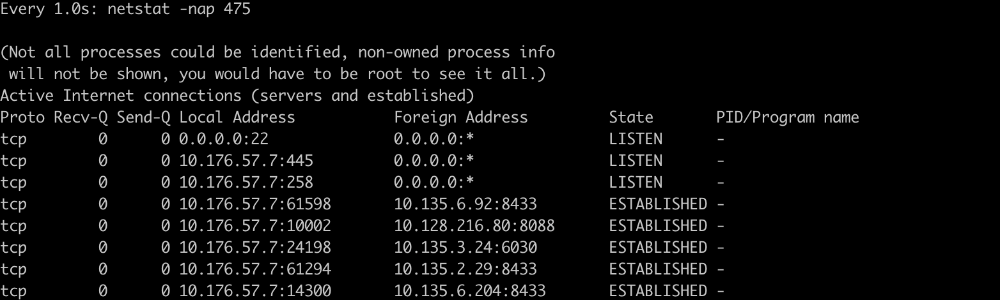
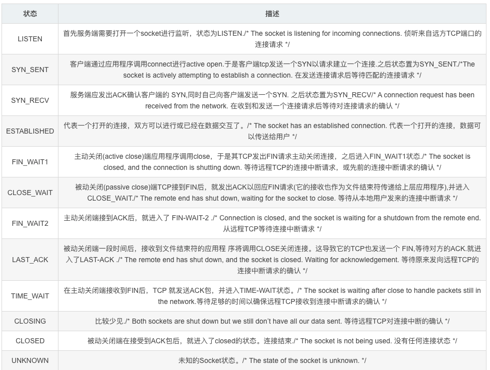
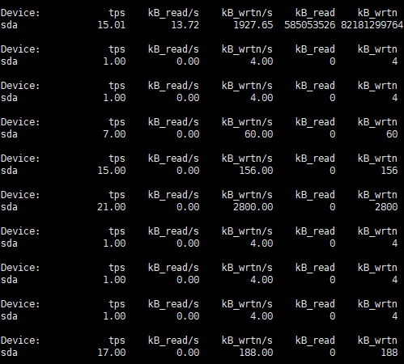
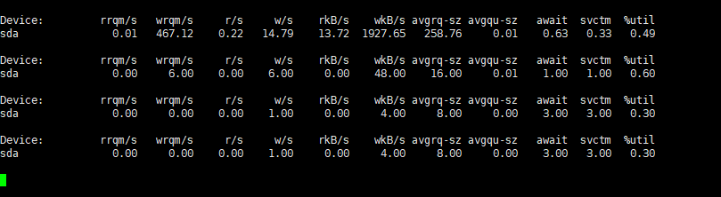
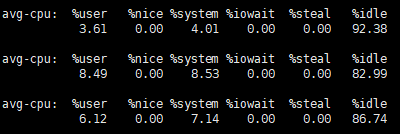
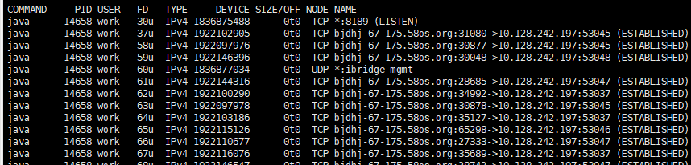
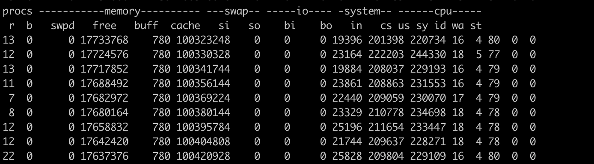

# Linux 常用命令

#### 1. find - 查找文件

#### 2.ps - 查看进行相关信息

#### 3.netstat - 检验本机各端口的网络连接情况
```shell
netstat -tunlp | grep 端口号
#-t (tcp) 仅显示tcp相关选项
#-u (udp)仅显示udp相关选项
#-n 拒绝显示别名，能显示数字的全部转化为数字
#-l 仅列出在Listen(监听)的服务状态
#-p 显示建立相关链接的程序名

# 查看某个进程链接情况
netstat -nap | grep <pid>
```



- Proto:协议名（tcp协议还是udp协议)

- recv-Q:网络接收队列 : 表示收到的数据已经在本地接收缓冲，但是还有多少没有被进程取走，recv(),如果接收队列Recv-Q一直处于阻塞状态，可能是遭受了拒绝服务 denial-of-service 攻击。

- send-Q:网路发送队列,对方没有收到的数据或者说没有Ack的,还是本地缓冲区.如果发送队列Send-Q不能很快的清零，可能是有应用向外发送数据包过快，或者是对方接收数据包不够快。

- Local Address : 

  - 0.0.0.0:22 表示监听服务器上所有ip地址的所有(0.0.0.0表示本地所有ip)

  - :::22 这个也表示监听本地所有ip的22端口，跟上面的区别是这里表示的是IPv6地址,“:::” 这三个: 的前两个"::"，是"0:0:0:0:0:0:0:0"的缩写，相当于IPv6的"0.0.0.0"，就是本机的所有IPv6地址，第三个:是IP和端口的分隔符

    

- Foreign Address : 与本机端口通信的外部socket。显示规则与Local Address相同
- State : 



#### 4.zip unzip  tar 打包相关命令

#### 5.crontab - 定时任务

#### 6.strings - 打印文件中可打印的字符 (可用于查找某一个文件,例如全量包中的低版本jar)

#### 7.nohup 

​		nohup 命令运行由 Command参数和任何相关的 Arg参数指定的命令，忽略所有挂断（SIGHUP）信号。在注销后使用 nohup 命令运行后台中的程序。要运行后台中的 nohup 命令，添加 & （ 表示“and”的符号）到命令的尾部。

#### 8.curl - 利用URL规则在命令行下工作的文件传输工具

#### 9.du / df  - 查看磁盘占用情况 
为了便于查看 , 一般加上 -h 

#### 10.grep - 在每个文件或标准输入中搜索 (-v 搜索不匹配的)

#### 11.linux 下杀死多个进程
```shell
# 批量杀死进程
ps -ef  | grep 关键字| grep -v grep | cut -c 5-23 |xargs kill -9

# kill 指定信息相关进程 : killall 进程名 
# 杀死java相关进程
killall java 
```

> `cut -c 5-23` : 是截取输入行的第5个字符到第23个字符，而这正好是进程号PID。

> `xargs kill -9`中的xargs命令是用来把前面命令的输出结果（PID）作为“kill -9”命令的参数，并执行该令。


#### 12.nslookup - 查询DNS的记录，查询域名解析是否正常

#### 13.awk - 处理文本,文本分析工具

awk [选项参数] 'script' var=value file(s) 或 awk [选项参数] -f scriptfile var=value file(s)

常用参数 :  
```shell
-F fs or --field-separator fs # 指定输入文件折分隔符，fs是一个字符串或者是一个正则表达式
-f scripfile or --file scriptfile # 从脚本文件中读取awk命令
# 输出第二列包含 "th"，并打印第二列与第四列 
awk '$2 ~ /th/ {print $2,$4}' log.txt
# 指定  ' 为分隔符,并打印分隔后的第五个和第六个参数
awk -F ' ' '{print $5 $6 }'
```

#### 14.nc - 检测远程 ip 端口是否监听

#### 15. iostat

```
-C 显示CPU使用情况
-d 显示磁盘使用情况
-k 以 KB 为单位显示
-m 以 M 为单位显示
-N 显示磁盘阵列(LVM) 信息
-n 显示NFS 使用情况
-p[磁盘] 显示磁盘和分区的情况
-t 显示终端和CPU的信息
-x 显示详细信息
-V 显示版本信息
```

```shell
# 常规用法
iostat -d -k 1 10         #查看TPS和吞吐量信息
iostat -d -x -k 1 10      #查看设备使用率（%util）、响应时间（await）
iostat -c 1 10            #查看cpu状态
```


##### (1) 基本使用

```shell
# -d 表示，显示设备（磁盘）使用状态；
# -k某些使用block为单位的列强制使用Kilobytes为单位；
# 1 10表示，数据显示每隔1秒刷新一次，共显示10次。
iostat -d -k 1 10
```



含义说明 : 

```
tps：该设备每秒的传输次数。“一次传输”意思是“一次I/O请求”。多个逻辑请求可能会被合并为“一次I/O请求”。“一次传输”请求的大小是未知的。

kB_read/s：每秒从设备（drive expressed）读取的数据量；
kB_wrtn/s：每秒向设备（drive expressed）写入的数据量；

kB_read：读取的总数据量；
kB_wrtn：写入的总数量数据量；

这些单位都为Kilobytes。
```

##### (2) -x 参数

```shell
# -x 获得更多统计信息
iostat -d -x -k 1 10
```



含义说明 : 

```
rrqm/s:每秒进行 merge 的读操作数目.即 delta(rmerge)/s（当系统调用需要读取数据的时候，VFS将请求发到各个FS，如果FS发现不同的读取请求读取的是相同Block的数据，FS会将这个请求合并Merge）
wrqm/s:每秒进行 merge 的写操作数目.即 delta(wmerge)/s

r/s:每秒完成的读 I/O 设备次数.即 delta(rio)/s
w/s:每秒完成的写 I/O 设备次数.即 delta(wio)/s

rsec/s:每秒读扇区数.即 delta(rsect)/s
wsec/s:每秒写扇区数.即 delta(wsect)/s

rkB/s:每秒读K字节数.是 rsect/s 的一半,因为每扇区大小为512字节.(需要计算)
wkB/s:每秒写K字节数.是 wsect/s 的一半.(需要计算)

avgrq-sz: 平均每次设备I/O操作的数据大小 (扇区).delta(rsect+wsect)/delta(rio+wio)
avgqu-sz: 平均I/O队列长度.即 delta(aveq)/s/1000 (因为aveq的单位为毫秒).

await:平均每次设备I/O操作的等待时间 (毫秒).即 delta(ruse+wuse)/delta(rio+wio)

svctm:平均每次设备I/O操作的服务时间 (毫秒).即 delta(use)/delta(rio+wio)

%util:一秒中有百分之多少的时间用于 I/O 操作,或者说一秒中有多少时间 I/O 队列是非空的.即 delta(use)/s/1000 (因为use的单位为毫秒)
```


##### （3）-c参数

```shell
# cpu相关信息
iostat -c 1 10
```



```
%user：CPU处在用户模式下的时间百分比

%nice：CPU处在带NICE值的用户模式下的时间百分比

%system：CPU处在系统模式下的时间百分比

%iowait：CPU等待输入输出完成时间的百分比

%steal：管理程序维护另一个虚拟处理器时，虚拟CPU的无意识等待时间百分比

%idle：CPU空闲时间百分比 
```


#### 16. uniq - 检查及删除文本文件中重复出现的行列，一般与 sort 命令结合使用

语法 : 
```shell
uniq [-cdu][-f<栏位>][-s<字符位置>][-w<字符位置>][--help][--version][输入文件][输出文件]
```
参数 : 
```shell
-c或--count 在每列旁边显示该行重复出现的次数。
-d或--repeated 仅显示重复出现的行列。
-f<栏位>或--skip-fields=<栏位> 忽略比较指定的栏位。
-s<字符位置>或--skip-chars=<字符位置> 忽略比较指定的字符。
-u或--unique 仅显示出一次的行列。
-w<字符位置>或--check-chars=<字符位置> 指定要比较的字符。
--help 显示帮助。
--version 显示版本信息。
[输入文件] 指定已排序好的文本文件。如果不指定此项，则从标准读取数据；
[输出文件] 指定输出的文件。如果不指定此选项，则将内容显示到标准输出设备（显示终端）。
```

注意 :  当重复的行并不相邻时，uniq 命令是不起作用的,所以一般和sort结合使用

```shell
# 先排序,在去重 ,在统计数量
sort  test | uniq | wc -l
```

#### 17.lsof - 列出当前系统打开文件的工具
常用命令 : 
```shell
# 查看8080端口占用
lsof -i:8080
# 显示开启文件abc.txt的进程
lsof abc.txt
# 显示abc进程现在打开的文件
lsof -c abc
# 列出进程号为1234的进程所打开的文件
lsof -p 1234
# 显示归属gid的进程情况
lsof -g gid
# 显示目录下被进程开启的文件
lsof +d /usr/local/
# 同上，但是会搜索目录下的目录，时间较长
lsof +D /usr/local/
# 显示使用fd为4的进程
lsof -d 4
# 显示所有打开的端口和UNIX domain文件
lsof -i -U
# 查看某一个端口(8080)的占用情况
lsof -i tcp:8080
```

输出信息含义 : 

```
COMMAND:进程名称
PID:进程号
USER:进程所有者
FD:文件描述符
TYPE:文件类型
DEVICE:指定磁盘名称
SIZE:文件大小
NODE:索引节点
NAME:打开文件的确切名称
```




#### 18.top 

 - 查看某个进程的线程资源占用情况
```shell
top -Hp <pid>
```

#### 19. watch - 监测一个命令的运行结果
```shell
# 检测 netstat 命令结果 将变化高亮
# -n 等待更新间隔(s) , -d 变化高亮
watch -n 1 -d netstat -nap 475
```

#### 20. vmstat - 给定时间间隔的服务器的状态值,包括服务器的CPU使用率，内存使用，虚拟内存交换情况,IO读写情况

```shell
# 第一个参数是采样的时间间隔数，单位是秒，第二个参数是采样的次数
# 2表示每隔两秒采集一次服务器状态，1表示只采集一次
vmstat 2 1
```




| **类别**                | **项目** | **含义**                                                 | **说明**                                                     |
| ----------------------- | -------- | -------------------------------------------------------- | ------------------------------------------------------------ |
| **Procs（进程）**       | r        | 等待执行的任务数                                         | 展示了正在执行和等待cpu资源的任务个数。当这个值超过了cpu个数，就会出现cpu瓶颈。 |
|                         | B        | 等待IO的进程数量                                         |                                                              |
| **Memory(内存)**        | swpd     | 正在使用虚拟的内存大小，单位k                            |                                                              |
|                         | free     | 空闲内存大小                                             |                                                              |
|                         | buff     | 已用的buff大小，对块设备的读写进行缓冲                   |                                                              |
|                         | cache    | 已用的cache大小，文件系统的cache                         |                                                              |
|                         | inact    | 非活跃内存大小，即被标明可回收的内存，区别于free和active |                                                              |
|                         | active   | 活跃的内存大小                                           |                                                              |
| **Swap**                | si       | 每秒从交换区写入内存的大小（单位：kb/s）                 |                                                              |
|                         | so       | 每秒从内存写到交换区的大小                               |                                                              |
| **IO**                  | bi       | 每秒读取的块数（读磁盘）                                 | 块设备每秒接收的块数量，单位是block，这里的块设备是指系统上所有的磁盘和其他块设备，现在的Linux版本块的大小为1024bytes |
|                         | bo       | 每秒写入的块数（写磁盘）                                 | 块设备每秒发送的块数量，单位是block                          |
| **system**              | in       | 每秒中断数，包括时钟中断                                 | 这两个值越大，会看到由内核消耗的cpu时间sy会越多 每           |
|                         | cs       | 每秒上下文切换数                                         | 例如我们调用系统函数，就要进行上下文切换，线程的切换，也要进程上下文切换，这个值要越小越好，太大了，要考虑调低线程或者进程的数目 |
| **CPU（以百分比表示）** | us       | 用户进程执行消耗cpu时间(user time)                       | us的值比较高时，说明用户进程消耗的cpu时间多，**但是如果长期超过50%的使用，那么我们就该考虑优化程序算法或其他措施了** |
|                         | sy       | 系统进程消耗cpu时间(system time)                         | sy的值过高时，说明系统内核消耗的cpu资源多，这个不是良性的表现，我们应该检查原因。**这里us + sy的参考值为80%，如果us+sy 大于 80%说明可能存在CPU不足** |
|                         | Id       | 空闲时间(包括IO等待时间)                                 | 一般来说 us+sy+id=100                                        |
|                         | wa       | 等待IO时间                                               | wa过高时，说明io等待比较严重，这可能是由于磁盘大量随机访问造成的，也有可能是磁盘的带宽出现瓶颈。 |

 


# 参考资料

- [1] [linux下杀死多个进程](https://blog.csdn.net/lgh1117/article/details/48402285)
- [2] [菜鸟教程-killall](https://www.runoob.com/linux/linux-comm-killall.html)
- [3] [Linux下使用iostat 监视I/O状态](https://www.cnblogs.com/chenpingzhao/p/5115063.html)
- [4] [Linux iostat监测IO状态](https://www.orczhou.com/index.php/2010/03/iostat-detail/)
- [5] [netstat输出内容详解](https://blog.csdn.net/m0_37556444/article/details/83000553)
- [6] [Linux vmstat命令实战详解](https://blog.csdn.net/m0_38110132/article/details/84190319)