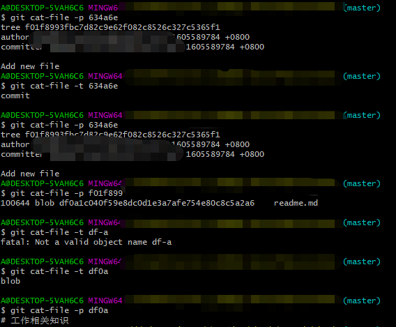

# Git 深入了解

# 一 `.git`文件夹

## 1.head文件
当前工作在哪个分支上 , 修改该文件和执行checkout切换分支是一样的.

## 2. config文件
和本地仓库相关的配置信息 , 可以理解为local配置信息

## 3.refs文件夹
(1) tags 文件夹
可以理解为一个tag , 有些人比较喜欢叫里程碑
(2)heads 文件夹
存储分支信息
(3) remotes 文件夹

## 4.objects文件夹
存储具体每一次的提交记录

# 二. `commit` ,`tree` ,`blob` 关系

## 1.含义
它们都是git的对象
(1) commit : 
存放的是当前文件与文件夹的快照 , 每一个commit里面都会包含tree
(2) tree : 
本地提交的相关信息 , 可以理解为一个提交的文件夹
(3) blob
提交的具体信息 , 可以理解为提交的内容

## 2. 三者之间的关系示例
下面是一次提交了一个readme文档的示例  :

# 三. detached HEAD

## 1.detached HEAD 含义
**分离头指针** : 可以理解为此时工作在没有分支的情况下
## 2.触发
**触发** : git checkout b2v3  # 切换到某一个HEAD下 , 此时处于分离头指针状态
## 3.风险
**风险** : 使用分离头指针后进行了一些提交 , 之后又切换了分支 , 此时你在分离头指针之后进行的操作会被Git认为是垃圾删除 , 所以最好把所有的操作都和分支绑定在一起.
## 4.使用场景
**使用场景** : 想进行测试性开发 , 或者回滚代码到某一个HEAD上 , 可以使用.

# 四. git协议

>哑协议 : 传输进度不可见 , 传输速度相对较慢
>智能协议 : 传输进度可见 , 传输速度相对较快

| 常用的传输协议  | 例子                                          | 协议类型 |
| --------------- | --------------------------------------------- | -------- |
| 本地协议        | /path/to/repo.git                             | 哑协议   |
| 本地协议        | file:///path/to/repo.git                      | 智能协议 |
| http/https 协议 | https://github.com/YczYanchengzhe/gitbook.git | 智能协议 |
| ssh 协议        | git@github.com:YczYanchengzhe/gitbook.git     | 智能协议 |

