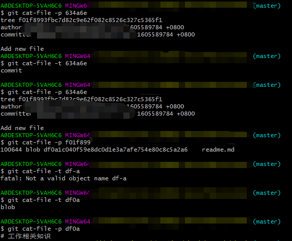
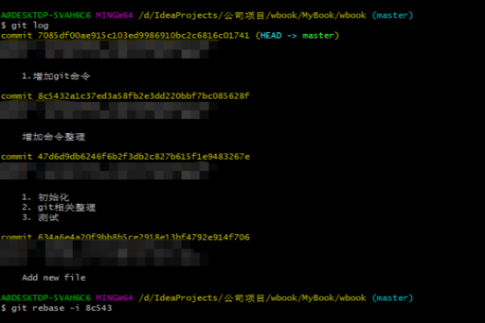
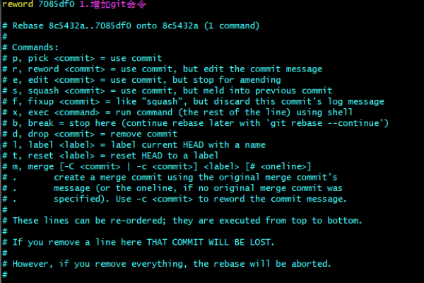
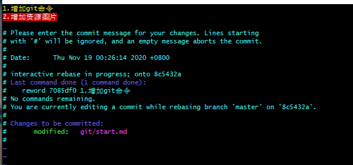
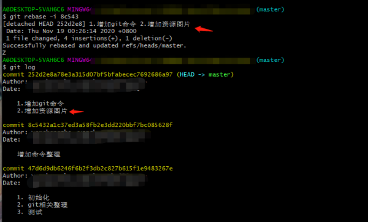

# Git 快速开始

# 一. 下载git

地址 : https://git-scm.com/downloads

# 二.git基础

## 1.git config 相关命令
```shell
# local 只对某一个仓库有效
git config --local
# global 对当前用户的所有仓库有效
git config --global
# system 对系统的所有用户都有效
git config -system
# 查看 local仓库的所有配置列表
git config --list --local 
# 设置用户名
git config --global user.name 'name'
# 设置邮件
git config --global user.email 'name@163.com'
# 提交时候转换为LF , 检出时候转换为CRLF
git config --global core.autocrlf true
# 提交时候转换为LF , 检出时候不转换
git config --global core.autocrlf input
# 提交检出时候均不转换
git config --global core.autocrlf false
```
## 2.git仓库 相关命令
1. 对于已有项目交给git管理
```shell
cd 项目目录
git init
```
2. 新建项目并交给git管理
```shell
cd 某个文件
# 会在当前路径下创建和项目名称相同的文件夹
git init your_project
```
## 3.git提交相关

```shell
# 查看 git 状态
git status
# 将该文件提交到暂存区
git add fileName 	#提交单个文件
git add -u 			# 将目录下被git管理的文件全部提交到暂存区
# 提交文件到本地仓库
git commit -m'commit message'
# 查看git提交记录
git log
```

## 4.git文件重命名
以把 `readme` 文件重命名为 `readme.md` 为例
```shell
#方法1 : 
mv readme readme.md
git rm readme 
git add readme.md
git commit -m'renameFile'
#方法2 : 
git mv readme readme.md
git commit -m'renameFile'
```

## 5.  查看版本演变历史
```shell
git log # 查看版本记录
git log --oneline # 简洁查看
git log -n2 # 查看最近2次的
git log --all # 查看所有分支信息
git log  --all --graph # 查看多个分支之间的关系
git log --oneline -n2 --all --graph # 全部分支简洁的最近两次版本历史,并展示多分支关系
```

## 6. git 图形界面查看版本记录
```shell
# 打开图形界面 , 可以查看git树形图,并进行一些操作
gitk --all
gitk
```

# 三.git进阶

## 1. 查看提交的内容
```shell
 # 显示对象类型
git cat-file -t hashvalue 
# 看内容
git cat-file -p hashvalue 
```

例如 : 



## 2. git - 分支

#### (1)新建分支/切换分支
```shell
# 假设基于HEAD : b2v3 创建新的分支
git checkout -b newbranchName b2v3 
# 不使用暂存区 , 直接提交到本地仓库 git -am'message'
git commit -am'Test'
# 提交之后commit的信息假设为 b2v6 , 使用b2v6新建一个分支
git branch branch_name b2v6
# 查看所有分支信息
git branch -v 
# 查看所有分支信息 , 包括远端分支
git branch -av 
# 基于某一个分支创建分支并切换到该分支 (加上-b会新建并自动切换分支)
git checkout -b new_branch_name old_branch_name
```
#### (2)删除分支
```shell
# 查看当前git结构
gitk --all
## 删除分支
# 如果分支没有完全合并无法删除 , 删除请使用 -D
git branch -d branch_name
# --delete --force 表示确实不再使用这个分支
git branch -D branch_name
```

## 3. 清除记录 
清除暂存区和工作区的记录
```shell
git reset --hard
# 下面比较的参数也可用在这里 , 灵活一些呦
# 删除本地代码 , 并回退到某一版本
git reset --head HEAD~n
# 不删除代码只是回退版本
git reset --soft HEAD~n
```

## 4. git 比较

```shell
# 比较差异 比较 c1v2 的commit 和 c2v3 的commit
git diff c1v2 c2v3
# 比较当前HEAD 和其父亲的比较 (父亲可以理解为上一次commit) (~n,可以理解为上几次提交)
git diff HEAD HEAD~1
git diff HEAD HEAD^
# 比较当前HEAD 和其父亲的父亲比较
git diff HEAD HEAD^^
git diff HEAD HEAD~2
```

## 5. git message相关操作

#### (1)修改最新提交的message
```shell
git commit --amend
```
之后根据弹出的窗口进行修改即可.

#### (2)修改某次提交的message

示例 :
```shell
#查看当前记录
git log
# 修改某次message , 要修改的是7085d ,由于他是在8c543基础上演变出来的 , 所以要修改的实际上是80543
git rebase -i 8c543
```

```shell
# 原来的命令是 pick , 表示只是一次commit , 将其修改为reword , 并保存
```

```shell
# 在新弹出来的窗口修改message , 并保存
```

```shell
# 检查是否修改成功
```


## 6. git commit相关操作
#### (1)合并多个连续commit
```shell
# 1.进入交互界面 , 同样选择父亲的 HEAD
git rebase -i
# 2.pick => squash
# 3.提交合并message
```
#### (1)合并多个不连续commit
```shell
# 1.进入交互界面 , 同样选择父亲的 HEAD
# 如果选择的是第一次提交 , 那么该指令出现的列表会缺少第一次的pick , 此时需要手动添加进来
git rebase -i
# 进行合并操作 : 将需要合并的多次commit 顺序放在一起 , 并修改pick为 squash , 删除已经合并commit的pick
# 检查合并结果
git state
# 进行合并后的message修改
git rebase --continue
# 查看版本树 , 确认结果
git log --graph
```

## 7.git diff 操作
> 暂存区 : add之后文件会存储在暂存区
> HEAD : 头指针指向的地方 , (最近一次commit)
> 工作区 : 本地代码开发环境

#### (1) 比较暂存区和HEAD所包含文件的差异
```shell
git diff --cache
```
#### (2) 比较暂存区和工作区所包含文件的差异
```shell
# 默认比较的就是暂存区和工作区
git diff
# 比较 filename1 filename2 这两个文件的差异
git diff -- filename1 filename2
# 查看不同 commit之间的指定文件差异
git diff branchName1 branchName2 -- fileName
# 比较 b2v3 b3v4 两次commit的指定文件差异
git diff b2v3 b3v4 --filename
```

## 8.git 回滚 操作
#### (1) 如何让暂存区恢复和HEAD一样
```shell
# 取消暂存区的所有变更 , 恢复到工作区
# 改变暂存区内容 reset
git reset HEAD  
# 取消暂存区部分文件的更改 : 只恢复 filename , filename2文件
git reset HEAD -- filename filename2
```

#### (2)如何让工作区文件恢复为何暂存区一样的
```shell
# 将 工作区filename  文件恢复为暂存区文件
git checkout -- filename   # 用于改变工作区内容 checkout   
```

#### (3)清除最近几次提交
```shell
# 回滚到b2v3版本
git reset --hard b2v3
```

#### (4) 删除文件相关操作
```shell
# 方法一 : 
rm fileName
git rm fileName
# 方法二 : 直接使用 git rm .会同时删除工作区的该文件,并同步到暂存区
git rm fileName
```

## 9.git 临时保存 操作
```shell
# 保存
git stash
# 查看 stash 列表
git stash list
# 之前存放的内容弹出来 , 放到工作区 , stash列表中该记录删除
git stash pop
# 之前存放的内容弹出来 , 放到工作区 , stash列表该记录不会删除
git stash apply
```

## 10. git 忽略指定文件
使用 : `.gitignore` 进行管理
对于不同语言的项目 , 可以参考gitghub项目进行配置 : https://github.com/github/gitignore

## 11.git备份
#### (1) 下载
```shell
# 备份远端代码
# 只拉取最近一次的提交
git clone --depends=1
#哑协议备份
git clone --bare github.com/YczYanchengzhe/gitbook.git   ya.git
#智能协议备份
git clone --bare file:///github.com/YczYanchengzhe/gitbook.git   ya.git
#查看远端地址
git remote -v
# 添加远端地址(intelligent : 智能)
#git remote add remoteConName 协议
git remote add intelligent file:///path/to/repo.git
```

#### (2) 推送
```shell
# 推送代码 : 推送远端 intelligent   , 本地分支 : localbranchName
git push --set-upstream intelligent  localbranchName
# 把本地所有分支信息同步推送到远端
git push intelligent --all
```

#### (3) 拉取
>non fast forward  : 如果拉取时候出现冲突 ,此时git会提示你的仓库此时处于该状态 . git仓库中已经有一部分其他人提交的代码，所以它不允许你直接把你的代码覆盖上去。

```shell
# git fetch:只会把远端代码拉下来,不会和本地关联(intelligent:链接名,master:分支名)
git fetch intelligent master
```
```shell
# 相当于执行了 : fetch + merge
git pull
```
**不同情景的merge**
```shell
# 不同人修改了不同文件如何处理
git pull
#不同人修改了同文件的不同区域如何处理
git pull
# 同时变更了文件名和文件内容 , 并未冲突
git pull
```

```shell
# 不同人修改了同文件的同一区域
git pull
# 处理冲突
# To doSomeThing
# (1) 解决完冲突,进行提交
git commit 
# (2) 冲突不想要了,恢复到未拉取状态
git merge --about
```
```shell
# 把同一文件改成了不同的文件名
# 此时会冲突 , git会把这两个文件都会拉取下来 , 开发者自行解决
# 两个人分别将  old.md 重命名为 new1.md , new2.md
git rm old.md
git add new1.md
git rm new2.md
# 之后commit即可
```


#### (4) 合并代码
> --allow-unrelated-histories : 默认情况下，git mergecommand拒绝合并不具有共同祖先的历史记录。合并两个独立开始的项目的历史记录时，可以使用此选项来覆盖此安全性。因为这是非常罕见的情况，所以默认情况下不存在用于启用此功能的配置变量，因此不会添加。

```shell
# 合并远端的master分支代码
git merge github/master
#  合并代码 允许合并不相干的两个树, 没有共同的父亲
git merge --allow-unrelated-histories github/master
```


## 12.配置公私钥
>查看手册 : https://docs.github.com/en

```shell
# 检查ssh
ls -al ~/.ssh
# 生成ssh
ssh-keygen -t ed25519 -C "your_email@example.com"
# 查看公钥
cat /c/Users/A/.ssh/id_rsa.pub
```

## 13.优化仓库存储
```shell
# 清理不必要的文件并优化本地存储库
git gc
```

