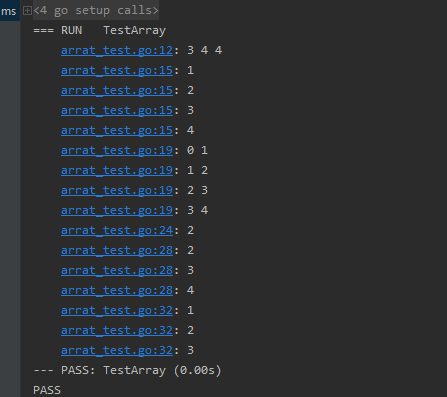
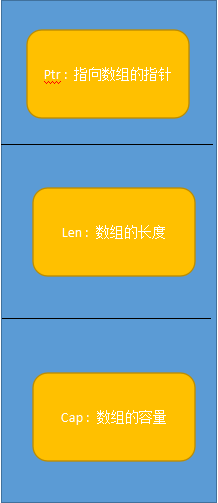
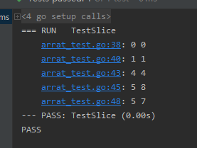
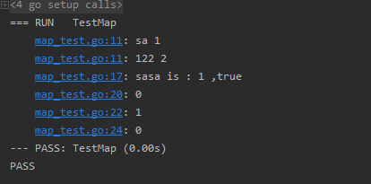
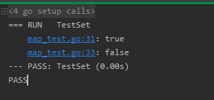

# 常用集合

## 一.数组和切片

#### 1. 数组
##### (1) 例子
```go
func TestArray(t *testing.T) {
	var arr [3] int
	arr1 := [4]int{1, 2, 3, 4}
	arr2 := [...] int{1, 2, 3, 4}
	//初始化数组 , 打印长度
	t.Log(len(arr), len(arr1), len(arr2))
	//遍历
	for i := 0; i < len(arr1); i++ {
		t.Log(arr1[i])
	}
	//遍历
	for index, data := range arr2 {
		t.Log(index, data)
	}
	//数组截取
	arr3 := arr2[1:2]
	for _, data := range arr3 {
		t.Log(data)
	}
	arr3 = arr2[1:]
	for _, data := range arr3 {
		t.Log(data)
	}
	arr3 = arr2[:3]
	for _, data := range arr3 {
		t.Log(data)
	}
}
```

##### (2) 运行结果



#### 2. 切片

##### (1) 切片的结构


##### (2)使用示例
```go
func TestSlice(t *testing.T) {
	var s0 [] int
	t.Log(len(s0), cap(s0))
	s0 = append(s0, 1)
	t.Log(len(s0), cap(s0))

	s1 := []int{1, 2, 3, 4}
	t.Log(len(s1), cap(s1))
	//使用append 进行数据插入
	s1 = append(s1, 1)
	t.Log(len(s1), cap(s1))
	//使用make创建对象 -> 类型 , 长度 , 容量
	var s2 = make([]int,5,7)
	t.Log(len(s2),cap(s2))
}
```
##### (4)运行结果




##### (3)切片如何实现可变长的

> 从上面例子中可以看到 , 给s1初始化了4的容量,在新加元素之后,长度变为5,容量变为8.

> 切片是通过指数增长容量,将数据拷贝到新的内存实现数组变长.

#### 3.二者区别
|                      | **数组** | **切片** |
| -------------------- | -------- | -------- |
| **容量是否可以伸缩** | 否       | 是       |
| **是否可以进行比较** | 是       | 否       |


## 二.Map

#### 1.map
##### (1)示例
```go
func TestMap(t *testing.T) {
	m := map[string]int{"sa": 1, "122": 2}
	//遍历
	for k, v := range m {
		t.Log(k, v)
	}
	//返回两个变量 , 第一个是值 , 第二个是是否存在
	if e, ok := m["sasa"]; ok {
		t.Logf("sa is : %d ,%t  \n", e, ok)
	} else if e, ok := m["sa"]; ok {
		t.Logf("sasa is : %d ,%t  \n", e, ok)
	}
	m1 := map[string]int{}
	t.Log(m1["qq"])
	m1["qq"] = 1
	t.Log(m1["qq"])
	//制定初始化容量 ,对于map不能使用cap计算容量
	m2 := make(map[string]int, 10)
	t.Log(m2["10"])
}
```

##### (2).执行结果



##### (3) 注意 : 
> 对于map类型.由于go语言对于不存在的值会赋一个默认值,name如何区分该值是真实等于默认值还是由于是nil被赋予默认值那?
> 在Go中 ,map类型会返回两个值,第一个是key对应的value ,第二个是bool类型,标识该值是否存在,可以用这个来判断


#### 2.Set
> 在Go语言中,没有内置set,但是可以通过 map[type]bool,来实现一个set.

##### (1)例子
```go
func TestSet(t *testing.T) {
	m := map[int]bool{}
	m[1] = true
	m[2] = true
	t.Log(m[1])
    //删除可以使用该方式 : delete(map,key)
	delete(m,1)
	t.Log(m[1])
}
```

##### (2)执行结果



