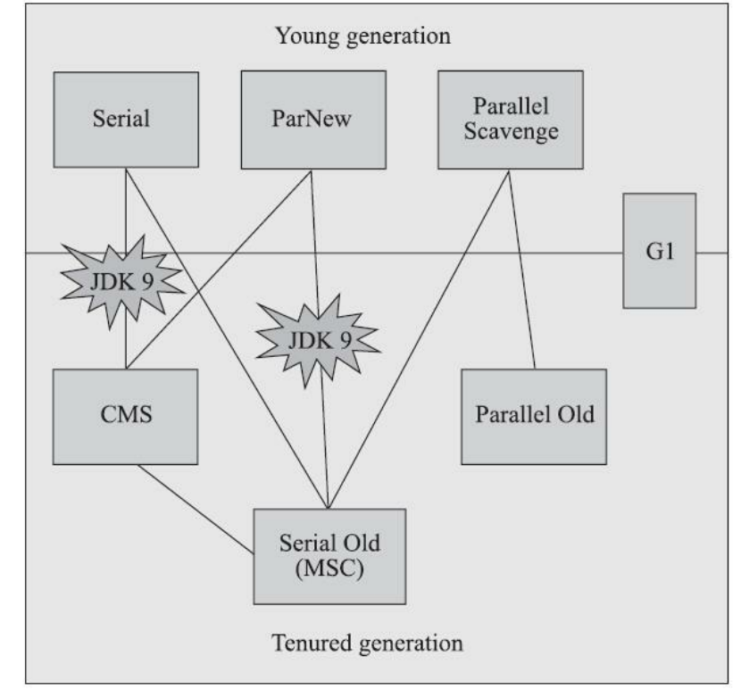
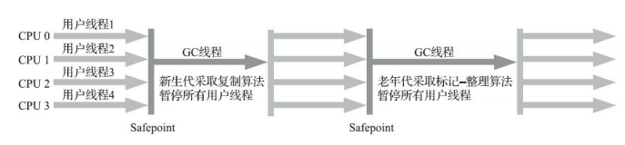
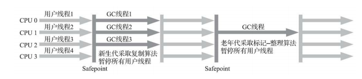
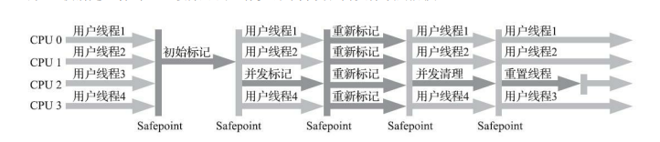
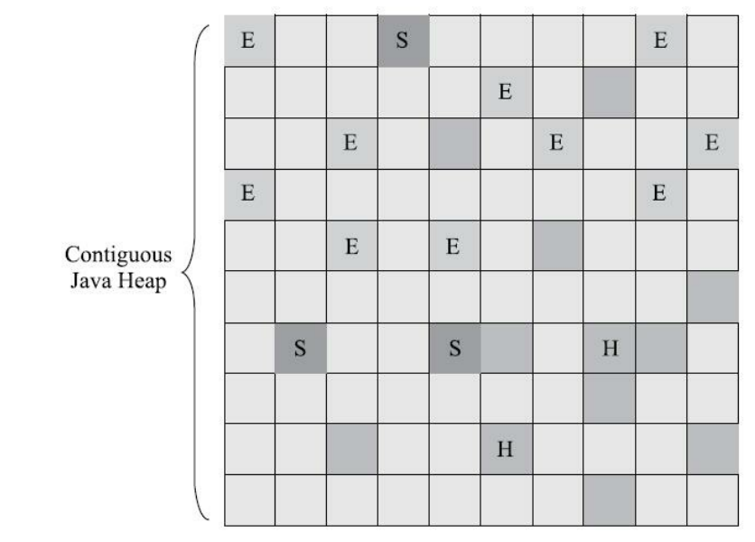
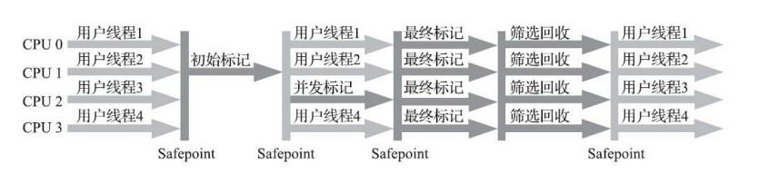
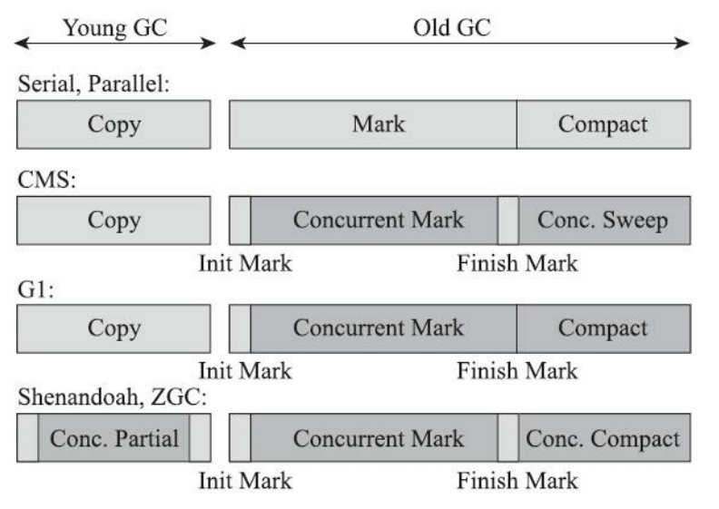
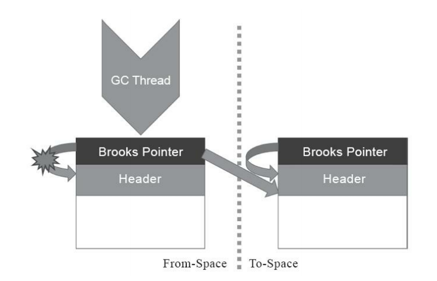
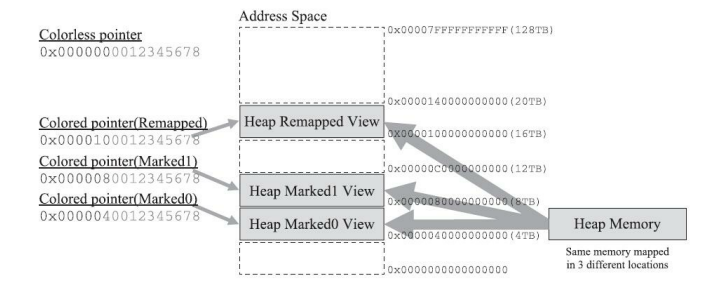
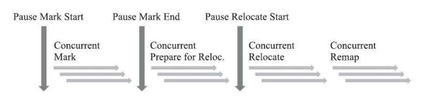

# 经典垃圾收集器

# 一. 垃圾收集器关系图

# 二.Serial收集器

## 1. 简介

这个收集器是一个单线程工作的收集器，但它的“单线程”的意义并不仅仅是说明它只会使用一个处理器或一条收集线程去完成垃圾收集工作，更重要的是强调在它进行垃圾收集时，必须暂停其他所有工作线程，直到它收集结束。

Serial收集器是HotSpot虚拟机运行在客户端模式下的默认新生代收集器.在内存资源受限的环境下，它是所有收集器里额外内存消耗最小的.对于单核处理器或处理器核心数较少的环境来说，Serial收集器由于没有线程交互的开销，专心做垃圾收集自然可以获得最高的单线程收集效率。

## 2. 使用场景

在用户桌面的应用场景以及近年来流行的部分微服务应用中，分配给虚拟机管理的内存一般来说并不会特别大，收集几十兆甚至一两百兆的新生代（仅仅是指新生代使用的内存，桌面应用甚少超过这个容量），垃圾收集的停顿时间完全可以控制在十几、几十毫秒，最多一百多毫秒以内，只要不是频繁发生收集，这点停顿时间对许多用户来说是完全可以接受的。所以，Serial收集器对于运行在客户端模式下的虚拟机来说是一个很好的选择。

## 3. 相关概念

**(1) 客户端模式和服务端模式**

最主要的差别在于：-Server模式启动时，速度较慢，但是一旦运行起来后，性能将会有很大的提升.因为当虚拟机运行在-client模式的时候,使用的是一个代号为C1的轻量级编译器, 而-server模式启动的虚拟机采用相对重量级,代号为C2的编译器. C2比C1编译器编译的相对彻底,服务起来之后,性能更高.

**(2)C1 和 C2 编译器**

在Java HotSpot VM内部，实际上有两种单独的JIT编译器模式，分别称为C1和C2。C1用于需要快速启动和坚如磐石的优化的应用；GUI应用程序通常是此编译器的理想选择。另一方面，C2最初是用于长时间运行的（主要是服务器端）应用程序。在某些Java SE 7更高版本之前，分别使用-client和-server开关可以使用这两种模式。

两种编译器模式使用不同的技术进行JIT编译，并且对于相同的Java方法，它们可以输出非常不同的机器代码。但是，现代Java应用程序通常可以同时使用两种编译模式。为了利用这一事实，从某些Java SE 7更高版本开始，提供了一个称为分层编译的新功能。此功能在开始时使用C1编译器模式以提供更好的启动性能。一旦对应用程序进行了适当的预热，C2编译器模式将接管其工作，以提供更具攻击性的优化，并且通常提供更好的性能。随着Java SE 8的到来，分层编译现已成为默认行为。

## 4. 流程图示

# 三.ParNew收集器

## 1. 简介
ParNew收集器实质上是Serial收集器的多线程并行版本，除了同时使用多条线程进行垃圾收集之 外，其余的行为包括Serial收集器可用的所有控制参数（例如：-XX：SurvivorRatio、-XX： PretenureSizeThreshold、-XX：HandlePromotionFailure等）、收集算法、Stop The World、对象分配规则、回收策略等都与Serial收集器完全一致。

除了Serial收集器外，目前只有它能与CMS 收集器配合工作。

## 2. 相关概念

- 并行（Parallel）：并行描述的是多条垃圾收集器线程之间的关系，说明同一时间有多条这样的线
程在协同工作，通常默认此时用户线程是处于等待状态。
-   并发（Concurrent）：并发描述的是垃圾收集器线程与用户线程之间的关系，说明同一时间垃圾收集器线程与用户线程都在运行。由于用户线程并未被冻结，所以程序仍然能响应服务请求，但由于垃圾收集器线程占用了一部分系统资源，此时应用程序的处理的吞吐量将受到一定影响。

## 3. 流程图示

# 四.Parallel Scavenge收集器

## 1.简介

Parallel Scavenge的诸多特性从表面上看和ParNew非常相似.Parallel Scavenge收集器的特点是它的关注点与其他收集器不同，CMS等收集器的关注点是尽可能地缩短垃圾收集时用户线程的停顿时间，而Parallel Scavenge收集器的目标则是达到一个可控制的吞吐量（Throughput）。所谓吞吐量就是处理器用于运行用户代码的时间与处理器总消耗时间的比值，即：`吞吐量=运行用户代码时间/(运行用户代码时间+垃圾收集器处理时间)`.

## 2. 相关参数

(1) -XX：MaxGCPauseMillis : 控制最大垃圾收集停顿时间

> -XX：MaxGCPauseMillis参数允许的值是一个大于0的毫秒数，收集器将尽力保证内存回收花费的时间不超过用户设定值。不过并不是把这个参数的值设置得更小一点就能使得系统的垃圾收集速度变得更快,垃圾收集停顿时间缩短是以牺牲吞吐量和新生代空间为代价换取的,所以在选择是要注意权衡.

(2) -XX：GCTimeRatio : 设置吞吐量大小

> -XX：GCTimeRatio参数的值则应当是一个大于0小于100的整数，也就是垃圾收集时间占总时间的比率，相当于吞吐量的倒数。譬如把此参数设置为19，那允许的最大垃圾收集时间就占总时间的5%（即1/(1+19)），默认值为99，即允许最大1%（即1/(1+99)）的垃圾收集时间。

(3) +UseAdaptiveSizePolicy  : 自适应调节策略

> 当这个参数被激活之后，就不需要人工指定新生代的大小（-Xmn）、Eden与Survivor区的比例（-XX：SurvivorRatio）、晋升老年代对象大小（-XX：PretenureSizeThreshold）等细节参数了，虚拟机会根据当前系统的运行情况收集性能监控信息，动态调整这些参数以提供最合适的停顿时间或者最大的吞吐量。 自适应调节策略也是Parallel Scavenge收集器区别于ParNew收集器的一个重要特性.

# 五.Serial Old收集器

# 六.Parallel Old收集器

# 七.CMS收集器

## 1.简介

CMS（Concurrent Mark Sweep）收集器是一种以获取最短回收停顿时间为目标的收集器。

## 2. 步骤

1）初始标记（CMS initial mark） : 确定 GCroot - Stop The World

2）并发标记（CMS concurrent mark）: 进行可达性分析

3）重新标记（CMS remark） : 增量更新变更的节点 - Stop The World

4）并发清除（CMS concurrent sweep）

其中初始标记、重新标记这两个步骤仍然需要“Stop The World”。由于在整个过程中耗时最长的并发标记和并发清除阶段中，垃圾收集器线程都可以与用户线程一起工作，所以从总体上来说，CMS收集器的内存回收过程是与用户线程一起并发执行的。

## 3. 流程图示

## 4. 缺点

(1) CMS收集器对处理器资源非常敏感 : 在并发阶段，它虽然不会导致用户线程停顿，但却会因为占用了一部分线程（或者说处理器的计算能力）而导致应用程序变慢，降低总吞吐量 ,CMS默认启动的回收线程数是（处理器核心数量+3）/4，也就是说，如果处理器核心数在四个或以上，并发回收时垃圾收集线程只占用不超过25%的处理器运算资源，并且会随着处理器核心数量的增加而下降。但是当处理器核心数量不足四个时， CMS对用户程序的影响就可能变得很大。

(2) CMS收集器无法处理“浮动垃圾”（Floating Garbage），有可能出现“Con-current Mode Failure”失败进而导致另一次完全“Stop The World”的Full GC的产生。

> 在CMS的并发标记和并发清理阶段，用户线程是还在继续运行的，程序在运行自然就还会伴随有新的垃圾对象不断产生，但这一部分垃圾对象是出现在标记过程结束以后，CMS无法在当次收集中处理掉它们，只好留待下一次垃圾收集时再清理掉。这一部分垃圾就称为“浮动垃圾”。

## 5. 相关问题

(1)为什么  “Con-current Mode Failure”失败进而导致“Stop The World”的Full GC  ? 

由于在垃圾收集阶段用户线程还需要持续运行，那就还需要预留足够内存空间提供给用户线程使用，因此CMS收集器不能像其他收集器那样等待到老年代几乎完全被填满了再进行收集，必须预留一部分空间供并发收集时的程序运作使用。要是CMS运行期间预留的内存无法满足程序分配新对象的需要，就会出现一次“并发失败”，这时候虚拟机将不得不启动后备预案：冻结用户线程的执行，临时启用Serial Old收集器来重新进行老年代的垃圾收集，导致停顿时间很长。

## 6. 相关参数

(1) -XX：CMSInitiatingOccupancyFraction : 调整CMS的触发百分比 , 在JDK5的默认设置下，CMS收集器当老年代使用了68%的空间后就会被激活.到了JDK 6时，CMS收集器的启动阈值就已经默认提升至92%。但设置得太高将会很容易导致大量的并发失败产生，性能反而降低.

(2) -XX：+UseCMS-CompactAtFullCollection : 在CMS收集器不得不进行Full GC时开启内存碎片的合并整理过程 , 默认是开启的，此参数从JDK 9开始废弃. 由于这个内存整理必须移动存活对象,（在Shenandoah和ZGC出现前）是无法并发的,所以虽然解决了内存碎片,但是停顿时间会变长.

(3)-XX：CMSFullGCsBefore-Compaction : 要求CMS收集器在执行过若干次（数量由参数值决定）不整理空间的Full GC之后，下一次进入Full GC前会先进行碎片整理（默认值为0，表示每次进入Full GC时都进行碎片整理）（此参数从JDK 9开始废弃）

# 八.Garbage First收集器

## 1. 简介

Garbage First 又称G1收集器 , 开创了收集器面向局部收集的设计思路和基于Region的内存布局形式。

G1是一款主要面向服务端应用的垃圾收集器。JDK 9发布之日，G1宣告取代Parallel Scavenge加Parallel Old组合，成为服务端模式下的默认垃圾收集器.

## 2. 跨时代的改变

在G1收集器出现之前的所有其他收集器，包括CMS在内，垃圾收集的**目标范围**要么是整个新生代（Minor GC），要么就是整个老年代（Major GC），再要么就是整个Java堆（Full GC）。而G1跳出了这个樊笼，它可以**面向堆内存任何部分来组成回收集**（Collection Set，一般简称CSet）进行回收，衡量标准不再是它属于哪个分代，而是哪块内存中存放的垃圾数量最多，回收收益最大，这就是G1收集器的Mixed GC模式。

## 3. 内存区域划分 - Region

G1不再坚持固定大小以及固定数量的分代区域划分，而是把连续的Java堆划分为多个大小相等的独立区域（Region），每一个Region都可以根据需要，扮演新生代的Eden空间、Survivor空间，或者老年代空间。收集器能够对扮演不同角色的Region采用不同的策略去处理，这样无论是新创建的对象还是已经存活了一段时间、熬过多次收集的旧对象都能获取很好的收集效果。

Region中还有一类特殊的Humongous区域，专门用来存储大对象。G1认为只要**大小超过了一个Region容量一半的对象即可判定为大对象**。每个Region的大小可以通过参数**-XX：G1HeapRegionSize**设定，取值范围为1MB～32MB，且应为2的N次幂。而对于那些超过了整个Region容量的超级大对象，将会被存放在N个连续Humongous Region之中，G1的大多数行为都把Humongous Region作为老年代的一部分来进行看待G1收集器之所以能建立可预测的停顿时间模型，是因为它将Region作为单次回收的最小单元，即每次收集到的内存空间都是Region大小的整数倍.

G1收集器去跟踪各个Region里面的垃圾堆积的“价值”大小，价值即回收所获得的空间大小以及回收所需时间的经验值，然后在后台维护一个优先级列表，每次根据用户设定允许的收集停顿时间（使用参数-XX：MaxGCPauseMillis指定，默认值是200毫秒），优先处理回收价值收益最大的那些Region，这也就是“Garbage First”名字的由来。这种使用Region划分内存空间，以及具有优先级的区域回收方式，保证了G1收集器在有限的时间内获取尽可能高的收集效率。

​                                                              图示 : G1收集器Region分区示意图

## 4. 实现可能遇到的问题 : 

**(1) 将Java堆分成多个独立Region后，Region里面存在的跨Region引用对象如何解决？**

使用**记忆集**避免全堆作为GC Roots扫描,每个Region都维护有自己的记忆集，这些记忆集会记录下别的Region指向自己的指针，并标记这些指针分别在哪些卡页的范围之内。

G1的记忆集在存储结构的本质上是一种哈希表，Key是别的Region的起始地址，Value是一个集合，里面存储的元素是卡表的索引号。这种“双向”的卡表结构（卡表是“我指向谁”，这种结构还记录了“谁指向我”）比原来的卡表实现起来更复杂，同时由于Region数量比传统收集器的分代数量明显要多得多，因此G1收集器要比其他的传统垃圾收集器有着更高的内存占用负担。根据经验，**G1至少要耗费大约相当于Java堆容量10%至20%的额外内存来维持收集器工作。**

**(2) 在并发标记阶段如何保证收集线程与用户线程互不干扰地运行？**

CMS收集器采用**增量更新**算法实现，而G1收集器则是通过**原始快照**（SATB）算法来实现垃圾收集对用户线程的互不干扰.

其体现在回收过程中新创建对象的内存分配上，程序要继续运行就肯定会持续有新对象被创建，G1为每一个Region设计了两个名为TAMS（Top at Mark Start）的指针，把Region中的一部分空间划分出来用于并发回收过程中的新对象分配，并发回收时新分配的对象地址都必须要在这两个指针位置以上。G1收集器默认在这个地址以上的对象是被隐式标记过的，即默认它们是存活的，不纳入回收范围。

与CMS中的“Concurrent Mode Failure”失败会导致Full GC类似，如果内存回收的速度赶不上内存分配的速度，G1收集器也要被迫冻结用户线程执行，导致Full GC而产生长时间“Stop The World”。

**(3) 怎样建立起可靠的停顿预测模型？**

-XX：MaxGCPauseMillis 指定停顿时间 

G1收集器的停顿预测模型是以衰减均值（Decaying Average）为理论基础来实现的，在垃圾收集过程中，G1收集器会记录每个Region的回收耗时、每个Region记忆集里的脏卡数量等各个可测量的步骤花费的成本，并分析得出平均值、标准偏差、置信度等统计信息。然后通过这些信息预测现在开始回收的话，由哪些Region组成回收集才可以在不超过期望停顿时间的约束下获得最高的收益。

## 5. 步骤

- 初始标记（Initial Marking）仅仅只是标记一下GC Roots能直接关联到的对象，并且修改TAMS指针的值，让下一阶段用户线程并发运行时，能正确地在可用的Region中分配新对象。这个阶段需要停顿线程，但耗时很短，而且是借用进行Minor GC的时候同步完成的，所以G1收集器在这个阶段实际并没有额外的停顿。 -  **Stop The World**

- 并发标记（Concurrent Marking）：从GC Root开始对堆中对象进行可达性分析，递归扫描整个堆里的对象图，找出要回收的对象，这阶段耗时较长，但可与用户程序并发执行。当对象图扫描完成以后，还要重新处理SATB记录下的在并发时有引用变动的对象。

- 最终标记（Final Marking）：对用户线程做另一个短暂的暂停，用于处理并发阶段结束后仍遗留下来的最后那少量的SATB记录。-  **Stop The World**

- 筛选回收（Live Data Counting and Evacuation）：负责更新Region的统计数据，对各个Region的回收价值和成本进行排序，根据用户所期望的停顿时间来制定回收计划，可以自由选择任意多个Region构成回收集，然后把决定回收的那一部分Region的存活对象复制到空的Region中，再清理掉整个旧Region的全部空间。这里的操作涉及存活对象的移动，是必须暂停用户线程，由多条收集器线程并行完成的。-  **Stop The World**

> 回收阶段（Evacuation）其实本也有想过设计成与用户程序一起并发执行，但这件事情做起来比较复杂，考虑到G1只是回收一部分Region，停顿时间是用户可控制的，所以并不迫切去实现，而选择把这个特性放到了G1之后出现的低延迟垃圾收集器（即ZGC）中。

> CMS GC 在回收时不会影响到存活对象的移动,所以不需要 Stop The World 但是G1 GC 不行  , 因为操作涉及存活对象的移动，是必须暂停用户线程.

> 停顿时间不要设置的太短,可能每次选出来的回收集只占堆内存的很少一部分,收集器收集的速度跟不上分配的速度,导致垃圾堆积,最终占满堆引发Full GC反而降低性能.所以通常把期望停顿时间设置为一两百毫秒或者两三百毫秒会是比较合理的。

​																			**G1收集器运行示意图**

## 6. G1 和CMS 比较 

**(1) 算法**

单从最传统的算法理论上看，G1也更有发展潜力。与CMS的“标记-清除”算法不同，G1从整体来看是基于“标记-整理”算法实现的收集器，但从局部（两个Region之间）上看又是基于“标记-复制”算法实现，无论如何，这两种算法都意味着G1运作期间不会产生内存空间碎片，垃圾收集完成之后能提供规整的可用内存。这种特性有利于程序长时间运行，在程序为大对象分配内存时不容易因无法找到连续内存空间而提前触发下一次收集。

**(2) 内存占用**

内存占用G1-GC的卡表实现复杂,相比于cms的卡表可能会占整个堆容量的20%乃至更多的内存空间.

**(3) 负载情况**

写屏障 , CMS用写后屏障来更新维护卡表 而G1除了使用写后屏障来进行同样的卡表维护操作外，为了实现原始快照搜索（SATB）算法，还需要使用写前屏障来跟踪并发时的指针变化情况.相比起增量更新算法，原始快照搜索能够减少并发标记和重新标记阶段的消耗，避免CMS那样在最终标记阶段停顿时间过长的缺点，但是在用户程序运行过程中确实会产生由跟踪引用变化带来的额外负担。

**(4) 写屏障的同步异步**

由于G1对写屏障的复杂操作要比CMS消耗更多的运算资源，所以CMS的写屏障实现是直接的同步操作，而G1就不得不将其实现为类似于消息队列的结构，把写前屏障和写后屏障中要做的事情都放到队列里，然后再异步处理。在小内存应用上CMS的表现大概率仍然要会优于G1，而在大内存应用上G1则大多能发挥其优势，这个**优劣势的Java堆容量平衡点通常在6GB至8GB之间**.

# 低延迟垃圾收集器

衡量垃圾收集器的三项最重要的指标是：**内存占用**（Footprint）、**吞吐量**（Throughput）和**延迟**（Latency）.

下图中浅色阶段表示必须挂起用户线程，深色表示收集器线程与用户线程是并发工作的.

在CMS和G1之前的全部收集器，其工作的所有步骤都会产生“Stop The World”式的停顿；

CMS和G1分别使用增量更新和原始快照技术，实现了标记阶段的并发，不会因管理的堆内存变大，要标记的对象变多而导致停顿时间随之增长。但是对于标记阶段之后的处理，仍未得到妥善解决。CMS使用标记-清除算法，虽然避免了整理阶段收集器带来的停顿，但是清除算法不论如何优化改进，在设计原理上避免不了空间碎片的产生，随着空间碎片不断淤积最终依然逃不过“Stop The World”的命运。G1虽然可以按更小的粒度进行回收，从而抑制整理阶段出现时间过长的停顿，但毕竟也还是要暂停的。

最后的两款收集器，Shenandoah和ZGC，几乎整个工作过程全 部都是并发的，只有初始标记、最终标记这些阶段有短暂的停顿，这部分停顿的时间基本上是固定的，与堆的容量、堆中对象的数量没有正比例关系。

​																		图示 : 各款收集器的并发情况

# 一.Shenandoah收集器

## 1.Shenandoah相比起G1又有什么改进?

在管理堆内存方面，它与G1至少有三个明显的不同之处 : 

(1) 支持并发的整理算法

(2) Shenandoah是默认不使用分代收集的，换言之，不会有专门的新生代Region或者老年代Region的存在.

(3) Shenandoah摒弃了在G1中耗费大量内存和计算资源去维护的记忆集，改用名为“连接矩阵”的全局数据结构来记录跨Region的引用关系,降低了处理跨代指针时的记忆集维护消耗，也降低了伪共享问题的发生概率。

## 2.执行过程

- 初始标记（Initial Marking）：与G1一样，首先标记与GC Roots直接关联的对象，这个阶段仍是“Stop The World”的，但停顿时间与堆大小无关，只与GC Roots的数量相关。 -  **Stop The World**

- 并发标记（Concurrent Marking）：与G1一样，遍历对象图，标记出全部可达的对象，这个阶段是与用户线程一起并发的，时间长短取决于堆中存活对象的数量以及对象图的结构复杂程度。

- 最终标记（Final Marking）：与G1一样，处理剩余的SATB扫描，并在这个阶段统计出回收价值最高的Region，将这些Region构成一组回收集（Collection Set）。最终标记阶段也会有一小段短暂的停顿。 -  **Stop The World**

- 并发清理（Concurrent Cleanup）：这个阶段用于清理那些整个区域内连一个存活对象都没有找到的Region（这类Region被称为Immediate Garbage Region）。

- 并发回收（Concurrent Evacuation）：并发回收阶段是Shenandoah与之前HotSpot中其他收集器的核心差异。在这个阶段，Shenandoah要把回收集里面的存活对象先复制一份到其他未被使用的Region之中。复制对象这件事情如果将用户线程冻结起来再做那是相当简单的，但如果两者必须要同时并发进行的话，就变得复杂起来了。其困难点是**在移动对象的同时，用户线程仍然可能不停对被移动的对象进行读写访问**，移动对象是一次性的行为，但移动之后整个内存中所有指向该对象的引用都还是旧对象的地址，这是很难一瞬间全部改变过来的。对于并发回收阶段遇到的这些困难，**Shenandoah将会通过读屏障和被称为“Brooks Pointers”的转发指针来解决**。并发回收阶段运行的时间长短取决于回收集的大小。

- 初始引用更新（Initial Update Reference）：并发回收阶段复制对象结束后，还需要把堆中所有指向旧对象的引用修正到复制后的新地址，这个操作称为引用更新。引用更新的初始化阶段实际上并未做什么具体的处理，设立这个阶段只是为了建立一个线程集合点，确保所有并发回收阶段中进行的收集器线程都已完成分配给它们的对象移动任务而已。初始引用更新时间很短，会产生一个非常短暂的停顿。-  **Stop The World**

- 并发引用更新（Concurrent Update Reference）：真正开始进行引用更新操作，这个阶段是与用户线程一起并发的，时间长短取决于内存中涉及的引用数量的多少。并发引用更新与并发标记不同，它不再需要沿着对象图来搜索，只需要按照内存物理地址的顺序，线性地搜索出引用类型，把旧值改为新值即可。

- 最终引用更新（Final Update Reference）：解决了堆中的引用更新后，还要修正存在于GC Roots中的引用。这个阶段是Shenandoah的最后一次停顿，停顿时间只与GC Roots的数量相关。-  **Stop The World**

- 并发清理（Concurrent Cleanup）：经过并发回收和引用更新之后，整个回收集中所有的Region已再无存活对象，这些Region都变成Immediate Garbage Regions了，最后再调用一次并发清理过程来回收这些Region的内存空间，供以后新对象分配使用。

## 3.转发指针

​																						图示 : 转发指针

### (1)介绍 : 

在原有对象布局结构的最前面统一增加一个新的引用字段，在正常不处于并发移动的情况下，该引用指向对象自己,当处于并发移动的时候将其指向真正的内存地址.

### (2)缺点 : 

每次对象访问会带来一次额外的转向开销

### (3)优点 :

转发指针加入后带来的收益是当对象拥有了一份新的副本时，只需要修 改一处指针的值，即旧对象上转发指针的引用位置，使其指向新对象，便可将所有对该对象的访问转 发到新的副本上。这样只要旧对象的内存仍然存在，未被清理掉，虚拟机内存中所有通过旧引用地址访问的代码便仍然可用，都会被自动转发到新对象上继续工作.

### (4)可能存在的问题 : 多线程竞争

>1）收集器线程复制了新的对象副本； 
> 2）用户线程更新对象的某个字段； 
> 3）收集器线程更新转发指针的引用值为新副本地址。

如果不做任何保护措施，让事件2在事件1、事件3之间发生的话，将导致的结果就是用户线程对对象的变更发生在旧对象上.所以Shenandoah收集器是通过比较并交换（Compare And Swap，CAS）操作来保证并发时对象的访问正 确性的。

# 二.ZGC收集器

## 1.简介

ZGC收集器是一款基于Region内存布局的,不设分代的，使用了读屏障、染色指针和内存多重映射等技术来实现可并发的标记-整理算法的，以低延迟为首要目标的一款垃圾收集器.ZGC和Shenandoah的目标是高度相似的，都希望在尽可能对吞吐量影响不太大的前提下，实现在任意堆内存大小下都可以把垃圾收集的停顿时间限制在十毫秒以内的低延迟。  

## 2. 内存布局

ZGC的内存布局与Shenandoah和G1一样，ZGC也采用基于Region的堆内存布局，但与它们不同的是，ZGC的Region具有动态性——动态创建和销毁，以及动态的区域容量大小。在x64硬件平台下，ZGC的Region可以具有大、中、小三类容量：

- 小型Region（Small Region）：容量固定为2MB，用于放置小于256KB的小对象。

- 中型Region（Medium Region）：容量固定为32MB，用于放置大于等于256KB但小于4MB的对象。

- 大型Region（Large Region）：容量不固定，可以动态变化，但必须为2MB的整数倍，用于放置4MB或以上的大对象。每个大型Region中只会存放一个大对象，这也预示着虽然名字叫作“大型Region”，但它的实际容量完全有可能小于中型Region，最小容量可低至4MB。大型Region在ZGC的实现中是不会被重分配（重分配是ZGC的一种处理动作，用于复制对象的收集器阶段）的，因为复制一个大对象的代价非常高昂。

## 3. 并发整理实现

Shenandoah使用转发指针和读屏障来实现并发整理，ZGC虽然同样用到了读屏障,但用的却是一条Shenandoah完全不同的思路。**ZGC收集器有一个标志性的设计是它采用的染色指针技术.**

## 4. 染色指针

**(1) 简介**

染色指针是一种直接将少量额外的信息存储在指针上的技术,在64位系统中，理论可以访问的内存高达16EB（2的64次幂）字节。实际上,基于需求（用不到那么多内存）、性能（地址越宽在做地址转换时需要的页表级数越多）和成本（消耗更多晶体管）的考虑，在AMD64架构中只支持到52位（4PB）的地址总线和48位（256TB）的虚拟地址空间.尽管Linux下64位指针的高18位不能用来寻址，但剩余的46位指针所能支持的64TB内存在今天仍然能够充分满足大型服务器的需要。**ZGC的染色指针技术则使用这剩下的46位指针宽度，将其高4位提取出来存储四个标志信息**。通过这些标志位，虚拟机可以直接从指针中看到其引用对象的三色标记状态、是否进入了重分配集（即被移动过）,是否只能通过finalize()方法才能被访问到.

**(2)优缺点 :** 

- ZGC能够管理的内存不可以超过4TB : 因为标志位进一步压缩了原本就只有46位的地址空间.

- 不能支持32位平台,不能支持压缩指针(-XX：+UseCompressedOops)

- 快速释放Region : 一旦某个Region的存活对象被移走之后，这个Region立即就能够被释放和重用掉.而不必等待整个堆中所有指向该Region的引用都被修正后才能清理。

- 答复减少内存屏障的使用 : 内存屏障的目的通常是为了记录对象引用的变动情况，如果将这些信息直接维护在指针中，显然就可以省去一些专门的记录操作.
- 染色指针可以作为一种可扩展的存储结构用来记录更多与对象标记、重定位过程相关的数据，以便日后进一步提高性能。

## 5. 常见问题
#### (1) Java虚拟机作为一个普普通通的进程，这样随意重新定义内存中某些指针的其中几位，操作系统是否支持？处理器是否支持？

ZGC 采用多重映射的方式 , 多重映射 : 将多个不同的虚拟内存地址映射到同一个物理内存地址上,来实现即时增加了标志位也不会影响数据的读取.

​																	图示 : 多重映射下的寻址

## 6. 执行流程图

## 7. 执行步骤

- 并发标记（Concurrent Mark）：与G1、Shenandoah一样，并发标记是遍历对象图做可达性分析的阶段，前后也要经过类似于G1、Shenandoah的初始标记、最终标记（尽管ZGC中的名字不叫这些）的短暂停顿，而且这些停顿阶段所做的事情在目标上也是相类似的。**与G1、Shenandoah不同的是，ZGC的标记是在指针上而不是在对象上进行的，标记阶段会更新染色指针中的Marked 0、Marked 1标志位**。 -  **Stop The World**

- 并发预备重分配（Concurrent Prepare for Relocate）：这个阶段需要根据特定的查询条件统计得出本次收集过程要清理哪些Region，将这些Region组成重分配集（Relocation Set）。重分配集与G1收集器的回收集（Collection Set）还是有区别的，**ZGC划分Region的目的并非为了像G1那样做收益优先的增量回收**。相反，**ZGC每次回收都会扫描所有的Region，用范围更大的扫描成本换取省去G1中记忆集的维护成本**。因此，ZGC的重分配集只是决定了里面的存活对象会被重新复制到其他的Region中，里面的Region会被释放，而并不能说回收行为就只是针对这个集合里面的Region进行，因为标记过程是针对全堆的。此外，在JDK 12的ZGC中开始支持的类卸载以及弱引用的处理，也是在这个阶段中完成的。

- 并发重分配（Concurrent Relocate）：重分配是ZGC执行过程中的核心阶段，这个过程要把重分配集中的存活对象复制到新的Region上，并为重分配集中的每个Region维护一个转发表（ForwardTable），记录从旧对象到新对象的转向关系。并且借助**自愈**实现对象的转发.

- 并发重映射（Concurrent Remap）：重映射所做的就是修正整个堆中指向重分配集中旧对象的所有引用，这一点从目标角度看是与Shenandoah并发引用更新阶段一样的，但是ZGC的并发重映射并不是一个必须要“迫切”去完成的任务，因为前面说过，即使是旧引用，它也是可以**自愈**的，最多只是第一次使用时多一次转发和修正操作。重映射清理这些旧引用的主要目的是为了不变慢（还有清理结束后可以释放转发表这样的附带收益），所以说这并不是很“迫切”。因此，ZGC很巧妙地把并发重映射阶段要做的工作，合并到了下一次垃圾收集循环中的并发标记阶段里去完成，反正它们都是要遍历所有对象的，这样合并就节省了一次遍历对象图的开销。一旦所有指针都被修正之后，原来记录新旧对象关系的转发表就可以释放掉了。

## 8. 相关知识
#### (1) 自愈 : 

得益于染色指针的支持，ZGC收集器能仅从引用上就明确得知一个对象是否处于重分配集之中，如果用户线程此时并发访问了位于重分配集中的对象，这次访问将会被预置的内存屏障所截获，然后立即根据Region上的转发表记录将访问转发到新复制的对象上，并同时修正更新该引用的值，使其直接指向新对象，ZGC将这种行为称为指针的“自愈”（Self-Healing）能力。

优点 : 只有第一次访问旧对象会陷入转发，也就是只慢一次，对比Shenandoah的Brooks转发指针，每次对象访问都必须付出的固定开销，简单地说就是每次都慢

因此ZGC对用户程序的运行时负载要比Shenandoah来得更低一些。还有另外一个直接的好处是由于染色指针的存在，一旦重分配集中某个Region的存活对象都复制完毕后，这个Region就可以立即释放用于新对象的分配（但是转发表还得留着不能释放掉），哪怕堆中还有很多指向这个对象的未更新指针也没有关系，这些旧指针一旦被使用，它们都是可以自愈的。

# 收集器的权衡
## 一. 如何选择一款适合自己应用的收集器呢?
**需要考虑下面三个因素 :** 

**(1) 应用程序的主要关注点是什么？**

如果是数据分析、科学计算类的任务，目标是能尽快算出结果，那吞吐量就是主要关注点；如果是SLA应用，那停顿时间直接影响服务质量，严重的甚至会导致事务超时，这样延迟就是主要关注点；而如果是客户端应用或者嵌入式应用，那垃圾收集的内存占用则是不可忽视的。

**(2) 运行应用的基础设施如何？**

譬如硬件规格，要涉及的系统架构是x86-32/64、SPARC还是ARM/Aarch64；处理器的数量多少，分配内存的大小；选择的操作系统是Linux、Solaris还是Windows等。

**(3) 使用JDK的发行商是什么？版本号是多少？**

# 二. 例子 : 

如果你接手的是遗留系统，软硬件基础设施和JDK版本都比较落后，那就根据内存规模衡量一下，对于大概4GB到6GB以下的堆内存，CMS一般能处理得比较好，而对于更大的堆内存，可重点考察一下G1。

# 参考资料
- [1] 深入理解JVM虚拟机 - 第二部分
- [2] [ORACLE技术文章](https://www.oracle.com/technical-resources/articles/java/architect-evans-pt1.html)
- [3] [JVM client模式和Server模式的区别](https://www.cnblogs.com/huzi007/p/6728328.html)