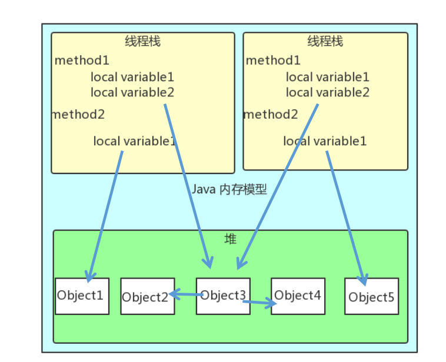
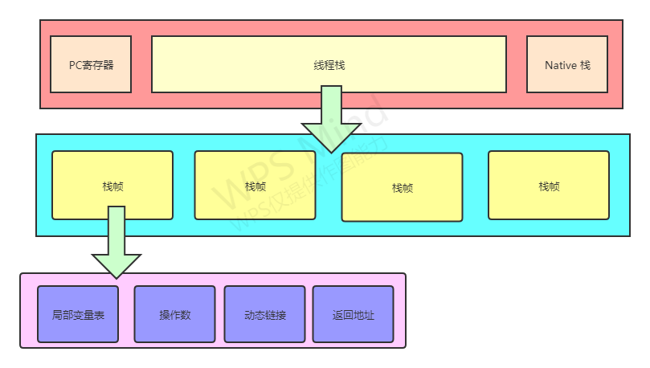
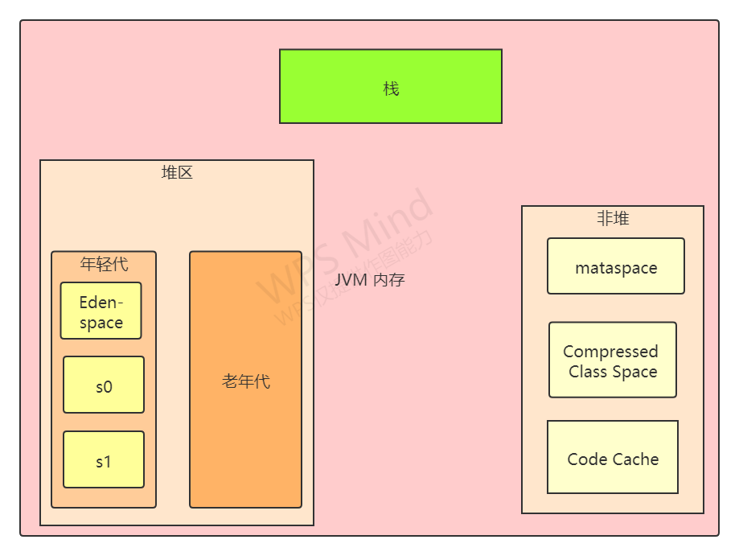

# JVM 内存结构


## 一. JVM内存结构
下面示例来自 : [Java Concurrency](http://tutorials.jenkov.com/java-concurrency/java-memory-model.html)

> 线程堆栈还包含正在执行的每个方法（调用堆栈上的所有方法）的所有局部变量。线程只能访问自己的线程堆栈。由线程创建的局部变量对创建线程之外的所有其他线程不可见。即使两个线程执行的代码完全相同，两个线程仍将在各自的线程堆栈中创建该代码的局部变量。因此，每个线程对每个局部变量都有其自己的版本。 

> 原始类型的所有局部变量（ `boolean`，`byte`，`short`，`char`，`int`，`long`， `float`，`double`）完全存储在线程栈上，因此不是其他线程可见。一个线程可以将一个主要变量的副本传递给另一个线程，但是它不能共享原始局部变量本身。 

> 堆包含在Java应用程序中创建的所有对象，而不管创建该对象的线程是什么。这包括原语类型（例如对象的版本`Byte`，`Integer`，`Long`等等）。创建对象并将其分配给局部变量，或者将其创建为另一个对象的成员变量都没有关系，该对象仍存储在堆中。 



```java
public class MyRunnable implements Runnable() {

    public void run() {
        methodOne();
    }

    public void methodOne() {
        int localVariable1 = 45;

        MySharedObject localVariable2 =
            MySharedObject.sharedInstance;

        //... do more with local variables.

        methodTwo();
    }

    public void methodTwo() {
        Integer localVariable1 = new Integer(99);

        //... do more with local variable.
    }
}
```
```java
public class MySharedObject {

    //static variable pointing to instance of MySharedObject

    public static final MySharedObject sharedInstance =
        new MySharedObject();


    //member variables pointing to two objects on the heap

    public Integer object2 = new Integer(22);
    public Integer object4 = new Integer(44);

    public long member1 = 12345;
    public long member2 = 67890;
}
```

内存情况讲解 : 

假设有两个线程在执行run方法,run方法会调用`methodOne()`,该方法中会引用`MySharedObject`,由于该类是一个静态变量,在内存中只有一份,所以两个线程的` local variable2 `都指向`Object3`,在`Object3`中存在2和4对象的引用,所以两个线程都可以通过`Object3`来访问对象2和4 , 而在方法`methodOne()`中还会调用`methodTwo()`,在执行`methodTwo()`的时候,每个线程都会存储一份`localVariable1` 变量的拷贝,而真实对象仍然存在堆上.也就出现了上图中指向 1和 5的情况.

## 二.JVM栈区结构



PC寄存器 : 用于存储字节码指令,当CPU在不停切换线程时能够知道接下来要执行什么指令.

Native 栈 : 本地方法栈,Native 方法不是以 Java 语言实现的，而是以本地语言实现的（比如 C 或 C++）

栈帧 : 栈的元素。每个方法在执行时都会创建一个栈帧。栈帧中存储了局部变量表、操作数栈、动态连接和方法出口等信息。每个方法从调用到运行结束的过程，就对应着一个栈帧在栈中压栈到出栈的过程。

## 三.JVM堆区结构



- JVM 将堆区分为年轻代和老年代  , 年轻代还划分为三个内存区域,Eden-space(新生代) ,s0 ,s1(存活区)

- 非堆本质上还是堆区,只是一般不归GC管理,主要包括 : mataspace , CCS , Code Cache
- Metaspace Jdk1.8之前叫持久代/永久代
- CCS : Compressed Class Space, 存放 class 信息，和 Metaspace 有交叉。
- Code Cache, 存放 JIT 编译器编译后的本地机器代码。


# 参考文献

- [1] [Java 内存模型](http://tutorials.jenkov.com/java-concurrency/java-memory-model.html )
- [2] [Jvm内存结构](https://blog.csdn.net/rongtaoup/article/details/89142396)
- [3] [PC寄存器，堆，栈等简介](https://blog.csdn.net/axiang_/article/details/107366145)
- [4] [JVM的Heap Memory和Native Memory](https://blog.csdn.net/u013721793/article/details/51204001?utm_medium=distribute.pc_relevant.none-task-blog-BlogCommendFromMachineLearnPai2-1.control&depth_1-utm_source=distribute.pc_relevant.none-task-blog-BlogCommendFromMachineLearnPai2-1.control)