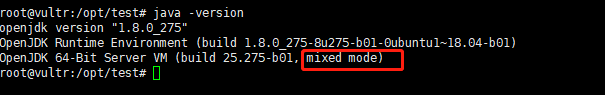

# JVM  相关参数

> 不积跬步无以至千里 , 不积小流无以成江海!
> 拼搏吧,骚年!


# 一.启动参数含义

> `-` : 标准参数，所有的 JVM 都要实现这些参数，并且向后兼容。 

> `-D`  : 设置系统属性。 

> `-X`  : 非标准参数， 基本都是传给 JVM 的,默认 JVM 实现这些参数的功能，但是并不保证所 有 JVM 实现都满足，且不保证向后兼容。 可以使用 java -X 命令来查看当前 JVM 支持的非标准参数。 

> `–XX` ：非稳定参数, 专门用于控制 JVM 的行为，跟具体的 JVM 实现有关，随时可能会在 下个版本取消。 

- -XX：+-Flags 形式, +- 是对布尔值进行开关。 

- -XX：key=value 形式, 指定某个选项的值


# 二.参数类型

## 1. 系统属性参数 
```shell
-Dfile.encoding=UTF-8 
-Duser.timezone=GMT+08 
-Dmaven.test.skip=true
-Dio.netty.eventLoopThreads=8
```

## 2. 运行模式参数 

- `-server`：设置 JVM 使用 server 模式，特点是启动速度比较慢，但运行时性能和内存管理效率 很高，适用于生产环境。在具有 64 位能力的 JDK 环境下将默认启用该模式，而忽略 -client 参数。
- `-client` : JDK1.7 之前在32位的 x86 机器上的默认值是 `-client` 选项.设置 JVM 使用 client 模式,特点是启动速度比较快,但运行时性能和内存管理效率不高,通常用于客户端应用程序或 者 PC 应用开发和调试。
- `-Xint`：在解释模式（interpreted mode）下运行，-Xint 标记会强制 JVM 解释执行所有的字节码，这当然会降低运行速度，通常低10倍或更多。
- `-Xcomp`：`-Xcomp` 参数与`-Xint` 正好相反，JVM 在第一次使用时会把所有的字节码编译成本地 代码，从而带来最大程度的优化。【注意预热】
-  `-Xmixed`：`-Xmixed` 是混合模式，将解释模式和编译模式进行混合使用，由JVM自己决定，这是 JVM 的默认模式，也是推荐模式。 我们使用 java -version 可以看到 mixed mode 等信息



## 3. 堆内存设置参数

- `-Xmx` :  指定最大堆内存。 如 -Xmx4g. 这只是限制了 Heap 部分的最大值为4g.这个内存不包括栈内存，也不包括堆外使用的内存。 

- `-Xms` :  指定堆内存空间的初始大小。 如 -Xms4g。 而且指定的内存大小，并不是操作系统实际分配的初始值，而是GC先规划好，用到才分配。 专用服务器上需要保持 –Xms 和 –Xmx 一致，否则应用刚启动可能就有好几个 FullGC。 当两者配置不一致时，堆内存扩容可能会导致性能抖动。

- `-Xmn` :  年轻代内存 , 等价于`-XX:NewSize`，使用 G1 垃圾收集器不应该设置该选项，在其他的某些业务场景下可以设置。官方建议设置为 -Xmx 的 1/2 ~ 1/4. 

- `-XX：MaxPermSize=size` :  JDK1.7 之前使用的。Java8 默认允许的Meta空间无限大，此参数无效。 

- `-XX：MaxMetaspaceSize=size` :  Java8 默认不限制 Meta 空间, 一般不允许设置该选项。 

- `-XX：MaxDirectMemorySize=size` : 系统可以使用的最大堆外内存，这个参数跟`-Dsun.nio.MaxDirectMemorySize` 效果相同。 
- `-Xss` :  设置每个线程栈的字节数。 例如`-Xss1m`指定线程栈为 1MB，与`-XX:ThreadStackSize=1m` 等价

## 4. GC 设置参数 

- `-XX：+UseG1GC` ：使用 G1 垃圾回收器 

- `-XX：+UseConcMarkSweepGC` ：使用 CMS 垃圾回收器 

- `-XX：+UseSerialGC`：使用串行垃圾回收器 

- `-XX：+UseParallelGC`：使用并行垃圾回收器 

- `-XX：+UnlockExperimentalVMOptions -XX:+UseZGC`   : Java 11以上,使用zgc

- `-XX：+UnlockExperimentalVMOptions -XX:+UseShenandoahGC` :  Java 12 以上,使用ShenandoahGC

## 5. 分析诊断参数 

- `-XX：+-HeapDumpOnOutOfMemoryError`  : 当 OutOfMemoryError 产生，即内存溢出(堆内存或持久代)时自动 Dump 堆内存。 
- `-XX:HeapDumpPath=/usr/local/ ConsumeHeap` : 指定自动dump下来的文件存储路径,没有指定则默认为启动 Java 程序的工作目录
- `-XX：OnError` : 发生致命错误时（fatal error）执行的脚本。eg : `java -XX:OnError="gdb - %p" MyApp`,  `%p` 表示进程Id
- `-XX：OnOutOfMemoryError` : 抛出 OutOfMemoryError 错误时执行的脚本。 
- `-XX：ErrorFile=filename`  : 致命错误的日志文件名,绝对路径或者相对路径。
- `-Xdebug -Xrunjdwp:transport=dt_socket,server=y,suspend=n,address=1506` : 远程调试

## 6. JavaAgent 参数

- `-agentlib:libname[=options]` 启用 native 方式的 agent, 参考LD_LIBRARY_PATH(动态库的查找路径)路径。 eg : 开启CPU使用时间抽样分析`-agentlib:hprof=cpu=samples,file=cpu.samples.log`

- `-agentpath:pathname[=options]` 启用 native 方式的 agent。 

- `-javaagent:jarpath[=options]` 启用外部的 agent 库, 比如 skywalking.jar 等等。 

- `-Xnoagent` 禁用所有 agent。

# 参考资料

- [1] kimmking老师的资料