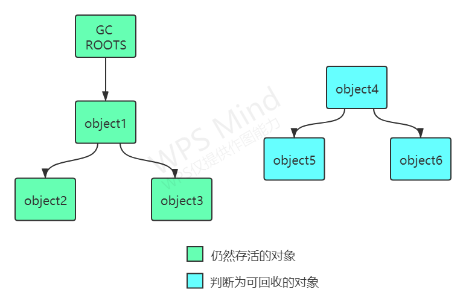
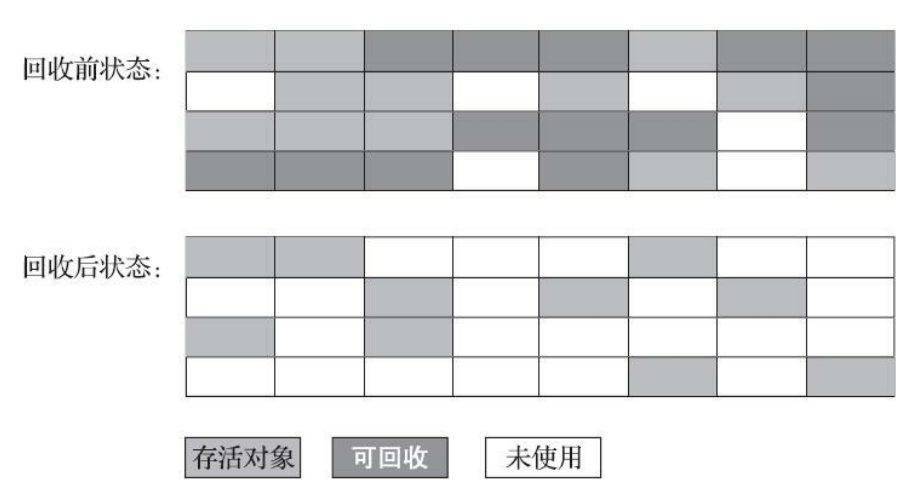

# 垃圾收集器与内存分配策略

## 一. 垃圾收集器到底要做什么?
> 哪些内存需要回收? 
> 什么时候回收?
> 如何回收?

## 二. 常见的判断对象是否存活算法以及相关知识介绍

### 1. 引用计数算法
在对象中添加一个引用计数器，每当有一个地方 引用它时，计数器值就加一；当引用失效时，计数器值就减一；任何时刻计数器为零的对象就是不可 能再被使用的。

### 2. Java为什么不使用引用计数算法
  这个看似简单 的算法有很多例外情况要考虑，必须要配合大量额外处理才能保证正确地工作，譬如单纯的引用计数 就很难解决对象之间相互循环引用的问题。

### 3. 可达性分析算法
通过一系列称为“GC Roots”的根对象作为起始节点集，从这些节点开始，根据引用关系向下搜索,搜索过程所走过的路径称为“引用链”（Reference Chain），如果某个对象到GC Roots间没有任何引用链相连， 或者用图论的话来说就是从GC Roots到这个对象不可达时，则证明此对象是不可能再被使用的。

### 4. Java中可以作为GC-ROOT的对象

- 在虚拟机栈（栈帧中的本地变量表）中引用的对象，譬如各个线程被调用的方法堆栈中使用到的参数、局部变量、临时变量等.
- 在方法区中类静态属性引用的对象，譬如Java类的引用类型静态变量。
- 在方法区中常量引用的对象，譬如字符串常量池（String Table）里的引用。
- 在本地方法栈中JNI（即通常所说的Native方法）引用的对象。
- Java虚拟机内部的引用，如基本数据类型对应的Class对象，一些常驻的异常对象（比如NullPointExcepiton、OutOfMemoryError）等，还有系统类加载器。
- 所有被同步锁（synchronized关键字）持有的对象。
- 反映Java虚拟机内部情况的JMXBean、JVMTI中注册的回调、本地代码缓存等。

除了这些固定的GC Roots集合以外，根据用户所选用的垃圾收集器以及当前回收的内存区域不 同，还可以有其他对象“临时性”地加入，共同构成完整GC Roots集合。譬如分代收集和局部回收（Partial GC）

### 5. Java中的引用
>在JDK 1.2版之后，Java对引用的概念进行了扩充，将引用分为强引用（Strongly Re-ference）、软 引用（Soft Reference),弱引用（Weak Reference）和虚引用（Phantom Reference）4种，这4种引用强度依次逐渐减弱。

- 强引用是最传统的“引用”的定义，是指在程序代码之中普遍存在的引用赋值.无论任何情况下，只要强引用关系还存在，垃圾收集器就永远不会回 收掉被引用的对象。

- 软引用是用来描述一些还有用，但非必须的对象。只被软引用关联着的对象，在系统将要发生内 存溢出异常前，会把这些对象列进回收范围之中进行第二次回收，如果这次回收还没有足够的内存， 才会抛出内存溢出异常。在JDK 1.2版之后提供了SoftReference类来实现软引用。

- 弱引用也是用来描述那些非必须对象，但是它的强度比软引用更弱一些，被弱引用关联的对象只 能生存到下一次垃圾收集发生为止。当垃圾收集器开始工作，无论当前内存是否足够，都会回收掉只 被弱引用关联的对象。在JDK 1.2版之后提供了WeakReference类来实现弱引用。

- 虚引用也称为“幽灵引用”或者“幻影引用”，它是最弱的一种引用关系。一个对象是否有虚引用的 存在，完全不会对其生存时间构成影响，也无法通过虚引用来取得一个对象实例。为一个对象设置虚引用关联的**唯一目的只是为了能在这个对象被收集器回收时收到一个系统通知**。在JDK 1.2版之后提供 了PhantomReference类来实现虚引用。

### 6. 对象的自救

即使在可达性分析算法中判定为不可达的对象，也不是“非死不可”的，这时候它们暂时还处于“缓 刑”阶段，要真正宣告一个对象死亡，至少要经历两次标记过程：如果对象在进行可达性分析后发现没 有与GC Roots相连接的引用链，那它将会被第一次标记，随后进行一次筛选，筛选的条件是此对象是 否有必要执行finalize()方法。假如对象没有覆盖finalize()方法，或者finalize()方法已经被虚拟机调用 过，那么虚拟机将这两种情况都视为“没有必要执行”。如果对象想要自救,那么可以在finalize()方法中将其与引用链上的任何一个对象建立关联.但是该方法值有效一次,因为 finalize()方法 只会执行一次.

### 7. 类型的回收

**判断类型是否可以回收的条件 :** 

(1)该类所有的实例都已经被回收，也就是Java堆中不存在该类及其任何派生子类的实例。
(2)加载该类的类加载器已经被回收，这个条件除非是经过精心设计的可替换类加载器的场景，如 OSGi、JSP的重加载等，否则通常是很难达成的。
(3)该类对应的java.lang.Class对象没有在任何地方被引用，无法在任何地方通过反射访问该类的方 法。

**Java虚拟机被允许对满足上述三个条件的无用类进行回收.**

**Java虚拟机类型回收相关参数 : **

关于是否要对类型进行回收，HotSpot虚拟机提供了- Xnoclassgc参数进行控制，还可以使用-verbose：class以及-XX：+TraceClass-Loading、-XX： +TraceClassUnLoading查看类加载和卸载信息，其中-verbose：class和-XX：+TraceClassLoading可以在 Product版的虚拟机中使用，-XX：+TraceClassUnLoading参数需要FastDebug版的虚拟机支持。

**使用场景 :** 

在大量使用反射、动态代理、CGLib等字节码框架，动态生成JSP以及OSGi这类频繁自定义类加载 器的场景中，通常都需要Java虚拟机具备类型卸载的能力，以保证不会对方法区造成过大的内存压力。

# 三.垃圾收集算法

# 参考资料
- [1] 深入理解JVM虚拟机 - 第二部分

