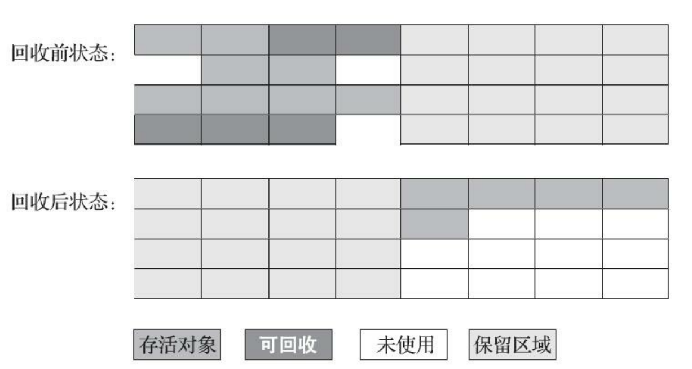
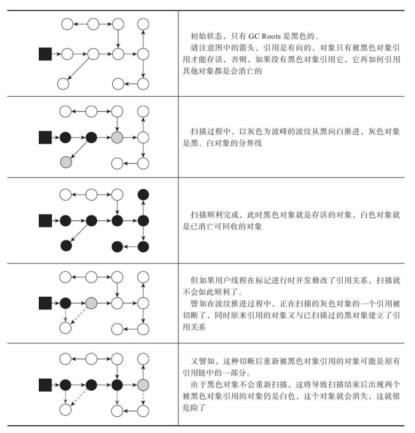

# 垃圾收集器与内存分配策略

## 一. 垃圾收集器到底要做什么?
> 哪些内存需要回收? 
> 什么时候回收?
> 如何回收?

## 二. 常见的判断对象是否存活算法以及相关知识介绍

### 1. 引用计数算法
在对象中添加一个引用计数器，每当有一个地方 引用它时，计数器值就加一；当引用失效时，计数器值就减一；任何时刻计数器为零的对象就是不可 能再被使用的。

### 2. Java为什么不使用引用计数算法
  这个看似简单 的算法有很多例外情况要考虑，必须要配合大量额外处理才能保证正确地工作，譬如单纯的引用计数 就很难解决对象之间相互循环引用的问题。

### 3. 可达性分析算法
通过一系列称为“GC Roots”的根对象作为起始节点集，从这些节点开始，根据引用关系向下搜索,搜索过程所走过的路径称为“引用链”（Reference Chain），如果某个对象到GC Roots间没有任何引用链相连， 或者用图论的话来说就是从GC Roots到这个对象不可达时，则证明此对象是不可能再被使用的。

### 4. Java中可以作为GC-ROOT的对象

- 在虚拟机栈（栈帧中的本地变量表）中引用的对象，譬如各个线程被调用的方法堆栈中使用到的参数、局部变量、临时变量等.
- 在方法区中类静态属性引用的对象，譬如Java类的引用类型静态变量。
- 在方法区中常量引用的对象，譬如字符串常量池（String Table）里的引用。
- 在本地方法栈中JNI（即通常所说的Native方法）引用的对象。
- Java虚拟机内部的引用，如基本数据类型对应的Class对象，一些常驻的异常对象（比如NullPointExcepiton、OutOfMemoryError）等，还有系统类加载器。
- 所有被同步锁（synchronized关键字）持有的对象。
- 反映Java虚拟机内部情况的JMXBean、JVMTI中注册的回调、本地代码缓存等。

除了这些固定的GC Roots集合以外，根据用户所选用的垃圾收集器以及当前回收的内存区域不 同，还可以有其他对象“临时性”地加入，共同构成完整GC Roots集合。譬如分代收集和局部回收（Partial GC）

### 5. Java中的引用
>在JDK 1.2版之后，Java对引用的概念进行了扩充，将引用分为强引用（Strongly Re-ference）、软 引用（Soft Reference),弱引用（Weak Reference）和虚引用（Phantom Reference）4种，这4种引用强度依次逐渐减弱。

- 强引用是最传统的“引用”的定义，是指在程序代码之中普遍存在的引用赋值.无论任何情况下，只要强引用关系还存在，垃圾收集器就永远不会回 收掉被引用的对象。

- 软引用是用来描述一些还有用，但非必须的对象。只被软引用关联着的对象，在系统将要发生内 存溢出异常前，会把这些对象列进回收范围之中进行第二次回收，如果这次回收还没有足够的内存， 才会抛出内存溢出异常。在JDK 1.2版之后提供了SoftReference类来实现软引用。

- 弱引用也是用来描述那些非必须对象，但是它的强度比软引用更弱一些，被弱引用关联的对象只 能生存到下一次垃圾收集发生为止。当垃圾收集器开始工作，无论当前内存是否足够，都会回收掉只 被弱引用关联的对象。在JDK 1.2版之后提供了WeakReference类来实现弱引用。

- 虚引用也称为“幽灵引用”或者“幻影引用”，它是最弱的一种引用关系。一个对象是否有虚引用的 存在，完全不会对其生存时间构成影响，也无法通过虚引用来取得一个对象实例。为一个对象设置虚引用关联的**唯一目的只是为了能在这个对象被收集器回收时收到一个系统通知**。在JDK 1.2版之后提供 了PhantomReference类来实现虚引用。

### 6. 对象的自救

即使在可达性分析算法中判定为不可达的对象，也不是“非死不可”的，这时候它们暂时还处于“缓 刑”阶段，要真正宣告一个对象死亡，至少要经历两次标记过程：如果对象在进行可达性分析后发现没 有与GC Roots相连接的引用链，那它将会被第一次标记，随后进行一次筛选，筛选的条件是此对象是 否有必要执行finalize()方法。假如对象没有覆盖finalize()方法，或者finalize()方法已经被虚拟机调用 过，那么虚拟机将这两种情况都视为“没有必要执行”。如果对象想要自救,那么可以在finalize()方法中将其与引用链上的任何一个对象建立关联.但是该方法值有效一次,因为 finalize()方法 只会执行一次.

### 7. 类型的回收

**判断类型是否可以回收的条件 :** 

(1)该类所有的实例都已经被回收，也就是Java堆中不存在该类及其任何派生子类的实例。
(2)加载该类的类加载器已经被回收，这个条件除非是经过精心设计的可替换类加载器的场景，如 OSGi、JSP的重加载等，否则通常是很难达成的。
(3)该类对应的java.lang.Class对象没有在任何地方被引用，无法在任何地方通过反射访问该类的方 法。

**Java虚拟机被允许对满足上述三个条件的无用类进行回收.**

**Java虚拟机类型回收相关参数 : **

关于是否要对类型进行回收，HotSpot虚拟机提供了- Xnoclassgc参数进行控制，还可以使用-verbose：class以及-XX：+TraceClass-Loading、-XX： +TraceClassUnLoading查看类加载和卸载信息，其中-verbose：class和-XX：+TraceClassLoading可以在 Product版的虚拟机中使用，-XX：+TraceClassUnLoading参数需要FastDebug版的虚拟机支持。

**使用场景 :** 

在大量使用反射、动态代理、CGLib等字节码框架，动态生成JSP以及OSGi这类频繁自定义类加载 器的场景中，通常都需要Java虚拟机具备类型卸载的能力，以保证不会对方法区造成过大的内存压力。

# 三.垃圾收集算法

## 1.分代收集理论基础
> (1) 弱分代假说(Weak Generational Hypothesis):绝大多数对象都是朝生夕灭的。 
> (2) 强分代假说(Strong Generational Hypothesis):熬过越多次垃圾收集过程的对象就越难以消亡。
> (3)跨代引用假说(Intergenerational Reference Hypothesis):跨代引用相对于同代引用来说仅占极少数。

​		前两个假说奠定了垃圾收集器一致的设计原则 ; 收集器应该将Java堆划分出不同的区域，然后将回收对象依据其年龄（年龄即对象熬过垃圾收集过程的次数）分配到不同的区域之中存储。
​		但是分代价说存在一个特例 : **跨代引用 , 对象不是孤立的,对象之间会存在跨代引用。**
​		假如要现在进行一次只局限于新生代区域内的收集（Minor GC），但新生代中的对象是完全有可能被老年代所引用的，为了找出该区域中的存活对象，不得不在固定的GC Roots之外，再额外遍历整个老年代中所有对象来确保可达性分析结果的正确性，反过来也是一样。遍历整个老年代所有对象的方案虽然理论上可行，但无疑会为内存回收带来很大的性能负担。
​		为了解决这个问题，就需要对分代收集理论添加第三条经验法则.第三条其实是可根据前两条假说逻辑推理得出的隐含推论：存在互相引用关系的两个对象，是应该倾向于同时生存或者同时消亡的。举个例子，如果某个新生代对象存在跨代引用，由于老年代对象难以消亡，该引用会使得新生代对象在收集时同样得以存活，进而在年龄增长之后晋升到老年代中，这时跨代引用也随即被消除了。
​		依据这条假说，我们就不应再为了少量的跨代引用去扫描整个老年代，也不必浪费空间专门记录 每一个对象是否存在及存在哪些跨代引用，只需在新生代上建立一个全局的数据结构（该结构被称 为“记忆集”，Remembered Set），这个结构把老年代划分成若干小块，标识出老年代的哪一块内存会 存在跨代引用。此后当发生Minor GC时，只有包含了跨代引用的小块内存里的对象才会被加入到GC Roots进行扫描。虽然这种方法需要在对象改变引用关系（如将自己或者某个属性赋值）时维护记录数 据的正确性，会增加一些运行时的开销，但比起收集时扫描整个老年代来说仍然是划算的。

### 2.标记-清除算法

#### (1) 算法原理

​		算法分为“标记”和“清除”两个阶段：首先标记出所有需要回收的对象，在标记完成后，统一回收掉所有被标记的对象，也可以反过来，标记存活的对象，统一回收所有未被标记的对象。

### (2) 算法不足
- 执行效率不稳定，如果Java堆中包含大量对象，而且其中大部分是需要被回收的，这时必须进行大量标记和清除的动作，导致标记和清除两个过 程的执行效率都随对象数量增长而降低
- 是内存空间的碎片化问题，标记、清除之后会产生大 量不连续的内存碎片，空间碎片太多可能会导致当以后在程序运行过程中需要分配较大对象时无法找 到足够的连续内存而不得不提前触发另一次垃圾收集动作

### 3.标记-复制算法
#### (1) 算法原理
​		将可用内存按容量划分为大小相等的两块，每次只使用其中的一块。当这一块的内存用完了，就将还存活着的对象复制到另外一块上面，然后再把已使用过的内存空间一次清理掉。
### (2) 算法不足
- 如果大多数对象都存活,会有很大的复制开销
- 可用内存减少为原来的一半
### (3) 算法优点
- 不会产生大量的内存碎片

### (4) 相关使用
- 现在的商用Java虚拟机大多都优先采用了这种收集算法去回收新生代.
- HotSpot虚拟机默认Eden和Survivor的大小比例是8∶1，也即每次新生代中可用内存空间为整个新生代容量的90%（Eden的80%加上一个Survivor的10%），只有一个Survivor空间，即10%的新生代是会 被“浪费”的。
- 当Survivor空间不足以容纳一次Minor GC之后存活的对象时，就需要依赖其他内存区域（实 际上大多就是老年代）进行分配担保（Handle Promotion）,也就是说将这部分对象直接进入老年代.

### 4.标记-整理算法
#### (1) 老年代为什么不能使用标记-复制算法
		标记-复制算法在对象存活率较高时就要进行较多的复制操作，效率将会降低。更关键的是，如果不想浪费50%的空间，就需要有额外的空间进行分配担保，以应对被使用的内存中所有对象都100%存活的极端情况，所以在老年代一般不能直接选用这种算法。
#### (2) 算法原理
		标记过程仍然与“标记-清除”算法一样，但后续步骤不是直接对可回收对象进行清理，而是让所有存活的对象都向内存空间一端移动，然后直接清理掉边界以外的内存.
		标记-清除算法与标记-整理算法的本质差异在于前者是一种非移动式的回收算法，而后者是移动 式的。

# 四.HotSpot算法细节实现
## 1. GC ROOT 枚举
**为什么不管是什么GC在查找GC ROOT的时候都需要`stop the world` ?**
​		因为根节点枚举必须在一个能保障一致性的快照中才得以进行,如果在查找根节点枚举的过程中,根节点集合的对象引用关系还在不断变化,就无法保证分析结果准确性.这是导致垃圾收集过程必须停顿所有 用户线程的其中一个重要原因.即使是号称停顿时间可控，或者（几乎）不会发生停顿的CMS、G1、 ZGC等收集器，枚举根节点时也是必须要停顿的。
**虚拟机是怎么直接得到哪些地方存放着对象引用的?**
​		借助OopMap , 在HotSpot中，对象的类型信息里有记录自己的OopMap，记录了在该类型的对象内什么偏移量上是什么类型的数据。所以从对象开始向外的扫描可以是准确的；这些数据是在类加载过程中计算得到的。
​		可以把oopMap简单理解成是调试信息。 在源代码里面每个变量都是有类型的，但是编译之后的代码就只有变量在栈上的位置了。oopMap就是一个附加的信息，告诉你栈上哪个位置本来是个什么东西。
​		

## 2.安全点
**为什么会有安全点存在 ?** 

​		在OopMap的协助下，HotSpot可以快速准确地完成GC Roots枚举,但是导致OopMap内容变化的指令非常多，如果为每一条指令都生成对应的OopMap，那将会需要大量的额外存储空间， 所以只是在“特定的位置”记录了这些信息，这些位置被称为安全点（Safepoint) ,  安全点位置的选取基本上是以“是否具有让程序长时间执行的特征”为标准进行选定的.

**如何在垃圾收集发生时让所有线程都跑到最近的安全点 ?** 

> 有两种方式 : 抢先式中断 （Preemptive Suspension）和主动式中断（Voluntary Suspension）

- 抢先式中断 : 在垃圾收集发生时，系统首先把所有用户线程全部中断，如果发现有用户线程中断的地 方不在安全点上，就恢复这条线程执行，让它一会再重新中断，直到跑到安全点上。
- 主动式中断 : 设置一 个标志位，各个线程执行过程时会不停地主动去轮询这个标志，一旦发现中断标志为真时就自己在最 近的安全点上主动中断挂起。

## 3.安全区域
**安全区域是用来解决什么问题的?**
		用户线程处于Sleep状态或者Blocked状态，这时候线程无法响应虚拟机的中断请求，不能再走到安全的地方去中断挂起自己.这个时间就需要借助安全区域来确保线程在某一段代码片段之中，引用关系不会发生变化,在这个区域中任意地方开始垃圾收集都是安全的。我们也可以把安全区域看作被扩展拉伸了的安全点。

​		当用户线程执行到安全区域里面的代码时，首先会标识自己已经进入了安全区域，那样当这段时间里虚拟机要发起垃圾收集时就不必去管这些已声明自己在安全区域内的线程了.

## 4.记忆集与卡表
​		为解决对象跨代引用所带来的问题 , 垃圾收集器在新生代中建立了名为记忆集（Remembered Set）的数据结构，用以避免把整个老年代加进GC Roots扫描范围.

​		记忆集是一种用于记录从非收集区域指向收集区域的指针集合的抽象数据结构。如果我们不考虑 效率和成本的话，最简单的实现可以用非收集区域中所有含跨代引用的对象数组来实现这个数据结构.

​		关于卡表与记忆集的关系，可以类比HashMap与Map的关系.

​		卡表最简单的形式可以只是一个字节数组 , 每一个数组元素代表一块内存空间 , 称为卡页 , 只要卡页内有一个（或更多）对象的字段存在着跨代指针，那就将对应卡表的数组元素的值标识为1，称为这个元素**变脏**（Dirty），没有则标识为0。在垃圾收集发生时，只要筛选出卡表中变脏的元素，就能轻易得出哪些卡页内存块中包含跨代指针，把它们加入GC Roots中一并扫描。

## 5.写屏障
**卡表元素何时变脏 ?** 
		在HotSpot虚拟机里是通过写屏障（Write Barrier）技术维护卡表状态的.写屏障可以看作在虚拟机层面对“引用类型字段赋值”这个动作的AOP切 面.其进行的操作是 : 当元素被赋值之后将卡表元素变脏.

**伪共享 : **

​		伪共享是处 理并发底层细节时一种经常需要考虑的问题，现代中央处理器的缓存系统中是以缓存行（Cache Line） 为单位存储的，当多线程修改互相独立的变量时，如果这些变量恰好共享同一个缓存行，就会彼此影 响（写回、无效化或者同步）而导致性能降低，这就是伪共享问题。

## 6.并发的可达性分析

**(1)由于主流的GC算法都是通过可达性分析来判断对象是否存活的,可达性分析算法理论上要求全过程都基于一个能保障一致性的快照中才能够进行分析,那么为什么会存在这个要求那?如果并发可能会有什么问题?**

借助三色标记来解释 : 按照“是否访问过”这个条件标记成以下三种颜色：

- 白色：表示对象尚未被垃圾收集器访问过。显然在可达性分析刚刚开始的阶段，所有的对象都是

白色的，若在分析结束的阶段，仍然是白色的对象，即代表不可达。

- 黑色：表示对象已经被垃圾收集器访问过，且这个对象的所有引用都已经扫描过。黑色的对象代

表已经扫描过，它是安全存活的，如果有其他对象引用指向了黑色对象，无须重新扫描一遍。黑色对

象不可能直接（不经过灰色对象）指向某个白色对象。

- 灰色：表示对象已经被垃圾收集器访问过，但这个对象上至少存在一个引用还没有被扫描过。

**(2)当且仅当以下两个条件同时满足时，会产生“对象消失”的问题 :** 

> 1. 赋值器插入了一条或多条从黑色对象到白色对象的新引用；
> 2. 赋值器删除了全部从灰色对象到该白色对象的直接或间接引用。

**(3)解决办法 :** 

> 增量更新（Incremental Update）:
> 增量更新要破坏的是第一个条件，当黑色对象插入新的指向白色对象的引用关系时，就将这个新
> 插入的引用记录下来，等并发扫描结束之后，再将这些记录过的引用关系中的黑色对象为根，重新扫
> 描一次。这可以简化理解为，黑色对象一旦新插入了指向白色对象的引用之后，它就变回灰色对象
> 了。

> 原始快照（Snapshot At The Beginning，SATB）
> 原始快照要破坏的是第二个条件，当灰色对象要删除指向白色对象的引用关系时，就将这个要删
> 除的引用记录下来，在并发扫描结束之后，再将这些记录过的引用关系中的灰色对象为根，重新扫描
> 一次。这也可以简化理解为，无论引用关系删除与否，都会按照刚刚开始扫描那一刻的对象图快照来
> 进行搜索。

**(4) 相关应用**

CMS是基于增量更新来做并发标记的，G1、Shenandoah则是用原始快照来实现。

# 相关名词解释

- 部分收集（Partial GC）：指目标不是完整收集整个Java堆的垃圾收集
- 新生代收集（Minor GC/Young GC）：指目标只是新生代的垃圾收集
- 老年代收集（Major GC/Old GC）：指目标只是老年代的垃圾收集。目前只有CMS收集器会- - 有单独收集老年代的行为。
- 混合收集（Mixed GC）：指目标是收集整个新生代以及部分老年代的垃圾收集。目前只有G1收集器会有这种行为
- 整堆收集（Full GC）：收集整个Java堆和方法区的垃圾收集

# 参考资料
- [1] 深入理解JVM虚拟机 - 第二部分
- [2] [OopMap 介绍](https://www.cnblogs.com/blythe/p/7463362.html)

