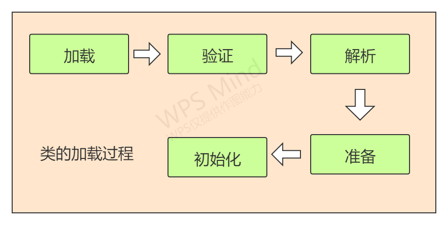

```
2. send one data cost :
```

# JVM 基础知识


# 一.为什么会有JVM

Java 语言的设计初衷就是为了解决多种主机类型无法运行同一套代码的问题,也就是跨平台问题.下面是选组Java虚拟机规范的原文.

> The Java platform was initially developed to address the problems of building software for networked consumer devices. It was designed to support multiple host architectures and to allow secure delivery of software components. 

Jvm(Java虚拟机) 是Java平台的基石.负责硬件和操作系统的独立性.

正是因为有了JVM,Java才可以跨平台


# 二. 相关概念

## 1.字节码
Java bytecode 由单字节（byte）的指令组成，理论上最多支持 256 个操作码（opcode）。
实际上 Java 只使用了200左右的操作码， 还有一些操作码则保留给调试操作

## 2. 类的加载时机
-  当虚拟机启动时，初始化用户指定的主类，就是启动执行的 main 方法所在的类；
-  当遇到用以新建目标类实例的 new 指令时，初始化 new 指令的目标类，就是 new
一个类的时候要初始化；
-  当遇到调用静态方法的指令时，初始化该静态方法所在的类；
-  当遇到访问静态字段的指令时，初始化该静态字段所在的类；
-  子类的初始化会触发父类的初始化；
-  如果一个接口定义了 default 方法，那么直接实现或者间接实现该接口的类的初始化，
会触发该接口的初始化；
-  使用反射 API 对某个类进行反射调用时，初始化这个类，其实跟前面一样，反射调用
要么是已经有实例了，要么是静态方法，都需要初始化；
-  当初次调用 MethodHandle 实例时，初始化该 MethodHandle 指向的方法所在的
类。

## 3. 不会初始化（可能会加载）
- 通过子类引用父类的静态字段，只会触发父类的初始化，而不会触发子类的初始化。
- 定义对象数组，不会触发该类的初始化。
- 常量在编译期间会存入调用类的常量池中，本质上并没有直接引用定义常量的类，不
会触发定义常量所在的类。
- 通过类名获取 Class 对象，不会触发类的初始化，Hello.class 不会让 Hello 类初始
化。
- 通过 Class.forName 加载指定类时，如果指定参数 initialize 为 false 时，也不会触
发类初始化，其实这个参数是告诉虚拟机，是否要对类进行初始化。Class.forName
（“jvm.Hello”）默认会加载 Hello 类。
- 通过 ClassLoader 默认的 loadClass 方法，也不会触发初始化动作（加载了，但是
不初始化）。

## 4. 类加载的过程



- 加载
1）通过一个类的全限定名来获取定义此类的二进制字节流。 
2）将这个字节流所代表的静态存储结构转化为方法区的运行时数据结构。 
3）在内存中生成一个代表这个类的java.lang.Class对象，作为方法区这个类的各种数据的访问入 
口。
- 验证
1) 文件格式验证 : 字节流是否符合Class文件格式规范.
2) 元数据验证 : 对字节码描述的信息进行语义分析,保证其描述的信息符合《Java 语言规范》要求.
3) 字节码验证 : 进行数据流分析和控制流分析,用于确定语义合法.
4) 符号引用验证 : 其发生在虚拟机将符号引用转化为直接引用时候,该阶段在下面的解析阶段会发生.用于校验该类是否缺少或者被禁止访问它依赖的某些外部 类、方法、字段等资源
- 准备 : 为类变量分配内存并设置初始值.
- 解析 : 用于将符号引用解析为直接引用.主要包括 : 对于雷和接口的解析,对于字段的解析,对于方法的解析,对于接口方法的解析
- 初始化 : 此时真正的执行类的代码，进行成员变量的初始化操作。初始化阶段就是执行类构造器<clinit>()方法的过程。

> 符号引用 : 符号引用以一组符号来描述所引用的目标，符号可以是任何 形式的字面量，只要使用时能无歧义地定位到目标即可。符号引用与虚拟机实现的内存布局无关，引 用的目标并不一定是已经加载到虚拟机内存当中的内容。各种虚拟机实现的内存布局可以各不相同， 但是它们能接受的符号引用必须都是一致的，因为符号引用的字面量形式明确定义在《Java虚拟机规 范》的Class文件格式中.

> 直接引用 : 直接引用是可以直接指向目标的指针、相对偏移量或者是一个能 间接定位到目标的句柄。直接引用是和虚拟机实现的内存布局直接相关的，同一个符号引用在不同虚 拟机实例上翻译出来的直接引用一般不会相同。如果有了直接引用，那引用的目标必定已经在虚拟机 的内存中存在。

> <clinit>()方法是由编译器自动收集类中的所有类变量的赋值动作和静态语句块（static{}块）中的 语句合并产生的，编译器收集的顺序是由语句在源文件中出现的顺序决定的，静态语句块中只能访问 到定义在静态语句块之前的变量，定义在它之后的变量，在前面的静态语句块可以赋值，但是不能访问.

```java
public class Test { 
    static { 
    	i = 0; // 给变量复制可以正常编译通过 
        System.out.print(i); // 这句编译器会提示“非法向前引用”
    }
    static int i = 1; 
}
```


# 参考文献 :

- [1] [Java虚拟机规范](https://docs.oracle.com/javase/specs/jvms/se7/html/jvms-1.html#jvms-1.1)
- [2] 深入理解JVM虚拟机


