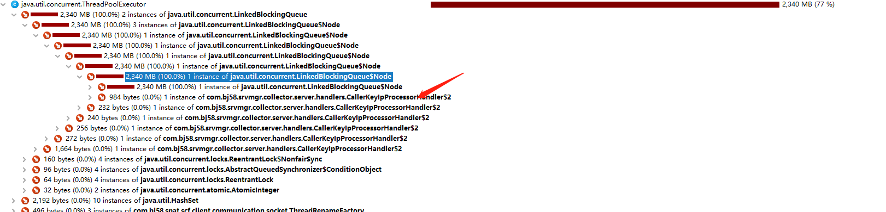
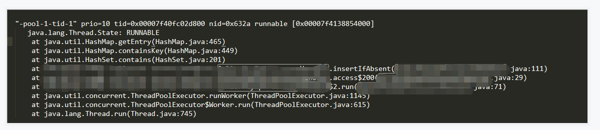

# 工作相关知识整理

> 不积跬步无以至千里 , 不积小流无以成江海!
> 拼搏吧,骚年!

# 相关知识整理学习

#### 1. CAS

- [Unsafe介绍及CAS原理解析](https://segmentfault.com/a/1190000023381653)

#### 2. 中断

#### 3. 双重检查锁

#### 4. HashMap死循环问题

在Java8之前的版本中之所以出现死循环是因为在resize的过程中对链表进行了倒序处理；在Java8中不再倒序处理，自然也不会出现死循环。
https://blog.csdn.net/pange1991/article/details/82377980

# 参考资料
- [1] [从ReentrantLock的实现看AQS的原理及应用](https://tech.meituan.com/2019/12/05/aqs-theory-and-apply.html)
- [2] [处理 InterruptedException](https://www.ibm.com/developerworks/cn/java/j-jtp05236.html)
- [3] [JAVA多线程之中断机制](https://blog.csdn.net/pange1991/article/details/85014872)
- [4] [Java中的双重检查锁](https://www.cnblogs.com/xz816111/p/8470048.html)