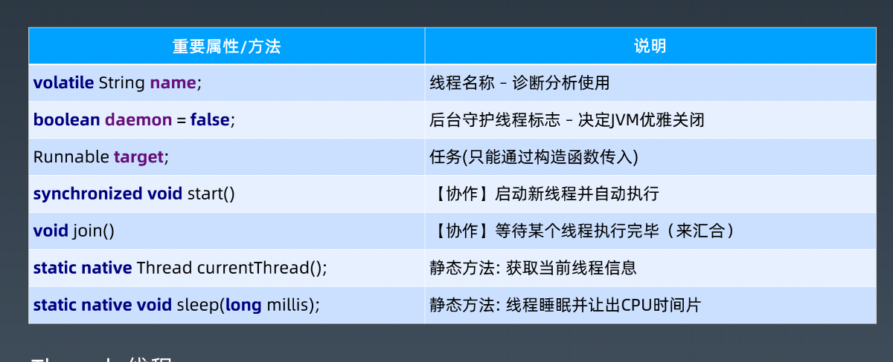
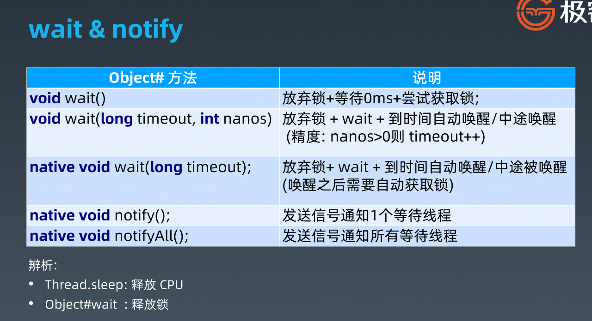
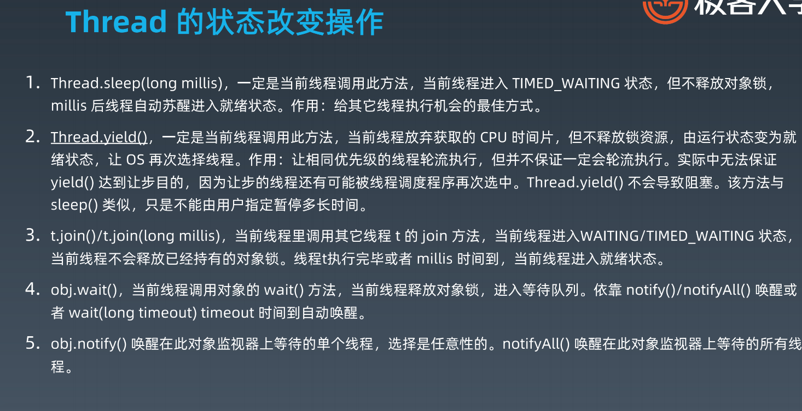
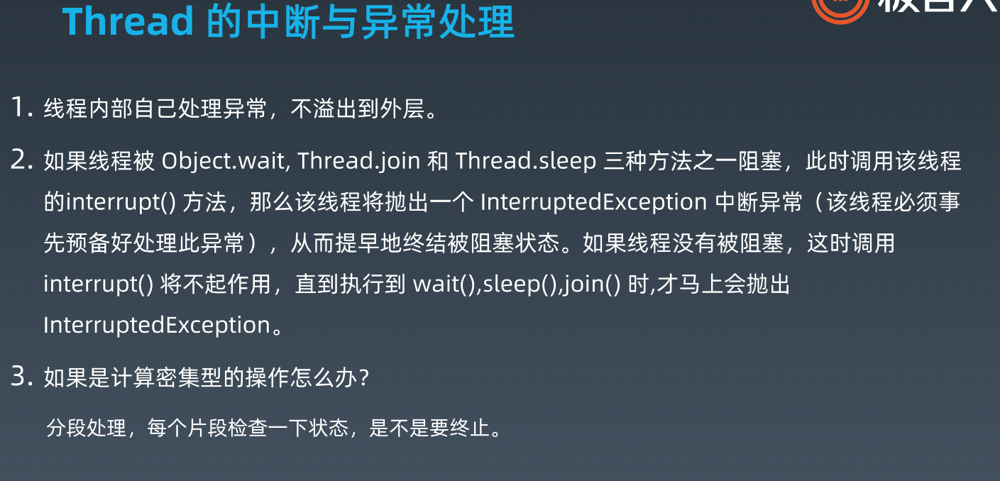

# Java 线程

# 一. 为什么会有多线程


# 二. Java线程创建过程


# 三.Java 多线程

## 3.1 守护线程

## 3.2 Runnable

### 3.2.1 常用方法/属性



- start() : 创建新线程
- run() : 本线程调用









## 3.3 线程状态

- Runnable
- Running
- Non-Runnable


## 3.4 线程安全

### 3.4.1 并发相关性质
- 原子性 : 对基本数据类型的变量的读取和赋值操作是原子性操作，即这些操作是不可被中断的，
  要么执行，要么不执行。

- 可见性 ：对于可见性，Java 提供了 volatile 关键字来保证可见性。
  当一个共享变量被 volatile 修饰时，它会保证修改的值会立即被更新到主存，当有其他
  线程需要读取时，它会去内存中读取新值。
  另外，通过 synchronized 和 Lock 也能够保证可见性，synchronized 和 Lock 能保证
  同一时刻只有一个线程获取锁然后执行同步代码，并且在释放锁之前会将对变量的修改
  刷新到主存当中。
  volatile 并不能保证原子性。

- 有序性：Java 允许编译器和处理器对指令进行重排序，但是重排序过程不会影响到单线程程序的执行，却会影

  响到多线程并发执行的正确性。可以通过 volatile 关键字来保证一定的“有序性”（synchronized 和 Lock

  也可以）。

  ```
  happens-before 原则（先行发生原则）：
  1. 程序次序规则：一个线程内，按照代码先后顺序
  2. 锁定规则：一个 unLock 操作先行发生于后面对同一个锁的 lock 操作
  3. Volatile 变量规则：对一个变量的写操作先行发生于后面对这个变量的读操作
  4. 传递规则：如果操作 A 先行发生于操作 B，而操作 B 又先行发生于操作 C，则可以得出 A 先于 C
  5. 线程启动规则：Thread 对象的 start() 方法先行发生于此线程的每个一个动作
  6. 线程中断规则：对线程 interrupt() 方法的调用先行发生于被中断线程的代码检测到中断事件的发生
  7. 线程终结规则：线程中所有的操作都先行发生于线程的终止检测，我们可以通过 Thread.join() 方法结束、
  Thread.isAlive() 的返回值手段检测到线程已经终止执行
  8. 对象终结规则：一个对象的初始化完成先行发生于他的 finalize() 方法的开始
  ```


\1. 每次读取都强制从主内存刷数据

\2. 适用场景： 单个线程写；多个线程读

\3. 原则： 能不用就不用，不确定的时候也不用

\4. 替代方案： Atomic 原子操作类


### 3.4.2 synchronized 的实现

TODO -> 需要听一下


- synchronized 使用哪种力度小

- • 同步块 : 粒度小

  • 同步方法: 专有指令 

### 3.4.3 final


## 四.线程池的原理和应用

### 4.1 Excutor: 执行者 – 顶层接口

线程池从功能上看，就是一个任务执行器
submit 方法 -> 有返回值，用 Future 封装
execute 方法 -> 无返回值
submit 方法抛异常可以在主线程中 catch 到。
execute 方法执行任务是捕捉不到异常的。


### 4.2 ExcutorService: 接口 API


### 4.3 ThreadFactory: 线程工厂

ThreadPoolExecutor 提交任务逻辑:

\1. 判断 corePoolSize 【创建】

\2. 加入 workQueue

\3. 判断 maximumPoolSize 【创建】

\4. 执行拒绝策略处理器

#### 线程池参数

缓冲队列

BlockingQueue 是双缓冲队列。BlockingQueue 内部使用两条队列，允许两个线程同

时向队列一个存储，一个取出操作。在保证并发安全的同时，提高了队列的存取效率。

\1. ArrayBlockingQueue:规定大小的 BlockingQueue，其构造必须指定大小。其所含

的对象是 FIFO 顺序排序的。

\2. LinkedBlockingQueue:大小不固定的 BlockingQueue，若其构造时指定大小，生

成的 BlockingQueue 有大小限制，不指定大小，其大小有 Integer.MAX_VALUE 来

决定。其所含的对象是 FIFO 顺序排序的。

\3. PriorityBlockingQueue:类似于 LinkedBlockingQueue，但是其所含对象的排序不

是 FIFO，而是依据对象的自然顺序或者构造函数的 Comparator 决定。

\4. SynchronizedQueue:特殊的 BlockingQueue，对其的操作必须是放和取交替完成。


拒绝策略

\1. ThreadPoolExecutor.AbortPolicy:丢弃任务并抛出 RejectedExecutionException

异常。

\2. ThreadPoolExecutor.DiscardPolicy：丢弃任务，但是不抛出异常。

\3. ThreadPoolExecutor.DiscardOldestPolicy：丢弃队列最前面的任务，然后重新提

交被拒绝的任务

\4. ThreadPoolExecutor.CallerRunsPolicy：由调用线程（提交任务的线程）处理该任

务


**创建线程池方法**

**1. newSingleThreadExecutor**

创建一个单线程的线程池。这个线程池只有一个线程在工作，也就是相当于单线程串行执行所有任

务。如果这个唯一的线程因为异常结束，那么会有一个新的线程来替代它。此线程池保证所有任务

的执行顺序按照任务的提交顺序执行。

**2.newFixedThreadPool**

创建固定大小的线程池。每次提交一个任务就创建一个线程，直到线程达到线程池的最大大小。线

程池的大小一旦达到最大值就会保持不变，如果某个线程因为执行异常而结束，那么线程池会补充

一个新线程。

**3. newCachedThreadPool**

创建一个可缓存的线程池。如果线程池的大小超过了处理任务所需要的线程，

那么就会回收部分空闲（60秒不执行任务）的线程，当任务数增加时，此线程池又可以智能的添 

加新线程来处理任务。此线程池不会对线程池大小做限制，线程池大小完全依赖于操作系统（或者

说JVM）能够创建的最大线程大小。

**4.newScheduledThreadPool**

创建一个大小无限的线程池。此线程池支持定时以及周期性执行任务的需求。


### 4.4 Executors: 工具类


**Callable –** **基础接口**

V call() **throws** Exception; 调用执行


**Runnable 和 Callable区别 :** 

• Runnable#run()没有返回值

• Callable#call()方法有返回值


**Future –** **基础接口**


