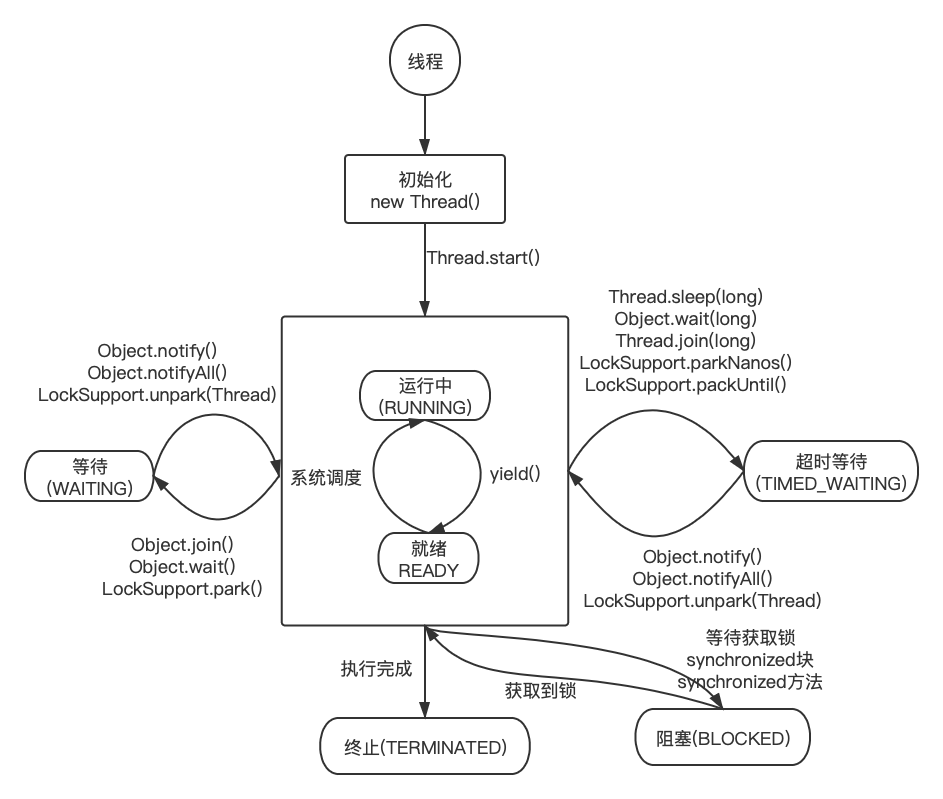
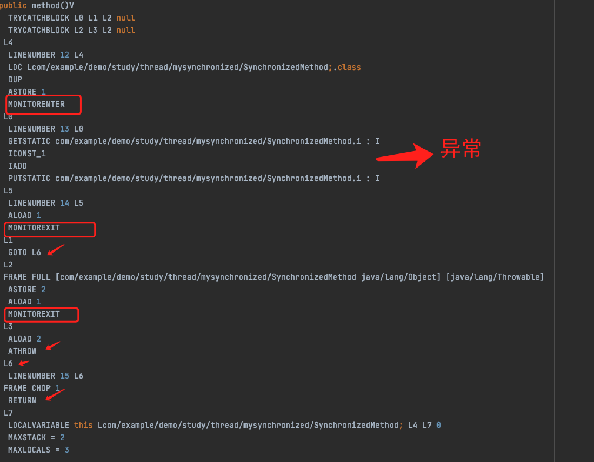
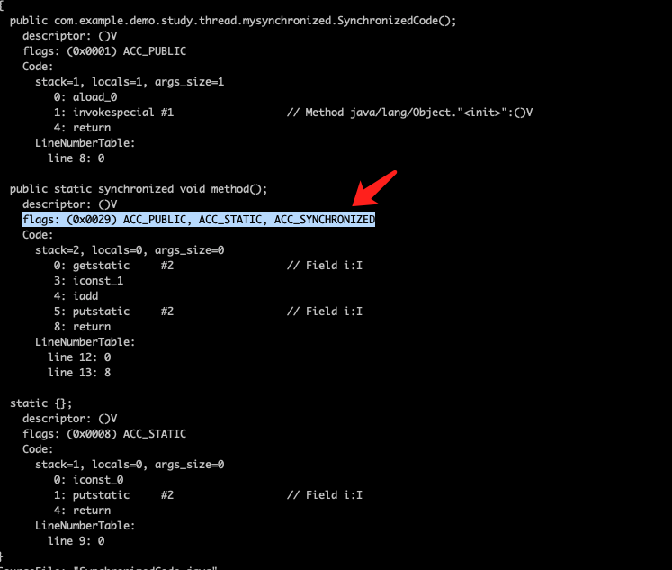
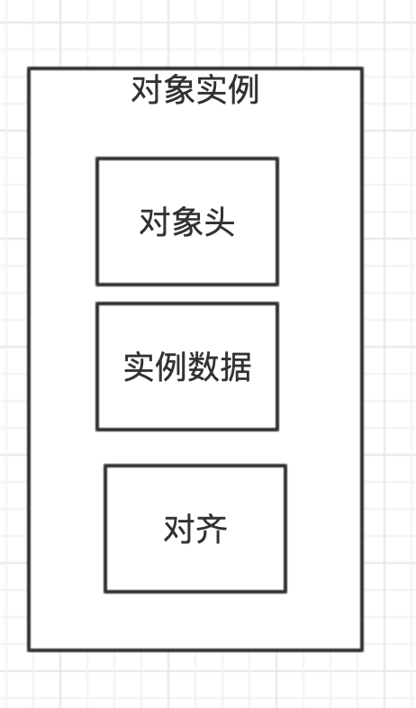
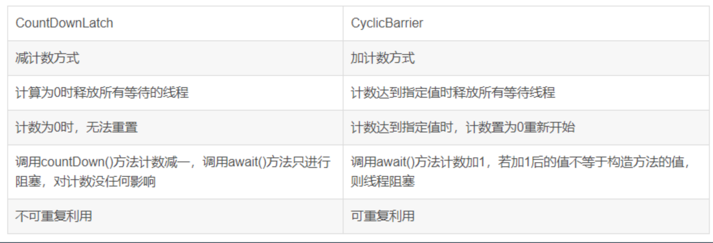
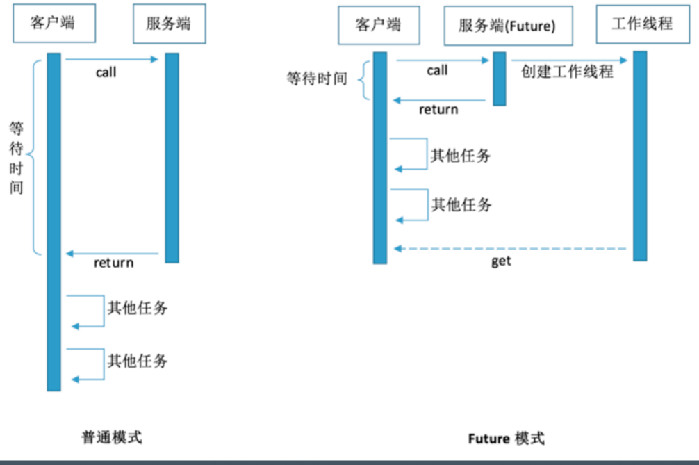
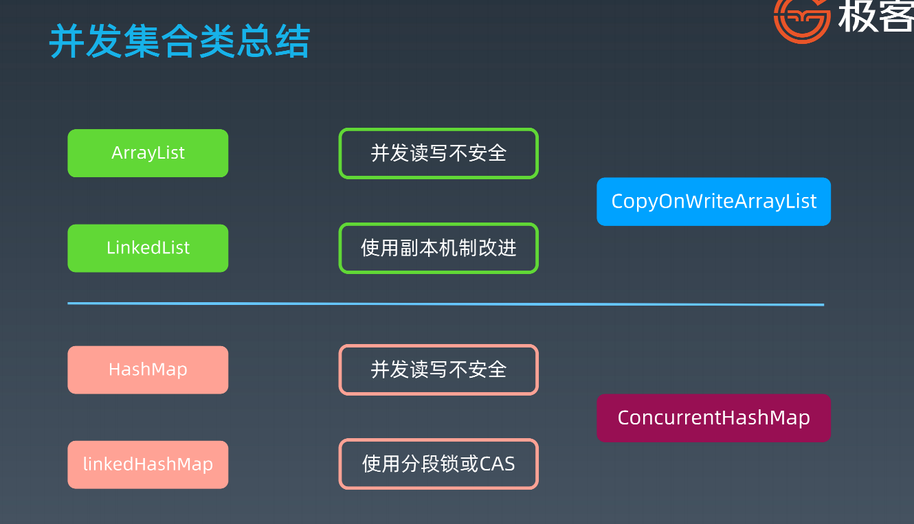
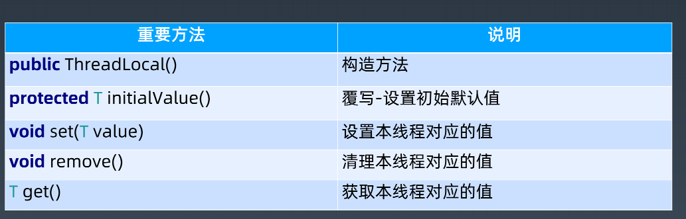

# 一. 线程

## 1.1 为什么会有多线程

更好的利用计算机资源

## 1.2  Java线程创建过程
-  第一步 : 调用线程的start方法
```java
start0();
```
- 第二步 : start0会创建线程
```java
 private native void start0();
```

- 第三步 : native 方法会调用底层操作系统的方法创建线程,所以Java的线程和操作系统的线程是一一对应的.(也就是Java的创建的用户线程和操作系统的内核线程是一一对应的)
```
// 调用pthread_create创建线程
pthread_create()
```

## 1.3 Java 线程

### 1.3.1 守护线程
```java
/*
    主线程结束后用户线程还会继续运行，JVM存活
    如果没有用户线程，都是守护线程，那么JVM结束（所有的线程都会结束）
 */
Thread thread = new Thread(() -> {
    try {
        Thread.sleep(3000);
        System.out.println("run thread");
    } catch (InterruptedException ignore)
    }
});
thread.setDaemon(true);
thread.start();
```

### 1.3.2 Thread常用方法和属性

| 常用方法属性                          | 含义                                                         |
| ------------------------------------- | ------------------------------------------------------------ |
| volatile String name                  | 线程名称                                                     |
| boolean daemon = false                | 守护线程标志                                                 |
| Runnable target                       | 任务(只能通过构造函数传入)                                   |
| synchronized void start()             | 启动新线程并自动执行                                         |
| void join()                           | 当前线程调用其他线程的join方法,等待某个线程执行完成,当前线程释放对象锁,进入到等待队列.依靠notify()/noitifyAll()唤醒或者wait(timeout)之后自动唤醒 |
| static native Thread currentThread()  | 获取当前线程信息                                             |
| static native void sleep(long millis) | 当前线程调用,进入TIMED_WAITING状态,但不释放对象锁,指定时间后自动苏醒,让出CPU时间片 |
| void run()                            | 直接调用run方法不会新开线程                                  |
| static native void yield()            | 当前线程调用,当前线程放弃CPU时间片,但是不放弃资源,由运行态变为就绪状态,让OS再次选择<br />作用 : 让相同优先级的线程轮流执行,但并不保证一定会轮流执行. |

### 1.3.3 Thread 中断和异常

- 线程内部自己处理异常 , 不抛出到外层
- 如果线程被 Object.wait, Thread.join 和 Thread.sleep 三种方法之一阻塞，此时调用该线程的interrupt() 方法，那么该线程将抛出一个 InterruptedException 中断异常（该线程必须事先预备好处理此异常），从而提早地终结被阻塞状态。如果线程没有被阻塞，这时调用interrupt() 将不起作用，直到执行到 wait(),sleep(),join() 时,才马上会抛出InterruptedException。
- 如果要是对于计算密集型的操作,可以采用分段处理的方式,每段执行完成之后都检查一下状态是否要终止.


### 1.3.4 Object 

| 常用方法属性                       | 含义                                                         |
| ---------------------------------- | ------------------------------------------------------------ |
| void wait()                        | 只能在同步块中调用,调用后会释放锁,直到被notify               |
| void wait(long timeout, int nanos) | 只能在同步块中调用,调用后会释放锁,到时间自动唤醒/中途唤醒(精度 : nanos>0那么timeout++) |
| native void wait(long timeout)     | 只能在同步块中调用,调用后会释放锁,到时间自动唤醒/中途唤醒    |
| native void notify()               | 发送信号通知一个等待线程                                     |
| native void notifyAll()            | 发送信号通知所有等待线程                                     |

### 1.3.5 Sleep 和 wait区别
- 使用限制 : wait 方法则必须放在 synchronized 块里面, 需要额外的方法 notify/ notifyAll 进行唤醒.
- 使用场景 : sleep 一般用于当前线程休眠，或者轮循暂停操作，wait 则多用于多线程之间的通信
- 所属类 : sleep 是 Thread 类的静态本地方法，wait 则是 Object 类的本地方法
- 释放锁 : wait会释放锁
- 线程切换 : sleep 会让出 CPU 执行时间且强制上下文切换，而 wait 则不一定，wait 后可能还是有机会重新竞争到锁继续执行的。

## 1.4 Java 线程状态切换




# 二. 线程安全

## 2.1 并发相关性质
- 原子性 : 对基本数据类型的变量的读取和赋值操作是原子性操作，即这些操作是不可被中断的，
  要么执行，要么不执行。但是像`i++`、`i+=1`等操作字符就不是原子性的，它们是分成**读取、计算、赋值**几步操作.**volatile不具备原子性**

- 可见性 ：对于可见性，Java 提供了 volatile 关键字来保证可见性。

```
  当一个共享变量被 volatile 修饰时，它会保证修改的值会立即被更新到主存，当有其他线程需要读取时，它会去内存中读取新值。
  另外，通过 synchronized 和 Lock 也能够保证可见性，synchronized 和 Lock 能保证同一时刻只有一个线程获取锁然后执行同步代码，并且在释放锁之前会将对变量的修改刷新到主存当中。
```

- 有序性：Java 允许编译器和处理器对指令进行重排序，但是重排序过程不会影响到单线程程序的执行，却会影

  响到多线程并发执行的正确性。可以通过 volatile 关键字来保证一定的“有序性”（synchronized 和 Lock

  也可以）。

```
  happens-before 原则（先行发生原则）：
  1. 程序次序规则：一个线程内，按照代码先后顺序
  2. 锁定规则：一个 unLock 操作先行发生于后面对同一个锁的 lock 操作
  3. Volatile 变量规则：对一个变量的写操作先行发生于后面对这个变量的读操作
  4. 传递规则：如果操作 A 先行发生于操作 B，而操作 B 又先行发生于操作 C，则可以得出 A 先于 C
  5. 线程启动规则：Thread 对象的 start() 方法先行发生于此线程的每个一个动作
  6. 线程中断规则：对线程 interrupt() 方法的调用先行发生于被中断线程的代码检测到中断事件的发生
  7. 线程终结规则：线程中所有的操作都先行发生于线程的终止检测，我们可以通过 Thread.join() 方法结束、Thread.isAlive() 的返回值手段检测到线程已经终止执行
  8. 对象终结规则：一个对象的初始化完成先行发生于他的 finalize() 方法的开始
```

- 可重入性 : 一个线程拥有了锁仍然还可以重复申请锁. `synchronized`和`ReentrantLock`都是可重入锁


## 2.2 volatile

- volatile 并不能保证原子性。每次读取都强制从主内存刷数据

### 2.2.1 适用场景
- 单个线程写；多个线程读

### 2.2.2 使用

- 原则： 能不用就不用，不确定的时候也不用
- 替代方案： Atomic 原子操作类

## 2.3 synchronized 

### 2.3.1 概述
synchronized可以修饰静态方法、成员函数，同时还可以直接定义代码块.
> 被`static`修饰的静态方法、静态属性都是归类所有，同时该类的所有实例对象都可以访问。但是普通成员属性、成员方法是归实例化的对象所有，必须实例化之后才能访问，这也是为什么静态方法不能访问非静态属性的原因。


```java
public class MySynchronized  implements Runnable{

	private Integer i = 0;
	private static Integer j = 0;
	private static Integer k = 0;

	/**
	 * 锁方法 : 该方法归实例化对象所有,所以锁的是MySynchronized类实例化的对象
	 */
	public synchronized void testMethod() {
		i++;
		j++;
	}

	/**
	 * 锁静态方法 : 锁加给MySynchronized类
	 */
	public synchronized static void staticTestMethod() {
		k++;
	}

	public void test() {
		/**
		 * 锁类 : 锁加给MySynchronized类
		 */
		synchronized (MySynchronized.class) {
			i++;
		}
		/**
		 * 锁实例 : 锁的是MySynchronized类实例化的对象
		 */
		synchronized (this) {
			j++;
		}
	}

	@Override
	public void run() {
		for (int i = 0; i < 1000000; i++) {
			testMethod();
			staticTestMethod();
		}
	}

	public static void main(String[] args) {
		Thread thread1 = new Thread(new MySynchronized());
		Thread thread2 = new Thread(new MySynchronized());

		thread1.start();
		thread2.start();

		try {
			thread1.join();
			thread2.join();
		} catch (InterruptedException e) {
			e.printStackTrace();
		}
		/*
			结果
			j : 1871953
			k : 2000000
			原因 : 因为 锁的是实例的方法,但是我创建了两个实例,所以没有达到同步的目的.
		 */
		System.out.println(j);
		System.out.println(k);
	}
}
```

### 2.3.2 实现样例
> synchronized有两种形式上锁，一个是对方法上锁，一个是构造同步代码块.他们的底层实现都是在进入同步代码之前先获取锁，获取到锁之后锁的计数器+1，同步代码执行完锁的计数器-1，如果获取失败就阻塞式等待锁的释放.

> 只是他们在同步块识别方式上有所不一样，从class字节码文件可以表现出来，一个是通过方法flags标志，一个是monitorenter和monitorexit指令操作。

#### 2.3.2.1 同步代码块

```java
public class SynchronizedMethod {
	private static int i = 0;

	public void method() {
		synchronized (SynchronizedMethod.class) {
			i++;
		}
	}
}
```

从反编译的图片可以看出,在反编译结果中增加了`MONITORENTER`以及`MONITOREXIT`.分别代表进入锁和释放锁.如果这个对象没有被锁定，或者当前线程已经拥有了这个对象的锁，那么就把锁的计数器加1。当执行monitorexit指令时，锁的计数器也会减1。当获取锁失败时会被阻塞，一直等待锁被释放。

那么为什么存在两个`MONITOREXIT`那,通过下面的字节码来看,第一个`MONITOREXIT`之后执行`GOTO`到`L6`之后直接`return`,但是如果在执行过程中出现异常,那么就会走到下一个`MONITOREXIT`,继续执行L3,抛出异常



#### 2.3.2.2 同步方法
```java
public class SynchronizedCode {
	private static int i = 0;

	/**
	 * javap  -c -verbose   SynchronizedCode.class
	 * flags: (0x0029) ACC_PUBLIC, ACC_STATIC, ACC_SYNCHRONIZED
	 */
	public static synchronized void method() {
		i++;
	}
}
```

可以看到在add方法的flags里面多了一个`ACC_SYNCHRONIZED`标志，这标志用来告诉JVM这是一个同步方法，在进入该方法之前先获取相应的锁，锁的计数器加1，方法结束后计数器-1，如果获取失败就阻塞住，直到该锁被释放。



### 2.3.3 底层实现

> 对象头是我们需要关注的重点，它是synchronized实现锁的基础，因为synchronized申请锁、上锁、释放锁都与对象头有关。对象头主要结构是由Mark Word 和 Class Metadata Address组成，其中Mark Word存储对象的hashCode、锁信息或分代年龄或GC标志等信息，Class Metadata Address是类型指针指向对象的类元数据，JVM通过该指针确定该对象是哪个类的实例。

> 锁也分不同状态，JDK6之前只有两个状态：无锁、有锁（重量级锁），而在JDK6之后对synchronized进行了优化，新增了两种状态，总共就是四个状态：无锁状态、偏向锁、轻量级锁、重量级锁，其中无锁就是一种状态了。锁的类型和状态在对象头Mark Word中都有记录，在申请锁、锁升级等过程中JVM都需要读取对象的Mark Word数据。




### 2.3.4 JVM对synchronized的优化

- 锁膨胀
上面讲到锁有四种状态，并且会因实际情况进行膨胀升级，其膨胀方向是：无锁——>偏向锁——>轻量级锁——>重量级锁，并且膨胀方向不可逆。

- 偏向锁(此时并不存在竞争)
一句话总结它的作用：减少统一线程获取锁的代价。在大多数情况下，锁不存在多线程竞争，总是由同一线程多次获得，那么此时就是偏向锁。
核心思想：
如果一个线程获得了锁，那么锁就进入偏向模式，此时Mark Word的结构也就变为偏向锁结构，当该线程再次请求锁时，无需再做任何同步操作，即获取锁的过程只需要检查Mark Word的锁标记位为偏向锁以及当前线程ID等于Mark Word的ThreadID即可，这样就省去了大量有关锁申请的操作。

- 轻量级锁(不存在竞争,但是存在共享资源,只不过不是同一时间使用,例如一个线程每天12点修改一个变量,另一个线程每天2点修改)
轻量级锁是由偏向锁升级而来，当存在第二个线程申请同一个锁对象时，偏向锁就会立即升级为轻量级锁。注意这里的第二个线程只是申请锁，不存在两个线程同时竞争锁，可以是一前一后地交替执行同步块。

- 重量级锁(存在竞争的场景)
重量级锁是由轻量级锁升级而来，当同一时间有多个线程竞争锁时，锁就会被升级成重量级锁，此时其申请锁带来的开销也就变大。
重量级锁一般使用场景会在追求吞吐量，同步块或者同步方法执行时间较长的场景。

- 锁消除 : 
  消除锁是虚拟机另外一种锁的优化，这种优化更彻底，在JIT编译时，对运行上下文进行扫描，去除不可能存在竞争的锁。比如下面代码的method1和method2的执行效率是一样的，因为object锁是私有变量，不存在所得竞争关系。

  锁消除的主要判定依据来源于逃逸分析的数据支持，如果判断在一段代码中，堆上的所有数据都不会逃逸出去从而被其他线程访问到，那就可以把它们当做栈上数据对待，认为它们是线程私有的，同步加锁自然就无须进行。

```
	public void method1(){
		Object o = new Object();
		synchronized (o){
			System.out.println("hello");
		}
	}

	public void method2(){
		Object o = new Object();
		synchronized (o){
			System.out.println("hello");
		}
	}
```

- 锁粗化 : 锁粗化是虚拟机对另一种极端情况的优化处理，通过扩大锁的范围，避免反复加锁和释放锁。比如下面method3经过锁粗化优化之后就和method4执行效率一样了。

```
	public void method3() {
		for (int l = 0; l < 10000; l++) {
			synchronized (MySynchronized.class) {
				System.out.println("a");
			}
		}
	}
	public void method4() {
		synchronized (MySynchronized.class) {
			for (int l = 0; l < 10000; l++) {
				System.out.println("a");
			}
		}
	}
```


- 自旋锁与自适应自旋锁

```
轻量级锁失败后，虚拟机为了避免线程真实地在操作系统层面挂起，还会进行一项称为自旋锁的优化手段。

自旋锁：许多情况下，共享数据的锁定状态持续时间较短，切换线程不值得，通过让线程执行循环等待锁的释放，不让出CPU。如果得到锁，就顺利进入临界区。如果还不能获得锁，那就会将线程在操作系统层面挂起，这就是自旋锁的优化方式。但是它也存在缺点：如果锁被其他线程长时间占用，一直不释放CPU，会带来许多的性能开销。

自适应自旋锁：这种相当于是对上面自旋锁优化方式的进一步优化，它的自旋的次数不再固定，其自旋的次数由前一次在同一个锁上的自旋时间及锁的拥有者的状态来决定，这就解决了自旋锁带来的缺点
```

- 可重入性

```java
public class RetrySynchronized implements Runnable {
	static RetrySynchronized instance = new RetrySynchronized();
	static int i = 0;
	static int j = 0;

	@Override
	public void run() {
		for (int j = 0; j < 1000000; j++) {
			//this,当前实例对象锁
			synchronized (this) {
				i++;
				//synchronized的可重入性
				increase();
			}
		}
	}

	public synchronized void increase() {
		j++;
	}

	public static void main(String[] args) throws InterruptedException {
		Thread t1 = new Thread(instance);
		Thread t2 = new Thread(instance);
		t1.start();
		t2.start();
		t1.join();
		t2.join();
		// 输出 : 2000000
		System.out.println(i);
	}
}
```

## 2.4 final

| Final 定义类型    | 说明                                                         |
| ----------------- | ------------------------------------------------------------ |
| final class       | 不允许继承                                                   |
| final 方法        | 不允许Override                                               |
| final 局部变量    | 不允许修改                                                   |
| final 实例属性    | 构造函数/初始化/\<init>之后不允许变更;<br />只能赋值一次<br />安全 : 构造函数结束返回时,final最新值被保证对其他线程可见 |
| final static 属性 | \<clinit>静态快执行后不允许变更;只能赋值一次                 |


# 三.线程池的原理和应用

## 3.1 Excutor: 执行者 – 顶层接口

> 线程池从功能上看，就是一个任务执行器

- submit 方法 : 有返回值，用 Future 封装,抛异常可以在主线程中 catch 到。
- execute 方法 : 无返回值 , 执行任务是捕捉不到异常的.


## 3.2 Executors: 工具类

- Callable

```
public static Callable<Object> callable(Runnable task) 
```

- Runnable 和 Callable区别 : Runnable#run()没有返回值 , Callable#call()方法有返回值

- Future – 基础接口

| 方法                                           | 说明                                   |
| ---------------------------------------------- | -------------------------------------- |
| boolean cancel(boolean mayInterruptIfRunning); | 取消任务(参数控制是否可以在执行时打断) |
| boolean isCancelled();                         | 是否被取消                             |
| boolean isDone();                              | 是否执行完成                           |
| V get()                                        | 获取执行结果                           |
| V get(long timeout, TimeUnit unit)             | 限时获取执行结果                       |

## 3.3 ExecutorService: 接口 API

| 重要方法                                              | 说明                                                         |
| ----------------------------------------------------- | ------------------------------------------------------------ |
| void execute(Runnable command)                        | 执行可运行的任务                                             |
| void shutdown();                                      | 关闭线程池,停止接收新任务,原来的任务继续执行                 |
| List<Runnable> shutdownNow();                         | 立即关闭,停止接收新任务,原来的任务停止执行                   |
| <T> Future<T> submit(Callable<T> task);               | 提交任务,允许获取执行结果                                    |
| <T> Future<T> submit(Runnable task, T result);        | 提交任务(指定结果);控制获取执行结果                          |
| <T> Future<T> submit(Callable<T> task);               | 提交任务,允许控制任务和获取执行结果                          |
| boolean awaitTermination(long timeout, TimeUnit unit) | 当前线程阻塞直到所有任务完成执行，或发生超时，或当前线程被中断，以先发生者为准。 |

## 3.4 ThreadFactory: 线程工厂

| 重要方法                     | 说明       |
| ---------------------------- | ---------- |
| Thread newThread(Runnable r) | 创建新线程 |

## 3.5 ThreadPoolExecutor : 创建线程

### 3.5.1 线程池参数

| 重要属性/方法                     | 说明                                                         |      |
| --------------------------------- | ------------------------------------------------------------ | ---- |
| int corePoolSize                  | 要保留在池中的线程数，即使它们处于空闲状态，除非设置了`allowCoreThreadTimeOut` |      |
| int maximumPoolSize               | 最大线程数                                                   |      |
| long keepAliveTime                | 当线程数大于核心数时，这是多余空闲线程在终止前等待新任务的最长时间 |      |
| TimeUnit unit                     | keepAliveTime参数的时间单位                                  |      |
| BlockingQueue<Runnable> workQueue | 用于在执行任务之前保存任务的队列。 这个队列将只保存execute方法提交的Runnable任务。 |      |
| ThreadFactory threadFactory       | 执行程序创建新线程时使用的工厂                               |      |
| RejectedExecutionHandler handler  | 执行被阻塞时使用的处理程序，因为达到了线程边界和队列容量     |      |

### 3.5.2 execute 执行流程

```java
    public void execute(Runnable command) {
        if (command == null)
            throw new NullPointerException();
        /*
         *  三个步骤
         *  1. 如果正在运行的线程少于 corePoolSize，尝试使用给定命令启动一个新线程作为其第一个任务。
         *  对 addWorker 的调用以原子方式检查 runState 和 workerCount，从而通过返回 false 来防止在不应该添加线程时出现误报。 
         *  2.如果任务可以成功排队，那么我们仍然需要仔细检查是否应该添加一个线程（因为自上次检查以来现有线程已死亡）或池自进入此方法后关闭。
         *  因此，我们重新检查状态，并在必要时在停止时回滚入队，如果没有则启动一个新线程。
         *  3.如果我们不能排队任务，那么我们尝试添加一个新线程。如果它失败了，我们知道我们已经关闭或饱和，因此拒绝该任务。
         */
        int c = ctl.get();
      	// 判断 corePoolSize
        if (workerCountOf(c) < corePoolSize) {
            if (addWorker(command, true))
                return;
            c = ctl.get();
        }
      	// 加入 workQueue
        if (isRunning(c) && workQueue.offer(command)) {
            int recheck = ctl.get();
            if (! isRunning(recheck) && remove(command))
                reject(command);
            else if (workerCountOf(recheck) == 0)
                addWorker(null, false);
        }
      	// 在addWorker中会判断 maximumPoolSize
        else if (!addWorker(command, false))
          	// 执行拒绝策略
            reject(command);
    }
```

### 3.5.3 BlockingQueue - 缓冲队列

BlockingQueue 是双缓冲队列。BlockingQueue 内部使用两条队列，允许两个线程同时向队列一个存储，一个取出操作。在保证并发安全的同时，提高了队列的存取效率。

- ArrayBlockingQueue:规定大小的 BlockingQueue，其构造必须指定大小。其所含的对象是 FIFO 顺序排序的。

-  LinkedBlockingQueue:大小不固定的 BlockingQueue，若其构造时指定大小，生成的 BlockingQueue 有大小限制，不指定大小，其大小有 Integer.MAX_VALUE 来决定。其所含的对象是 FIFO 顺序排序的。

- PriorityBlockingQueue:类似于 LinkedBlockingQueue，但是其所含对象的排序不是 FIFO，而是依据对象的自然顺序或者构造函数的 Comparator 决定。

- SynchronizedQueue:特殊的 BlockingQueue，对其的操作必须是放和取交替完成。

### 3.5.4 RejectedExecutionHandler - 拒绝策略

- ThreadPoolExecutor.AbortPolicy:丢弃任务并抛出 RejectedExecutionException异常。
- ThreadPoolExecutor.DiscardPolicy：丢弃任务，但是不抛出异常。
- ThreadPoolExecutor.DiscardOldestPolicy：丢弃队列最前面的任务，然后重新提交被拒绝的任务
- ThreadPoolExecutor.CallerRunsPolicy：由调用线程（提交任务的线程）处理该任务


### 3.5.5 创建线程池方法

- newSingleThreadExecutor

创建一个单线程的线程池。这个线程池只有一个线程在工作，也就是相当于单线程串行执行所有任务。如果这个唯一的线程因为异常结束，那么会有一个新的线程来替代它。此线程池保证所有任务的执行顺序按照任务的提交顺序执行。

- newFixedThreadPool (任务数量无限)

创建固定大小的线程池。每次提交一个任务就创建一个线程，直到线程达到线程池的最大大小。线程池的大小一旦达到最大值就会保持不变，如果某个线程因为执行异常而结束，那么线程池会补充一个新线程。

- newCachedThreadPool(线程池大小无限)

创建一个可缓存的线程池。如果线程池的大小超过了处理任务所需要的线程，那么就会回收部分空闲（60秒不执行任务）的线程，当任务数增加时，此线程池又可以智能的添加新线程来处理任务。此线程池不会对线程池大小做限制，线程池大小完全依赖于操作系统（或者说JVM）能够创建的最大线程大小。

- newScheduledThreadPool

创建一个大小无限的线程池。此线程池支持定时以及周期性执行任务的需求。

# 四. Java并发包

- 锁机制类 Locks : Lock, Condition, ReadWriteLock
- 原子操作类 Atomic : AtomicInteger...
- 线程池相关类 Executer : Future, Callable, Executor
- 信号量三组工具类 Tools : CountDownLatch, CyclicBarrier, Semaphore
- 并发集合类 Collections : CopyOnWriteArrayList, ConcurrentMap


## 4.1 锁

> synchronized 可以加锁，wait/notify 可以看做加锁和解锁。那为什么还需要一个显式的锁呢？

synchronized 方式的问题：
- 同步块的阻塞无法中断（不能 Interruptibly） 
- 同步块的阻塞无法控制超时（无法自动解锁）
- 同步块无法异步处理锁（即不能立即知道是否可以拿到锁）
- 同步块无法根据条件灵活的加锁解锁（即只能跟同步块范围一致）

Lock : 
- 使用方式灵活可控
- 性能开销小

### 4.4.1 基础接口 - Lock
> ReadWriteLock 管理一组锁，一个读锁，一个写锁。读锁可以在没有写锁的时候被多个线程同时持有，写锁是独占的。所有读写锁的实现必须确保写操作对读操作的内存影响。每次只能有一个写线程，但是同时可以有多个线程并发地读数据.ReadWriteLock 适用于读多写少的并发情况。

| 方法                                      | 说明                                                         |
| ----------------------------------------- | ------------------------------------------------------------ |
| void lock();                              | 获取锁,类似 synchronized(lock)                               |
| void lockInterruptibly()                  | 获取锁,允许打断                                              |
| boolean tryLock();                        | 尝试获取锁(无等待),成功返回true                              |
| boolean tryLock(long time, TimeUnit unit) | 尝试获取锁,等待指定时间,成功返回true,超时退出返回false       |
| void unlock();                            | 解锁,当前线程获取锁才能解锁                                  |
| Condition newCondition();                 | 新增一个绑定到当前锁的条件;<br />示例 : <br />final Lock lock = new ReentrantLock(); <br />final Condition notFull = lock.newCondition(); <br />final Condition notEmpty = lock.newCondition(); |

### 4.4.2 基础接口 - Condition

| 方法                                    | 说明                                              |
| --------------------------------------- | ------------------------------------------------- |
| void await()                            | 等待信号,类比Object#wait()                        |
| void awaitUninterruptibly();            | 等待信号                                          |
| boolean await(long time, TimeUnit unit) | 等待信号,超时返回false                            |
| boolean awaitUntil(Date deadline)       | 等待信号,超时返回false                            |
| void signal()                           | 给一个等待线程发送唤醒信号;类比Object#notify()    |
| void signalAll()                        | 给所有等待线程发送唤醒信号;类比Object#notifyAll() |

### 4.4.3 基础接口 - LockSupport

> LockSupport类似于Thread的静态方法,专门处理本线程

| 方法                                                        | 说明                                                         |
| ----------------------------------------------------------- | ------------------------------------------------------------ |
| public static void park(Object blocker)                     | 暂停当前线程                                                 |
| public static void parkNanos(Object blocker, long nanos)    | 暂停当前线程,有超时时间限制                                  |
| public static void parkUntil(Object blocker, long deadline) | 暂停当前线程,知道某个时间                                    |
| public static void park()                                   | 无期限暂停当前线程                                           |
| public static void parkNanos(long nanos)                    | 暂停当前线程,不过有超时时间限制                              |
| public static void parkUntil(long deadline)                 | 暂停当前线程,直到某个时间                                    |
| public static void unpark(Thread thread)                    | 恢复某个线程(线程通过参数传进来,没办法自己恢复自己,因为自己已经暂停了) |
| public static Object getBlocker(Thread t)                   | 返回提供给尚未解除阻塞的 park 方法的最近调用的阻塞程序对象，如果未阻塞，则返回 null。 |

### 4.4.4 锁使用的注意事项

- 永远只在更新对象的成员变量时加锁

- 永远只在访问可变的成员变量时加锁

- 永远不在调用其他对象的方法时加锁

### 4.4.5 最小使用锁：

- 降低锁范围：锁定代码的范围/作用域
- 细分锁粒度：讲一个大锁，拆分成多个小锁


# 五.并发原子类

CAS 本质上没有使用锁, 借助硬件CAS指令实现。
```
并发压力跟锁性能的关系： 
1、压力非常小，性能本身要求就不高；
2、压力一般的情况下，无锁更快，大部分都一次写入；
3、压力非常大时，自旋导致重试过多，资源消耗很大。
```

## 5.1 原子更新基本类型
| 类名          | 描述             |
| ------------- | ---------------- |
| AtomicBoolean | 原子更新布尔类型 |
| AtomicInteger | 原子更新整型     |
| AtomicLong    | 原子更新长整型   |

| 方法                                          | 描述                                                         |
| --------------------------------------------- | ------------------------------------------------------------ |
| int addAndGet(int delta)                      | 以原子的方式将输入的数值与实例中的值相加，并返回结果。       |
| boolean compareAndSet(int expect, int update) | 如果输入的值等于预期值，则以原子方式将该值设置为输入的值。   |
| int getAndIncrement()                         | 以原子的方式将当前值加 1，注意，这里返回的是自增前的值，也就是旧值。 |
| void lazySet(int newValue)                    | 最终会设置成newValue,使用lazySet设置值后，可能导致其他线程在之后的一小段时间内还是可以读到旧的值。 |
| int getAndSet(int newValue)                   | 以原子的方式设置为newValue,并返回旧值。                      |

```java
    // 以boolean为例 : 通过 do while 循环直到达到期望值
		public final boolean getAndSet(boolean newValue) {
        boolean prev;
        do {
            prev = get();
        } while (!compareAndSet(prev, newValue));
        return prev;
    }
```

## 5.2 原子更新数组

| 类名                 | 描述                         |
| -------------------- | ---------------------------- |
| AtomicIntegerArray   | 原子更新整型数组里的元素     |
| AtomicLongArray      | 原子更新长整型数组里的元素   |
| AtomicReferenceArray | 原子更新引用类型数组里的元素 |

| 方法                                         | 描述                                                         |
| -------------------------------------------- | ------------------------------------------------------------ |
| get(int index)                               | 获取索引为index的元素值                                      |
| compareAndSet(int i, int expect, int update) | 如果当前值等于预期值，则以原子方式将数组位置 i 的元素设置为update值 |

## 5.3 原子更新引用类型

| 类名                        | 描述                                                         |
| --------------------------- | ------------------------------------------------------------ |
| AtomicReference             | 原子更新引用类型                                             |
| AtomicReferenceFieldUpdater | 原子更新引用类型的字段                                       |
| AtomicMarkableReference     | 原子更新带有标记位的引用类型，可以使用构造方法更新一个布尔类型的标记位和引用类型 |
| AtomicStampedReference      | 原子更新带有标记位的引用类型，可以使用构造方法更新一个int类型的标记位和引用类型 |

`AtomicStampedReference`和`AtomicMarkableReference`是用来解决CAS中的ABA问题的。他们解决ABA问题的原理类似，都是通过一个版本号来区分有没被更新过。

- AtomicStampedReference：带版本戳的原子引用类型，版本戳为int类型。
- AtomicMarkableReference：带版本戳的原子引用类型，版本戳为boolean类型。

```java
public class AtomicStampedReferenceDemo {
	private static Long var = 1L;

	public static void main(String[] args) {
		// 初始化一个原子引用,初始标记为1
		AtomicStampedReference<Long> referenceDemo = new AtomicStampedReference(var, 1);
		System.out.println("now value:" + referenceDemo.getReference().intValue());
		// 取出标记
		int stamp = referenceDemo.getStamp();
		System.out.println("now stamp:" + stamp);
		// 尝试cas设置值 : 尝试设置为2,并且标记+1
		boolean b = referenceDemo.compareAndSet(var, 2L, stamp, stamp + 1);
		// 根据设置结果打印结果
		if (b) {
			System.out.println("success set value...");
			System.out.println("now value:" + referenceDemo.getReference().intValue());
			stamp = referenceDemo.getStamp();
			System.out.println("now stamp:" + stamp);
		} else {
			System.out.println("failed set value...");
			System.out.println("now value:" + referenceDemo.getReference().intValue());
			stamp = referenceDemo.getStamp();
			System.out.println("now stamp:" + stamp);
		}
	}
}
```

## 5.4 原子更新字段类

| 类名                      | 描述                         |
| ------------------------- | ---------------------------- |
| AtomicIntegerFieldUpdater | 原子更新整型的字段           |
| AtomicLongFieldUpdater    | 原子更新长整型字段           |
| AtomicStampedFieldUpdater | 原子更新带有版本号的引用类型 |


```java
public class AtomicIntegerFieldUpdaterDemo {

	private static AtomicIntegerFieldUpdater<User> userAtomicIntegerFieldUpdater = AtomicIntegerFieldUpdater.newUpdater(User.class, "age");

	public static void main(String[] args) {
		/*
			User(name=你不在, age=12)
			12
			User(name=你不在, age=13)
		 */
		User myUser = new User("你不在",12);
		System.out.println(myUser);
		System.out.println(userAtomicIntegerFieldUpdater.getAndIncrement(myUser));
		System.out.println(myUser);
		
	}
}

@AllArgsConstructor
@ToString
class User {
	private String name;
	/**
	 * 年龄 , 需要注意 AtomicIntegerFieldUpdater只能访问 public成员 , 类型一致, volatile 修饰
	 */
	public volatile int age;
}
```

## 5.5 JDK8新增原子类

| 类名              |
| ----------------- |
| DoubleAccumulator |
| LongAccumulator   |
| DoubleAdder       |
| LongAdder         |

```java
public class LongAdderDemo {
	private static ExecutorService executorService = Executors.newFixedThreadPool(5);

	private static LongAdder counter = new LongAdder();

	public static void main(String[] args) throws InterruptedException {
		for (int i = 1; i <= 10000; i++) {
			executorService.execute(new Runnable() {
				@Override
				public void run() {
					counter.add(2);
				}
			});
		}
		// sum在并发时候数值会小,因为不会合并并发的修改
		System.out.println(counter.sum());
		// 因为还没有执行完,所以看到的结果不是最终结果
		System.out.println(counter);
		System.out.println(LocalDateTime.now());
		// 先执行关闭
		executorService.shutdown();
		// 等待执行完成
		System.out.println(executorService.awaitTermination(1, TimeUnit.SECONDS));
		System.out.println(LocalDateTime.now());
		System.out.println(counter.sum());
		System.out.println(counter);

	}
}
```

**LongAdder** **对** **AtomicLong** **的改进**

```
LongAdder 的改进思路：
1、AtomicInteger 和 AtomicLong 里的 value 是所有
线程竞争读写的热点数据；
2、将单个 value 拆分成跟线程一样多的数组 Cell[]； 
3、每个线程写自己的 Cell[i]++，最后对数组求和。
```


# # 六.并发工具类 TODO 

```
场景 : 
- 我们需要控制实际并发访问资源的并发数量
- 我们需要多个线程在某个时间同时开始运行
- 我们需要指定数量线程到达某个状态再继续处理
```

**AQS** : AbstractQueuedSynchronizer，即队列同步器。它是构建锁或者其他同步组件的基础（如Semaphore、CountDownLatch、ReentrantLock、ReentrantReadWriteLock)是JUC并发包中的核心基础组件。

- AbstractQueuedSynchronizer：抽象队列式的同步器

- 两种资源共享方式: 独占 | 共享，子类负责实现公平 OR 非公平

**Semaphore -** **信号量**

```
使用场景：同一时间控制并发线程数

1. 准入数量 N
2. N =1 则等价于独占锁
```

**CountdownLatch**

```
场景: Master 线程等待 Worker 线程把任务执行完

public CountDownLatch(int count) 构造方法（总数）
void await() throws InterruptedException 等待数量归0
boolean await(long timeout, TimeUnit unit) 限时等待
void countDown() 等待数减1
long getCount() 返回剩余数量
```

**CyclicBarrier**

```
场景: 任务执行到一定阶段, 等待其他任务对齐。

public CyclicBarrier(int parties) 构造方法（需要等待的数量）
public CyclicBarrier(int parties, Runnable barrierAction) 构造方法（需要等待的数量, 需要执行的任务）
int await() 任务内部使用; 等待大家都到齐
int await(long timeout, TimeUnit unit) 任务内部使用; 限时等待到齐
void reset() 重新一轮
```

**CountDownLatch** **与** **CyclicBarrier** **比较**




**Future/FutureTask/CompletableFuture**



**CompletableFuture**

```
static final boolean useCommonPool =
(ForkJoinPool.getCommonPoolParallelism() > 1);
是否使用内置线程池
static final Executor asyncPool = useCommonPool ?
ForkJoinPool.commonPool() : new ThreadPerTaskExecutor();
线程池
CompletableFuture<Void> runAsync(Runnable runnable)； 异步执行【当心阻塞？】
CompletableFuture<Void> runAsync(Runnable runnable, Executor 
executor)
异步执行, 使用自定义线程池
T get() 等待执行结果
T get(long timeout, TimeUnit unit) 限时等待执行结果
T getNow(T valueIfAbsent) 立即获取结果(默认值)
```


# 常用线程安全类型

**List**：ArrayList、LinkedList、Vector、Stack

**ArrayList :** 

基本特点：基于数组，便于按 index 访问，超过数组需要扩容，扩容成本较高

用途：大部分情况下操作一组数据都可以用 ArrayList

原理：使用数组模拟列表，默认大小10，扩容 x1.5，newCapacity = oldCapacity + (oldCapacity >> 1)


安全问题：

1、写冲突：\- 两个写，相互操作冲突

2、读写冲突：

\- 读，特别是 iterator 的时候，数据个数变了，拿到了非预期数据或者报错

\- 产生ConcurrentModificationException

```
List 线程安全的简单办法

既然线程安全是写冲突和读写冲突导致的
最简单办法就是，读写都加锁。
例如：
- 1.ArrayList 的方法都加上 synchronized -> Vector
- 2.Collections.synchronizedList，强制将 List 的操作加上同步
- 3.Arrays.asList，不允许添加删除，但是可以 set 替换元素
- 4.Collections.unmodifiableList，不允许修改内容，包括添加删除和 set
```

**CopyOnWriteArrayList**

1、写加锁，保证不会写混乱

2、写在一个 Copy 副本上，而不是原始数据上（类似GC young 区用复制，old 区用本区内的移动）

- 通过读写分离保证最终一致


1、插入元素时，在新副本操作，不影响旧引用，why?

2、删除元素时，

1）删除末尾元素，直接使用前 N-1 个元素创建一个新数组。

2）删除其他位置元素，创建新数组，将剩余元素复制到新数组。

3、读取不需要加锁，why？

4、使用迭代器的时候，

直接拿当前的数组对象做一个快照，此后的 List元素变动，就跟这次迭代没关系了。


**Set**：LinkedSet、HashSet、TreeSet

**Queue**->Deque->LinkedList


**Map**：HashMap、LinkedHashMap、TreeMap


**HashMap**

基本特点：空间换时间，哈希冲突不大的情况下查找数据性能很高

用途：存放指定 key 的对象，缓存对象

原理：使用 hash 原理，存 k-v 数据，初始容量16，扩容 x2，负载因子0.75

JDK8 以后，在链表长度到8 & 数组长度到64时，使用红黑树。

```
安全问题：
1、写冲突，
2、读写问题，可能会死循环
3、keys()无序问题
```

**LinkedHashMap**

```
基本特点：继承自 HashMap，对 Entry 集合添加了一个双向链表
用途：保证有序，特别是 Java8 stream 操作的 toMap 时使用
原理：同 LinkedList，包括插入顺序和访问顺序
安全问题：
同 HashMap
```


**ConcurrentHashMap-Java7** **分段锁**

```
分段锁
默认16个Segment，降低锁粒度。操作数据时候只要锁上对应的Segment段,达到降低锁力度的目的
concurrentLevel = 16

Java 7为实现并行访问，引入了Segment 这一结构，实现了分段锁，理论上最大并发度与 Segment 个数相等。

Java 8为进一步提高并发性，摒弃了分段锁的方案，而是直接使用一个大的数组。 why?
```





Dictionary->HashTable->Properties


# 并发编程相关内容


**线程安全操作利器** **- ThreadLocal**



• 线程本地变量

• 场景: 每个线程一个副本

• 不改方法签名静默传参

• 及时进行清理


**并行** **Stream** : 多线程执行，只需要加个 parallel 即可


# 并发编程经验总结

**加锁需要考虑的问题**

```
1. 粒度
2. 性能
3. 重入
4. 公平
5. 自旋锁（spinlock）
6. 场景: 脱离业务场景谈性能都是耍流氓
```

**线程间协作与通信**

**1.** **线程间共享**

• static/实例变量(堆内存) 

• Lock

• synchronized

**2.** **线程间协作**

• Thread#join()

• Object#wait/notify/notifyAll

• Future/Callable

• CountdownLatch

• CyclicBarrier


# 参考资料

- [1] [Java 线程实现原理](https://blog.csdn.net/jxch____/article/details/115492362)
- [2] [Java 用户线程和守护线程](https://www.cnblogs.com/myseries/p/12078413.html)
- [3] [深入理解synchronized底层原理](https://zhuanlan.zhihu.com/p/75880892)
- [4] [并发原子类](https://blog.csdn.net/weixin_38003389/article/details/88569336)
