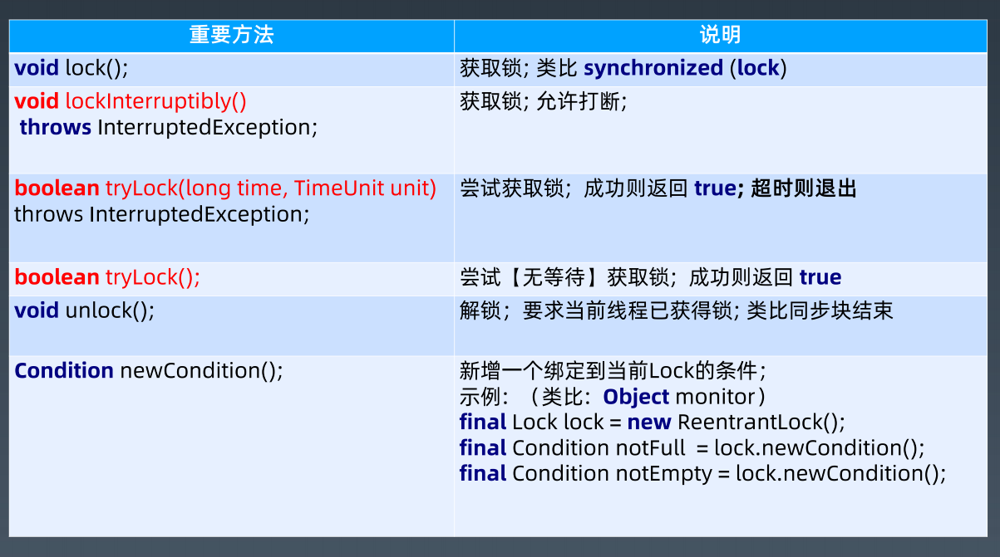

# 一. 线程

## 1.1 为什么会有多线程

更好的利用计算机资源

## 1.2  Java线程创建过程
-  第一步 : 调用线程的start方法
```java
start0();
```
- 第二步 : start0会创建线程
```java
 private native void start0();
```

- 第三步 : native 方法会调用底层操作系统的方法创建线程,所以Java的线程和操作系统的线程是一一对应的.(也就是Java的创建的用户线程和操作系统的内核线程是一一对应的)
```
// 调用pthread_create创建线程
pthread_create()
```

## 1.3 Java 线程

### 1.3.1 守护线程
```java
/*
    主线程结束后用户线程还会继续运行，JVM存活
    如果没有用户线程，都是守护线程，那么JVM结束（所有的线程都会结束）
 */
Thread thread = new Thread(() -> {
    try {
        Thread.sleep(3000);
        System.out.println("run thread");
    } catch (InterruptedException ignore)
    }
});
thread.setDaemon(true);
thread.start();
```

### 1.3.2 Thread常用方法和属性

| 常用方法属性                          | 含义                                                         |
| ------------------------------------- | ------------------------------------------------------------ |
| volatile String name                  | 线程名称                                                     |
| boolean daemon = false                | 守护线程标志                                                 |
| Runnable target                       | 任务(只能通过构造函数传入)                                   |
| synchronized void start()             | 启动新线程并自动执行                                         |
| void join()                           | 当前线程调用其他线程的join方法,等待某个线程执行完成,当前线程释放对象锁,进入到等待队列.依靠notify()/noitifyAll()唤醒或者wait(timeout)之后自动唤醒 |
| static native Thread currentThread()  | 获取当前线程信息                                             |
| static native void sleep(long millis) | 当前线程调用,进入TIMED_WAITING状态,但不释放对象锁,指定时间后自动苏醒,让出CPU时间片 |
| void run()                            | 直接调用run方法不会新开线程                                  |
| static native void yield()            | 当前线程调用,当前线程放弃CPU时间片,但是不放弃资源,由运行态变为就绪状态,让OS再次选择<br />作用 : 让相同优先级的线程轮流执行,但并不保证一定会轮流执行. |

### 1.3.3 Thread 中断和异常

- 线程内部自己处理异常 , 不抛出到外层
- 如果线程被 Object.wait, Thread.join 和 Thread.sleep 三种方法之一阻塞，此时调用该线程的interrupt() 方法，那么该线程将抛出一个 InterruptedException 中断异常（该线程必须事先预备好处理此异常），从而提早地终结被阻塞状态。如果线程没有被阻塞，这时调用interrupt() 将不起作用，直到执行到 wait(),sleep(),join() 时,才马上会抛出InterruptedException。
- 如果要是对于计算密集型的操作,可以采用分段处理的方式,每段执行完成之后都检查一下状态是否要终止.


### 1.3.4 Object 

| 常用方法属性                       | 含义                                                         |
| ---------------------------------- | ------------------------------------------------------------ |
| void wait()                        | 只能在同步块中调用,调用后会释放锁,直到被notify               |
| void wait(long timeout, int nanos) | 只能在同步块中调用,调用后会释放锁,到时间自动唤醒/中途唤醒(精度 : nanos>0那么timeout++) |
| native void wait(long timeout)     | 只能在同步块中调用,调用后会释放锁,到时间自动唤醒/中途唤醒    |
| native void notify()               | 发送信号通知一个等待线程                                     |
| native void notifyAll()            | 发送信号通知所有等待线程                                     |


## 1.4 Java 线程状态切换


# 二. 线程安全

## 2.1 并发相关性质
- 原子性 : 对基本数据类型的变量的读取和赋值操作是原子性操作，即这些操作是不可被中断的，
  要么执行，要么不执行。

- 可见性 ：对于可见性，Java 提供了 volatile 关键字来保证可见性。

```
  当一个共享变量被 volatile 修饰时，它会保证修改的值会立即被更新到主存，当有其他线程需要读取时，它会去内存中读取新值。
  另外，通过 synchronized 和 Lock 也能够保证可见性，synchronized 和 Lock 能保证同一时刻只有一个线程获取锁然后执行同步代码，并且在释放锁之前会将对变量的修改刷新到主存当中。
```

- 有序性：Java 允许编译器和处理器对指令进行重排序，但是重排序过程不会影响到单线程程序的执行，却会影

  响到多线程并发执行的正确性。可以通过 volatile 关键字来保证一定的“有序性”（synchronized 和 Lock

  也可以）。

```
  happens-before 原则（先行发生原则）：
  1. 程序次序规则：一个线程内，按照代码先后顺序
  2. 锁定规则：一个 unLock 操作先行发生于后面对同一个锁的 lock 操作
  3. Volatile 变量规则：对一个变量的写操作先行发生于后面对这个变量的读操作
  4. 传递规则：如果操作 A 先行发生于操作 B，而操作 B 又先行发生于操作 C，则可以得出 A 先于 C
  5. 线程启动规则：Thread 对象的 start() 方法先行发生于此线程的每个一个动作
  6. 线程中断规则：对线程 interrupt() 方法的调用先行发生于被中断线程的代码检测到中断事件的发生
  7. 线程终结规则：线程中所有的操作都先行发生于线程的终止检测，我们可以通过 Thread.join() 方法结束、Thread.isAlive() 的返回值手段检测到线程已经终止执行
  8. 对象终结规则：一个对象的初始化完成先行发生于他的 finalize() 方法的开始
```

## 2.2 volatile

- volatile 并不能保证原子性。每次读取都强制从主内存刷数据

### 2.2.1 适用场景
- 单个线程写；多个线程读

### 2.2.2 使用

- 原则： 能不用就不用，不确定的时候也不用
- 替代方案： Atomic 原子操作类

## 2.3 synchronized 

- 实现  : 通过对象头标记字

锁方法是最大的锁范围 , 最好的是只锁住某一个对象

- 锁方法
- 锁对象
- 锁代码块

深入理解synchronized底层原理

https://zhuanlan.zhihu.com/p/75880892


- synchronized 使用哪种力度小

- • 同步块 : 粒度小

  • 同步方法: 专有指令 

### 3.4.3 final


## 四.线程池的原理和应用

### 4.1 Excutor: 执行者 – 顶层接口

线程池从功能上看，就是一个任务执行器
submit 方法 -> 有返回值，用 Future 封装
execute 方法 -> 无返回值
submit 方法抛异常可以在主线程中 catch 到。
execute 方法执行任务是捕捉不到异常的。


### 4.2 ExcutorService: 接口 API


### 4.3 ThreadFactory: 线程工厂

ThreadPoolExecutor 提交任务逻辑:

\1. 判断 corePoolSize 【创建】

\2. 加入 workQueue

\3. 判断 maximumPoolSize 【创建】

\4. 执行拒绝策略处理器

#### 线程池参数

缓冲队列

BlockingQueue 是双缓冲队列。BlockingQueue 内部使用两条队列，允许两个线程同

时向队列一个存储，一个取出操作。在保证并发安全的同时，提高了队列的存取效率。

\1. ArrayBlockingQueue:规定大小的 BlockingQueue，其构造必须指定大小。其所含

的对象是 FIFO 顺序排序的。

\2. LinkedBlockingQueue:大小不固定的 BlockingQueue，若其构造时指定大小，生

成的 BlockingQueue 有大小限制，不指定大小，其大小有 Integer.MAX_VALUE 来

决定。其所含的对象是 FIFO 顺序排序的。

\3. PriorityBlockingQueue:类似于 LinkedBlockingQueue，但是其所含对象的排序不

是 FIFO，而是依据对象的自然顺序或者构造函数的 Comparator 决定。

\4. SynchronizedQueue:特殊的 BlockingQueue，对其的操作必须是放和取交替完成。


拒绝策略

\1. ThreadPoolExecutor.AbortPolicy:丢弃任务并抛出 RejectedExecutionException

异常。

\2. ThreadPoolExecutor.DiscardPolicy：丢弃任务，但是不抛出异常。

\3. ThreadPoolExecutor.DiscardOldestPolicy：丢弃队列最前面的任务，然后重新提

交被拒绝的任务

\4. ThreadPoolExecutor.CallerRunsPolicy：由调用线程（提交任务的线程）处理该任

务


**创建线程池方法**

**1. newSingleThreadExecutor**

创建一个单线程的线程池。这个线程池只有一个线程在工作，也就是相当于单线程串行执行所有任

务。如果这个唯一的线程因为异常结束，那么会有一个新的线程来替代它。此线程池保证所有任务

的执行顺序按照任务的提交顺序执行。

**2.newFixedThreadPool**

创建固定大小的线程池。每次提交一个任务就创建一个线程，直到线程达到线程池的最大大小。线

程池的大小一旦达到最大值就会保持不变，如果某个线程因为执行异常而结束，那么线程池会补充

一个新线程。

**3. newCachedThreadPool**

创建一个可缓存的线程池。如果线程池的大小超过了处理任务所需要的线程，

那么就会回收部分空闲（60秒不执行任务）的线程，当任务数增加时，此线程池又可以智能的添 

加新线程来处理任务。此线程池不会对线程池大小做限制，线程池大小完全依赖于操作系统（或者

说JVM）能够创建的最大线程大小。

**4.newScheduledThreadPool**

创建一个大小无限的线程池。此线程池支持定时以及周期性执行任务的需求。


### 4.4 Executors: 工具类


**Callable –** **基础接口**

V call() **throws** Exception; 调用执行


**Runnable 和 Callable区别 :** 

• Runnable#run()没有返回值

• Callable#call()方法有返回值


**Future –** **基础接口**


# 五. Java并发包


锁机制类 Locks : Lock, Condition, ReadWriteLock
原子操作类 Atomic : AtomicInteger
线程池相关类 Executer : Future, Callable, Executor
信号量三组工具类 Tools : CountDownLatch, CyclicBarrier, Semaphore
并发集合类 Collections : CopyOnWriteArrayList, ConcurrentMap


# 六.锁

synchronized 可以加锁，
wait/notify 可以看做加锁和解锁。
那为什么还需要一个显式的锁呢？

```
synchronized 方式的问题：
1、同步块的阻塞无法中断（不能 Interruptibly） 2、同步块的阻塞无法控制超时（无法自动解锁）
3、同步块无法异步处理锁（即不能立即知道是否可以拿到锁）
4、同步块无法根据条件灵活的加锁解锁（即只能跟同步块范围一致）
```

```
优点 : 
使用方式灵活可控
性能开销小

Lock 接口设计：
// 1.支持中断的 API
void lockInterruptibly() throws InterruptedException;
// 2.支持超时的 API
boolean tryLock(long time, TimeUnit unit) throws InterruptedException;
// 3.支持非阻塞获取锁的 API
boolean tryLock();
```

## 基础接口 - Lock




Lock : 可重入锁 , 读写锁 , 公平锁

注意：ReadWriteLock 管理一组锁，一个读锁，一个写锁。

读锁可以在没有写锁的时候被多个线程同时持有，写锁是独占的。

所有读写锁的实现必须确保写操作对读操作的内存影响。每次只能有一个写线程，但是

同时可以有多个线程并发地读数据。ReadWriteLock 适用于读多写少的并发情况。

## **基础接口** **- Condition**


## **用锁的最佳实践**

\1. 永远只在更新对象的成员变量时加锁

\2. 永远只在访问可变的成员变量时加锁

\3. 永远不在调用其他对象的方法时加锁

总结-最小使用锁：

1、降低锁范围：锁定代码的范围/作用域

2、细分锁粒度：讲一个大锁，拆分成多个小锁


# 并发原子类

####  原子类
https://blog.csdn.net/weixin_38003389/article/details/88569336


**Atomic** **工具类**

无锁技术的底层实现原理

• Unsafe API - Compare-And-Swap

• CPU 硬件指令支持: CAS 指令

```
CAS 本质上没有使用锁。
并发压力跟锁性能的关系： 
1、压力非常小，性能本身要求就不高；
2、压力一般的情况下，无锁更快，大部分都一次写入；
3、压力非常大时，自旋导致重试过多，资源消耗很大。
```

**LongAdder** **对** **AtomicLong** **的改进**

```
LongAdder 的改进思路：
1、AtomicInteger 和 AtomicLong 里的 value 是所有
线程竞争读写的热点数据；
2、将单个 value 拆分成跟线程一样多的数组 Cell[]； 3、每个线程写自己的 Cell[i]++，最后对数组求和。
```

# 并发工具类

```
场景 : 
- 我们需要控制实际并发访问资源的并发数量
- 我们需要多个线程在某个时间同时开始运行
- 我们需要指定数量线程到达某个状态再继续处理
```

**AQS**

AbstractQueuedSynchronizer，即队列同步器。它是构建锁或者其他同步组件的基础（

如Semaphore、CountDownLatch、ReentrantLock、ReentrantReadWriteLock），

是JUC并发包中的核心基础组件。

- AbstractQueuedSynchronizer：抽象队列式的同步器

- 两种资源共享方式: 独占 | 共享，子类负责实现公平 OR 非公平


**Semaphore -** **信号量**

```
1. 准入数量 N
2. N =1 则等价于独占锁

使用场景：同一时间控制并发线程数
```

**CountdownLatch**

```
场景: Master 线程等待 Worker 线程把任务执行完

public CountDownLatch(int count) 构造方法（总数）
void await() throws InterruptedException 等待数量归0
boolean await(long timeout, TimeUnit unit) 限时等待
void countDown() 等待数减1
long getCount() 返回剩余数量
```

**CyclicBarrier**

```
场景: 任务执行到一定阶段, 等待其他任务对齐。

public CyclicBarrier(int parties) 构造方法（需要等待的数量）
public CyclicBarrier(int parties, Runnable barrierAction) 构造方法（需要等待的数量, 需要执行的任务）
int await() 任务内部使用; 等待大家都到齐
int await(long timeout, TimeUnit unit) 任务内部使用; 限时等待到齐
void reset() 重新一轮
```

**CountDownLatch** **与** **CyclicBarrier** **比较**


**Future/FutureTask/CompletableFuture**


**CompletableFuture**

```
static final boolean useCommonPool =
(ForkJoinPool.getCommonPoolParallelism() > 1);
是否使用内置线程池
static final Executor asyncPool = useCommonPool ?
ForkJoinPool.commonPool() : new ThreadPerTaskExecutor();
线程池
CompletableFuture<Void> runAsync(Runnable runnable)； 异步执行【当心阻塞？】
CompletableFuture<Void> runAsync(Runnable runnable, Executor 
executor)
异步执行, 使用自定义线程池
T get() 等待执行结果
T get(long timeout, TimeUnit unit) 限时等待执行结果
T getNow(T valueIfAbsent) 立即获取结果(默认值)
```


# 常用线程安全类型

**List**：ArrayList、LinkedList、Vector、Stack

**ArrayList :** 

基本特点：基于数组，便于按 index 访问，超过数组需要扩容，扩容成本较高

用途：大部分情况下操作一组数据都可以用 ArrayList

原理：使用数组模拟列表，默认大小10，扩容 x1.5，newCapacity = oldCapacity + (oldCapacity >> 1)


安全问题：

1、写冲突：\- 两个写，相互操作冲突

2、读写冲突：

\- 读，特别是 iterator 的时候，数据个数变了，拿到了非预期数据或者报错

\- 产生ConcurrentModificationException

```
List 线程安全的简单办法

既然线程安全是写冲突和读写冲突导致的
最简单办法就是，读写都加锁。
例如：
- 1.ArrayList 的方法都加上 synchronized -> Vector
- 2.Collections.synchronizedList，强制将 List 的操作加上同步
- 3.Arrays.asList，不允许添加删除，但是可以 set 替换元素
- 4.Collections.unmodifiableList，不允许修改内容，包括添加删除和 set
```

**CopyOnWriteArrayList**

1、写加锁，保证不会写混乱

2、写在一个 Copy 副本上，而不是原始数据上（类似GC young 区用复制，old 区用本区内的移动）

- 通过读写分离保证最终一致


1、插入元素时，在新副本操作，不影响旧引用，why?

2、删除元素时，

1）删除末尾元素，直接使用前 N-1 个元素创建一个新数组。

2）删除其他位置元素，创建新数组，将剩余元素复制到新数组。

3、读取不需要加锁，why？

4、使用迭代器的时候，

直接拿当前的数组对象做一个快照，此后的 List元素变动，就跟这次迭代没关系了。


**Set**：LinkedSet、HashSet、TreeSet

**Queue**->Deque->LinkedList


**Map**：HashMap、LinkedHashMap、TreeMap


**HashMap**

基本特点：空间换时间，哈希冲突不大的情况下查找数据性能很高

用途：存放指定 key 的对象，缓存对象

原理：使用 hash 原理，存 k-v 数据，初始容量16，扩容 x2，负载因子0.75

JDK8 以后，在链表长度到8 & 数组长度到64时，使用红黑树。

```
安全问题：
1、写冲突，
2、读写问题，可能会死循环
3、keys()无序问题
```

**LinkedHashMap**

```
基本特点：继承自 HashMap，对 Entry 集合添加了一个双向链表
用途：保证有序，特别是 Java8 stream 操作的 toMap 时使用
原理：同 LinkedList，包括插入顺序和访问顺序
安全问题：
同 HashMap
```


**ConcurrentHashMap-Java7** **分段锁**

```
分段锁
默认16个Segment，降低锁粒度。操作数据时候只要锁上对应的Segment段,达到降低锁力度的目的
concurrentLevel = 16

Java 7为实现并行访问，引入了Segment 这一结构，实现了分段锁，理论上最大并发度与 Segment 个数相等。

Java 8为进一步提高并发性，摒弃了分段锁的方案，而是直接使用一个大的数组。 why?
```


Dictionary->HashTable->Properties


# 并发编程相关内容


**线程安全操作利器** **- ThreadLocal**


• 线程本地变量

• 场景: 每个线程一个副本

• 不改方法签名静默传参

• 及时进行清理


**并行** **Stream** : 多线程执行，只需要加个 parallel 即可


# 并发编程经验总结

**加锁需要考虑的问题**

```
1. 粒度
2. 性能
3. 重入
4. 公平
5. 自旋锁（spinlock）
6. 场景: 脱离业务场景谈性能都是耍流氓
```

**线程间协作与通信**

**1.** **线程间共享**

• static/实例变量(堆内存) 

• Lock

• synchronized

**2.** **线程间协作**

• Thread#join()

• Object#wait/notify/notifyAll

• Future/Callable

• CountdownLatch

• CyclicBarrier
