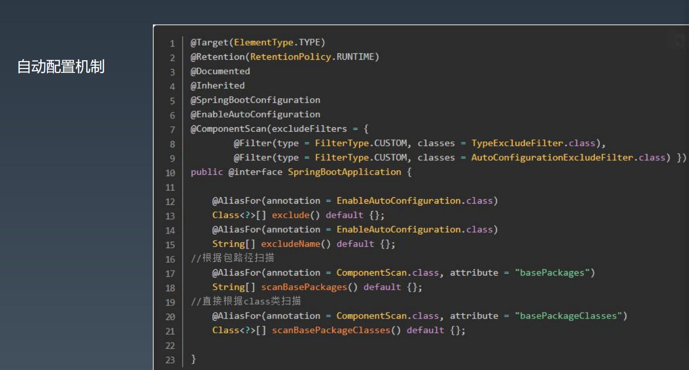
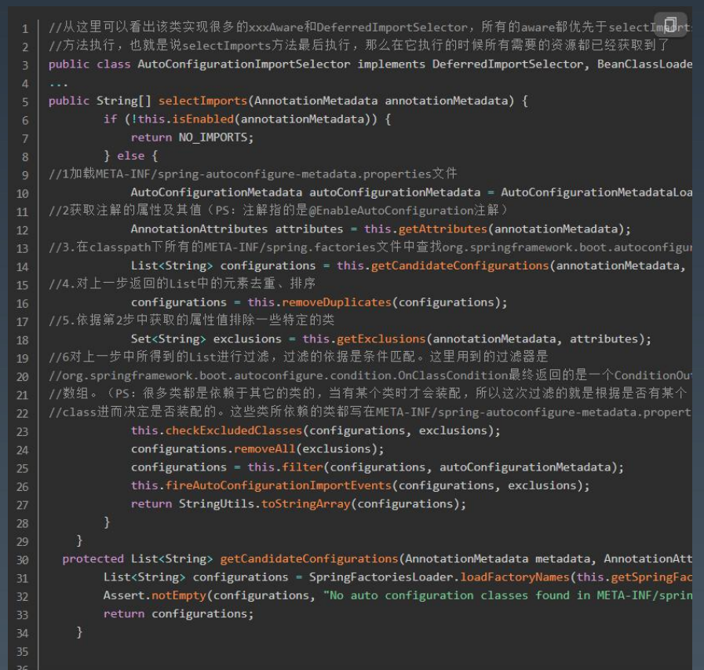

# Spring boot 

## 一. 什么是 Spring Boot
## 1.1 

Spring Boot 使创建独立运行、生产级别的 Spring 应用变得容易，你可以直接运行它。
我们对 Spring 平台和第三方库采用限定性视角，以此让大家能在最小的成本下上手。
大部分 Spring Boot 应用仅仅需要最少量的配置。

## 1.2 功能特性

1. 创建独立运行的 Spring 应用
2. 直接嵌入 Tomcat 或 Jetty，Undertow，无需部署 WAR 包
3. 提供限定性的 starter 依赖简化配置（就是脚手架）
4. 在必要时自动化配置 Spring 和其他三方依赖库
5. 提供生产 production-ready 特性，例如指标度量，健康检查，外部配置等
6. 完全零代码生产和不需要 XML 配置

约定大于配置 : 核心入口为：SpringBootApplication

优势在于，开箱即用：
一、Maven的目录结构：默认有resources文件夹存放配置文件。默认打包方式为jar。
二、默认的配置文件：application.properties 或 application.yml 文件 
三、默认通过 spring.profiles.active 属性来决定运行环境时的配置文件。 
四、EnableAutoConfiguration 默认对于依赖的 starter 进行自动装载。 
五、spring-boot-start-web 中默认包含 spring-mvc 相关依赖以及内置的 tomcat 容器，使得构建一个 web 应用更 加简单。

总结： 
基于profile分组做环境隔离 基于前缀做组内覆盖 
与Spring properties相同，与maven profile类似 
与maven profile的区别？ 运行期间确定 vs 打包期间确定 
可以结合Spring Cloud的配置中心使用

# 二. Spring Boot 自动配置注解 

• @SpringBootApplication 
• SpringBoot应用标注在某个类上说明这个类是SpringBoot的主配置类，SpringBoot就会运行这个类的main方法来 启动SpringBoot项目。 
• @SpringBootConfiguration 
• @EnableAutoConfiguration 
• @AutoConfigurationPackage 
• @Import({AutoConfigurationImportSelector.class}) 
• 加载所有META-INF/spring.factories中存在的配置类（类似SpringMVC中加载所有converter）

• 自动装配原理、创建自动配置类  : demo 练习
自动装配命名的潜规则 自动装配Class的命名规则 
SpringBoot内建的自动装配的class的名称模式均为
*AutoConfiguration，按照该模式，我们自定义的自动装配Class 均沿用该命名方式 
自动装配Package的命名规则 
${group}.autoconfigure 
自定义Starter的命名规则
 ${module}-spring-boot-starter

总结
1.通过各种注解实现了类与类之间的依赖关系，容器在启动的时候Application.run，会调用 EnableAutoConfigurationImportSelector.class的selectImports方法（其实是其父类的方法） 
2.selectImports方法最终会调用SpringFactoriesLoader.loadFactoryNames方法来获取一个全面的常用 BeanConfiguration列表 
3.loadFactoryNames方法会读取FACTORIES_RESOURCE_LOCATION（也就是spring-boot-autoconfigure.jar 下 面的spring.factories），获取到所有的Spring相关的Bean的全限定名ClassName，大概120多个 
4.selectImports方法继续调用filter(configurations, autoConfigurationMetadata);这个时候会根据这些 BeanConfiguration里面的条件，来一一筛选，最关键的是@ConditionalOnClass，这个条件注解会去classpath下 查找，jar包里面是否有这个条件依赖类，所以必须有了相应的jar包，才有这些依赖类，才会生成IOC环境需要的一些 默认配置Bean 
5.最后把符合条件的BeanConfiguration注入默认的EnableConfigurationPropertie类里面的属性值，并且注入到 IOC环境当中

# 三. 自定义Spring Boot Starter

一个完整的Spring Boot Starter可能包含以下组件： 
autoconfigure模块：包含自动配置的代码 
starter模块：提供对autoconfigure模块的依赖，以及一些其它的依赖 

1. 命名 
模块名称不能以spring-boot开头 如果你的starter提供了配置keys，那么请确保它们有唯一的命名空间。而且，不要用Spring Boot用到的命名空间 （比如：server， management， spring 等等） 举个例子，假设你为“acme”创建了一个starter，那么你的auto-configure模块可以命名为acme-spring-boot- autoconfigure，starter模块可以命名为acme-spring-boot-starter。如果你只有一个模块包含这两部分，那么你可 以命名为acme-spring-boot-starter。

2. autoconfigure模块 
建议在autoconfigure模块中包含下列依赖： 
<dependency> 
<groupId>org.springframework.boot</groupId> 
<artifactId>spring-boot-autoconfigure-processor</artifactId>
 <optional>true</optional> 
</dependency> 

3. starter模块 
事实上，starter是一个空jar。它唯一的目的是提供这个库所必须的依赖。 你的starter必须直接或间接引用核心的Spring Boot starter（spring-boot-starter）

# 四. Spring Boot条件化自动装配

条件化自动装配 使用conditona注解可自由定制自动化装配 
@ConditionalOnBean 
@ConditionalOnClass 
@ConditionalOnMissingBean 
@ConditionalOnProperty 
@ConditionalOnResource 
@ConditionalOnSingleCandidate 
@ConditionalOnWebApplication

# 五. Spring Boot 最核心的 25 个注解 : 
1、@SpringBootApplication 
这是 Spring Boot 最最最核心的注解，用在 Spring Boot 主类上，标识这是一个 Spring Boot 应用，用来开启 Spring Boot 的各项能力。 其实这个注解就是@SpringBootConfiguration、@EnableAutoConfiguration、@ComponentScan这三个注解的 组合，也可以用这三个注解来代替 @SpringBootApplication 注解。 

2、@EnableAutoConfiguration 
允许 Spring Boot 自动配置注解，开启这个注解之后，Spring Boot 就能根据当前类路径下的包或者类来配置 Spring Bean。 如：当前类路径下有 Mybatis 这个 JAR 包，MybatisAutoConfiguration 注解就能根据相关参数来配置 Mybatis 的 各个 Spring Bean。 

3、@Configuration 
这是 Spring 3.0 添加的一个注解，用来代替 applicationContext.xml 配置文件，所有这个配置文件里面能做到的事 情都可以通过这个注解所在类来进行注册。 

4、@SpringBootConfiguration 
这个注解就是 @Configuration 注解的变体，只是用来修饰是 Spring Boot 配置而已，或者可利于 Spring Boot 后 续的扩展。 

5、@ComponentScan 这是 Spring 3.1 添加的一个注解，用来代替配置文件中的 component-scan 配置，开启组件扫描，即自动扫描包路 径下的 @Component 注解进行注册 bean 实例到 context 中。

6、@Conditional 
这是 Spring 4.0 添加的新注解，用来标识一个 Spring Bean 或者 Configuration 配置文件，当满足指定的条件才开 启配置。 

7、@ConditionalOnBean 
组合 @Conditional 注解，当容器中有指定的 Bean 才开启配置。 

8、@ConditionalOnMissingBean 
组合 @Conditional 注解，和 @ConditionalOnBean 注解相反，当容器中没有指定的 Bean 才开启配置。 

9、@ConditionalOnClass 
组合 @Conditional 注解，当容器中有指定的 Class 才开启配置。 

10、@ConditionalOnMissingClass 
组合 @Conditional 注解，和 @ConditionalOnClass 注解相反，当容器中没有指定的 Class 才开启配置。 

11、@ConditionalOnWebApplication 
组合 @Conditional 注解，当前项目类型是 WEB 项目才开启配置。 当前项目有以下 3 种类型。 enum Type { /** * Any web application will match. */ ANY, /** * Only servlet-based web application will match. */ SERVLET, /** * Only reactive-based web application will match. */ REACTIVE} 

12、@ConditionalOnNotWebApplication 
组合 @Conditional 注解，和 @ConditionalOnWebApplication 注解相反，当前项目类型不是 WEB 项目才开启配 置。

13、@ConditionalOnProperty 
组合 @Conditional 注解，当指定的属性有指定的值时才开启配置。 

14、@ConditionalOnExpression 
组合 @Conditional 注解，当 SpEL 表达式为 true 时才开启配置。 

15、@ConditionalOnJava 
组合 @Conditional 注解，当运行的 Java JVM 在指定的版本范围时才开启配置。 

16、@ConditionalOnResource 
组合 @Conditional 注解，当类路径下有指定的资源才开启配置。 

17、@ConditionalOnJndi 
组合 @Conditional 注解，当指定的 JNDI 存在时才开启配置。

18、@ConditionalOnCloudPlatform 
组合 @Conditional 注解，当指定的云平台激活时才开启配置。 

19、@ConditionalOnSingleCandidate 
组合 @Conditional 注解，当指定的 class 在容器中只有一个 Bean，或者同时有多个但为首选时才开启配置。 

20、@ConfigurationProperties 
用来加载额外的配置（如 .properties 文件），可用在 @Configuration 注解类，或者@Bean 注解方法上面。 关于这个注解的用法可以参考《Spring Boot读取配置的几种方式》这篇文章。

 21、@EnableConfigurationProperties 
一般要配合 @ConfigurationProperties 注解使用，用来开启对@ConfigurationProperties 注解配置 Bean 的支持。

22、@AutoConfigureAfter 
用在自动配置类上面，表示该自动配置类需要在另外指定的自动配置类配置完之后。 如 Mybatis 的自动配置类，需要在数据源自动配置类之后。 

23、@AutoConfigureBefore 
这个和 @AutoConfigureAfter 注解使用相反，表示该自动配置类需要在另外指定的自动配置类配置之前。 

24、@Import 
这是 Spring 3.0 添加的新注解，用来导入一个或者多个 @Configuration 注解修饰的类。 

25、@ImportResource 
这是 Spring 3.0 添加的新注解，用来导入一个或者多个 Spring 配置文件，这对 Spring Boot 兼容老项目非常有用， 因为有些配置无法通过 Java Config 的形式来配置就只能用这个注解来导入。

# 六. Spring 注意事项 : 

1. 代码结构： 避免使用默认包 如果创建的类没有声明包信息，则类会默认使用默认包，默认包使用在使用诸如@ComponentScan, @EntityScan, 及@SpringBootApplication时可能会引发特殊问题。 官方建议遵循java既有的命名约定规则，使用反转域名的方式命名包。例如，com.example.project. 
2. 应用主类位置： 通常我们建议将主类放置于根路径下，注解@SpringBootApplication 通常放置于主类上，并且作为么某些扫描的根 路径。如JPA配置的Entity扫描等。 @SpringBootApplication注解包含 @EnableAutoConfiguration 和 @ComponentScan ，可以单独配置，或者直 接使用@SpringBootApplication 简化配置。 
3. 配置类@Configuration： Spring boot倾向使用基于java配置类的配置方式，建议使用主类作为主要的配置位置@Configuration。
4. 引入额外的配置类：不需要将所有的配置放到一个配置类中，可以通过使用@Import注解引入额外的配置类信息。 当然@ComponentScan注解会扫描包含@Configuration注解的配置类。 
5. 引入xml配置：如果存在不许使用xml配置的情况，则可以通过@ImportResource注解来进行加载。 
6. 自动配置@EnableAutoConfiguration Spring boot基于添加的相应的功能jar进行自动配置。例如，类路径中有HSQLDB jar包的情况下，如果没有主动定义 相应的数据源连接bean，则spring boot会自动配置内存数据库。自动配置需添加相应的 @EnableAutoConfiguration或者@SpringBootApplication来启用。通常放置其一于主类即可。 
7. 自动配置的覆盖： 自动配置是非侵入性的，可以通过定义相应的自定义配置类进行覆盖，如果需要知道工程目前使用了那些自动配置， 可以通过在启动时添加—debug选项，来进行输出。 
8. 禁用某些自动配置 如果发现输出的日中包含一些不需要应用的自动配置可以通过在注解@EnableAutoConfiguration上添加exclude附 加选项来禁用。 
9. maven打包后为fat jar： mvn clean package 使用maven插件运行： $ mvn spring-boot:run

# 七. Hibernate 和 MyBatis

## 7.1 Hibernate
ORM（Object-Relational Mapping） 表示对象关系映射。

Hibernate 是一个开源的对象关系映射框架，它对JDBC 进行了非常轻量级的对象封装，它将 POJO 与数据库表建立映射关系，是一个全自动的 orm 框架，hibernate 可以自动生成 SQL 语句，自动执行，使得 Java 程序员可以使用面向对象的思维来操纵数据库。

Hibernate 里需要定义实体类和 hbm 映射关系文件（IDE 一般有工具生成）。

Hibernate 里可以使用 HQL、Criteria、Native SQL三种方式操作数据库。也可以作为 JPA 适配实现，使用 JPA 接口操作。

## 7.2 MyBatis

MyBatis 是一款优秀的持久层框架，它支持定制化 SQL、存储过程以及高级映射。MyBatis 避免了几乎所有的JDBC 代码和手动设置参数以及获取结果集。MyBatis 可以使用简单的 XML 或注解来配置和映射原生信息，将接口和 Java 的 POJOs(Plain Old Java Objects,普通的 Java 对象)映射成数据库中的记录。

## 7.3 对比

- Mybatis 优点：原生 SQL（XML 语法），直观，对 DBA 友好
- Hibernate 优点：简单场景不用写 SQL（HQL、Cretiria、SQL）
- Mybatis 缺点：繁琐，可以用 MyBatis-generator、MyBatis-Plus 之类的插件
- Hibernate 缺点：对 DBA 不友好

## 7.4 使用ORM 经验
- 本地事务（事务的设计与坑）
- 多数据源（配置、静态制定、动态切换）
- 线程池配置（大小、重连）
- ORM 内的复杂 SQL，级联查询
- ORM 辅助工具和插件