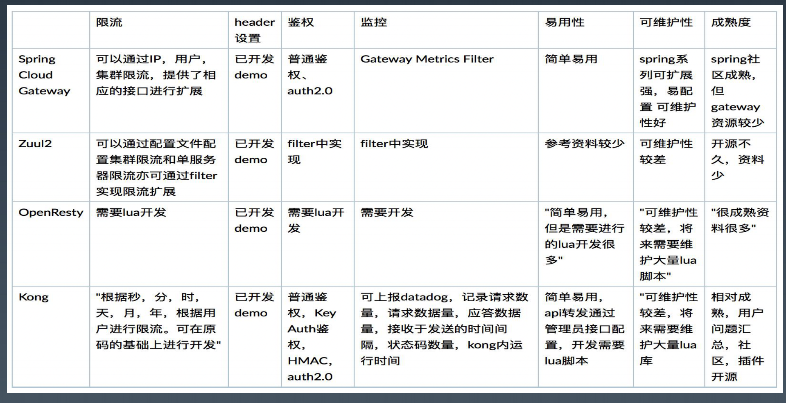

# Spring-Cloud

如何扩展微服务 : 
1. 水平复制 : 复制系统 .
2. 功能解耦 : 拆分业务
3. 数据分区 : 切分数据

### 1. 声明式服务调用-Feign
Feign的核心功能就是，作为HTTP Client访问REST服务接口。 
优势在于： 
1、全都基于注解，简单方便 
2、跟XXTemplate一样，内置了简化操作，OOP 
3、跟其他组件，ribbon，hytrix联合使用

### 2. 客户端负载均衡-Ribbon

### 3. 分布式配置中心-Spring Cloud Config

Ctrip Apollo ,  Alibaba Nacos（同时也可以做为注册中心）  , 一般我们也可以用ZK，etcd实现配置中心和注册中心

### 4. 服务治理中心-Eureka

Eureka是Netflix开发的服务发现框架，本身是一个基于REST的服务，主要用于定位运行在AWS域中的中间层服务，以 达到负载均衡和中间层服务故障转移的目的。SpringCloud将它集成在其子项目spring-cloud-netflix中，以实现 SpringCloud的服务发现功能。

Eureka包含两个组件：Eureka Server和Eureka Client。 
Eureka Server提供服务注册服务，各个节点启动后，会在Eureka Server中进行注册，这样Eureka Server中的服务注 册表中将会存储所有可用服务节点的信息，服务节点的信息可以在界面中直观的看到。 
• Register(服务注册)：把自己的IP和端口注册给Eureka。 
• Renew(服务续约)：发送心跳包，每30秒发送一次。告诉Eureka自己还活着。 
• Cancel(服务下线)：当provider关闭时会向Eureka发送消息，把自己从服务列表中删除。防止consumer调用到不存 在的服务。 
• Get Registry(获取服务注册列表)：获取其他服务列表。 
• Replicate(集群中数据同步)：eureka集群中的数据复制与同步。 
• Make Remote Call(远程调用)：完成服务的远程调用。

### 5. 服务容错保护-Hystrix

### 6. 服务容错保护-Sentinel
在 Sentinel 里面，所有的资源都对应一个 资源名称（resourceName），每次资源调 用都会创建一个 Entry 对象。Entry 创建的 时候，同时也会创建一系列功能插槽（slot chain），这些插槽有不同的职责： 
1. NodeSelectorSlot: 建立树状结构（调 用链路） 
2. ClusterBuilderSlot: 根据资源保存统计 簇点
3. StatisticSlot: 实时数据统计 
4. FlowSlot: 流量控制 
5. DegradeSlot: 熔断降级 
6. SystemSlot: 系统负载保护

### 7. API网关

API网关-Zuul
Zuul 是 Netflix 开源的 API 网关系统，它 的主要设计目标是动态路由、监控、弹性和 安全。 
Zuul 的内部原理可以简单看做是很多不同 功能 filter 的集合，最主要的就是 pre、 routing、post 这三种过滤器，分别作用于 调用业务服务 API 之前的请求处理、直接 响应、调用业务服务 API 之后的响应处理

Zuul 2.x 是基于Netty内核重构的版本。 
核心功能： 1. Service Discovery 2. Load Balancing 3. Connection Pooling 4. Status Categories 5. Retries 6. Request Passport 7. Request Attempts 8. Origin Concurrency Protection 9. HTTP/2 10.Mutual TLS 11.Proxy Protocol 12.GZip 13.WebSockets

API网关-Spring Cloud Gateway
Spring Cloud Gateway 基于 Java 8、Spring 5.0、Spring Boot 2.0、Project Reactor，发展的比 Zuul 2 要早，目前 也是 Spring Cloud 全家桶的一部分。
Spring Cloud Gateway 可以看做是一个 Zuul 1.x 的升级版和代替品，比 Zuul 2 更早的使用 Netty 实现异步 IO，从而 实现了一个简单、比 Zuul 1.x 更高效的、与 Spring Cloud 紧密配合的 API 网关。

Spring Cloud Gateway 里明确的区分了 Router 和 Filter，并且一个很大的特点是内置了非常多的开箱即用功能，并且 都可以通过 SpringBoot 配置或者手工编码链式调用来使用。 内置了 10 种 Router，使得我们可以直接配置一下就可以随心所欲的根据 Header、或者 Path、或者 Host、或者 Query 来做路由。 

区分了一般的 Filter 和全局 Filter，内置了 20 种 Filter 和 9 种全局 Filter，也都可以直接用。当然自定义 Filter 也非常 方便。 

核心特性： Able to match routes on any request attribute. Predicates and filters are specific to routes. Hystrix Circuit Breaker integration. Spring Cloud DiscoveryClient integration Easy to write Predicates and Filters Request Rate Limiting Path Rewriting

流量网关 , 业务网关 : 关注点以及区别

总结 : 
openresty , kong : 性能更好,适合流量网关
spring cloud gateway , zuul2 : 扩展性好,适合业务网关 ,需要二次开发

Spring Cloud常见问题及解决方案

1. Eureka注册服务慢
服务注册涉及到周期性的心跳，默认30秒一次，只有当实例、服务器端和客户端本地缓存中的元数据都相同时，服务才能被其他客户端发现 （可能需要三次心跳）。 可以使用参数eureka.instance.leaseRenewalintervalInSeconds修改eureka client向eureka server发送心跳间隔，从而加快客户端连接到其 他服务的过程。 在生产环境中最好坚持使用默认值，因为在服务器内部有一些计算，它们会对续约做出假设。 
2. 已停止的服务节点注销慢或者不注销 Eureka server清理无效节点的周期比较长（默认90秒），以及自我保护等原因，可能对服务节点注销慢或者不注销 Eureka server配置关闭自我保护，并按需配置清理无效节点的间隔。 
3.Hystrix/feign 整合Hystrix后首次访问失败的问题 Hystrix默认超时时间是1秒，首次加载的时候因为服务器缓存，或者创建连接池等原因，就会进入fallback逻辑。由于spring的懒加载机制，因 此在某些机器上首次请求的时间可能大于1秒 解决方案一，延长Hystrix超时时间： 代码中修改默认超时配置（改为3秒） 
4.配置不起作用（spring cloud配置实在太多了） YAML缩进是否正确：YAML缩进不正确会导致springcloud 应用无法正常启动或者配置文件无法加载 配置属性是否正确：属性是不是写错了名字，默认IDE会检查 配置属性位置是否正确：属性是不是配置错了文件，或者应用
5. Spring Cloud问题排查思路 
1）先检查配置，绝大部分情况下是配置问题。 
2）再检查环境，变量，hosts，ip等等。 
3）接着排查代码问题：很多时候常常是少了某个注解，或是依赖缺失，而导致了各种异常。 
4）最后看异常信息，是不是Spring Cloud自己的问题。

Service Mesh 是一个基础设施层，用于处 理服务间通信。云原生应用有着复杂的服务 拓扑，Service Mesh 保证请求可以在这些 拓扑中可靠地穿梭。在实际应用当中， Service Mesh 通常是由一系列轻量级的网 络代理组成的，它们与应用程序部署在一起， 但应用程序不需要知道它们的存在。