# Spring 框架

## 一. Spring框架与 AOP/IoC

### 1.1 Spring framework 6大模块： 
- Core : IoC Container, Events, Resources, i18n, Validation, Data Binding, Type Conversion, SpEL, AOP.
- Testing : Mock Objects, TestContext Framework, Spring MVC Test, WebTestClient.
- Data Access : Transactions, DAO Support, JDBC, R2DBC, O/R Mapping, XML Marshalling.
- Web Servlet : Spring MVC, WebSocket, SockJS, STOMP Messaging.
- Web Reactive : Spring WebFlux, WebClient, WebSocket, RSocket.
- Integration : Remoting, JMS, JCA, JMX, Email, Tasks, Scheduling, Caching.
- Languages : Kotlin, Groovy, Dynamic Languages.
- Appendix : Spring properties.

### 1.2 AOP-面向切面编程 
Spring早期版本的核心功能，管理对象生命周期与对象装配。 为了实现管理和装配，一个自然而然的想法就是，加一个中间层代理（字节码增强）来实现所有对象的托管。

### 1.3 IoC-控制反转 也成为DI（Dependency Injection）依赖注入

对象装配思路的改进。 从对象A直接引用和操作对象B，变成对象A里指需要依赖一个接口IB，系统启动和装配阶段，把IB接口的实例对象注 入到对象A，这样A就不需要依赖一个IB接口的具体实现，也就是类B。 从而可以实现在不修改代码的情况，修改配置文件，即可以运行时替换成注入IB接口另一实现类C的一个对象实例.

可以解决循环依赖的问题 ,但是需要注意,对于构造函数的循环依赖无法解决,因为处理的办法需要存在一个实例,但是构造函数的循环依赖导致无法实例化.

## 二. Spring - Bean

自动化XML配置工具： XmlBeans -> Spring-xbean 2个原理： 1、根据Bean的字段结构，自动生成XSD 2、根据Bean的字段结构，配置XML文件

### 2.1 使用方式

- 配置方式：XML、Annotation 
- 组装方式：ByName，ByType，Lazy 
- 自动装配：Autowired、Resource 

### 2.2 Bean 生命周期

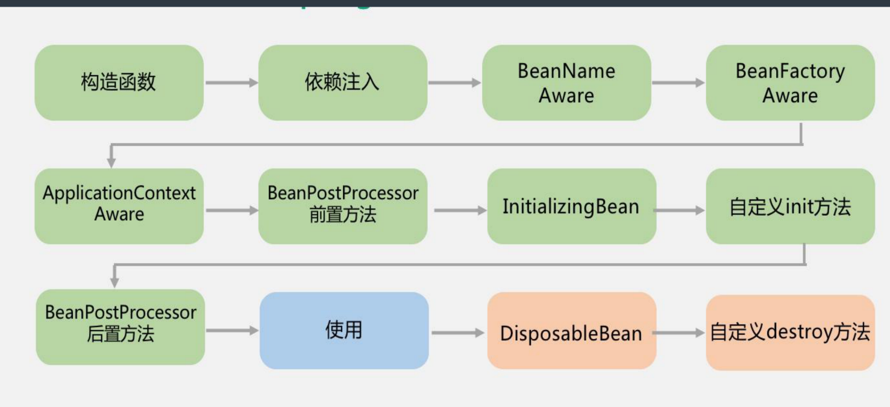

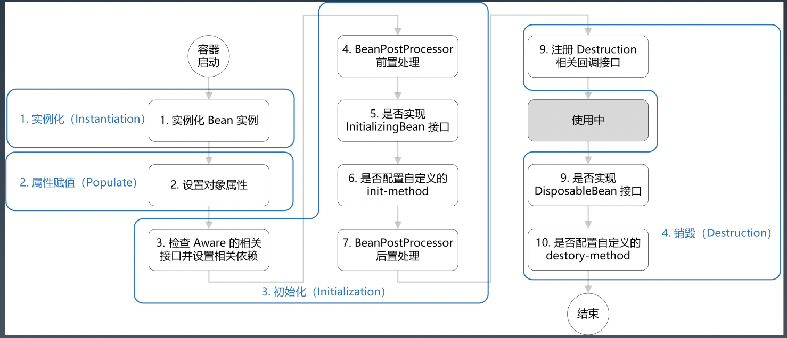

### 2.3 Bean 的生命周期 - 底层实现

**创建对象**

- 创建对象
- 属性赋值 
- 初始化 
- 注销接口注册
  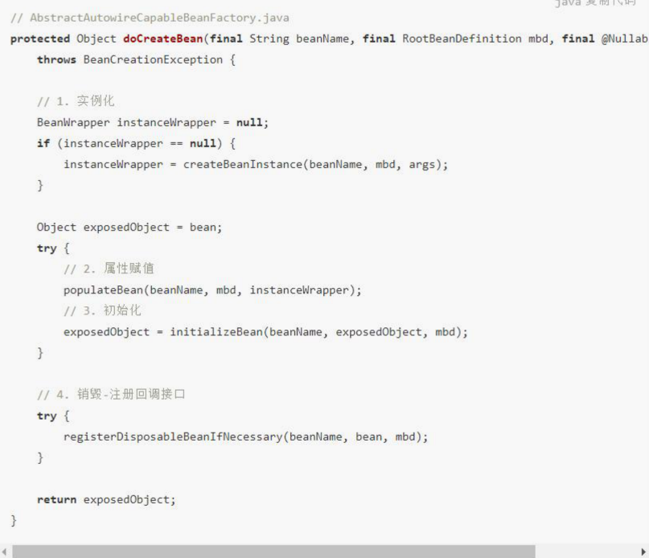

**初始化对象**

- 检查Aware装配 
- 前置处理、After处理 
- 调用init method 
- 后置处理
  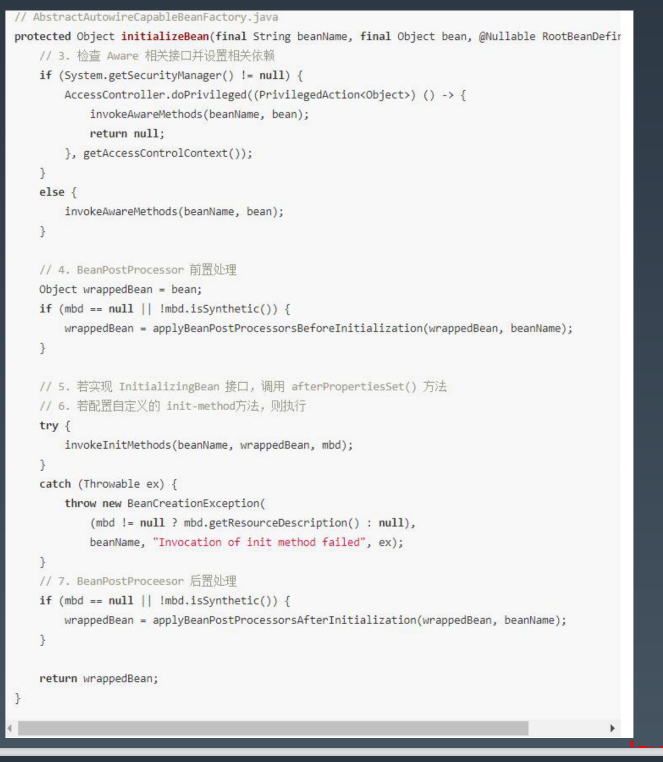

**Aware 接口有：** 

- BeanNameAware：注入当前 bean 对应 beanName； 
- BeanClassLoaderAware：注入加载当前 bean 的 ClassLoader； 
- BeanFactoryAware：注入 当前BeanFactory容器 的引用。 

**对于 ApplicationContext 类型的容器（通过 BeanPostProcessor ）：** 

- EnvironmentAware：注入 Enviroment，一般用于获取配置属性； 
- EmbeddedValueResolverAware：注入 EmbeddedValueResolver（Spring EL解析器,Spring表达式语言（简称SpEl）是一个支持查询和操作运行时对象导航图功能的强大的表达式语言. 它的语法类似于传统EL，但提供额外的功能，最出色的就是函数调用和简单字符串的模板函数），一般用于参数解析； 
- ApplicationContextAware（ResourceLoader、ApplicationEventPublisherAware、MessageSourceAware）：注 入 ApplicationContext 容器本身。

**BeanPostProcessor 是 Spring 为修改 bean提供的强大扩展点，其可作用于容器中所有 bean**

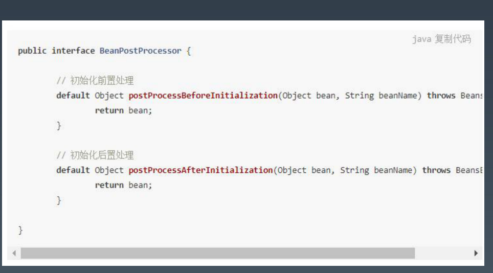

**InitializingBean 和 init-method 是 Spring 为 bean 初始化提供的扩展点。**

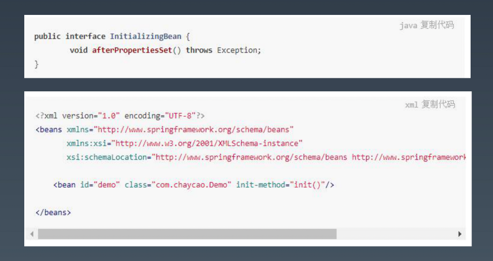

## 三. Spring 常用注解

1.声明组件的注解 

@Component 组件，没有明确的角色 

@Service 在业务逻辑层使用（service层） 

@Repository 在数据访问层使用（dao层） 

@Controller 在展现层使用，控制器的声明（C）

2.注入bean的注解 

@Autowired：由Spring提供 

@Inject：由JSR-330提供 

@Resource：由JSR-250提供

3.java配置类相关注解 

@Configuration 声明当前类为配置类，相当于xml形式的Spring配置（类上） 

@Bean 注解在方法上，声明当前方法的返回值为一个bean，替代xml中的方式（方法上） 

@Component注解，表明这个类是一个bean（类上） 

@ComponentScan 用于对Component进行扫描，相当于xml中的（类上） 

@WishlyConfiguration 为@Configuration与@ComponentScan的组合注解，可以替代这两个注解

4.切面（AOP）相关注解 

@Aspect 声明一个切面（类上） 使用@After、@Before、@Around定义建言（advice），可直接将拦截规则（切点）作为参数。 

@After 在方法执行之后执行（方法上） 

@Before 在方法执行之前执行（方法上） 

@Around 在方法执行之前与之后执行（方法上） 

@PointCut 声明切点 在java配置类中使用@EnableAspectJAutoProxy注解开启Spring对AspectJ代理的支持（类上）

5.@Bean的属性支持 

@Scope 设置Spring容器如何新建Bean实例（方法上，得有@Bean） 

其设置类型包括： 

Singleton （单例,一个Spring容器中只有一个bean实例，默认模式）, 

Protetype （每次调用新建一个bean）, 

Request （web项目中，给每个http request新建一个bean）, 

Session （web项目中，给每个http session新建一个bean）, 

GlobalSession（给每一个 global http session新建一个Bean实例） 

@StepScope 在Spring Batch中还有涉及 

@PostConstruct 由JSR-250提供，在构造函数执行完之后执行，等价于xml配置文件中bean的initMethod 

@PreDestory 由JSR-250提供，在Bean销毁之前执行，等价于xml配置文件中bean的destroyMethod

6.@Value注解：@Value 为属性注入值（属性上） 

支持如下方式的注入： 

\- 注入普通字符 @Value("Michael Jackson")String name; 

\- 注入操作系统属性 @Value("#{systemProperties['os.name']}")String osName; 

\- 注入表达式结果 @Value("#{ T(java.lang.Math).random()* 100 }") String randomNumber; 

\- 注入其它bean属性 @Value("#{domeClass.name}")String name; 

\- 注入文件资源 @Value("classpath:com/hgs/hello/test.txt")String Resource file; 

\- 注入URL资源 @Value("http://www.javastack.cn")Resource url; 

\- 注入配置文件 Value("${book.name}")String bookName;

注入配置使用方法：

① 编写配置文件（test.properties）book.name=《三体》

② @PropertySource 加载配置文件(类上) @PropertySource("classpath:com/hgs/hello/test/test.propertie")

③ 还需配置一个PropertySourcesPlaceholderConfigurer的bean。

7.环境切换 

@Profile 通过设定Environment的ActiveProfiles来设定当前context需要使用的配置环境。（类或方法上） 

@Conditional Spring4中可以使用此注解定义条件话的bean，通过实现Condition接口，并重写matches方法，从而 决定该bean是否被实例化。（方法上）

8.异步相关 

@EnableAsync 配置类中，通过此注解开启对异步任务的支持，叙事性AsyncConfigurer接口（类上） 

@Async 在实际执行的bean方法使用该注解来申明其是一个异步任务（方法上或类上所有的方法都将异步，需要 @EnableAsync开启异步任务）

9.定时任务相关 

@EnableScheduling 在配置类上使用，开启计划任务的支持（类上） 

@Scheduled 来申明这是一个任务，包括cron,fixDelay,fixRate等类型（方法上，需先开启计划任务的支持）

10.@Enable*注解，这些注解主要用来开启对xxx的支持。 

@EnableAspectJAutoProxy 开启对AspectJ自动代理的支持 

@EnableAsync 开启异步方法的支持 

@EnableScheduling 开启计划任务的支持 

@EnableWebMvc 开启Web MVC的配置支持 

@EnableConfigurationProperties 开启对@ConfigurationProperties注解配置Bean的支持 (对于配置类实现一次注入)

@EnableJpaRepositories 开启对SpringData JPA Repository的支持 @EnableTransactionManagement 开启注解式事务的支持 

@EnableCaching 开启注解式的缓存支持

11.测试相关注解 

@RunWith 运行器，Spring中通常用于对JUnit的支持 @RunWith(SpringJUnit4ClassRunner.class) 

@ContextConfiguration 用来加载配置ApplicationContext，其中classes属性用来加载配置类 @ContextConfiguration(classes={TestConfig.class})

12.SpringMVC相关注解 

@EnableWebMvc 在配置类中开启Web MVC的配置支持，如一些ViewResolver或者MessageConverter等，若无 此句，重写WebMvcConfigurerAdapter方法（用于对SpringMVC的配置）。 

@Controller 声明该类为SpringMVC中的Controller @RequestMapping 用于映射Web请求，包括访问路径和参数（类或方法上） 

@ResponseBody 支持将返回值放在response内，而不是一个页面，通常用户返回json数据（返回值旁或方法上） 

@RequestBody 允许request的参数在request体中，而不是在直接连接在地址后面。（放在参数前） 

@PathVariable 用于接收路径参数，比如@RequestMapping(“/hello/{name}”)申明的路径。 

@RestController 该注解为一个组合注解，相当于@Controller和@ResponseBody的组合。 

@ControllerAdvice 通过该注解，我们可以将对于控制器的全局配置放置在同一个位置。 

@ExceptionHandler 用于全局处理控制器里的异常 

@InitBinder 用来设置WebDataBinder，WebDataBinder用来自动绑定前台请求参数到Model中。 

@ModelAttribute 本来的作用是绑定键值对到Model里，在@ControllerAdvice中是让全局的@RequestMapping 都能获得在此处设置的键值对。

## 四. - - - 

纯XML配置开发：没有注解，全部<bean>标签，但也可以配置自动装配 

注解开发不能单独存在，需要开启扫描。自动装配一般用@Autowired 

XML+注解：XML+<context:component-scan>+@Component 

JavaConfig+注解：@Configuration+@ComponentScan+@Component 

JavaConfig方式：@Configuration+@Bean 

3种编程风格：XML、注解、JavaConfig 
		2种注入方式：setter方法、构造方法 
		4种装配模式：byType、byName、constructor、no(ref)

## 五. Spring ORM持久化与事务

ORM（Object-Relational Mapping） 表示对象关系映射。
Hibernate是一个开源的对象关系映射框架，它对JDBC进行了非常轻量级的对象封装，它将POJO与数据库表建立映 射关系，是一个全自动的orm框架，hibernate可以自动生成SQL语句，自动执行，使得Java程序员可以使用面向对象 的思维来操纵数据库。 

JPA的全称是Java Persistence API， 即Java 持久化API，是一套基于ORM的规范， 内部是由一系列的接口和抽象类构成。 JPA通过JDK 5.0注解描述对象-关系表映射关系 ，并将运行期的实体对象持久化到数据库中。

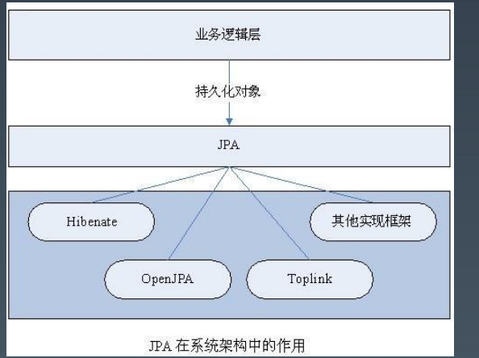

MyBatis 是一款优秀的持久层框架，它支 持定制化 SQL、存储过程以及高级映射。 MyBatis 避免了几乎所有的 JDBC 代码和 手动设置参数以及获取结果集。MyBatis 可以使用简单的 XML 或注解来配置和映 射原生信息，将接口和 Java 的 POJOs(Plain Old Java Objects,普通的 Java对象)映射成数据库中的记录。

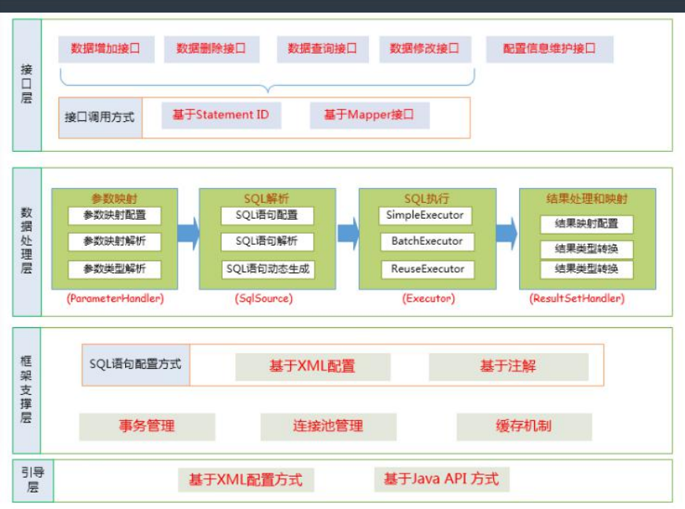

MyBatis 与 Hibernate 的区别与联系？ 

Mybatis优点：原生SQL（XML语法），直观，对DBA友好 
Hibernate优点：简单场景不用写SQL（HQL、Cretiria、SQL） 
Mybatis缺点：繁琐，可以用MyBatis-generator、MyBatis-Plus之类的插件 
Hibernate缺点：对DBA不友好

事务的特性  : ACID 
• 原子性（Atomicity）：事务是一个原子操作，由一系列动作组成。事务的原子性确保动作要么全部完成，要么完全不起作用。 
• 一致性（Consistency）：一旦事务完成（不管成功还是失败），系统必须确保它所建模的业务处于一致的状态，而不会是部分完成部分失 败。在现实中的数据不应该被破坏。 
• 隔离性（Isolation）：可能有许多事务会同时处理相同的数据，因此每个事务都应该与其他事务隔离开来，防止数据损坏。 
• 持久性（Durability）：一旦事务完成，无论发生什么系统错误，它的结果都不应该受到影响，这样就能从任何系统崩溃中恢复过来。通常 情况下，事务的结果被写到持久化存储器中。 

事务的传播性一般用在事务嵌套的场景，
比如一个事务方法里面调用了另外一个事务方法，那么两个方法是各自作为 独立的方法提交还是内层的事务合并到外层的事务一起提交，这就是需要事务传播机制的配置来确定怎么样执行。 

常用的事务传播机制如下： 
• PROPAGATION_REQUIRED：Spring默认的传播机制，能满足绝大部分业务需求，如果外层有事务，则当前事务加入到外层事务，一块 提交，一块回滚。如果外层没有事务，新建一个事务执行 
• PROPAGATION_REQUES_NEW：该事务传播机制是每次都会新开启一个事务，同时把外层事务挂起，当当前事务执行完毕，恢复上层事 务的执行。如果外层没有事务，执行当前新开启的事务即可 
• PROPAGATION_SUPPORT：如果外层有事务，则加入外层事务，如果外层没有事务，则直接使用非事务方式执行。完全依赖外层的事务 
• PROPAGATION_NOT_SUPPORT：该传播机制不支持事务，如果外层存在事务则挂起，执行完当前代码，则恢复外层事务，无论是否异 常都不会回滚当前的代码 
• PROPAGATION_NEVER：该传播机制不支持外层事务，即如果外层有事务就抛出异常 
• PROPAGATION_MANDATORY：与NEVER相反，如果外层没有事务，则抛出异常 
• PROPAGATION_NESTED：该传播机制的特点是可以保存状态保存点，当前事务回滚到某一个点，从而避免所有的嵌套事务都回滚，即各 自回滚各自的，如果子事务没有把异常吃掉，基本还是会引起全部回滚的。

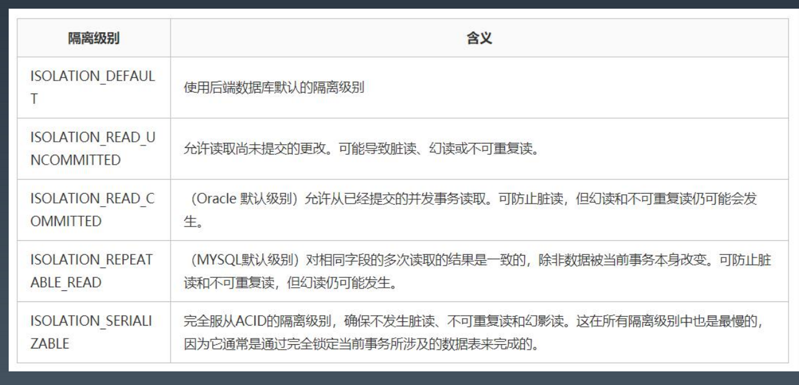

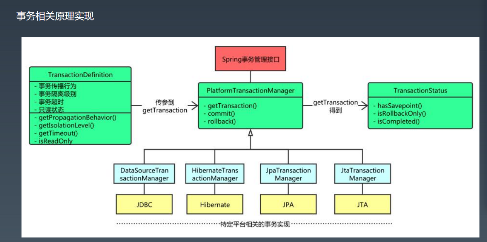

Spring声明式事务配置参考 
事务的传播性： @Transactional(propagation=Propagation.REQUIRED) 

事务的隔离级别： @Transactional(isolation = Isolation.READ_UNCOMMITTED) 读取未提交数据(会出现脏读, 不可重复读) 基本不使用 

只读： @Transactional(readOnly=true) 该属性用于设置当前事务是否为只读事务，设置为true表示只读，false则表示可读写，默认值为false。 

事务的超时性： @Transactional(timeout=30) 

回滚： 
指定单一异常类：@Transactional(rollbackFor=RuntimeException.class) 
指定多个异常类：@Transactional(rollbackFor={RuntimeException.class, Exception.class})

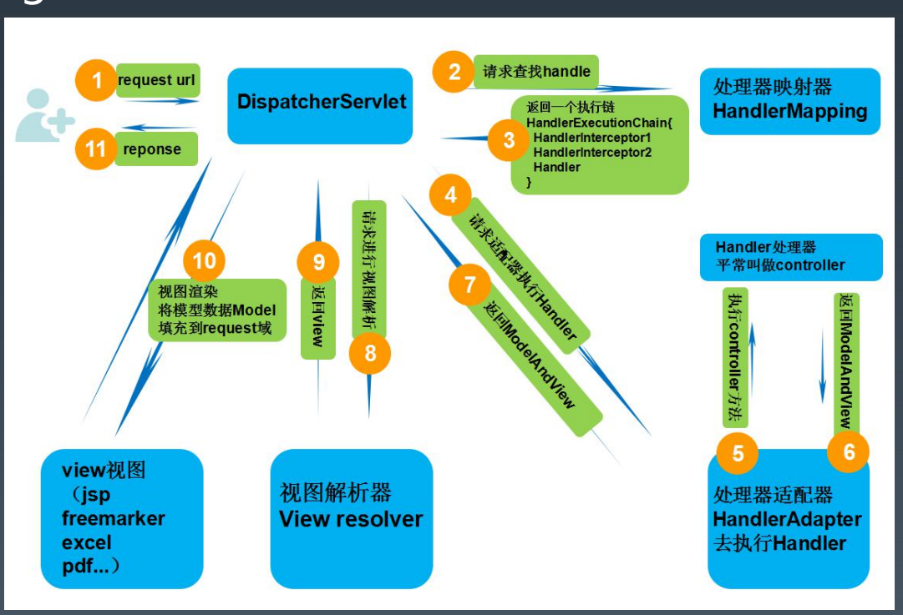

第二步：前端控制器请求处理器映射器（HandlerMappering）去查找处理器（Handle）,通过xml配置或者注解查找 
第三步：找到以后处理器映射器（HandlerMappering）像前端控制器返回执行链（HandlerExecutionChain） 
第四步：前端控制器（DispatcherServlet）调用处理器适配器（HandlerAdapter）去执行处理器（Handler） 
第五步：处理器适配器去执行Handler 
第六步：Handler执行完给处理器适配器返回ModelAndView 
第七步：处理器适配器向前端控制器返回ModelAndView 
第八步：前端控制器请求视图解析器（ViewResolver）去进行视图解析 
第九步：视图解析器像前端控制器返回View 
第十步：前端控制器对视图进行渲染 
第十一步：前端控制器向用户响应结果

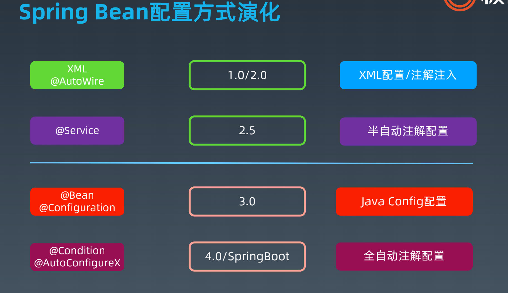

从Spring MVC走向前后端分离REST 

前端：三大框架 

后端：SpringMVC->RestController，SwaggerUI

SwaggerUI : 生成接口文档

https://www.jianshu.com/p/5c1111d3b99f

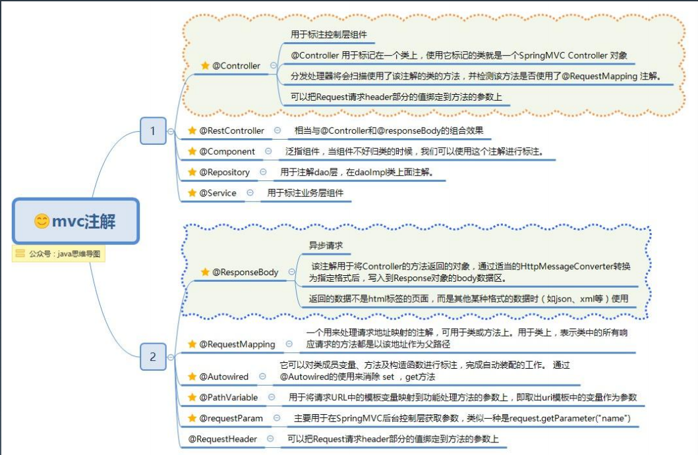

**Spring Data**: Spring 的一个子项目。用于简化数据库访问，支持NoSQL和关系数据库存储。其主要目标是使数据库 的访问变得方便快捷。 

Spring Data 项目所支持NoSQL存储（通过统一抽象，像操作数据库一样）： 

\- - MongoDB（文档数据库） 

\- - Neo4j （图形数据库） 

\- - Redis（键/值存储） 

\- - Hbase（列族数据库） 

Spring Data 项目所支持的关系数据存储（前面ORM部分）： - - JDBC - - JPA

**Spring-message 模块** : 简化消息操作，实现面向对象一样的方式去发送和接收消息

XXXTemplate：如JMSTemplate，KafkaTemplate，AmqpTemplate 

Converter：转换Pojo与Message对象

## 六. spring-profile 和 maven -  profile 区别
- Maven的profile用于在打包时根据指定环境替换不同环境的配置文件配置 ,编译打包时候生效
- Spring的Profile可以用于在不同的环境下加载不同的bean,运行时生效

# 参考文献

- [1] [Spring注解驱动开发](https://www.cnblogs.com/binghe001/p/13174687.html)
- [2] [Spring拓展接口之BeanPostProcessor](https://www.cnblogs.com/youzhibing/p/10559330.html)
- [3] [Maven profile整合Spring profile](https://blog.csdn.net/xiao__gui/article/details/88189429)

