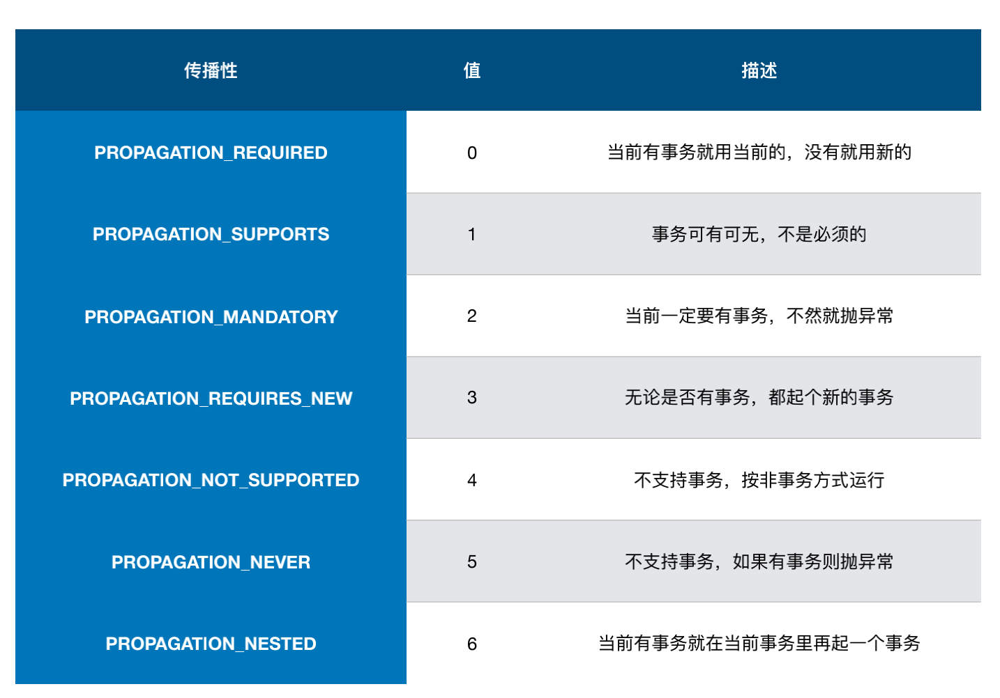
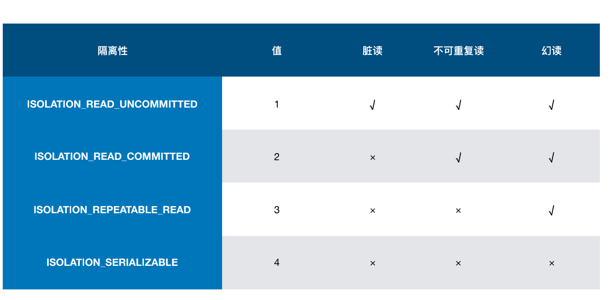

# 常用的 Bean 注解

## 一. @Component
通用注解,用来定义一个通用的 Bean.


## 二. @Repository
数据库的操作建议放在Repository定义的 Bean 中


## 三. @Service
业务的服务可以使用 service 注解


## 四. @Controller
spring mvc 相关的可以使用Controller注解


## 五. @RestController
方便 RestFul web service 使用.


# Spring 事务抽象

## 事务的传播特性



## 事务的隔离特性




## 编程式事务
**TransactionTemplate**

- TransactionCallback
- TransactionCallbackWithoutResult


**PlatformTransactionManager**

- 可以传入 TranslactionDefinition 进行定义


## 声明式事务

### 开启事务 : @EnableTransactionManagement

### 配置
- proxyTargetClass : 类增强还是接口增强
- mode : AdviceMode.PROXY 代理增强方式
- order : default 2147483647 , 默认优先级最低

### 使用 : @Transactional
- transactionManager : 数据源
- propagation : 传播性
- isolation : 隔离性,默认-1,按照数据库隔离级别为准
- timeout
- readOnly
- rollbackXXX


### 类中声明式事务失败
**原因 :** 直接调用的方法 ,因为声明式事务是基于 AOP 的代理实现的,那么如果在方法内部调用这个方法的话就执行不到事务的逻辑,导致没有成功使用事务
		**解决 :** 

```java

	@Autowired
	private FooService fooService;

	@Autowired
	private JdbcTemplate jdbcTemplate;

	@Override
	@Transactional
	public void insertRecode() {
		jdbcTemplate.execute("INSERT INTO FOO  (BAR) VALUES('AAA')");
	}

	@Override
	@Transactional(rollbackFor = RollBackException.class)
	public void insertThenRollback() throws RollBackException {
		jdbcTemplate.execute("INSERT INTO FOO  (BAR) VALUES('BBB')");
		throw new RollBackException();
	}

	@Override
	public void invokeInsertThenRollBack() throws RollBackException {
		// 这种调用实际上是直接调用的方法 ,因为声明式事务是基于 AOP 的代理实现的
		// 那么如果在方法内部调用这个方法的话就执行不到事务的逻辑,导致没有成功使用事务
		insertThenRollback();
    
		// 1. 使用代理
		((FooService) AopContext.currentProxy()).insertThenRollback();
		// 2. 注入自己
		fooService.insertThenRollback();
		// 3. 再加一层事务(这里不修改了)
		// 4. 从 context get bean 之后调用
	}
```

**常见问题 :**

`Cannot find current proxy: Set 'exposeProxy' property on Advised to 'true' to make it available`

原因 : 因为将代理类注入到 Threadlocal 中可能会有性能方面影响,所以默认是 false

解决 : 
`@EnableAspectJAutoProxy(proxyTargetClass = true, exposeProxy = true)` 加在代理类或者启动方法中都可以,注意如果使用事务,不要在事务的注解上在再次选择代理 : `@EnableTransactionManagement(mode = AdviceMode.ASPECTJ)`选择了的话会报错`Cannot find current proxy: Set 'exposeProxy' property on Advised to 'true' to make it available`


