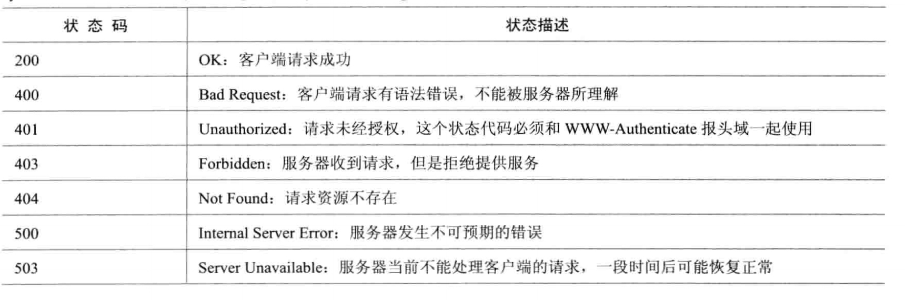
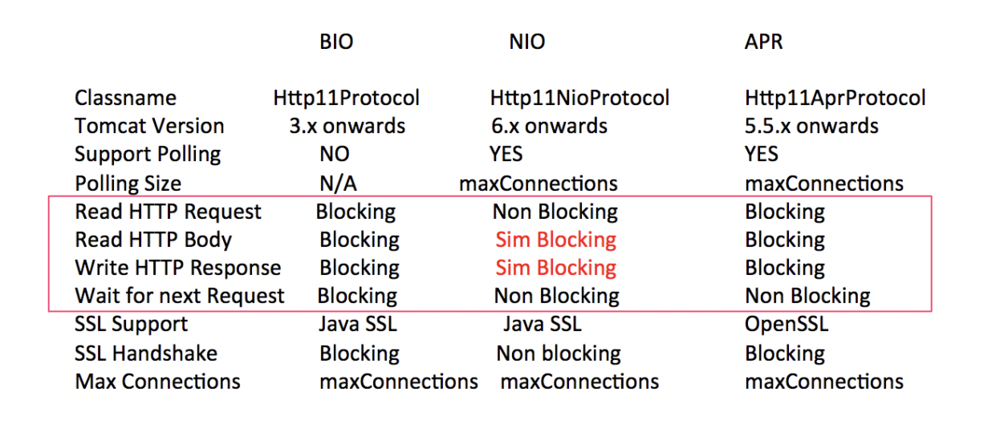

# Http 相关知识

## 一. 状态码

## 二. Tomcat

#### 2.1 tomcat 三种连接模式

#### 2.2 tomcat 为什么不采用netty处理并发
- servlet规范,servlet规范里定义了ServletInputStream在读数据时是阻塞模式,在servlet3.0中引入了异步,但也要toncat8之后才提供了.

# 参考文献

- [apache-tomcat官方文档](http://tomcat.apache.org/)
- [tomcat 不同链接模式下keep alive实现](https://hongjiang.info/how-tomcat-implements-keep-alive/)
- [Servlet规范](https://www.cnblogs.com/54chensongxia/p/13231046.html)