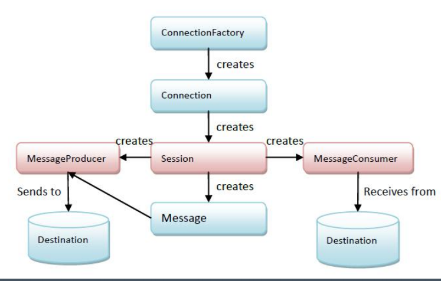
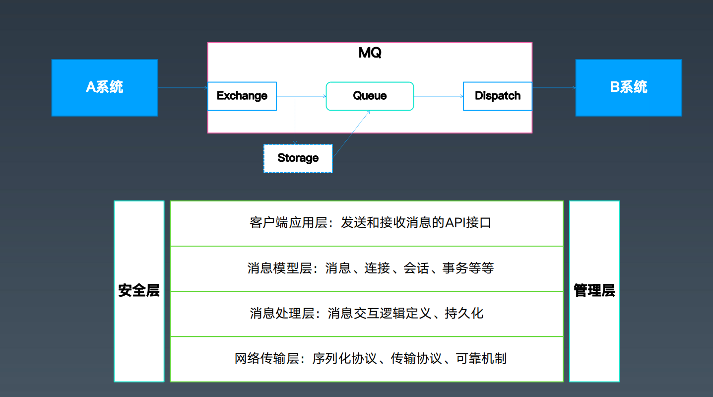

# 消息队列

# 一. MQ : Message Queue / Messaging System / Message Middlewire 

## 1.1 系统间通信方式

基于文件 , 共享内存 , IPC ,Socket  ,数据库 ,RPC


## 1.2 各个模式的优缺点

- 文件 : 不方便,不及时
- Socket : 使用麻烦 , 多数情况不如RPC
- 数据库 : 不实时 , 很多人使用数据库模拟消息队列 , 缺点 : 轮询获取状态时候会有延时 , 对于强实时性和顺序消费等需求需要特殊处理.
- RPC : 调用关系复杂 , 同步处理,压力大时候无法缓冲

## 1.3 需求 : 需要一种可以满足下面这些条件的通信方式

- 可以实现异步消息通信
- 可以简化参与各方复杂依赖关系
- 可以再请求量很大时候,进行缓冲,类似线程池的队列Queue
- 某些情况下能够保障消息的可靠性 ,顺序性


## 二. 从队列到消息服务

### 2.1 核心要点 : 
- Queue  : 队列
- Messagwe : 消息
- Producer : 生产者
- Consumer : 消费者


### 2.2 MQ的优势
- 异步通信：异步通信，减少线程等待，特别是处理批量等大事务、耗时操作。 
- 系统解耦：系统不直接调用，降低依赖，特别是不在线也能保持通信最终完成。 
- 削峰平谷：压力大的时候，缓冲部分请求消息，类似于背压处理。 
- 可靠通信：提供多种消息模式、服务质量、顺序保障等


背压 :  https://www.zhihu.com/question/49618581

# 三. 消息模式与消息协议

## 3.1 消息处理模式

常见的有两种消息模式： 
- 点对点：PTP，Point-To-Point 对应于Queue    发布-接收
- 发布订阅：PubSub，Publish-Subscribe， 对应于Topic   发布-订阅

## 3.2 消息处理的保障
三种QoS(Quality of Service 服务质量)（注意：这是消息语义的，不是业务语义的）： 
- At most once，至多一次，消息可能丢失但是不会重复发送； 
- At least once，至少一次，消息不会丢失，但是可能会重复；
- Exactly once，精确一次，每条消息肯定会被传输一次且仅一次。 消息有且只有一次

在出现消息重复时候的处理 : 幂等 , 去重

## 3.3 消息处理的事务性
- 通过确认机制实现事务性；
- 可以被事务管理器管理，甚至可以支持XA。

## 3.4 消息的有序性

同一个Topic或Queue的消息，保障按顺序投递。 
注意：如果做了消息分区，或者批量预取之类的操作，可能就没有顺序了。

## 3.5 消息协议

> AMQP , MQTT : 相对完整的协议,规定了如何序列化 , 和服务端交互报文格式 , 
优点 : 客户端发出的包具有一致性 , 同事描述了客户端服务端行为,相对完善的

STOMP  : 简单文本对象协议 : sample text object message 
JMS*  : java 消息协议 ,很长时间的J2EE 标准 , 序列化和协议,由mq协议方来实现 , 对于持久化协议,规定必须持久化之后才会返回.
AMQP* : 高级消息队列协议  - 金融
MQTT*  : 遥感传输的协议  - IBM ,物联网
XMPP  : jabber
Open Messaging : ali的

## 3.6 JMS （Java Message Service）

关注于应用层的API协议( ~ 类似JDBC)

JMS 相关文档 : https://kimmking.blog.csdn.net/article/details/6577021 

### 3.6.1 Message结构与Queue概念 
- Body\Header\Property, messages types
```
Header : 消息的信息,用于mq使用,像优先级,路由信息,是否持久化,过期,重试
Property : 业务自定义的一些信息
messages types : 默认定义5种 : 文本/map/对象/字节/流 
```
- Queue\Topic\TemporaryQueue\TemporaryTopic 
```
Temporary* 临时消息队列,相当于数据库中的临时表
Queue一般持久化,Topic不持久化
```
- Connection\Session\Producer\Consumer\DurableSubscription 
```
DurableSubscription : 持久化订阅 , 启动的话,topic的数据会写进磁盘,记录订阅者订阅的位置
```
在数据被消费完成后会不定期的清除数据 , 原因 : 第一代的mq是基于把消息存储在内存实现高性能,堆积的消息越少,系统处理的越快.

### 3.6.2 Messaging行为 
- PTP&Pub-Sub 
- 持久化 
- 事务机制
- 确认机制 
- 临时队列




# 四. 消息队列的通用结构




- exchange 用来接收消息,并投递到队列中 
- dispatch 负责把消息投递到订阅了消息的queue中

> 调用模式 : 
>
> ​	oneway : 单方面,请求 
>
> ​	rr : 请求-响应

基于jms 可以实现rr模式 , 消息发送出去之后根据消息id进行定位,等待消息返回之后根据消息id找到发送发,绑定结果返回.

# 五. 开源消息中间件/消息队列
- ActiveMQ/RabbitMQ :基于 AMS 和 AMQP ,不支持堆积,主要是靠内存 , 一般支持 queue和topic
- Kafka/RocketMQ : 使用WAL技术,磁盘+内存 , 一般只支持 topic
- Apache Pulsar : 计算和存储分离 , 可以计算和存储独立扩展 ,一般支持 queue和topic
- zmq : 可以认为是一个通信库 ,重写了通信协议,做到通信的优化


# 六. MQ的选型 : 
关于性能 : 吞吐量/延时
(1) 业务量不大 ,但是对mq策略要求较高,需要有重试,超时的策略 , 可以考虑使用activemq,持久化配置jdbc数据库.
(2) 性能高,通过内存做高可用 ,数据不丢  :rebitMQ
(3) 大数据场景,kafka ,recketmq
关于选型 : 场景与指标
关于开发 : 抽象与封装
关于维护 ; 稳定性/高可用


选型前做POC测试 : 
https://baike.baidu.com/item/POC%E6%B5%8B%E8%AF%95/1048802?fr=aladdin


