# 一. 什么是Kafka

Kafka 是一个消息系统，由 LinkedIn 于2011年设计开发，用作 LinkedIn 的活动流 （Activity Stream）和运营数据处理管道（Pipeline）的基础。 

Kafka 是一种分布式的，基于发布 / 订阅的消息系统。

主要设计目标如下： 
- 以时间复杂度为 O(1) 的方式提供消息持久化能力，即使对 TB 级以上数据也能保证 常数时间复杂度的访问性能。 
- 高吞吐率。即使在非常廉价的商用机器上也能做到单机支持每秒 100K 条以上消息 的传输。 
- 支持 Kafka Server 间的消息分区，及分布式消费，同时保证每个 Partition 内的消息顺序传输。 
- 同时支持离线数据处理和实时数据处理。 
- Scale out：支持在线水平扩展。

# 二. Kafka的基本概念
- Broker：Kafka 集群包含一个或多个服务器，这种服务器被称为 broker。 
broker/proxy/agent ==> 代理!!!
- Topic：每条发布到 Kafka 集群的消息都有一个类别，这个类别被称为 Topic。 
（物理上不同 Topic 的消息分开存储，逻辑上一个 Topic 的消息虽然保存于一个或 多个 broker 上，但用户只需指定消息的 Topic 即可生产或消费数据而不必关心数 据存于何处）。 
- Partition：Partition 是物理上的概念，每个 Topic 包含一个或多个 Partition。 
- Producer：负责发布消息到 Kafka broker。 
- Consumer：消息消费者，向 Kafka broker 读取消息的客户端。 
- Consumer Group：每个 Consumer 属于一个特定的 Consumer Group（可为每个 Consumer 指定 group name，若不指定 group name 则属于默认的 group） , 消费组内协同工作

# 三. 单机部署结构

- Kafka 单机消息处理

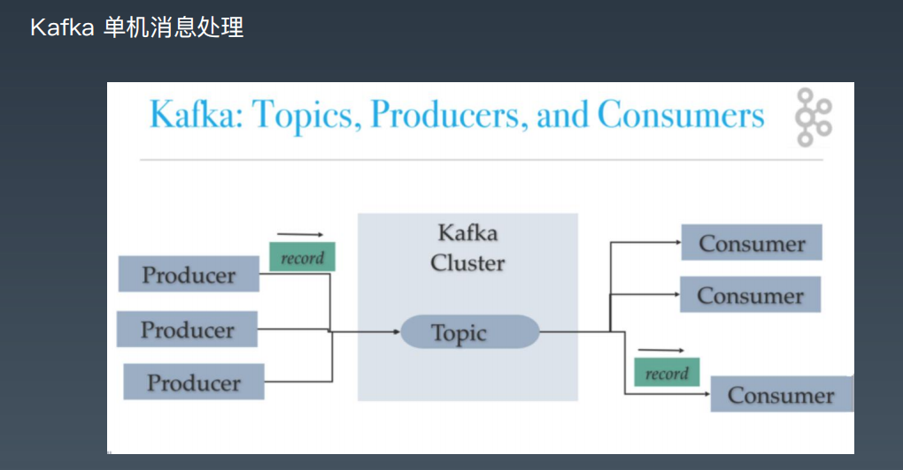

- 集群部署结构

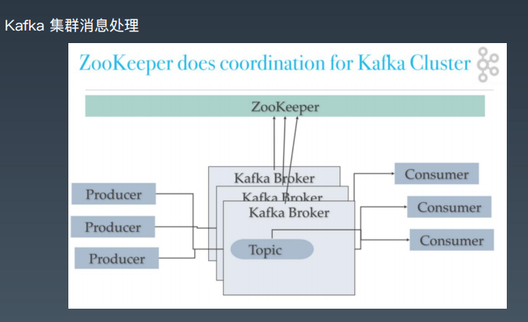


- Topic和Partition

每一个Partition都相当于是一个子队列 , Partition的寻址都是在客户端完成的,多Partition支持水平扩展和并行处理，顺序写入提升吞吐性能


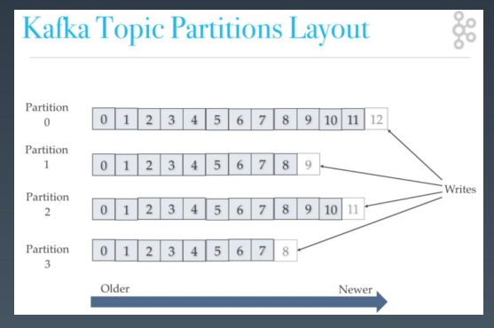


- Partition和 Replica(副本 , 3副本为例)

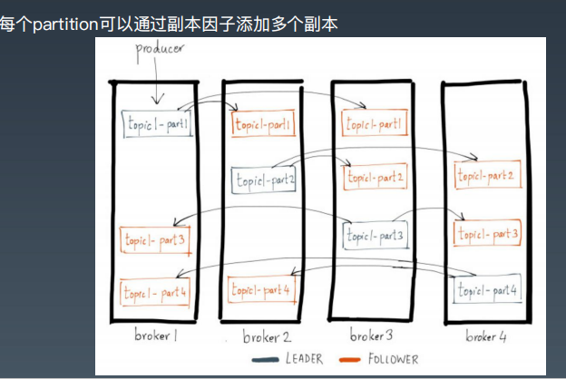

- Topic特性 : Topic逻辑概念 , partition物理概念
```
1. 通过partition增加可扩展性  : 修改partition相当于是修改了表结构 , 可以线上操作,但是会有性能的抖动.
2. 通过顺序写入达到高吞吐 
3. 多副本增加容错性

单个机器上,不建议有大量的partition , 不建议有大量的topic,因为他们对应一个数据文件 ==> 单个机器上,数据文件大了,意味着,随机IO读写.因为多个partition 是并行的 , 可能partition 分别对应1,10,20,所以可能读取1之后读取10之后读取20 仍然是随机读取
```


# 四. 简单使用

## 4.1 单机安装部署
- kafka安装 
http://kafka.apache.org/downloads 
下载2.6.0或者2.7.0，解压。 

- 启动kafka： 
命令行下进入kafka目录 
修改配置文件 vim config/server.properties 
打开 listeners=PLAINTEXT://localhost:9092 
```shell
bin/zookeeper-server-start.sh config/zookeeper.properties 
bin/kafka-server-start.sh config/server.properties
```

- 命令行操作Kafka 
```shell
bin/kafka-topics.sh --zookeeper localhost:2181 --list 
//创建一个topic
bin/kafka-topics.sh --zookeeper localhost:2181 --create --topic testk --partitions 4 -- replication-factor 1 
//查看topic信息
bin/kafka-topics.sh --zookeeper localhost:2181 --describe --topic testk 
//启动一个consumer
bin/kafka-console-consumer.sh --bootstrap-server localhost:9092 --from-beginning -- topic testk 
//启动一个producer
bin/kafka-console-producer.sh --bootstrap-server localhost:9092 --topic testk 
```

- 简单性能测试 
```shell
//跑10万个 , 记录 1000字节 , 每s2000个
//生产者压测
bin/kafka-producer-perf-test.sh --topic testk --num-records 100000 --record-size 1000 --throughput 2000 --producer-props bootstrap.servers=localhost:9092 
//消费者压测
bin/kafka-consumer-perf-test.sh --bootstrap-server localhost:9092 --topic testk -- fetch-size 1048576 --messages 100000 --threads 1
```

## 4.2 Java中使用kafka发送接收消息
- 基于Kafka Client发送和接收消息--极简生产者

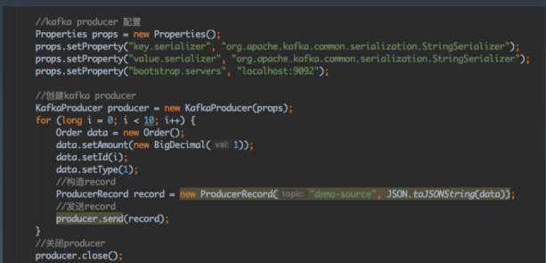

- 基于Kafka Client发送和接收消息--极简消费者 , kafka消费模式使用的是拉取模式,所以所有操作都依赖客户端

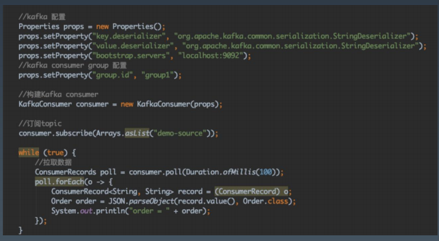


## 4.3 集群配置
- 首先准备3个配置文件(kafka900x.properties)
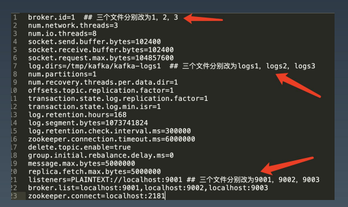

- 清理掉zk上的所有数据，可以删除zk的本地文件或者用ZooInspector操作 


- 启动3个kafka： 
```shell
./bin/kafka-server-start.sh kafka9001.properties 
./bin/kafka-server-start.sh kafka9002.properties 
./bin/kafka-server-start.sh kafka9003.properties 
```

- 测试
```shell
# 创建带有副本的topic： 
bin/kafka-topics.sh --zookeeper localhost:2181 --create --topic test32 --partitions 3 - -replication-factor 2 

bin/kafka-console-producer.sh --bootstrap-server localhost:9003 --topic test32 bin/kafka-console-consumer.sh --bootstrap-server localhost:9001 --topic test32 -- from-beginning 

# 执行性能测试： 
bin/kafka-producer-perf-test.sh --topic test32 --num-records 100000 --record-size 1000 --throughput 2000 --producer-props bootstrap.servers=localhost:9002 

bin/kafka-consumer-perf-test.sh --bootstrap-server localhost:9002 --topic test32 -- fetch-size 1048576 --messages 100000 --threads 1
```

## 4.4 kafka web 开源工具
https://www.cnblogs.com/frankdeng/p/9584870.html


## 4.5 集群与多副本的说明
- ISR：In-Sync Replica  同步的副本
https://www.cnblogs.com/zzzzrrrr/p/13197390.html

- Rebalance：broker和consumer group的rebalance 
Kafka Rebalance机制分析 :  cnblogs.com/yoke/p/11405397.html
除了文档中的还有一种情况 : 一个新的topic匹配已有的订阅正则(subscribed regx)

- 热点分区：需要重新平衡

# 五. kafka 高级特性

## 5.1 生产者-执行步骤
客户端实现序列化，分区，压缩操作
客户端要进行路由判断  ,所以要拿到分区信息,即topic metadata

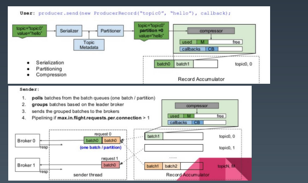

## 5.2 生产者-确认模式 三种
ack=0 : 只发送不管有没有写入到broker 
ack=1：写入到leader就认为成功 
ack=-1/all：写入到最小的复本数则认为成功

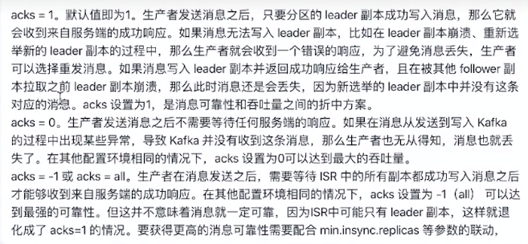

分布式数据不丢方案 : 多节点,多副本,多确认
可以设置isr数量,低于该数量不允许写入,1. 可以用来防止脑裂.2. 避免主节点数据丢失 , 但是由于和主数据存在一定延时,所以可能会丢数据

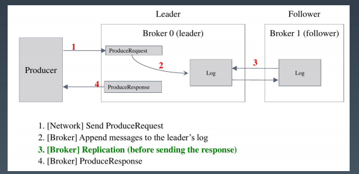

## 5.3 生产者特性-同步发送
```java
同步发送 

KafkaProducer kafkaProducer = new KafkaProducer(pro); 
ProducerRecord record = new ProducerRecord("topic", "key", "value"); 
Future future = kafkaProducer.send(record); 

//同步发送方法1 
Object o = future.get(); 

//同步发送方法2 
kafkaProducer.flush();
```

## 5.4 生产者特性-异步发送

```java
异步发送 
pro.put("linger.ms", “1"); 
pro.put("batch.size", "10240"); 

KafkaProducer kafkaProducer = new KafkaProducer(pro); 
ProducerRecord record = new ProducerRecord("topic", "key", "value"); 
Future future = kafkaProducer.send(record); 

//异步发送方法1 
kafkaProducer.send(record, (metadata, exception) -> { 
if (exception == null) System.out.println("record = " + record);
}); 

//异步发送方法2 
kafkaProducer.send(record);
```

## 5.5 生产者特性-顺序保证 
```java
//未被确认的数据 , 一个连接只允许一个
pro.put("max.in.flight.requests.per.connection", “1"); 

KafkaProducer kafkaProducer = new KafkaProducer(pro); 
ProducerRecord record = new ProducerRecord("topic", "key", "value");

Future future = kafkaProducer.send(record); 

//同步发送 
kafkaProducer.send(record); 
kafkaProducer.flush();
```


## 5.6 生产者特性-消息可靠性传递

```java
pro.put("enable.idempotence","true"); // 打开幂等操作 , 此时就会默认把acks设置为all  ,pro.put("transaction.id","tx0001"); //给事务操作设置一个id
try {
//开启
kafkaProducer.beginTransaction(); 
ProducerRecord record = new ProducerRecord("topic", "key", "value"); 
for (int i = 0; i < 100; i++) { 
kafkaProducer.send(record, (metadata, exception) -> { 
if (exception != null) { 
//回滚
kafkaProducer.abortTransaction(); 
throw new KafkaException(exception.getMessage() + " , data: " + record);
} }); } 
//提交
kafkaProducer.commitTransaction(); 
} catch (Throwable e) {
 kafkaProducer.abortTransaction(); 
}
```


## 5.7 消费者-Consumer Group

消费者与Partition对应关系，如果4个partition，3个消费者怎么办？5个呢？
Consumer Group中有3个consumer : 一个consumer处理两个partition
Consumer Group中有5个consumer : 有一个consumer空闲
所以消费组中的消费者数量不要大于partition的数量

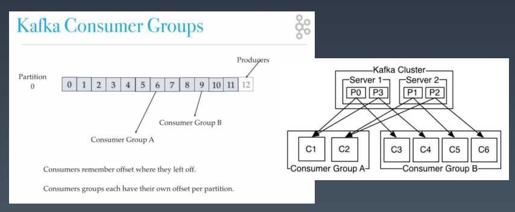

## 5.8 消费者特性-Offset同步提交/异步提交/自动提交
> 高版本的offset 信息存放在一个topic下面 __consumer_offset 下面,对其也可以设置高可用,多副本

```java
//自动提交 , 不在需要手动提交代码,只需要配置上自动提交以及设置一下提交间隔即可
props.put("enable.auto.commit","true"); 
props.put(“auto.commit.interval.ms”,”5000");

props.put("enable.auto.commit","false");
while (true) { 
//拉取数据 
ConsumerRecords poll = consumer.poll(Duration.ofMillis(100)); 
poll.forEach(o -> { 
ConsumerRecord<String, String> record = (ConsumerRecord) o; 
Order order = JSON.parseObject(record.value(), Order.class); 
System.out.println("order = " + order);
 }); 
//同步提交
consumer.commitSync();
//或者使用异步提交 同步提交和异步提交只有提交方式有区别 , 自动提交都设置为false
consumer.commitAsync();
 }
```

## 5.9 消费者特性-Offset Seek


```java
props.put("enable.auto.commit","true"); 
// 有新的节点加入时候 , 会触发回调 , 此时可以手动记录offset,将其写入到数据库中,保证数据可靠
//订阅topic 
consumer.subscribe(Arrays.asList("demo-source"), new ConsumerRebalanceListener() { 	
	@Override 
public void onPartitionsRevoked(Collection<TopicPartition> partitions) { 
commitOffsetToDB(); 
}
@Override 
public void onPartitionsAssigned(Collection<TopicPartition> partitions) { 
partitions.forEach(topicPartition -> consumer.seek(topicPartition, getOffsetFromDB(topicPartition))); 
} 
});

while (true) { 
//拉取数据 
ConsumerRecords poll = consumer.poll(Duration.ofMillis(100)); 
poll.forEach(o -> { 
ConsumerRecord<String, String> record = (ConsumerRecord) o; 
//记录从数据库中获取保存 , 相当于是自己管理
processRecord(record); 
saveRecordAndOffsetInDB(record, record.offset());
 }); 
}
```


# 六. 其它问题

如何缓解Kafka集群在有大量topic时性能快速劣化的问题？
https://www.zhihu.com/question/300144434?sort=created

多个消费者的顺序消费 : 单个partition有序,多个是无序的 , 同一个partition在同一个组中,只会有一个消费节点.

ZooInspector : 图形化工具浏览zk文件
https://www.cnblogs.com/lwcode6/p/11586537.html
https://www.jianshu.com/p/8320a6c52f15

kafka 日志删除策略 : 
https://blog.csdn.net/hyj_king/article/details/105701507?utm_term=kafka%E6%95%B0%E6%8D%AE%E5%88%A0%E9%99%A4%E7%AD%96%E7%95%A5&utm_medium=distribute.pc_aggpage_search_result.none-task-blog-2~all~sobaiduweb~default-0-105701507&spm=3001.4430
