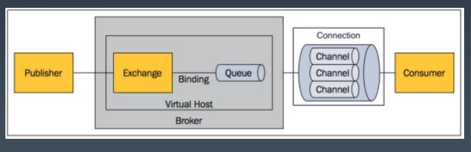
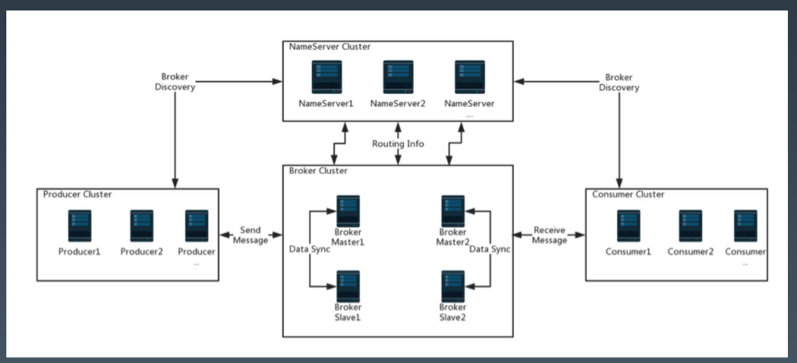
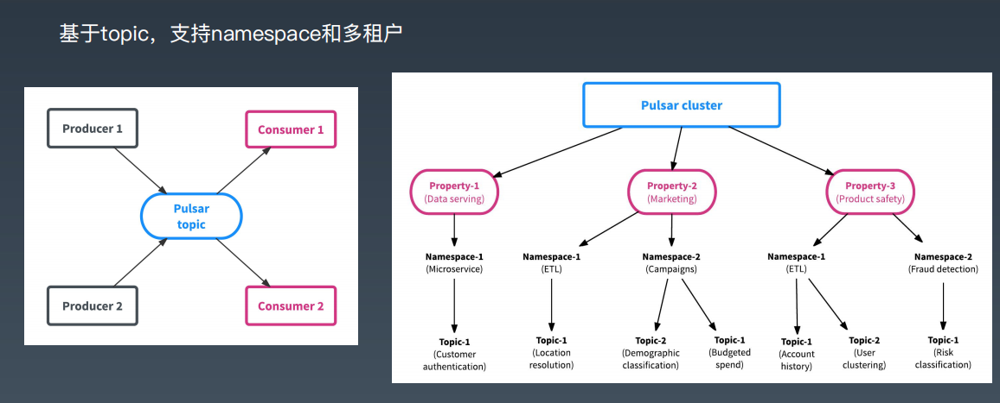
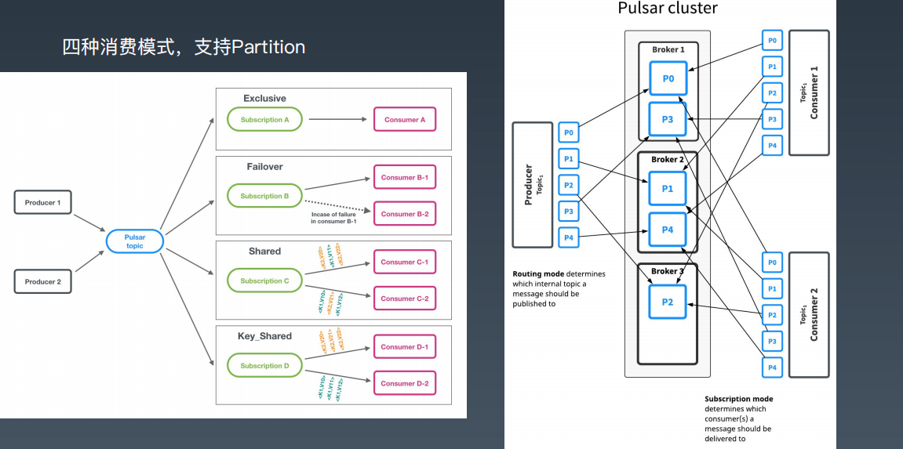
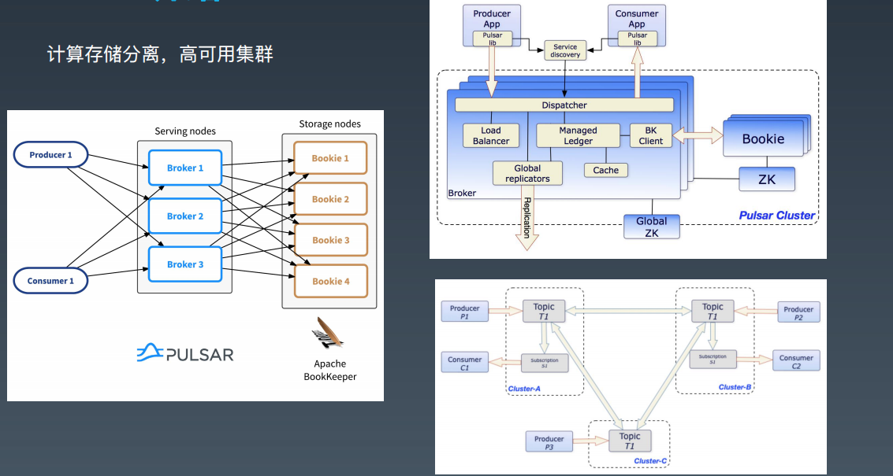

# 一.Rabbit MQ

## 1.1 安装

### 1.1.1 直接安装
```shell
brew install rabbitmq //macos 
apt/yum install rabbitmq-server //linux 
choco install rabbitmq //windows 

rabbitmq-plugins enable rabbitmq_management 
```
### 1.1.2 docker 安装
```shell
docker pull rabbitmq:management # 注意不带后缀就不会有web控制台 
docker run -itd --name rabbitmq-test -e RABBITMQ_DEFAULT_USER=admin -e RABBITMQ_DEFAULT_PASS=admin -p 15672:15672 -p 5672:5672 rabbitmq:management 

docker exec -it rabbitmq-test /bin/bash 

rabbitmqctl list_queues、rabbitmqctl status 
rabbitmqadmin declare queue name=kk01 -u admin -p admin 
rabbitmqadmin get queue=kk01 -u admin -p admin
```

## 1.2 RabbitMQ 的核心概念

queue/exchange/routekey/binding



目前主流的mq,把路由放在客户端,而rabbitmq是将其封装在服务端,这样就导致服务端逻辑相对较重


## 1.3 spring-amqp操作rabbitmq
- spring-amqp 封装好了 Template 
- rabbitmq-client直接操作

使用的 routeing-key 一样的队列,在你发送时候,都会收到一份消息


# 二. RocketMQ 

## 2.1 安装

### 2.1.1 直接安装
```shell
# 从http://rocketmq.apache.org/dowloading/releases/下载4.8.0 解压，即可。 
nohup sh bin/mqnamesrv & 
nohup sh bin/mqbroker -n localhost:9876 & 

export NAMESRV_ADDR=localhost:9876 
sh bin/tools.sh org.apache.rocketmq.example.quickstart.Producer 
sh bin/tools.sh org.apache.rocketmq.example.quickstart.Consumer 
```
参见：http://rocketmq.apache.org/docs/quick-start/ 

### 2.1.2 docker安装 
参见https://github.com/apache/rocketmq-docker

## 2.2 RocketMQ安装
总体结构 : nameServe 可以看成zk




## 2.3 介绍

### 2.3.1 与Kafka的区别：
作为Kafka的重新实现版，没太大本质区别（可以理解为百事和可口） 
- 纯Java开发，用不用zk 
- 支持延迟投递，消息追溯
- 多个队列使用一个日志文件，所以不存在kafka过多topic问题 

### 2.3.2 rocketmq 一般单机效率低于kafka
- 单个文件问题,随机操作会影响性能
- 处理策略上,比kafka复杂

### 2.3.3 和第三代mq的区别
- 同一个broker都进行消息处理和io操作.
### 2.3.4 相关文档
参见 http://rocketmq.apache.org/docs/motivation/
中文文档 : https://github.com/apache/rocketmq/blob/master/docs/cn/design.md

# 三. pulsar
## 3.1 安装
```shell
# 1、下载安装 
通过 http://pulsar.apache.org/zh-CN/download/ 下载2.7.0版本 解压压缩包，即可。
详细文档可以参见：http://pulsar.apache.org/docs/zh-CN/ 

> bin/pulsar standalone 
> bin/pulsar-client consume topic1 -s "first-subscription" 
> bin/pulsar-client produce topic1 --messages "hello-pulsar" 

# 2、Docker安装运行 
参考 http://pulsar.apache.org/docs/zh-CN/standalone-docker/
```
## 3.2 Pulsar介绍 
基于topic，支持namespace和多租户



四种消费模式，支持Partition
- exclusive 排他 : activemq 支持,kafka不支持

- failover 默认排他,如果一个consumer出问题,会给另一个消费 , 冷备

- 共享 : shard

- key共享 : key_shard

支持 pardition



计算存储分离，高可用集群 : 以kafka为例,很大问题就是rebalance , 在进行 rebalance时候会有性能和吞吐量影响 , 好的解决办法就是将计算和存储分离, 下一代的数据库设计基本都是基于此进行拆分.




# 四. EIP/Camel/Spring Integration

- 集成领域的两大法宝，就是RPC和Messaging 也是所有SOA/ESB的基础。 
- 两个开源EIP实现框架，Camel和Spring Integration
```
设计上拆分还是管道加过滤器模式
EIP里，所有的处理，都可以看做是： 
1、数据从一个输入源头出发； 
2、数据在一个管道流动； 
3、经过一些处理节点，数据被过滤器处理，增强，或者转换，或者做个业务处理等等。 
4、最后，数据输出到一个目的地。
```

- 以Camel为例 : 把ActiveMQ的消息，自动转移到RabbitMQ。


使用场景 : 
- 需要实现一套类似于esb的东西
- 你需要打通不同的技术,特别是和数据有关系的
- 做老系统直接对接,或者新系统直接对接老系统,如果新老系统的协议被ELP支持.


