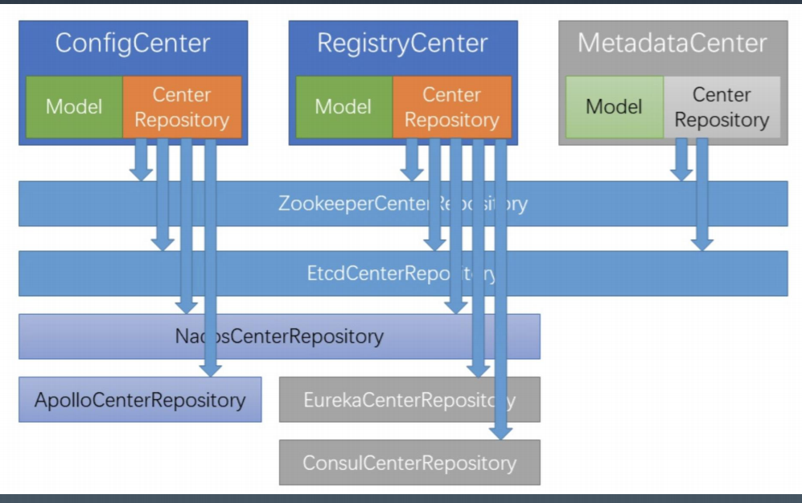

# 深入微服务

# 一 . 深入微服务 , 需要考虑的点都有什么

### 1. 深入分布式服务化需要注意的点都有什么

#### (1)分布式和集群关系 ? 
集群 : 一堆服务器对外提供服务
分布式 : 多组分布式机器对外提供服务,每一组机器的功能是不一样的.多组之间是有协作关系的.

#### (2) 服务注册发现机制
保证新增节点可以及时对外提供服务,进入使用节点列表中

#### (3) 负载均衡
保证多个节点的流量均衡

#### (4)熔断限流
用于处理爆发的流量高峰

#### (5) 心跳,重试

#### (6)高可用,监控,性能
Devops 和 SRE 的区别 :  
https://zhuanlan.zhihu.com/p/87598465

# 二 . RPC 和 分布式服务化区别
> 明确概念 : 
> 1. RPC : 技术概念 , 只要能够提供远程调用功能,就可以认为是一个RPC.
> 2. 分布式服务 : 服务是业务语义 , 偏向于业务系统集成 , 服务!=接口 , 服务可以用接口或者接口文档来描述.

# 三. 配置/注册/元数据中心 : 都是逻辑概念
## 1. 元数据和业务数据
metadata : 元数据 , 用于描述数据的数据 , 例如表结构
database : 存储业务数据 , data

## 2. **中心概念
配置中心 : 管理系统的配置信息
注册中心 : 管理系统的服务注册,提供发现和协调的能力
元数据中心 : 管理各个节点使用的元数据信息 

> 三者相同点 : 都需要保存和读取数据/状态
> 三者不同点 : 配置是全局的非业务参数 , 注册中心是运行期临时状态,元数据是业务模型

## 3.配置中心 : 
#### 1) 为什么会有配置中心? 
(1) 大规模集群下的配置信息管理 , 批量更新
(2) 开发,测试,运维物理隔离
(3) 运行期的开关控制

#### 2)  常用的配置中心
Zookeeper , etcd , Nacos , Apollo.

## 4.注册中心 : 

#### 为什么需要注册中心 ? 
目的 : 让消费者动态知道生产者集群的状态变化

## 5.元数据中心 : 
这个其实并不是必须要有的 , 即使没有也可以 , 其定义了所有的业务服务模型,这样在网络传输时候就不需要传输固定的模型数据.

## 6.核心 : 
(1) 存储数据的能力 , 特别是临时数据的能力
(2) 需要有数据变化的通知机制,全量或者增量
(3) 环境隔离 , 大多数基座(\**中心)都是支持环境隔离的 , 使用namespace概念,但是zk没有namespace的概念,所以一般使用根节点,第一层节点作为namespace使用.

## 7. **中心 和一些开源组件适用关系

注 : 
分布式协调服务 :  https://curator.apache.org/

# 四. 服务的注册与发现

## 1. 服务注册
简易化流程 :  
(1)服务启动时候,写入注册中心(zk)中
(2)停止/宕机时候将其删除

## 2. 服务发现
(1)客户端从注册中心拿到服务节点列表
(2)根据路由和负载均衡选择其中一个节点调用
(3)节点变更时候注册中心通知调用方变更节点列表

# 五. 服务的集群与路由
## 1. 负载均衡策略  : 
(1) 权重 : 
(2) 随机 : 受机器性能影响 , 可能有的服务端处理能力不够,但是仍然会给他很多请求
(3) 快的多给 : 有节点在处理,给他+1,处理完成-1,路由时候选择数值小的
(4) 一致性哈希

# 六. 服务的过滤与流控
## 1. 服务过滤 : 
> 所有的复杂处理都可以抽象为 , 过滤器+管道

对于RPC来说 , 过滤器是一个很有必要的功能.

## 2. 服务流控 : 
> 流控的原因 : 系统的容量有限 , 再出现问题时候保持部分服务能力,在问题解决之后恢复正常状态

#### (1) 流控级别 : 
- 限流 (内部线程数 , 外部调用数)
- 服务降级(去掉不必要业务逻辑,只保留核心)
- 过载保护(短时间不提供服务,处理完积压请求之后在恢复请求)

#### (2) 开源组件
阿里的sentinel : 可以定义资源和保护规则的高可用管理框架.
官网地址 :  https://github.com/alibaba/Sentinel

