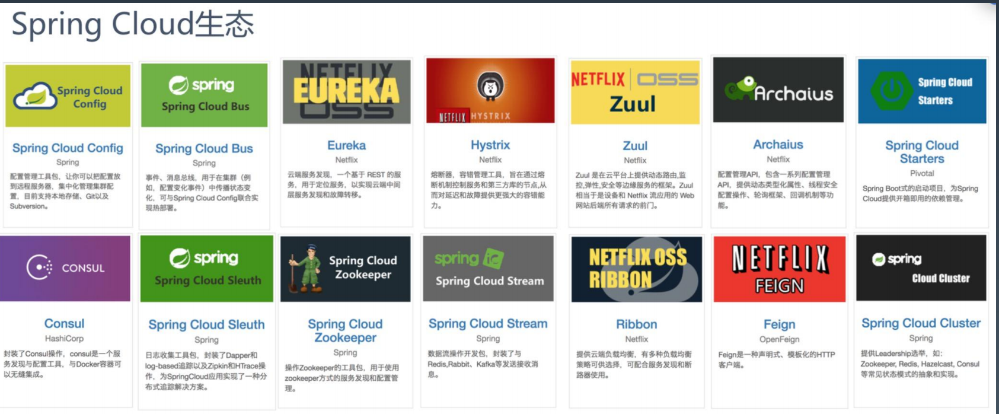
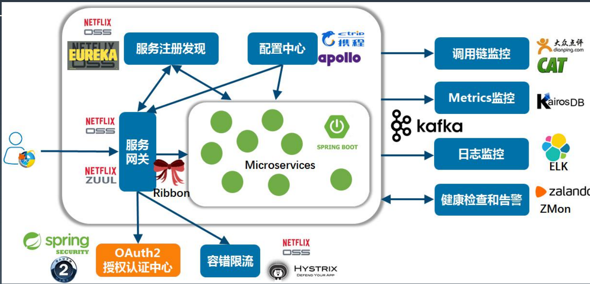
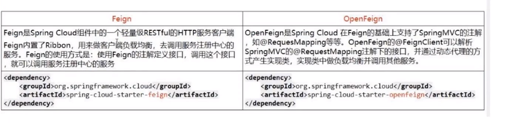
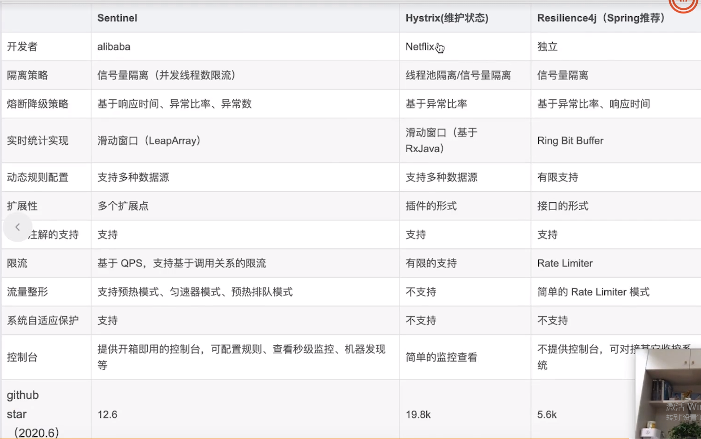
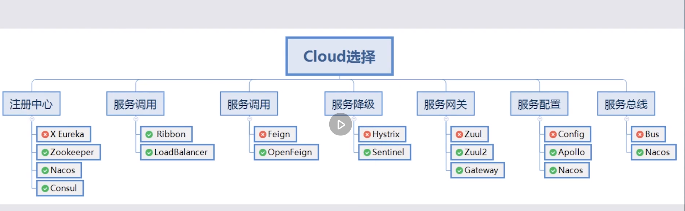
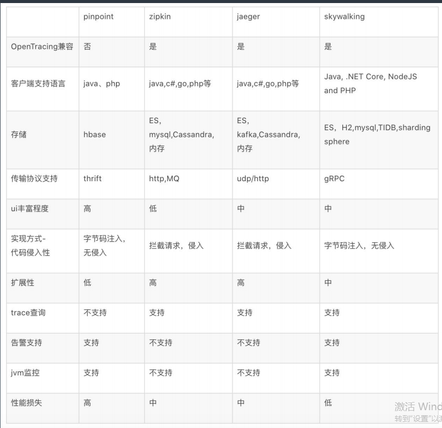

# Spring Cloud与微服务架构 

# 一. 微服务的发展历程

> 单体架构 -> 垂直架构 -> SOA架构 -> 微服务架构

## 微服务发展趋势 : 

## 1. 响应式微服务

响应式编程是一个专注于数据流和变化传递的异步编程范式.

响应式宣言 : 
- 消息驱动
- 即时响应性(系统任何情况下都要对输入进行响应)
- 可恢复性(当机器性能出现问题,通过增加机器或者其他方式解决之后,系统可以恢复对外提供能力)
- 弹性(节点是无状态的,可以进行横向扩容)

## 2. 服务网格与云原生

云原生 : 微服务 + 容器化 + 持续交付 + Devops

基于容器做微服务,使用Devops方式开发运维,工作进行持续交付.

## 3. 数据库网格

## 4. 单元化架构

每一个单元中是一组微服务 , 每一个单元只处理一部分流量 , 可以认为是整个系统的缩小版 , 每个机房部署多个单元

## 5. 名词解释
- istio : service mesh的实施标准
- k8s : 容器编排的实施标准

# 二. 微服务架构应用场景 
- 在复杂度低的去情况下,生产力比单体架构低 , 复杂度高了之后则相反.
- 大规模复杂业务系统的架构升级和中台建设

## 常用场景 : 

#### 1. 遗留系统改造  ,流程如下
(1) 功能剥离,数据解耦 : 数据库拆分
(2) 自然演进,逐步拆分 : 结合业务场景,是否需要做这个事情
(3) 小步快跑,快速迭代
(4) 灰度发布,谨慎试错
(5) 提质量线,还技术债

#### 2. 恰当的粒度拆分

拆分原则 : 高内聚低耦合 , **不同阶段拆分要点不同**

#### 3.  扩展立方体
(1) 水平复制 : 复制系统
(2) 功能解耦 : 拆分业务
(3) 数据分区 : 切分数据

> 以上实际上就是单元化架构的基础 , 并且在进行微服务化的时候要注意设计特性开关(同时新老流量并行,增加开关出现问题可以进行新老流量切换),将损失降到最低.

> 容错设计 :  https://zhuanlan.zhihu.com/p/31972018

#### 4.  自动化管理

#### 5.分布式事务
幂等 , 去重 ,补偿
慎用分布式事务

#### 6.完善监控体系

(1) 技术指标监控(cpu+网络+磁盘) + 业务指标监控(与业务逻辑相关的)

(2) 容量规划 : 系统水位是多少,可以据此设置报警参数

(3) 报警预警 : 

(4) 运维流程 : 上线过程中出现任何异常立刻回滚,保留环境,线下处理

(5) 故障处理 : 定时复盘

# 三. Spring Cloud 生态: 微服务的技术解决方案
## 1.SpringCloud生态

## 2.一套微服务的例子

## 3.具体介绍 : 

#### (1)配置中心和服务注册发现 

组件 : Config/Eureka/Consul  配置中心/注册中心

#### (2) 服务网关 : 

组件 : Zuul/Zuul2/Spring Cloud Gateway  Soul

- Zuul : 基于BIO
- Zuul2/Spring Cloud Gateway : 基于NIO
- Soul : 可视化操作 , 可以集成各种框架和微服务
#### (3) 客户端熔断限流

组件 : Feign/Ribbon

Feign作为http客户端访问rest服务接口 , 优势 : 
- 全都基于注解,简单方便
- 和XXTemplate一样,内置了简化操作,OOP(面向对象编程 : Object-oriented programming)
- 和其他组件,ribbon,hystric联合使用

Ribbon : 用于云环境的客户端内部通信的(IPC)库, 特性 : 
- 负载均衡
- 容错
- 多协议支持(HTTP/TCP/UDP),特别是异步和反应式下
- 缓存和批处理

Hystric/Alibaba Sentinel : 限流熔断
**限流组件对比 : **

**微服务组件的选择 :** 
https://processon.com/view/5b7d2f1fe4b075b9fe22d3d2

#### (4) APM : 应用性能监控

组件 : Skywalking , Pinpoint , Zipkin , Jaeger

监控 : 
ELK , promethus + Grafana
MQ + 时序数据库(InfluxDB/OpenTSDB)

可观测性分为三点 : 
Logging 日志 : elk
Tracing 跟踪 : opentrace , opencensus , openTelemetry
Metrics 指标

#### (5) 权限控制

核心包含3A, 其他的包含: 资源管理 ,安全加密等
Authc : Authentication , 检查权限,认证
Authz : Authorization , 授权
Audit : 审计

组件 : SpringSecurity , Apache Shiro : 用户身份认证,安全框架

CAS + SSO (CAS 统一认证中心)

#### (6) 数据处理

- 读写分离与高可用HA
- 分库分表Sharding
- -分布式事务DTX
- 数据迁移Migration
- 数据集群扩容Scaling
- 数据操作审计Audit：

#### (7) 网关和通信

- 流量网关与WAF(Nginx/OR/Kong/Apisix)

- 业务网关(Zuul/Zuul2/SCG)

- REST与其他协议(websocket/actor/rsocket/mq...)