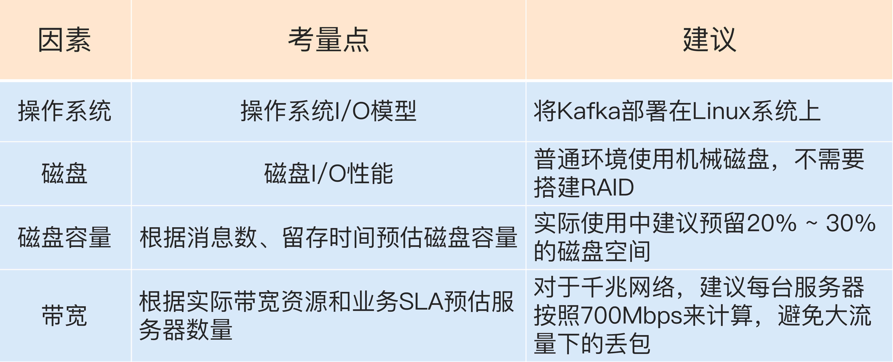

# Kafka

## Kafka 三层消息架构 : 

第一层是主题层，每个主题可以配置 M 个分区，而每个分区又可以配置 N 个副本。

第二层是分区层，每个分区的 N 个副本中只能有一个充当领导者角色，对外提供服务；其他 N-1 个副本是追随者副本，只是提供数据冗余之用。

第三层是消息层，分区中包含若干条消息，每条消息的位移从 0 开始，依次递增。最后，客户端程序只能与分区的领导者副本进行交互。

## 关键术语 : 

消息：Record。Kafka 是消息引擎嘛，这里的消息就是指 Kafka 处理的主要对象。

主题：Topic。主题是承载消息的逻辑容器，在实际使用中多用来区分具体的业务。

分区：Partition。一个有序不变的消息序列。每个主题下可以有多个分区。

消息位移：Offset。表示分区中每条消息的位置信息，是一个单调递增且不变的值。

副本：Replica。Kafka 中同一条消息能够被拷贝到多个地方以提供数据冗余，这些地方就是所谓的副本。副本还分为领导者副本和追随者副本，各自有不同的角色划分。副本是在分区层级下的，即每个分区可配置多个副本实现高可用。

生产者：Producer。向主题发布新消息的应用程序。

消费者：Consumer。从主题订阅新消息的应用程序。

消费者位移：Consumer Offset。表征消费者消费进度，每个消费者都有自己的消费者位移。

消费者组：Consumer Group。多个消费者实例共同组成的一个组，同时消费多个分区以实现高吞吐。

重平衡：Rebalance。消费者组内某个消费者实例挂掉后，其他消费者实例自动重新分配订阅主题分区的过程。Rebalance 是 Kafka 消费者端实现高可用的重要手段。

## 几种 kafka 对比

Apache Kafka，也称社区版 Kafka。优势在于迭代速度快，社区响应度高，使用它可以让你有更高的把控度；缺陷在于仅提供基础核心组件，缺失一些高级的特性。

Confluent Kafka，Confluent 公司提供的 Kafka。优势在于集成了很多高级特性且由 Kafka 原班人马打造，质量上有保证；缺陷在于相关文档资料不全，普及率较低，没有太多可供参考的范例。

CDH/HDP Kafka，大数据云公司提供的 Kafka，内嵌 Apache Kafka。优势在于操作简单，节省运维成本；缺陷在于把控度低，演进速度较慢。

## kafka 部署考量 :

在 Linux 部署 Kafka 能够享受到零拷贝技术所带来的快速数据传输特性。获得更高效的 I/O 性能。

## 集群参数配置

**Broker 端参数 :** 

log.dirs：指定了 Broker 需要使用的若干个文件目录路径。参数没有默认值,必须指定。多个值时候逗号分割.

log.dir：注意这是 dir，结尾没有 s，说明它只能表示单个路径，它是补充上一个参数用的。

**ZooKeeper 相关的设置 :** 

zookeeper.connect : 如果你有两套 Kafka 集群，假设分别叫它们 kafka1 和 kafka2，那么两套集群的zookeeper.connect参数可以这样指定：zk1:2181,zk2:2181,zk3:2181/kafka1和zk1:2181,zk2:2181,zk3:2181/kafka2.切记 chroot 只需要写一次，而且是加到最后的。

**与 Broker 连接相关的**

listeners：学名叫监听器，其实就是告诉外部连接者要通过什么协议访问指定主机名和端口开放的 Kafka 服务。

advertised.listeners：和 listeners 相比多了个 advertised。Advertised 的含义表示宣称的、公布的，就是说这组监听器是 Broker 用于对外发布的。

host.name/port：列出这两个参数就是想说你把它们忘掉吧，压根不要为它们指定值，毕竟都是过期的参数了。

**Topic 管理 :** 

auto.create.topics.enable：是否允许自动创建 Topic。

unclean.leader.election.enable：是否允许 Unclean Leader 选举。如果设置成 false，那么就坚持之前的原则，坚决不能让那些落后太多的副本竞选 Leader。这样做的后果是这个分区就不可用了，因为没有 Leader 了。反之如果是 true，那么 Kafka 允许你从那些“跑得慢”的副本中选一个出来当 Leader。这样做的后果是数据有可能就丢失了，因为这些副本保存的数据本来就不全

auto.leader.rebalance.enable：是否允许定期进行 Leader 选举。严格来说它与上一个参数中 Leader 选举的最大不同在于，它不是选 Leader，而是换 Leader！比如 Leader A 一直表现得很好，但若auto.leader.rebalance.enable=true，那么有可能一段时间后 Leader A 就要被强行卸任换成 Leader B。你要知道换一次 Leader 代价很高的，原本向 A 发送请求的所有客户端都要切换成向 B 发送请求，而且这种换 Leader 本质上没有任何性能收益，因此我建议你在生产环境中把这个参数设置成 false。

**数据留存 :** 

log.retention.{hours|minutes|ms}：这是个“三兄弟”，都是控制一条消息数据被保存多长时间。从优先级上来说 ms 设置最高、minutes 次之、hours 最低。

log.retention.bytes：这是指定 Broker 为消息保存的总磁盘容量大小。

message.max.bytes：控制 Broker 能够接收的最大消息大小。

**Topic 级别参数** : 同时存在时候Topic 级别参数会覆盖全局 Broker 参数的值

retention.ms：规定了该 Topic 消息被保存的时长。默认是 7 天，即该 Topic 只保存最近 7 天的消息。一旦设置了这个值，它会覆盖掉 Broker 端的全局参数值。

retention.bytes：规定了要为该 Topic 预留多大的磁盘空间。和全局参数作用相似，这个值通常在多租户的 Kafka 集群中会有用武之地。当前默认值是 -1，表示可以无限使用磁盘空间。

max.message.bytes : 与message.max.bytes 参数的作用是一样的，只不过 max.message.bytes 是作用于某个 topic，而 message.max.bytes 是作用于全局。

**JVM 参数**

Java 7 : 

如果 Broker 所在机器的 CPU 资源非常充裕，建议使用 CMS 收集器。启用方法是指定-XX:+UseCurrentMarkSweepGC。

否则，使用吞吐量收集器。开启方法是指定-XX:+UseParallelGC。

Java 8 : 使用 G1 收集器

KAFKA_HEAP_OPTS：指定堆大小。

KAFKA_JVM_PERFORMANCE_OPTS：指定 GC 参数。

**操作系统参数**

文件描述符限制 : ulimit -n 1000000

