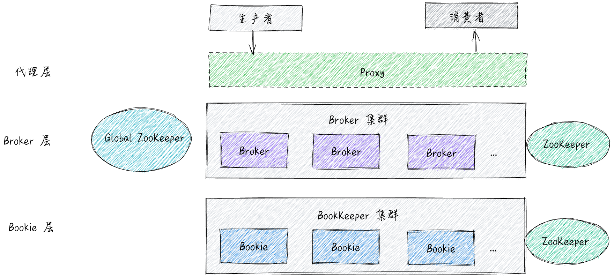

# 认识 Pulsar

## Pulsar 背景

### 为什么需要消息队列?

随着互联网的告诉发展,用户规模与业务并发量开始急剧增加,海量的请求需要接收和存储,业务需要中间件来实现削峰填谷;业务也在不断发展,企业内部的系统数量也在不断地增长,不同语言开发出来的系统需要统一的事件驱动.进而导致越来越多的场景离不开消息队列.

### 为什么需要 Pulsar ?

我们知道,现有的消息队列已经非常成熟了,像 Kafka,RabbitMQ 等已经可以满足日常的业务需求,为什么还需要pulsar这个消息队列那?

这里主要包括以下几点 : 

1. 天然支持云原生 : 
   Pulsar 是计算与存储分离的架构,天然适配云原生的环境.目前基于 Kubernetes 的生态,已经成为事实上的云原生的标准,借助Kubernetes的动态伸缩能力,企业可以更好的管理计算资源,降低成本,提高效率.而对于无状态的服务,移植到云原生环境是容易的,但传统的消息队列在设计的时候并没有考虑云原生的情况,大多是有状态的.因此,传统的消息队列的运维成本相对较高,在适配云原生的问题上,需要研发人员投入一定的时间.

2. 支持多租户和海量的 topic : 
    Pulsar 天然支持多租户,每个租户下还支持多 NameSpance,非常适合做共享大集群,便于维护.此外,Pulsar 天然支持租户之间资源的逻辑隔离,防止互相干扰,还能实现大集群资源的充分利用.

3. 可靠性与性能 : 
    现有的消息队列给人一种惯性思维,如果一个消息队列的消息是可靠的,那么他的性能一定很差,因为同步刷盘,数据同步等会消耗时间.而 Pulsar 做到了可靠消息与性能的平衡.即使在很高吞吐量的场景下,也能保证消息的可靠性.

4. 低延迟 : 

​		很多业务对消息的延迟有很高的要求,现有的消息队列要么延迟很小但吞吐量低,要么延迟很大但吞吐量不高,而 Pulsar 是一个两者兼得的消息队列.

5. 高可用的分布式消息队列 : 

​	pulsar 是真正意义上的分布式消息队列,自带了各种容灾方案.我们可以根据不同的业务 RTO,RPO 来决定使用哪一种.例如 异步跨地域复制可以实现两个集群之间的主被复制,互备复制.

6. 轻量函数式计算

​	可以使用函数来创建复杂的处理逻辑,无需部署单独的处理系统.

7. 流批一体

8. 多协议 :

​	除了支持自己的通信协议,还支持其他消息队列的协议,比如 Kafka 协议的 KOP,AMOP,MQTT 协议等.

9. 功能丰富 : 

​	延迟队列 ,死信队列,顺序消息,主题压缩,多租户,认证授权,分层存储(冷热分离),跨地域复制等.

## Pulsar 总体介绍

Pulsar 服务端的基本结构可以分为三层,分别是代理层,Broker 层和 Bookie 层.

代理层 : 代理层不是必须的,如果没有代理层,那么生产者/消费者会直接与每个要生产/消费的 Broker 建立一个连接.

Broker 层 : Broker 和一半的 MQ 不同,数据并不直接存储在 Broker 中,而是保存在最下面的 Bookeeper 集群中,由于 Broker 是无状态的没所以它很方便的在容器环境中快速扩/缩容. Broker 主要负责整个 Pulsar 的业务逻辑,Bookeeper 只负责数据的存储.

Bookeeper 层 : Bookeeper 是一个可扩展,容错,低延迟,只可追加数据的存储服务.他不包含任何业务逻辑,,我们可以把它看做数据库.

Zookeeper : Broker 和 Bookeeper 都会用到 Zookeeper,Broker 主要用它存储元数据,选主,使用它的分布式锁,Bookeeper 使用场景也类似.

GlobalZookeeper : 用于多个集群之间互相通信的场景,例如跨地域复制等.

## 相关名词解释 : 

多租户 : 多租户是一种单个软件实例可以为多个不同用户组提供服务的软件架构。

RTO : (Recovery Time Objective) 恢复时间目标 , 是持续时间和服务级别，在此期间业务流程必须在灾难后恢复以避免与连续性中断相关的不可接受的后果.

RPO : (Recovery Point Objective) 恢复点目标 , 描述了在中断期间丢失的数据量超过业务连续性计划的最大允许阈值或“容限”之前可能经过的时间间隔。

