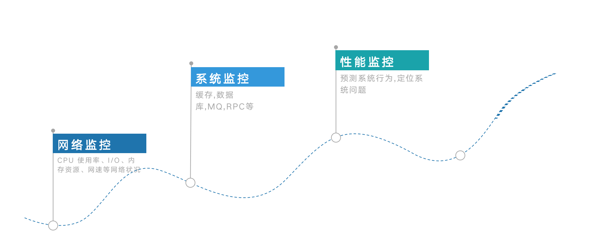
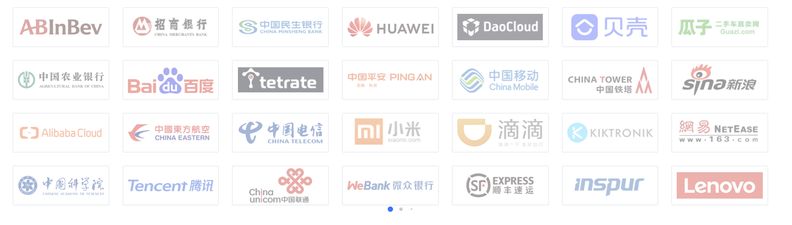

# APM概述

# 一. APM到底是什么

首先,先说明一下APM到底是什么.APM(ApplicationPerformance Management)，即应用性能管理.顾名思义,是你应用程序性能的管理员.

那么,为什么现在越来越看重APM了那?随着互联网行业的兴起,互联网产品的竞争越来越激烈.互联网经历了一次又一次的变革.从最初的单体架构,到多层架构,从单机服务到微服务架构,再到现在的中台架构.应用程序的运行环境边的越来越复杂,这也直接导致了在进行故障定位,数据统计,性能优化等问题的成本也就越来越高,运维人员可开发人员的压力越来越大.

对于每一个互联网从事人员,相信对于报警都不陌生,但是真正让我们恐惧的可能是收到报警之后竟不知如何排查.于是APM系统也就应运而生了.

# 二.APM的发展

从下图中可以看出,APM的发展大体可以分为三个阶段 : 

- 首先是最初的网络监控阶段,在这个阶段主要是基于SNMP（简单网络管理协议）的网络监控和系统（主要指操作系统）监控,这个时候的网络环境还相对简单.
- 接下来随着互联网行业的发展,我们对于系统监控也越来越重视,希望能够对于使用的中间件等其他第三方组件进行监控
- 随着微服务的兴起,网络环境的复杂度陡升,系统被拆分成一个个的模块,按照集群的方式进行部署,这个时候对于监控的需求更加强烈,并且不仅停留在监控上面,还希望能够通过APM系统帮助我们定位问题,预测问题.

# 三.业内流行的APM软件

目前主要流行的APM系统有 : 
- 开源 : 美团开源的 CAT、Twitter 开源的 Zipkin、韩国开源的 Pinpoint 以及 SkyWalking.
  - CAT : 补充简介,github地址
  - Zipkin : 补充简介,github地址
  - Pinpoint : 补充简介,github地址
  - Skywalking : 补充简介,github地址
- 商业 : OneAPM  , 听云 , 博睿[等](https://www.iyiou.com/news/2016030124764)
- 未开源 : 淘宝鹰眼、Google Dapper等.

# 四.APM这么多那么应该如何选择那?

当然,既然这个系列主要介绍的是skywalking,那么肯定要选择skywalking啦~但是为什么要选择skywalking那?

第一, 它是基于OpenTracing规范(关于OpenTraceing规范,我们会在下面详细说明),专门为基于云的基于容器的分布式系统而设计.

第二, 目前基本上为人所知的互联网公司或多或少都有使用skywalking来进行监控或者其他功能.在下图截取了官方提供的目前使用的公司部分截图.

第三, skywalking是国人在2017年年底加入apache孵化器,并且在2019年年初成功毕业,成为apache顶级项目.并且社区活跃,增长势头强劲.学习障碍较低.

第四, skywalking的架构的可插拔性非常强,主要是体现在使用和架构上.
- 在架构上,像DataCarry模块,skywalking中用其进行数据的发送,由于其封装非常好,完全可以作为一个独立的模块在其他项目中单独使用.
- 在使用中,采用JavaAgent字节码增强技术,所有插件都存在于第三方目录下,可以通过移动目录结构快速实现插件的插拔.

第五, skywalking生态十分丰富,对于多语言支持非常良好,目前支持语言包括:Java,NodeJs,Python,JavaScript,Nginx[等](http://skywalking.apache.org/docs/),对于Java支持的组件也是非丰富,并且扩展非常简单,目前支持的插件涵盖Java的大部分中间件,例如:Dubbo,Sofa,Kafka,Http[等](https://skywalking.apache.org/docs/main/v8.5.0/en/setup/service-agent/java-agent/plugin-list/#skywalking-agent-list)

