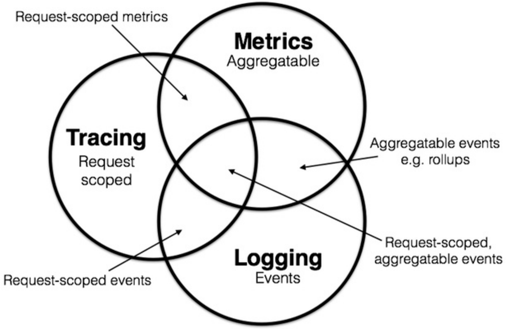

# 开源协议以及Skywalking概述
## 一.监控指标概述

Logging
Metrics
Tracing
## 二. OpenTrace 

https://wu-sheng.gitbooks.io/opentracing-io/content/

https://mp.weixin.qq.com/s?__biz=MzAxMTQ2NTA1Mg==&mid=2247487700&idx=1&sn=91dd1840afd849790cac0e118ec6b221&chksm=9b41e8e7ac3661f179e488f7705cb212a99cb262e7aa1570f923a87de22911f937d656ad6792&scene=21#wechat_redirect

## 三. Skywalking相关概念

## 四. Skywalking架构设置