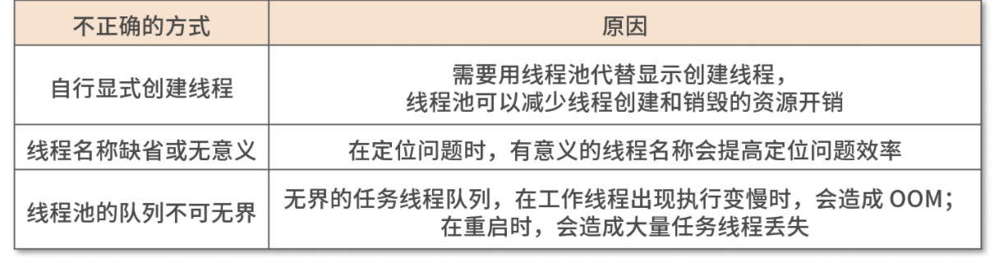
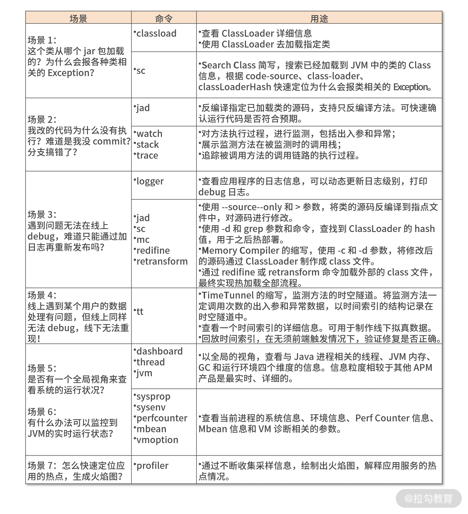

# Skywalking

## 一.文档总结 : 

#### 1. [插件开发指南详情](https://github.com/apache/skywalking/blob/master/docs/en/guides/Java-Plugin-Development-Guide.md)

#### 2. [OAL 脚本详情](https://github.com/apache/skywalking/blob/master/docs/en/concepts-and-designs/oal.md)

#### 3. [自定义指标](https://github.com/apache/skywalking/blob/8.3.0/docs-hotfix/docs/en/setup/service-agent/java-agent/Application-toolkit-meter.md)

#### 4.skywalking 需要额外下载的文件 : 

| 文件名                           | 文件位置                                                     | 下载git地址                                                | 简介            |
| -------------------------------- | ------------------------------------------------------------ | ---------------------------------------------------------- | --------------- |
| query-graphql-plugin             | skywalking/oap-server/server-query-plugin/query-graphql-plugin/src/main/resources/ | git@github.com:apache/skywalking-query-protocol.git        | graphql配置文件 |
| skywalking-rocketbot-ui          | skywalking                                                   | git@github.com:apache/skywalking-rocketbot-ui.git          | 前端代码        |
| skywalking-data-collect-protocol | skywalking/apm-protocol/apm-network/src/main/                | git@github.com:apache/skywalking-data-collect-protocol.git | grpc协议        |

# Skywalking

## 一.文档总结 : 

#### 1. [插件开发指南详情](https://github.com/apache/skywalking/blob/master/docs/en/guides/Java-Plugin-Development-Guide.md)

#### 2. [OAL 脚本详情](https://github.com/apache/skywalking/blob/master/docs/en/concepts-and-designs/oal.md)

#### 3. [自定义指标](https://github.com/apache/skywalking/blob/8.3.0/docs-hotfix/docs/en/setup/service-agent/java-agent/Application-toolkit-meter.md)

# 二.相关文档链接

- [原理讲解](https://my.oschina.net/u/4418565/blog/4653959)

skywalking学习 ： 

https://kaiwu.lagou.com/course/courseInfo.htm?courseId=50&sid=20-h5Url-0#/sale

skywalking相关问题 ： 

\1. 集群级别的插件开启  ， 核心组件全采样 ， 其余组件 ， 按需开启 ， 将组建按照重要程度进行排序 ： 核心 ，我们采集了很多不重要的数据

\2. 接口 入参， 返回值 等安全问题 。 需要带上 SkyWalking 和信息安全功能的功能配置，与安全组进行信息拉齐，在整体通过安全组审核后，才可以将应用 APM 数据的展示配置开放给业务线 。 

**线程优化 ：** 

1.为什么要进行线程优化？

从软件资源角度：Java 进程内是通过多线程技术处理完成消费者请求，多线程需要调用 JVM 资源，而 JVM 资源又需要 GC 来持续维护可用。从应用视角看，线程的优化可以优化 JVM 资源，从而减少 GC。

从硬件资源角度：每个节点有线程上限，过多的线程会影响 CPU 的并行度，而节省进程就是节省资源，这样可以实现一个节点资源运行多个进程，降低硬件成本。

从可用性角度：非预期的 GC 导致应用节点不能按照预期响应消费者，造成应用服务不可用。

\2. 使用线程的正确姿势

3.正确使用方式

使用线程池去管理线程；

线程的命名需要有意义；

任务线程的数量需要与工作线程挂钩，且需要考虑极端情况，如故障重启

\4. 优化实战

1）数量优化

第一种，框架使用线程池的方式显然就不合理 ， 可以根据高峰和一定的未来预估来适当缩小线程池，并且考虑将线程池类型由 Fixed 改为 Cache，实现减少项目的启动时间和不必要的线程池数量。

第二种，主要会在公司使用 IDC 机房，采取物理机多进程混合部署的方式，会存在线程滥用过多的情况。

2）体积优化

对单个线程的体积进行优化，根据国内 Java 进程线上运行的现状，基本都是在使用 Java 6 以上版本和在 64 位的操作系统上运行。线程栈默认大小为 1M ，可以适当缩小线程栈到 512k 以下

**Arthas 的核心应用场景如下。学习 ：** 命令+场景+原理

场景 1：这个类从哪个 jar 包加载的？为什么会报各种类相关的 Exception？

场景 2：我改的代码为什么没有执行？难道是我没 commit？分支搞错了？

场景 3：遇到问题无法在线上 debug，难道只能通过加日志再重新发布吗？

场景 4：线上遇到某个用户的数据处理有问题，但线上同样无法 debug，线下无法重现！

场景 5：是否有一个全局视角来查看系统的运行状况？

场景 6：有什么办法可以监控到 JVM 的实时运行状态？

场景 7：怎么快速定位应用的热点，生成火焰图？

1.通过实操，熟悉命令 , 按照四个分类：基础命令、系统命令、类命令和增强命令，将这些命令通通实操一遍，对 Arthas 命令有个全局的感性认知。

https://arthas.aliyun.com/doc/

2.深入场景，进行诊断

visualvm **使用**

**skywalking线程模型**

在使用线程池链路跟踪时候，拦截的线程分为工作线程和任务线程，应该拦截的是任务线程，如果拦截工作线程，由于工作线程一直不退出，可能会出现内存泄漏的问题。

skywalking。 学习路径。 

搭建demo

skywalking

agent配置优先级。 探针配置，jvm配置，系统变量，config配置

可以尝试。加一个brief面板，看到接入服务数量

endpoint监控展示问题

java的代理

**下载子模块代码**

git submodule init

git submodule update

**学习源码**

了解项目，部署Demo，运行项目功能，

查看项目中用到的技术栈，对技术栈进行简单了解，初步应用

准备远源码阅读环境

熟悉项目模块，模块划分，职责，确定要学习哪一部分

**Java Proxy**

Java Proxy 是 JDK 自带的一个代理工具，它允许为实现了一系列接口的类生成代理类。Java Proxy 要求目标类必须实现接口是一个非常大限制，例如，在某些场景中，目标类没有实现任何接口且无法修改目标类的代码实现，Java Proxy 就无法对其进行扩展和增强了。

**CGLIB**

CGLIB 诞生于 Java 初期，但不幸的是没有跟上 Java 平台的发展。虽然 CGLIB 本身是一个相当强大的库，但也变得越来越复杂。鉴于此，导致许多用户放弃了 CGLIB 。

**Javassist**

Javassist 的使用对 Java 开发者来说是非常友好的，它使用Java 源代码字符串和 Javassist 提供的一些简单 API ，共同拼凑出用户想要的 Java 类，Javassist 自带一个编译器，拼凑好的 Java 类在程序运行时会被编译成为字节码并加载到 JVM 中。Javassist 库简单易用，而且使用 Java 语法构建类与平时写 Java 代码类似，但是 Javassist 编译器在性能上比不了 Javac 编译器，而且在动态组合字符串以实现比较复杂的逻辑时容易出错。

**Byte Buddy**

Byte Buddy 提供了一种非常灵活且强大的领域特定语言，通过编写简单的 Java 代码即可创建自定义的运行时类。与此同时，Byte Buddy 还具有非常开放的定制性，能够应付不同复杂度的需求。

Byte Buddy 动态增强代码总共有三种方式：

subclass：对应 ByteBuddy.subclass() 方法。这种方式比较好理解，就是为目标类（即被增强的类）生成一个子类，在子类方法中插入动态代码。

rebasing：对应 ByteBuddy.rebasing() 方法。当使用 rebasing 方式增强一个类时，Byte Buddy 保存目标类中所有方法的实现，也就是说，当 Byte Buddy 遇到冲突的字段或方法时，会将原来的字段或方法实现复制到具有兼容签名的重新命名的私有方法中，而不会抛弃这些字段和方法实现。从而达到不丢失实现的目的。这些重命名的方法可以继续通过重命名后的名称进行调用。

redefinition：对应 ByteBuddy.redefine() 方法。当重定义一个类时，Byte Buddy 可以对一个已有的类添加属性和方法，或者删除已经存在的方法实现。如果使用其他的方法实现替换已经存在的方法实现，则原来存在的方法实现就会消失。

通过上述三种方式完成类的增强之后，我们得到的是 DynamicType.Unloaded 对象，表示的是一个未加载的类型，我们可以使用 ClassLoadingStrategy 加载此类型。

WRAPPER 策略：创建一个新的 ClassLoader 来加载动态生成的类型。

CHILD_FIRST 策略：创建一个子类优先加载的 ClassLoader，即打破了双亲委派模型。

INJECTION 策略：使用反射将动态生成的类型直接注入到当前 ClassLoader 中。

枚举实现单例，可以避免反射导致的重复构建实例

