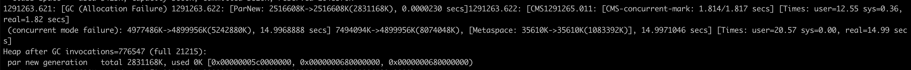

# 一. 故障排查

## 1.故障定义 : 
影响业务功能：比如在电商系统中，用户无法使用“购买”功能了，这就是已经影响到关键功能了。所以我们根据业务功能，评估出问题的重要程度。

影响人群：影响到哪些人群？这些人群的标签是什么？比如新用户、某个地区的用户等。

损失预估：根据日活或交易数据评出损失，从而警醒开发人员在设计方案，以及测试人员测试时，能增加相应资源。

影响时长：问题持续时间越长，需要投入的资源也就越多。

影响范围：通过监控系统的拓扑功能，确认影响范围，从而发现潜在服务集群的瓶颈。

## 2.故障分类 : 
设计类 : 机构设计 , 技术方案 , 代码不够鲁棒,测试不到位
资源类 : 硬件故障 ,运营商故障,软件故障
变更类 : 基础配置变更 , 操作不规范 , 第三方操作变更(SRE操作,运维任务)

## 3.故障处理 : 
保留现场 , 回滚,重启,扩容

## 4.故障定位 : 
环境变更：随着业务体量的发展或缩减，避免不了对应用服务所部署的硬件环境进行调整，比如为了给应用服务更高的算力，将应用服务迁移到更高配置的机器上。
我曾遇到过由于扩容节点，新节点使用的 JCE 环境导致代码调用 AES 加密方法失败。环境变更问题让 SRE 去完成原因定位是最合适的。不过解决问题很简单，将新节点流量摘掉即可止损。

代码变更：需求所导致的每次代码变更都要明确上一次稳定版本的版本号，若上线内容只包括代码变更，且变更后就发生问题，那项目组相关 RD 便可以执行“快速回滚”操作。

配置变更：一线开发为了应用服务有更好的灵活性，都会将一些判断的代码通过配置去实现。比如某些功能开放给哪些地区，通过配置中心如 Apollo，在变更配置导致故障发生时，可以使用“回滚配置”完成止损。

数据变更：数据变更的故障定位和修复，我认为是最难的。首先在重大变更时，我们会备份影响关键数据表。在变更后，数据变更往往伴随着代码变更，若出现线上问题，及时进行了回表等相关操作，还是会有脏数据产生。这时为了最保险起见，建议开发一些需求外的数据修复小工具，确保脏数据的修复。

# 二.线上故障总结
## 1. 项目启动脚本上线之后出现语法错误,排查修改的代码没有找到问题

原因 : 脚本中出现 ^M , 在windows会被解析为换行,原来被注释的代码出现了这个符号 , 本地编辑之后直接上传,导致应该被注释的代码没有被注释,进而导致脚本执行错误.

避免 : 上线前进行测试,对于功能进行测试,尤其是这种语法问题,更要在线上严格避免,对于脚本windows和Linux下会有不同效果的更要谨慎.

## 2. 数据回写问题
问题描述 : 在项目中为了避免数据频繁读取,加入了一层缓存,同时由于数据库中存在历史数据,需要启动一个定时任务进行历史数据删除,在设计缓存的时候,缓存如果未命中会在数据库中查找.并且定时将缓存的数据写入数据库,于是出现一个问题,即使定时任务把历史数据删除了,缓存在写入时候仍然会把历史数据写回数据库,出现删除失败问题.

问题解决 : 采用双缓存策略,读写缓存拆分.
当有数据上报时候,这部分数据是需要定时写入数据库的,将这部分数据加入到写缓存中,设置过期时间.
当访问时候,会访问读缓存,读缓存未命中时候在数据库中拉取数据,该缓存数据不会写入数据库.

## 3. GC相关问题
gc 时间
https://cloud.tencent.com/developer/article/1491229
https://blog.csdn.net/varyall/article/details/80044132

1. 线上机器出现线程不执行情况
2. 查看gc日志，发现出现gc分配内存不足，导致stop the world

