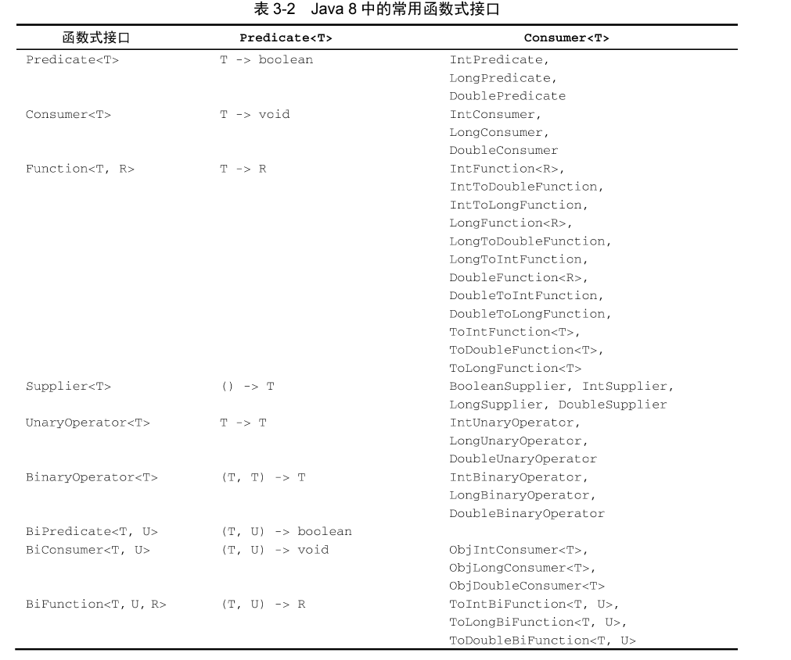
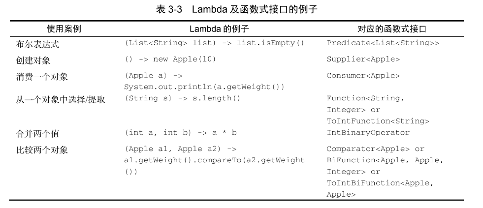

# 第一部分 - 基础知识


## 第一章  Java 的变化
Collection 主要是为了存储和访问数据,Stream 则主要用于描述对数据的计算

## 第二章 通过行为参数化传递代码


## 第三章 Lambda 表达式

### 1. 使用函数式接口

#### 1.1 Predicate
`Predicate` 接口定义了一个名叫`test`的抽象方案,接收泛型`T`对象,并返回一个`boolean`.

```java
	/**
	 * 按照传入函数的条件执行 filter 操作
	 *
	 * @param inventory
	 * @param condition
	 * @param <T>
	 * @return
	 */
	public static <T> List<T> filter(List<T> inventory, Predicate<T> condition) {
		return inventory.stream().filter(condition).collect(Collectors.toList());
	}

	@Test
	public void demoPredicate1() {
		/*
			使用该方式会省去装箱,拆箱的操作 :
			DoublePredicate、IntConsumer、LongBinaryOperator、IntFunction
		 */
		IntPredicate evenNumbers = (int i) -> i % 2 == 0;
		assertTrue(evenNumbers.test(12));
		assertFalse(evenNumbers.test(13));
	}

	@Test
	public void demoPredicate2() {
		/*
			使用该方式会省去装箱,拆箱的操作 :
			ToIntFunction、IntToDoubleFunction
		 */
		ToIntFunction<String> function = (info) -> -1;
		assertEquals(function.applyAsInt("aa"), -1);
	}
```

#### 1.2 Consumer
`Consumer` 接口定义了一个名叫`accept`的抽象方案,接收泛型`T`对象,没有返回值.

```java
	/**
	 * 遍历一个 list 并且执行指定操作
	 * @param inventory
	 * @param consumer
	 * @param <T>
	 */
	public static <T> void foreach(List<T> inventory, Consumer<T> consumer) {
		inventory.forEach(consumer);
	}
```

#### 1.3 Function
`Function` 接口定义了一个名叫`apply`的抽象方案,接收泛型`T`对象,并返回一个泛型`R`


```java
	/**
	 * 遍历 list 进行元素转换操作
	 * @param inventory
	 * @param function
	 * @param <T>
	 * @param <R>
	 * @return
	 */
	public static <T, R> List<R> map(List<T> inventory, Function<T, R> function) {
		return inventory
				.stream()
				.map(function)
				.collect(Collectors.toList());
	}
```

#### 1.4 Java 8 常用的函数式接口列表



#### 1.5 示例




### 2. 为什么 Lambda 会限制访问变量
- 第一，实例变量和局部变量背后的实现有一个关键不同。实例变量都存储在堆中，局部变量则保存在栈上。如果 Lambda 可以直接访问局部变量，而且 Lambda 是在一个线程中使用的，则使用 Lambda 的线程，可能会在分配该变量的线程将这个变量收回之后，去访问该变量。因此，Java 在访问自由局部变量时，实际上是在访问它的副本，而不是访问基本变量。如果局部变量仅仅赋值一次那就没有什么区别了,如果赋值多次,访问的数据就会有所不同,所以有了这个限制.
- 第二，这一限制不鼓励你使用改变外部变量的典型命令式编程模式

### 3. 复合 Lambda 表达式的使用
#### 3.1 比较器复合
```java
	public static void sort(List<Apple> apples) {
		// 对于苹果按照重量排序
		apples.sort(Comparator.comparing(Apple::getWeight)
				// 翻转
				.reversed()
				// 相同值时如何比较
				.thenComparing(Apple::getColor));
	}
```

#### 3.2 谓词复合

```java
	@Test
	public void demoPredicate3() {
		List<Demo1.Apple> apples = new ArrayList<>();

		/*
			and 和 or 方法是按照在表达式链中的位置，从左向右确定优先级的
			a.or(b).and(c)可以看作(a || b) && c。同样，a.and(b).or(c) 可以看作(a && b) || c
		 */
		Predicate<Demo1.Apple> red = (apple) -> apple.getColor() == Demo1.Color.RED;
		// 非
		Predicate<Demo1.Apple> notRed = red.negate();
		// and
		Predicate<Demo1.Apple> redAndHeavy = red.and(apple -> apple.getWeight() > 150);
		// or
		Predicate<Demo1.Apple> redAndHeavyOrGreen = red
				.and(apple -> apple.getWeight() > 150)
				.or(apple -> apple.getColor() == Demo1.Color.GREEN);

	}
```


#### 3.3. 函数复合

```java
	@Test
	public void functionTest1() {
		Function<Integer, Integer> f = x -> x + 1;
		Function<Integer, Integer> g = x -> x * 2;
		/*
			compose : f(g(x))
			andThen : g(f(x))
		 */
		Function<Integer, Integer> h1 = f.compose(g);
		Function<Integer, Integer> h2 = f.andThen(g);
		System.out.println(h1.apply(12));
		System.out.println(h2.apply(12));
	}
```

