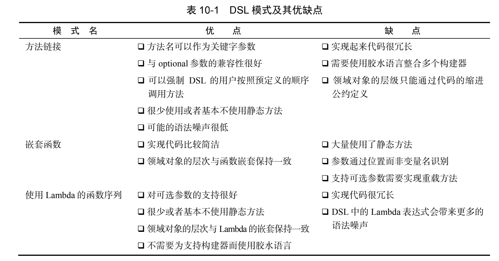

# 第三部分 使用流和 Lambda 进行高效编程

## 第八章 Collection API 的增强功能

```java
public class FactoryDemo {
	/**
	 * JDK 9+
	 */
	public static void demo1() {
		{
			List<String> friends = List.of("Raphael", "Olivia", "Thibaut");
		}
		{
			Set<String> friends = Set.of("Raphael", "Olivia", "Thibaut");
			System.out.println(friends);
		}
		{
			Map<String, Integer> ageOfFriends = Map.of("Raphael", 30, "Olivia", 25, "Thibaut", 26);
			System.out.println(ageOfFriends);
		}
		{
			Map<String, Integer> ageOfFriends = Map.ofEntries(entry("Raphael", 30), entry("Olivia", 25), entry("Thibaut", 26));
			System.out.println(ageOfFriends);
		}
	}

	public static void demo2() {
		{
			List<String> friends = Stream.of("Raphael", "Olivia", "Thibaut").collect(Collectors.toList());
			friends.removeIf("Thibaut"::equals);
			System.out.println(friends);
			friends.replaceAll(String::toLowerCase);
			System.out.println(friends);
		}

		{
			Map<String, Integer> ageOfFriends = Map.ofEntries(entry("Raphael", 30), entry("Olivia", 25), entry("Thibaut", 26));
			ageOfFriends.forEach((k, v) -> System.out.println(k + " " + v));
			System.out.println("------------------");
			ageOfFriends.entrySet().stream()
					.sorted(Map.Entry.comparingByValue())
					.forEachOrdered(System.out::println);
		}
	}

	public static void demo3(List<String> lines) {
		Map<String, byte[]> dataToHash = new HashMap<>(8);
		lines.forEach(line -> dataToHash.computeIfAbsent(line, FactoryDemo::calculateDigest));

		dataToHash.remove("a",new byte[0]);
	}

	private static byte[] calculateDigest(String key) {
		try {
			MessageDigest messageDigest = MessageDigest.getInstance("SHA-256");
			return messageDigest.digest(key.getBytes(StandardCharsets.UTF_8));
		} catch (NoSuchAlgorithmException e) {
			e.printStackTrace();
			return new byte[0];
		}
	}


	public static void main(String[] args) {
		demo1();
		demo2();
	}
}
```

## 第九章 重构,测试和调试

### 9.1 为改善代码的可读性和灵活性重构代码
- 重构代码,用 Lambda 表达式取代匿名类
- 用方法引用重构 Lambda 表达式
- 用 Stream API 重构命令式的数据处理

### 9.2 使用 Lambda 重构面向对象的设计模式
- 策略模式
- 模板方法 
- 观察者模式 : 
- 责任链模式 : 
- 工厂模式 : 

### 9.3 Stream 的调试

```java
public class StreamPeekDemo {

	public static void main(String[] args) {
		/*
			借助 peek 查看流中数据
		 */
		List<Integer> collect = IntStream.rangeClosed(0, 100)
				.peek(x -> System.out.println("map before : " + x))
				.map(x -> x + 17)
				.peek(x -> System.out.println("map after : " + x))
				.filter(x -> x % 2 == 0)
				.peek(x -> System.out.println("filter after : " + x))
				.limit(3)
				.peek(x -> System.out.println("milie after : " + x))
				.boxed()
				.collect(toList());
		System.out.println(collect);
	}
}
```

## 第十章 基于 Lambda 的领域特定语言

### 10.1 领域特定语言 DSL

#### 10.1.1 DSL 的优缺点
**优点 :** 
- 简洁 : DSL 提供的 API 非常贴心的封装了业务逻辑,让你可以避免编写重复的代码,最终你的代码将会非常简洁
- 可读性 : DSL 使用领域中的术语描述功能和行为,让代码的逻辑很容易理解,即使是不懂代码的非领域专家也能轻松上手.由于 DSL 的这个特性,代码和领域知识能在你的组织内无缝的分享与沟通.
- 可维护性 : 构建于设计良好的 DSL 之上的代码既易于维护又便于修改。可维护性对于业务相关的代码尤其重要，因为这部分的代码很可能需要经常变更。
- 高层的抽象性——DSL 中提供的操作与领域中的抽象在同一层次，因此隐藏了那些与领域问题不直接相关的细节。
- 专注——使用专门为表述业务领域规则而设计的语言，可以帮助程序员更专注于代码的某个部分。结果是生产效率得到了提升。
- 关注点隔离——使用专用的语言描述业务逻辑使得与业务相关的代码可以同应用的基础架构代码相分离。以这种方式设计的代码将更容易维护。

**缺点 :** 
- DSL 的设计比较困难——要想用精简有限的语言描述领域知识本身就是件困难的事情。
- 开发代价——向你的代码库中加入 DSL 是一项长期投资，尤其是其启动开销很大，这在项目的早期可能导致进度延迟。此外，DSL 的维护和演化还需要占用额外的工程开销。
- 额外的中间层——DSL 会在额外的一层中封装你的领域模型，这一层的设计应该尽可能地薄，只有这样才能避免带来性能问题。
- 又一门要掌握的语言——当今时代，开发者已经习惯了使用多种语言进行开发。然而，在你的项目中加入新的 DSL 意味着你和你的团队又需要掌握一门新的语言。如果你决定在你的项目中使用多个 DSL 以处理来自不同业务领域的作业，并将它们无缝地整合在一起，那这种代价就更大了，因为 DSL 的演化也是各自独立的。
- 宿主语言的局限性——有些通用型的语言（比如 Java）一向以其烦琐和僵硬而闻名。这些语言使得设计一个用户友好的 DSL 变得相当困难。实际上，构建于这种烦琐语言之上的 DSL 已经受限于其臃肿的语法，使得其代码几乎不具备可读性。好消息是，Java 8 引入的 Lambda 表达式提供了一个强大的新工具可以缓解这个问题。

#### 10.1.2 JVM 中已提供的 DSL 解决方案

##### 10.1.2.1 内部 DSL
**纯 Java 开发的 DSL 优点**

- 学习如何实现一个良好的 DSL 所需的那些模式和技巧，与学习一门新的语言及其工具链，并将其用于开发外部 DSL 比较起来，所花费的精力和时间要少得多。
- 如果你的 DSL 用纯 Java 编写，它就能与其他的代码一起编译。由于不需要集成新的语言编译器或者其他用于生成外部 DSL 的工具，你在编译成本这块不会有任何新增开销。
- 你的开发团队不需要花时间去熟悉新的语言，也不需要去研究那些他们不熟悉的、复杂的外部工具。
- 你 DSL 的用户能够使用跟你一样的集成开发环境，充分利用集成开发环境所提供的所有特性，譬如自动补全、代码重构等。虽然现代 IDE 也在不断地改进它们对别的基于 JVM的流行语言的支持，但是目前为止还没有哪一种语言的支持能达到跟 Java 同等的程度。
- 如果你需要实现多种 DSL 来支撑你领域的多个部分，或者支持多个领域，如果它们都是用纯 Java 编写的，那整合它们不会是一个大问题。

##### 10.1.2.2 多语言 DSL 
Scala 等
##### 10.1.2.3 外部 DSL 
ANTLR

### 10.2 现代 Java API 中的小型DSL

#### 10.2.1 把 Stream API 当成 DSL去操作集合

```java
public class StreamDsl {


	public static List<String> readFile1(String filePath) throws IOException {
		List<String> errors = new ArrayList<>();
		int errorCount = 0;
		BufferedReader bufferedReader = new BufferedReader(new FileReader(filePath));
		String line = bufferedReader.readLine();
		while (errorCount < 40 && line != null) {
			if (line.startsWith("ERROR")) {
				errorCount++;
				errors.add(line);
			}
			line = bufferedReader.readLine();
		}
		return errors;
	}

	public static List<String> readFile2(String filePath) throws IOException {
		return Files.lines(Paths.get(filePath))
				.filter(line -> line.startsWith("ERROR"))
				.limit(40)
				.collect(Collectors.toList());
	}

	public static void main(String[] args) throws IOException {
		String filePath = "/Users/chengzheyan/idea/study/study.bak/java8_util/src/main/resources/aa.log";
//		List<String> list = readFile1(filePath);
		List<String> list = readFile2(filePath);
		list.forEach(System.out::println);

	}
}
```

### 10.3 使用 Java 创建 DSL 的模式和技巧

#### 10.3.1 方法链接
方法链接 : 允许使用单链的方法调用定义一个交易订单

**创建 : **
```java
public class MethodChainingOrderBuilding {
	/**
	 * 构造器封装一个订单对象
	 */
	public final Order order = new Order();

	private MethodChainingOrderBuilding(String customer) {
		order.setCustomer(customer);
	}

	/**
	 * 静态工厂方法,创建订单
	 *
	 * @param customer
	 * @return
	 */
	public static MethodChainingOrderBuilding forCustomer(String customer) {
		return new MethodChainingOrderBuilding(customer);
	}

	/**
	 * 创建一个TradeBuilder,构造一个购买股票的交易
	 *
	 * @param quantity
	 * @return
	 */
	public TradeBuilder buy(int quantity) {
		return new TradeBuilder(this, Trade.Type.BUY, quantity);
	}

	public TradeBuilder sell(int quantity) {
		return new TradeBuilder(this, Trade.Type.SELL, quantity);
	}

	/**
	 * 向订单中添加交易
	 *
	 * @param trade
	 * @return
	 */
	public MethodChainingOrderBuilding addTrade(Trade trade) {
		order.addTrade(trade);
		return this;
	}

	/**
	 * 终止创建订单,并返回
	 *
	 * @return
	 */
	public Order end() {
		return order;
	}
}
```

```java
public class StockBuilder {

	private MethodChainingOrderBuilding building;
	private final Stock stock = new Stock();
	private final Trade trade;

	public StockBuilder(MethodChainingOrderBuilding building, Trade trade, String symbol) {
		this.building = building;
		this.trade = trade;
		stock.setSymbol(symbol);
	}

	public TradeBuilderWithStock on(String market) {
		stock.setMarket(market);
		trade.setStock(stock);
		return new TradeBuilderWithStock(building, trade);

	}
}
```
```java
public class TradeBuilder {
	private final MethodChainingOrderBuilding building;
	public final Trade trade = new Trade();


	public TradeBuilder(MethodChainingOrderBuilding building, Trade.Type type, int quantity) {
		this.building = building;
		trade.setType(type);
		trade.setQuantity(quantity);
	}

	public StockBuilder stock(String symbol) {
		return new StockBuilder(building, trade, symbol);

	}
}

```
```java
public class TradeBuilderWithStock {
	private final MethodChainingOrderBuilding building;
	private final Trade trade;

	public TradeBuilderWithStock(MethodChainingOrderBuilding building, Trade trade) {
		this.building = building;
		this.trade = trade;
	}

	public MethodChainingOrderBuilding at(double price) {
		trade.setPrice(price);
		return building.addTrade(trade);
	}
}
```
**使用 : **
```java
public class Demo {

	public static Order demo1() {
		Stock stock1 = new Stock();
		stock1.setSymbol("IBM");
		stock1.setMarket("NYSE");

		Trade trade1 = new Trade();
		trade1.setType(Trade.Type.BUY);
		trade1.setStock(stock1);
		trade1.setQuantity(80);
		trade1.setPrice(125.0D);

		Stock stock2 = new Stock();
		stock2.setSymbol("GOOGLE");
		stock2.setMarket("NASDAQ");

		Trade trade2 = new Trade();
		trade2.setType(Trade.Type.BUY);
		trade2.setStock(stock2);
		trade2.setQuantity(50);
		trade2.setPrice(375);

		Order order = new Order();
		order.setCustomer("BinBank");
		order.setTradeList(Lists.newArrayList(trade1, trade2));
		return order;
	}

	public static Order demo2() {
		return forCustomer("BigBank")
				.buy(80)
				.stock("IBM")
				.on("NYSE")
				.at(125)
				.sell(50)
				.stock("GOOGLE")
				.on("NASDAQ")
				.at(375)
				.end();
	}

	public static void main(String[] args) {
		System.out.println(demo1());
		System.out.println(demo2());
	}
}
```

#### 10.3.2 使用嵌套函数

嵌套函数 DSL : 使用嵌套于其他函数的函数来生成领域模型


##### 10.3.2.1 优缺点
- 优点 : 领域对象的层次结构由于嵌套包含关系一目了然
- 缺点 : 
  - 该方式包含了大量的圆括号,
  - 传递给静态方法的参数列表必须预先定义好
  - 如果你的领域中的对象存在一些可选字段，那么你需要为那些方法分别实现对应的重载版本
  - 不同参数的意义是由其位置决定的,而不是变量名


##### 10.3.2.2 demo

```java
public class NestedFunctionOrderBuilder {
	public static Order order(String customer, Trade... trades) {
		Order order = new Order();
		order.setCustomer(customer);
		Stream.of(trades).forEach(order::addTrade);
		return order;
	}

	public static Trade buy(Stock stock, double price, int quantity) {
		return buildTrade(Type.BUY, stock, price, quantity);
	}

	public static Trade sell(Stock stock, double price, int quantity) {
		return buildTrade(Type.SELL, stock, price, quantity);
	}

	public static double at(double price) {
		return price;
	}

	public static String on(String market) {
		return market;
	}

	public static Stock stock(String symbol, String market) {
		Stock stock = new Stock();
		stock.setSymbol(symbol);
		stock.setMarket(market);
		return stock;
	}

	private static Trade buildTrade(Type type, Stock stock, double price, int quantity) {
		Trade trade = new Trade();
		trade.setType(type);
		trade.setStock(stock);
		trade.setQuantity(quantity);
		trade.setPrice(price);
		return trade;
	}
}
```

```java
	public static Order demo3() {
		return order("BigMark",
				buy(stock("IBM", on("NYSE")), 125, 80),
				sell(stock("GOOGLE", on("NASDAQ")), 375, 50));
	}
```


#### 10.3.3 使用Lambda 表达式的函数序列

##### 10.3.3.1 优缺点
- 优点 : 
  - 整合了前两种 DSL 风格的优点。它可以像方法链接模式那样以流畅方式定义交易顺序。
  - 通过不同 Lambda 表达式的嵌套层次，它也像嵌套函数的风格那样，保留了领域对象的层次结构

- 缺点 : 
  - 需要编写大量的配置代码
  - DSL 自身也会受到 Java 8 Lambda 表达式语法的干扰。

##### 10.3.3.2 demo

```java
public class LambdaOrderBuilder {
	public final Order order = new Order();

	public static Order order(Consumer<LambdaOrderBuilder> consumer) {
		LambdaOrderBuilder builder = new LambdaOrderBuilder();
		consumer.accept(builder);
		return builder.order;
	}

	public void forConsumer(String consumer) {
		order.setCustomer(consumer);
	}

	public void buy(Consumer<LambdaTradeBuilder> consumer) {
		order.addTrade(trade(consumer, Trade.Type.BUY));
	}

	public void sell(Consumer<LambdaTradeBuilder> consumer) {
		order.addTrade(trade(consumer, Trade.Type.SELL));
	}

	private Trade trade(Consumer<LambdaTradeBuilder> consumer, Trade.Type type) {
		LambdaTradeBuilder lambdaTradeBuilder = new LambdaTradeBuilder();
		lambdaTradeBuilder.trade().setType(type);
		consumer.accept(lambdaTradeBuilder);
		return lambdaTradeBuilder.trade();
	}
}
```

```java
public class LambdaStockBuilder {
	private final Stock stock = new Stock();

	public void symbol(String symbol) {
		stock.setSymbol(symbol);
	}

	public void market(String market) {
		stock.setMarket(market);
	}

	public Stock stock(){
		return stock;
	}
}
```

```java
public class LambdaTradeBuilder {
	private Trade trade = new Trade();

	public void quantity(int quantity) {
		trade.setQuantity(quantity);
	}

	public void price(double price) {
		trade.setPrice(price);
	}

	public void stock(Consumer<LambdaStockBuilder> consumer) {
		LambdaStockBuilder lambdaTradeBuilder = new LambdaStockBuilder();
		consumer.accept(lambdaTradeBuilder);
		trade.setStock(lambdaTradeBuilder.stock());
	}

	public Trade trade(){
		return trade;
	}
}
```

```java
	public static Order demo3() {
		return LambdaOrderBuilder.order(o -> {
			o.forConsumer("BigBank");
			o.buy(t -> {
				t.quantity(80);
				t.price(125);
				t.stock(s -> {
					s.market("NYSE");
					s.symbol("IBM");
				});
			});
			o.sell(t -> {
				t.quantity(50);
				t.price(375);
				t.stock(s -> {
					s.market("NASDAQ");
					s.symbol("GOOGLE");
				});
			});
		});
	}
```


#### 10.3.4 把他们放在一起

##### 10.3.4.1 优缺点
- 优点 : 充分利用各种 DSL 优点
- 缺点 : 最终的 DSL 与单一模式的 DSL 比较起来看上去没那么一致，DSL 的用户很可能需要更多的时间学习

##### 10.3.4.2 demo
```java
public class MixedBuilder {
	public static Order forCustomer(String customer, MixedTradeBuilder... builders) {
		Order order = new Order();
		order.setCustomer(customer);
		Stream.of(builders).forEach(builder -> order.addTrade(builder.trade()));
		return order;
	}

	public static MixedTradeBuilder buy(Consumer<MixedTradeBuilder> builderConsumer) {
		return builderTrade(Trade.Type.BUY, builderConsumer);
	}

	public static MixedTradeBuilder sell(Consumer<MixedTradeBuilder> builderConsumer) {
		return builderTrade(Trade.Type.SELL, builderConsumer);
	}

	private static MixedTradeBuilder builderTrade(Trade.Type type, Consumer<MixedTradeBuilder> builderConsumer) {
		MixedTradeBuilder mixedTradeBuilder = new MixedTradeBuilder();
		mixedTradeBuilder.type(type);
		builderConsumer.accept(mixedTradeBuilder);
		return mixedTradeBuilder;
	}
}
```

```java
public class MixedStockBuilder {

	private final MixedTradeBuilder mixedTradeBuilder;
	private final Trade trade;
	private final Stock stock = new Stock();


	public MixedStockBuilder(MixedTradeBuilder mixedTradeBuilder, Trade trade, String symbol) {
		this.mixedTradeBuilder = mixedTradeBuilder;
		this.trade = trade;
		stock.setSymbol(symbol);
	}

	public MixedTradeBuilder on(String market) {
		stock.setMarket(market);
		trade.setStock(stock);
		return mixedTradeBuilder;
	}
}
```

```java
public class MixedTradeBuilder {
	private Trade trade = new Trade();

	public MixedTradeBuilder type(Trade.Type type) {
		trade.setType(type);
		return this;
	}

	public MixedTradeBuilder quantity(int quantity) {
		trade.setQuantity(quantity);
		return this;
	}

	public MixedTradeBuilder at(double price) {
		trade.setPrice(price);
		return this;
	}

	public Trade trade() {
		return trade;
	}

	public MixedStockBuilder stock(String symbol) {
		return new MixedStockBuilder(this, trade, symbol);

	}
}
```

```java
	private static Order demo4() {
		return MixedBuilder.forCustomer("BigBank",
				MixedBuilder.buy(t -> t.quantity(80).stock("IBM").on("NYSE").at(125)),
				MixedBuilder.sell(t -> t.quantity(50).stock("GOOGLE").on("NASDAQ").at(375))
		);
	}
```


### 10.4 Java 8 DSL 的实际应用



