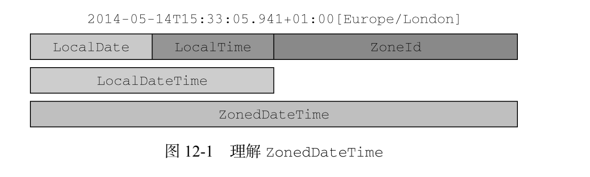

# 第四部分 无所不在的 Java

## 第十二章 新的日期和时间 API

### 12.1 LocalDate、LocalTime、LocalDateTime、Instant、Duration 以及 Period 基本使用

**Demo**

```java
public class DateDemo {

	public static void demoLocalDate() {
		// 创建日期对象
		LocalDate date = LocalDate.of(2017, 9, 21);
		LocalDate now = LocalDate.now();
		LocalDate localDate = LocalDate.parse("2017-09-21");
		// 获取年
		int year = date.getYear();
		year = date.get(ChronoField.YEAR);
		// 获取月
		Month month = date.getMonth();
		int month2 = date.get(ChronoField.MONTH_OF_YEAR);
		month2 = date.getMonthValue();
		// 获取日
		int day = date.getDayOfMonth();
		day = date.get(ChronoField.DAY_OF_MONTH);
		// 获取星期几
		DayOfWeek dayOfWeek = date.getDayOfWeek();

		// 返回该月的天数
		int len = date.lengthOfMonth();

		// 是否闰年
		boolean leap = date.isLeapYear();
	}

	public static void demoLocalTime() {
		LocalTime localTime = LocalTime.of(13, 45, 12);
		LocalTime localTime1 = LocalTime.parse("13:23:34");
		int hour = localTime.getHour();
		int minute = localTime.getMinute();
		int second = localTime.getSecond();
	}

	public static void demoLocalDateTime() {
		// LocalDate + LocalTime <=> LocalDateTime
		LocalDate date = LocalDate.of(2017, 9, 21);
		LocalTime time = LocalTime.of(13, 45, 12);
		LocalDateTime dt1 = LocalDateTime.of(date, time);
		date = dt1.toLocalDate();
		time = dt1.toLocalTime();


		LocalDateTime dt2 = LocalDateTime.of(2014, Month.SEPTEMBER, 21, 13, 45, 20);

		LocalDateTime dt3 = date.atTime(13, 45, 20);

		LocalDateTime dt4 = date.atTime(time);

		LocalDateTime dt5 = time.atDate(date);
	}

	public static void demoInstant() {
		Instant instant = Instant.ofEpochSecond(3);
		// 修改 ns 级别的数值 , 精度可以精确到纳秒
		instant = Instant.ofEpochSecond(3, 0);
		instant = Instant.ofEpochSecond(3, 1_000_000);
		instant = Instant.ofEpochSecond(3, -1_000_000);

		int nanoOfSecond = Instant.now().get(ChronoField.NANO_OF_SECOND);
		System.out.println(nanoOfSecond);
	}

	public static void demoDurationPeriod() {
		LocalTime time1 = LocalTime.of(13, 45, 12);
		LocalTime time2 = LocalTime.of(13, 45, 13);
		Duration d1 = Duration.between(time1, time2);


		LocalDate date1 = LocalDate.of(2017, 9, 20);
		LocalDate date2 = LocalDate.of(2017, 9, 21);
		// 因为 Duration 的设计是为了统计秒和 ns 衡量时间的长短,所以不能向其传递 localDate 参数
//		Duration d2 = Duration.between(date1, date2);
		// 如果想要获取天数之间的差距,可以使用 period
		Period oneDays = Period.between(date1, date2);


		Instant instant1 = Instant.ofEpochSecond(3);
		Instant instant2 = Instant.ofEpochSecond(4);
		Duration d3 = Duration.between(instant1, instant2);


		Duration threeMinutes = Duration.ofMinutes(3);
		threeMinutes = Duration.of(3, ChronoUnit.MINUTES);

		Period tenDays = Period.ofDays(10);

		Period threeWeeks = Period.ofWeeks(3);

		Period twoYearsSixMonthsOneDay = Period.of(2, 6, 1);
	}

	public static void main(String[] args) {
		demoLocalDate();
		demoLocalTime();
		demoLocalDateTime();
		demoInstant();
		demoDurationPeriod();
	}
}
```

**Duration 以及 Period公有方法**

| 方法名       | 是否是静态方法 | 方法描述                                                    |
| ------------ | -------------- | ----------------------------------------------------------- |
| between      | 是             | 创建两个时间点之间的 interval                               |
| from         | 是             | 有一个临时时间点创建 interval                               |
| of           | 是             | 由它的组成部分创建 interval 的实例                          |
| parse        | 是             | 由字符串创建 interval 实例                                  |
| addTo        | 否             | 创建该 interval 的副本,并将其叠加到某个指定的 temporal 对象 |
| get          | 否             | 读取该 interval 的状态                                      |
| isNegative   | 否             | 检查该 interrval 的时长是否为负值,不包含 0                  |
| isZero       | 否             | 检查该 interrval 的时长是否为 0                             |
| minus        | 否             | 通过减去一定的时间创建该 interval 的副本                    |
| multipliedBy | 否             | 将 interval 的值乘以某个标量创建该 interval 的副本          |
| negated      | 否             | 以忽略某个时长的方式创建该 interval 的副本                  |
| plus         | 否             | 以增加某个指定的时长的方式创建该 interval 的副本            |
| subtractFrom | 否             | 从指定 temporal 对象中减去该 interval                       |

### 12.2 操纵,解析和格式化日期

**Demo**

```java
public class DateFormatDemo {
	public static void demo1() {
		// 修改已知 localDate 对象
		LocalDate date1 = LocalDate.of(2017, 9, 21);
		LocalDate date2 = date1.withYear(2011);
		LocalDate date3 = date2.withDayOfMonth(25);
		LocalDate date4 = date3.with(ChronoField.MONTH_OF_YEAR, 2);

		LocalDate date5 = date4.plusDays(1);
		LocalDate date6 = date5.minusYears(6);
		LocalDate date7 = date6.plus(6, ChronoUnit.MONTHS);
	}

	public static void demo2() {
		// 使用 TemporalAdjuster
		LocalDate date1 = LocalDate.now();
		LocalDate date2 = date1.with(TemporalAdjusters.nextOrSame(DayOfWeek.SUNDAY));
		LocalDate date3 = date2.with(TemporalAdjusters.lastDayOfMonth());

		String s1 = date1.format(DateTimeFormatter.BASIC_ISO_DATE);
		String s2 = date1.format(DateTimeFormatter.ISO_LOCAL_DATE);
		System.out.println(s1);
		System.out.println(s2);

		DateTimeFormatter dateTimeFormatter = DateTimeFormatter.ofPattern("dd/MM/yyyy");
		String s3 = date1.format(dateTimeFormatter);
		System.out.println(s3);
	}

	public static void demo3() {
		DateTimeFormatter italianFormatter = new DateTimeFormatterBuilder()
				.appendText(ChronoField.DAY_OF_MONTH)
				.appendLiteral(". ")
				.appendText(ChronoField.MONTH_OF_YEAR)
				.appendLiteral(" ")
				.appendText(ChronoField.YEAR)
				.parseCaseInsensitive()
				.toFormatter(Locale.ITALIAN);

		DateTimeFormatter dateTimeFormatter = DateTimeFormatter.ofPattern("d. MMMM yyyy");
	}

	public static void main(String[] args) {
		demo2();
	}
	
}
```

**表示时间点的日期-时间类的通用方法**

| 方法名   | 是否是静态方法 | 方法描述                                                     |
| -------- | -------------- | ------------------------------------------------------------ |
| from     | 是             | 依据传入的 Temporal 对象创建对象实例                         |
| now      | 是             | 依据系统时钟创建 Temporal 对象                               |
| of       | 是             | 由 Temporal 对象的某个部分创建该对象实例                     |
| parse    | 是             | 由字符串创建 Temporal 对象的实例                             |
| atOffset | 否             | 将 Temporal 对象和某个时区偏移相结合                         |
| atZone   | 否             | 将 Temporal 对象和某个时区相结合                             |
| format   | 否             | 使用某个指定的格式器将 Temporal 对象转换为字符串(Instant 类不提供该方法) |
| get      | 否             | 读取 Temporal 对象的某一部分的值                             |
| minus    | 否             | 创建 Temporal 对象的一个副本,通过将当前 Temporal 对象的值减去一定的时长创建该副本 |
| plus     | 否             | 创建 Temporal 对象的一个副本,通过将当前 Temporal 对象的值加上一定的时长常见该副本 |
| with     | 否             | 以该 Temporal 对象为模板,对某些状态进行修改创建该对象的副本  |

**TemporalAdjusters 类中的工厂方法**

| 方法名                    | 描述                                                         |
| ------------------------- | ------------------------------------------------------------ |
| dayOfWeekInMonth          | 创建一个新的日期,它的值为同一个月每一周的第几天(负数表示从月末往月初计数) |
| firstDayOfMonth           | 创建一个新的日期,它的值为当月的第一天                        |
| firstDayOfNextMonth       | 创建一个新的日期,它的值为下月的第一天                        |
| firstDayOfNextYear        | 创建一个新的日期,它的值为明年的第一天                        |
| firsyDayOfYear            | 创建一个新的日期,它的值为当年的第一天                        |
| firstInMonth              | 创建一个新的日期,它的值为同一个月中,第一个符合星期几要求的值 |
| lastDayOfMonth            | 创建一个新的日期,它的值为当月的最后一天                      |
| lastDayOfNextMonth        | 创建一个新的日期,它的值为下月的最后一天                      |
| lastDayOfNextYear         | 创建一个新的日期,它的值为明年的最后一天                      |
| lasyDayOfYear             | 创建一个新的日期,它的值为当年的最后一天                      |
| lastInMonth               | 创建一个新的日期,它的值为同一个月中,最后一个符合星期几要求的值 |
| Next/previous             | 创建一个新的日期,并将其设定为日期调整后或者调整前,第一个符合指定星期几要求的日期 |
| nextOrSame/previousOrSame | 创建一个新的日期,并将其值设定为日期调整后或者调整前,第一个符合指定星期几要求的日期,如果该日期已经符合要求,则直接返回该对象 |

**Demo**

```java
public class NextWorkDay implements TemporalAdjuster {
	@Override
	public Temporal adjustInto(Temporal temporal) {
		DayOfWeek dayOfWeek = DayOfWeek.of(temporal.get(ChronoField.DAY_OF_WEEK));
		int add = 1;
		if (dayOfWeek == DayOfWeek.SATURDAY) {
			add = 2;
		} else if (dayOfWeek == DayOfWeek.FRIDAY) {
			add = 3;
		}
		return temporal.plus(add, ChronoUnit.DAYS);
	}
}
```

### 12.3 处理不同的时区和历法

**Demo**

```java
public class ZoneDemo {
	public static void demo() {
		ZoneId romeId = ZoneId.of("Europe/Rome");

		ZoneId zoneId = TimeZone.getDefault().toZoneId();

		LocalDate date = LocalDate.now();

		ZonedDateTime zonedDateTime = date.atStartOfDay(romeId);

		LocalDateTime localDateTime = LocalDateTime.now();
		localDateTime.atZone(romeId);


		Instant instant = Instant.now();
		instant.atZone(zoneId);
		localDateTime = LocalDateTime.ofInstant(instant, zoneId);

		ZoneOffset zoneOffset = zoneId.getRules().getOffset(localDateTime);
		Instant instantFromDateTime = localDateTime.toInstant(zoneOffset);

		// 纽约时间
		ZoneOffset newYorkOffset = ZoneOffset.of("-05:00");
		OffsetDateTime dateTimeInNewYork = OffsetDateTime.of(localDateTime, newYorkOffset);

		// 日本时间 : 建议使用
		JapaneseDate japaneseDate = JapaneseDate.from(localDateTime);

		// 日本时间 : 不建议使用
		Chronology japaneseChronology = Chronology.ofLocale(Locale.JAPAN);
		ChronoLocalDate now = japaneseChronology.dateNow();

		// 在 ISO 日历中计算 当前伊斯兰年中斋月的起始和终止日期
		HijrahDate ramadanDate = HijrahDate.now()
				.with(ChronoField.DAY_OF_MONTH, 1)
				.with(ChronoField.MONTH_OF_YEAR, 9);

		System.out.println("Ramadan starts on " +
				IsoChronology.INSTANCE.date(ramadanDate) +
				" and ends on " +
				IsoChronology.INSTANCE.date(ramadanDate.with(TemporalAdjusters.lastDayOfMonth())));
	}

	public static void main(String[] args) {
		demo();
	}
}
```




## 第十三章 默认方法

**Demo**

```java
public class D implements A{ } 

public class C extends D implements B, A { 
 public static void main(String... args) { 
 new C().hello(); 
 } 
}
// 此时执行 B 中的 hello 方法
```

**解决默认方法冲突的三条原则**

- 类中的方法优先级最高。类或父类中声明的方法的优先级高于任何声明为默认方法的优先级。
- 如果无法依据第一条进行判断，那么子接口的优先级更高：函数签名相同时，优先选择拥有最具体实现的默认方法的接口，即如果 B 继承了 A，那么 B 就比 A 更加具体。
- 最后，如果还是无法判断，那么继承了多个接口的类必须通过显式覆盖和调用期望的方法，显式地选择使用哪一个默认方法的实现。

## 第十四章 Java 模块系统 - 跳过
