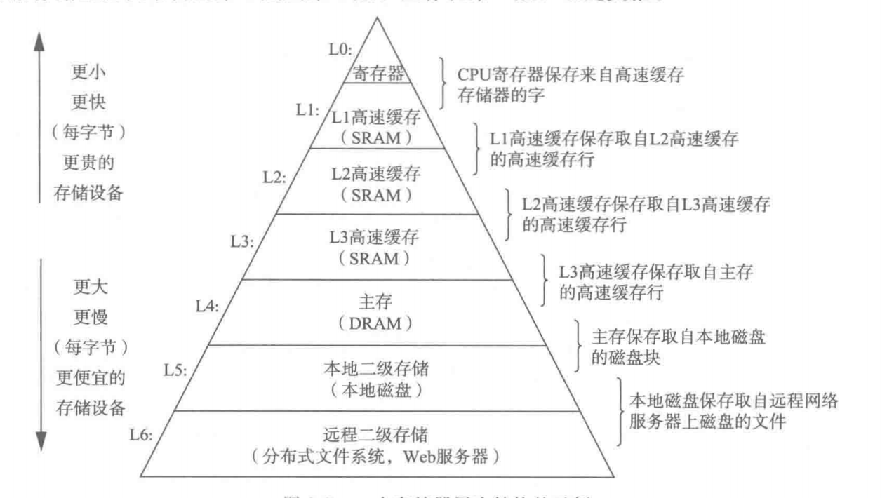

# 深入理解计算机系统

##  一. 系统的硬件组成

### 1.1 总线

- 贯穿系统的电子管道 -- 总线 
- 他携带信息字节并负责在各个部件间传递.通常被设计成传送定长的字块(4个字节或者 8 个字节).

### 1.2 I/O 设备

I/O(输入/输出)设备是系统与外部世界联系的通道.下图中包含四个 I/O 设备 : 鼠标,键盘,显示器,磁盘驱动器.

每一个 I/O 设备都通过一个控制器或者适配器与 I/O 总线相连.控制器与配置器之间的区别主要是他们的封装方式.

- 控制器是 I/O 设备本身或者系统的主印制电路板(主板)上的芯片组.
- 适配器则是一块插在主板插槽上的卡
- 他们的功能都是 I/O 总线和 I/O 设备之间传递信息.

### 1.3 主存

主存是一个临时存储设备,在处理器执行程序时,用来存放程序和程序处理的数据.从物理上来说,主存是由一组动态随机存取存储器芯片组成.

### 1.4 处理器

中央处理单元(CPU),简称处理器	是解释(执行)存储在主存中指令的引擎.处理器的核心是一个大小为一个字的存储设备(或寄存器).称为程序计数器.

### 1.5 存储器层次结构

### 1.6 进程
进程是操作系统对一个正在运行程序的抽象

### 1.7 线程
一个进程是由多个被称为线程的执行单元构成

### 1.8 虚拟内存
虚拟内存是一个抽象的概念,他为内个进程提供了一个假象,即每个进程都在独占的使用主存.每个进程看到的内存都是一致的,称为虚拟地址空间.

下图表示的是进程的虚拟地址空间,图中的地址是从下往上增大的.

### 1.9 计算机系统的抽象

下图描述了计算机系统的一些抽象 : 

- 文件 : 对于 I/O 设备的抽象
- 虚拟内存 : 对程序和存储器的抽象
- 进程 : 对于一个正在运行程序的抽象
- 虚拟机 : 对于整个计算机的抽象

## 二. 循环与条件控制
### 2.1 条件控制

#### 2.1.1 控制的条件转移实现条件操作
当条件满足时,程序沿着一条执行路径执行,当条件不满足时,沿着另一条路径执行.

#### 2.1.2 用条件传送来实现条件分支
通过预先把两个逻辑都计算出来,在进行执行,效率会比条件控制实现快很多.

#### 2.1.3 条件传送由于条件转移的原因
现代处理器通过流水线来获取高性能,在流水线中,一条指令的处理要经过一系列的阶段,每个阶段执行所需操作的一小部分.这种方式通过重叠连续指令的步骤来获取高性能.例如 : 在取一条指令的同事,执行它前面的一条指令的算术运算.要做到这一点,要求能够事先确定要执行的指令序列.这样才能保证流水线中充满了待执行的指令.当机器遇到条件跳转时候,只有当分支条件求值完成才能确定要往哪个分支走.现代处理器采用分支预测逻辑来猜测每条跳转指令是否会执行,只要预测准确,流水线中就充满了指令,但是如果预测失败,就需要丢弃它为该跳转指令后所有指令已做的工作,然后在开始从正确的位置去填充流水线,导致程序性能严重下降.

