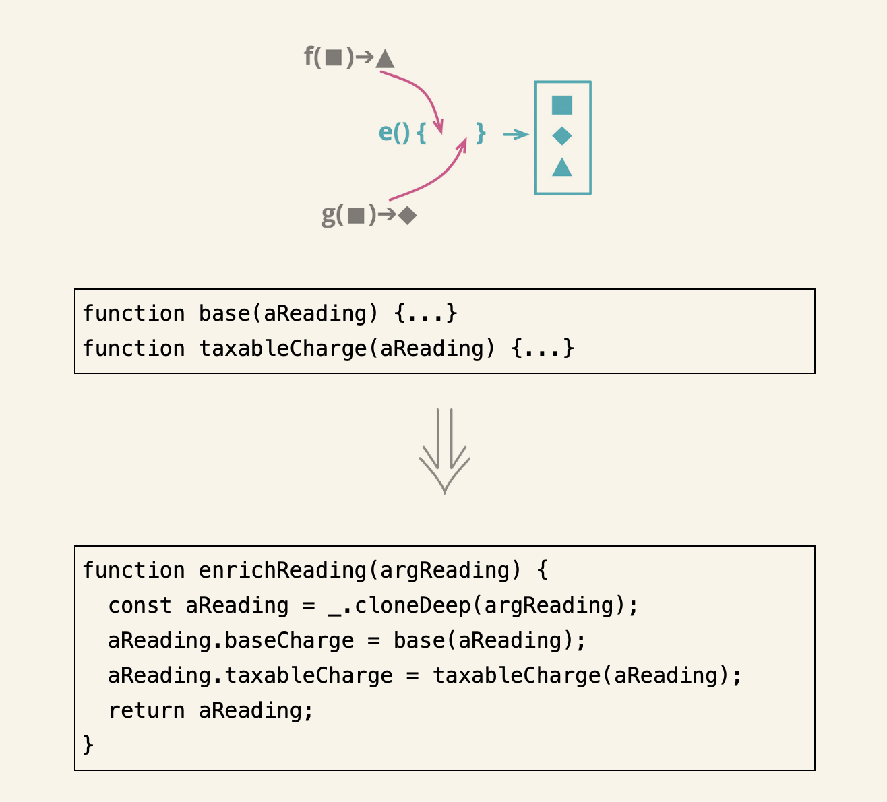

# 第一组重构

## 1.1 提炼函数

### 场景

- 按照一段代码的作用,将其提炼到独立的函数,并以这段代码的用途为这个函数命名.
- 如果你需要花时间浏览一段代码才能弄清它到底在干什么，那么就应该将其提炼到一个函数中，并根据它所做的事为其命名.

### 修改方法

- 将待提炼的代码从源函数复制到新建的目标函数中
- 仔细检查提炼出的代码，看看其中是否引用了作用域限于源函数、在提炼出的新函数中访问不到的变量。若是，以参数的形式将它们传递给新函数
- 在源函数中，将被提炼代码段替换为对目标函数的调用
- 查看其他代码是否有与被提炼的代码段相同或相似之处。如果有，考虑使用以函数调用取代内联代码令其调用提炼出的新函数
- 测试

## 1.2 内联函数

### 场景
如果代码中有太多间接层，使得系统中的所有函数都似乎只是对另一个函数的简单委托 , 这个时候考虑使用内联函数进行重构

### 修改方法
- 检查函数，确定它不具多态性 : 如果有子类继承了这个函数,那么就无法内联
- 找出这个函数的所有调用点
- 将这个函数调用点替换为函数本体
- 测试
- 删除函数定义

## 1.3 提炼变量

### 场景

表达式非常复杂而难以阅读,通过局部变量可以帮助我们将表达式分解为比较容易管理的形式.
### 修改方法
- 确认要提炼的表达式没有副作用。
- 声明一个不可修改的变量，把你想要提炼的表达式复制一份，以该表达式的结果值给这个变量赋值。
- 用这个新变量取代原来的表达式。
- 测试

## 1.4 内联变量

### 场景
变量的存在可能妨碍重构附近的代码
### 修改方法
- 检查确认变量赋值语句的右侧表达式没有副作用
- 如果变量没有被声明为不可修改，先将其变为不可修改，并执行测试。这是为了确保该变量只被赋值一次
- 找到第一处使用该变量的地方，将其替换为直接使用赋值语句的右侧表达式
- 测试

## 1.5 改变函数声明

### 场景
发现函数名字不对,或者和其做的事情不符,需要对其进行改名,可以尝试先写依据注释描述这个函数用途,再把注释变成函数的名字
### 修改方法

##### 简单做法

- 确定函数体内没有使用该参数
- 修改函数声明
- 找出旧函数的使用,替换为新函数
- 测试

##### 迁移式做法

- 重构函数体内部
- 提炼函数,将函数体提炼为一个新函数
- 确定参数是否变更,变更的话使用简单方法进行改变
- 测试
- 对于旧函数使用内联函数
- 新函数的名字检验修改
- 测试

##### 多态函数做法
- 提炼函数
- 通过旧函数调用新函数
- 尝试将转发操作提炼到超类

##### 重构一个已经对外发布的 API
- 提炼新函数
- 标记老函数为废弃
- 给客户端时间来进行切换
- 确认切换完成
- 移除旧函数声明

## 1.6 封装变量

### 场景
- 对于所有可变的数据，只要它的作用域超出单个函数，我就会将其封装起来，只允许通过函数访问 .
- 对于被广泛使用的变量,考虑使用封装变量对其进行封装

### 修改方法
- 创建封装函数,在其中访问和更新变量值
- 执行静态检查
- 修改使用变量的代码为使用函数
- 修改变量可见性
- 测试

## 1.7 变量改名

### 场景
对于命名和含义不符的变量,需要进行改名.
### 修改方法
- 对于被广泛使用的变量,考虑使用封装变量对其进行封装
- 找出使用该变量的方法,进行修改
- 测试

## 1.8 引入参数对象

### 场景
一组数据总是结伴出现在函数中(数据泥团),使用数据结构取代.
### 修改方法
- 创建数据结构,将参数封装进来
- 测试
- 使用改变函数声明,给原函数增加参数,类型是新的数据结构
- 测试
- 调整所有调用点,将参数放在数据结构中
- 用新数据结构中的参数,取代老参数的使用
- 删除原来的参数
- 测试

## 1.9 函数组合成类

### 场景
一组函数形影不离的操作同一块数据.

### 修改方法
- 使用封装记录,对多个函数共用的数据进行封装.
- 对于使用该记录结构的每个函数，运用搬移函数将其移入新类
- 用以处理该数据的逻辑可以使用提炼函数抽象出来,并入新的类中

## 1.10 函数组合成变换

### 场景

- 有很多地方做的事情是把数据传给函数,函数处理之后在吐回来,此时可以将这样做的函数封装为一个变换函数.
- 如果代码中会对源数据进行更新,那么使用函数组合成类会更好.

### 修改方法

- 创建一个变换函数,参数是需要变换的记录,并直接返回该记录的值
- 挑选一块逻辑，将其主体移入变换函数中，把结果作为字段添加到输出记录中。修改客户端代码，令其使用这个新字段
- 测试

## 1.11 拆分阶段

### 场景
一段代码同时处理两件不同的事.

### 修改方法
- 将第二阶段代码抽象成独立的函数
- 测试
- 引入一个中转数据结构,将其作为参数添加到提炼出的函数的参数列表中
- 测试
- 检验第二阶段的参数,是否用到了第一阶段处理的结果,进行参数搬移,放到中转数据结构中
- 对第一阶段使用提炼函数,让提炼出来的函数返回中转数据结构.
