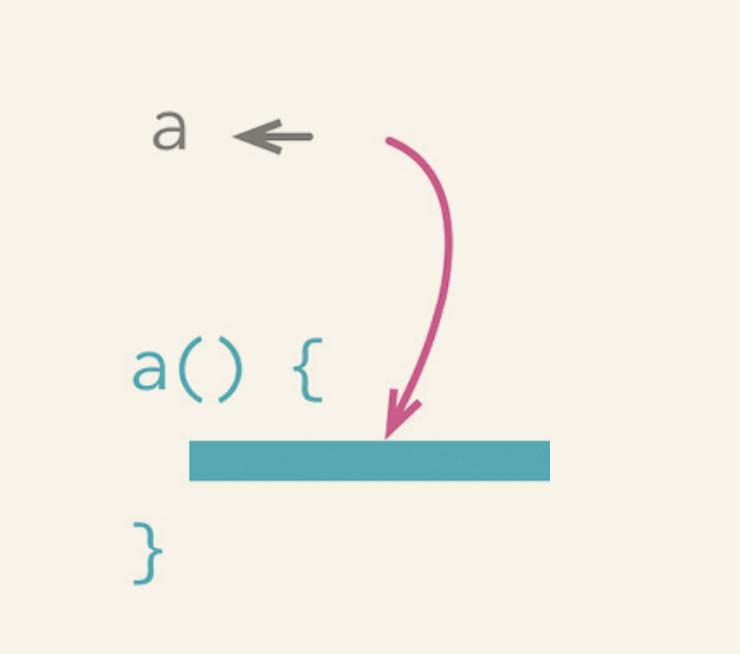
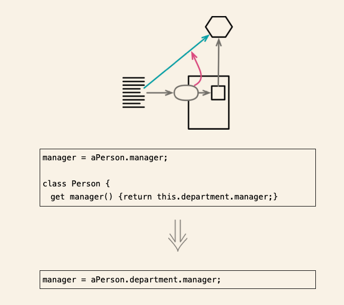

# 封装

## 2.1 封装记录

### 场景
程序的中间互相传递的嵌套列表(list)或者散列映射结构(map),将这些结构将其封装在类中,暴露访问方法.

### 修改方法
- 对持有记录的变量使用封装变量（132），将其封装到一个函数中。
- 创建一个类，将记录包装起来，并将记录变量的值替换为该类的一个实例。然后在类上定义一个访问函数，用于返回原始的记录。修改封装变量的函数，令其使用这个访问函数。
- 测试
- 新建一个函数，让它返回该类的对象，而非那条原始的记录
- 对于该记录的每处使用点，将原先返回记录的函数调用替换为那个返回实例对象的函数调用
- 移除类对原始记录的访问函数
- 测试
- 如果记录中的字段本身也是复杂结构，考虑对其再次应用封装记录（162）或封装集合（170）手法

## 2.2 封装集合

### 场景
- 不要再模块以外修改集合 , 通过封装对于集合元素的添加删除方法来做集合的变更处理,不要直接返回集合原始数据
### 修改方法

- 使用封装变量封装对于集合的引用
- 在类上添加用于"添加集合元素"和"移除集合元素"的方法
- 执行静态检查
- 查找集合的引用点,如果有调用者直接引用集合,那么修改为使用方法的方式
- 修改集合的取值函数,另其返回一个只读副本,或者设置只读代理
- 测试

## 2.3 以对象取代基本类型

### 场景

### 修改方法

- 如果变量没有封装,先使用封装变量,对其进行封装
- 为这个数据值创建一个简单的类. 类的构造函数应该保存这个数据值, 并为它提供一个取值函数.
- 执行静态检查
- 修改第一步得到的设值函数,令其创建一个新类的对象并将其存入字段,如果有必要的话,同时修改字段的类型声明.
- 修改取值函数,令其调用新类的取值函数,并返回结果.
- 测试
- 考虑对第一步得到的访问函数使用函数改名（124）,以便更好反映其用途.
- 考虑应用将引用对象改为值对象（252）或将值对象改为引用对象（256）,明确指出新对象的角色是值对象还是引用对象.

## 2.4 以查询取代临时变量

### 场景

在分接一个非常冗长的函数的时候,将变量放到函数中,可以让函数的分解变得简单

### 修改方法

- 检查变量在使用前是否已经完全计算完毕，检查计算它的那段代码是否每次都能得到一样的值
- 如果变量目前不是只读的,但是可以改造成只读变量,那就先改造它
- 测试
- 将为变量赋值的代码段提炼成函数
- 测试
- 应用内联变量的方法删除临时变量

## 2.5 提炼类

### 场景

- 如果某些数据和函数总是一起出现,某些数据经常同时变化甚至彼此相依,那么应该将其分离出去

### 修改方法

- 决定如何分解类所负的责任
- 创建一个新的类,用以表现从旧类来的责任
- 构造旧类时候创建一个新类的实例,建立从旧类到新类的连接关系
- 对于想要搬移的每个字段,运用搬移字段搬移
- 使用搬移函数将必要的字段搬到新的类,先搬移较低级的函数(被其他函数调用多于调用其它函数)
- 检查两个类的接口,去掉不再需要的函数,必要时为函数重新取名
- 决定是否公开新的类

## 2.6 内联类

### 场景

- 如果一个类不在承担足够的责任,不在有单独存在的理由,那么他应该被内联
- 对于两个需要处理的类,可以先内联,在拆分

### 修改方法

- 对于待内联类（源类）中的所有public函数，在目标类上创建一个对应的函数，新创建的所有函数应该直接委托至源类
- 修改源类public方法的所有引用点，令它们调用目标类对应的委托方法
- 每次更改后运行测试
- 将源类中的函数与数据全部搬移到目标类，每次修改之后进行测试，直到源类变成空壳为止
- 删除源类，为它举行一个简单的"丧礼"

## 2.7 隐藏委托关系

### 场景

封装意味着每个模块都应该最可能少了解系统其他部分,如果某些客户端先通过服务端想的字段得到一个委托类,再调用后者的函数,那么,客户端就需要知道这一层委托关系,此时需要使用隐藏委托关系.

### 修改方法

- 对于每个委托关系中的函数，在服务对象端建立一个简单的委托函数
- 调整客户端，令它只调用服务对象提供的函数
- 每次调整后运行测试
- 如果将来不再有任何客户端需要取用Delegate（受托类），便可移除服务对象中的相关访问函数。
- 测试

## 2.8 移除中间人

### 场景

- 与隐藏委托关系相反,当隐藏委托关系这层封装越来越重,导致服务层成了一个中间人的时候,尝试,去掉服务层,让客户端直接调用手托类.

### 修改方法

- 为受托对象创建一个取值函数
- 对于每个委托函数，让其客户端转为连续的访问函数调用。每次替换后运行测试

## 2.9 替换算法

### 场景

- 如果做一件事情有更清晰的方式,采用比较清晰的方式替换复杂的方式.

### 修改方法

- 整理一下待替换的算法,保证它已经被抽取到一个独立的函数中
- 先只为这个函数准备测试,以便固定他的行为
- 准备好了另一个(替换用的)算法
- 进行静态检查
- 运行测试,比较新旧算法的运行结果,如果测试通过,那么大功告成;否则,在后续测试和调试中,以旧算法为比较的参照标准.

### 
