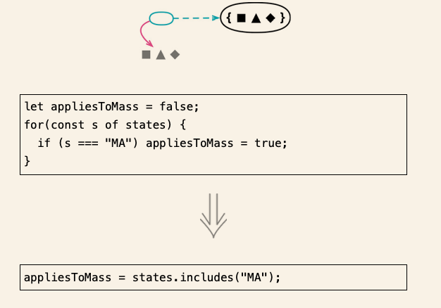

# 搬移特性

## 3.1 搬移函数

### 场景

一个函数频繁引用其他上下文中的元素,二队自身上下文中的元素缺关心甚少.

### 修改方法

- 检查函数在当前上下文里引用的所有程序元素（包括变量和函数），考虑是否需要将它们一并搬移
- 检查待搬移函数是否具有多态
- 将函数复制一份到目标上下文中.调整函数,使其能够适应新家
- 执行静态检查
- 设法从源上下文中正确引用目标函数
- 修改源函数,使之成为一个纯委托函数
- 测试
- 考虑对源函数使用内联函数

## 3.2 搬移字段

### 场景

- 发现当前的数据结构已经不再适应此时的需求了 ,需要马上进行修缮

### 修改方法

- 确保源字段已经得到了良好的封装
- 测试
- 在目标对象上创建一个字段以及对应的访问函数
- 执行静态检查
- 确保源对象里面能够正常引用目标对象
- 调整原对象的访问函数,另其使用目标对象的字段
- 测试
- 移除源对象上的字段
- 测试

## 3.3 搬移语句到函数

### 场景

- 在调用某个函数的时候,发现总有一些相同的代码也需要每次执行,那么考虑将此端代码合并到函数中.
- 将某段代码放在函数中了,可以帮助我们更好的理解函数的功能

### 修改方法

- 如果重复的代码段离调用目标函数的地方还有些距离，则先用移动语句（223）将这些语句挪动到紧邻目标函数的位置
- 如果目标函数仅被唯一一个源函数调用，那么只需将源函数中的重复代码段剪切并粘贴到目标函数中即可，然后运行测试。本做法的后续步骤至此可以忽略。
- 如果函数不止一个调用点，那么先选择其中一个调用点应用提炼函数（106），将待搬移的语句与目标函数一起提炼成一个新函数。给新函数取个临时的名字，只要易于搜索即可。
- 调整函数的其他调用点，令它们调用新提炼的函数。每次调整之后运行测试。
- 完成所有引用点的替换后，应用内联函数（115）将目标函数内联到新函数里，并移除原目标函数。
  对新函数应用函数改名（124），将其改名为原目标函数的名字。

## 3.4 搬移语句到调用者

### 场景

- 函数的边界发生偏移 , 以往在多个地方共用的行为,如今需要在某些调用点前面表现出不同的行为.

### 修改方法

- 最简单的情况下，原函数非常简单，其调用者也只有寥寥一两个，此时只需把要搬移的代码从函数里剪切出来并粘贴回调用端去即可，必要的时候做些调整。运行测试。如果测试通过，那就大功告成，本手法可以到此为止。
- 若调用点不止一两个，则需要先用提炼函数（106）将你不想搬移的代码提炼成一个新函数，函数名可以临时起一个，只要后续容易搜索即可。
- 对原函数应用内联函数
- 对提炼出来的函数应用改变函数声明,令其与原函数使用同一个名字

## 3.5 以函数调用取代内联代码

### 场景

- 如果发现一些内联代码,他们做的事情仅仅是已有函数的重复,采用函数调用取代内联代码.

### 修改方法

- 将内联代码替代为一个既有函数的调用
- 测试

## 3.6 移动语句

### 场景

让存在关联的东西一起出现,可以让代码更容易理解.

### 修改方法

- 确定待移动的代码片段应该被搬往何处。仔细检查待移动片段与目的地之间的语句，看看搬移后是否会影响这些代码正常工作。如果会，则放弃这项重构
- 剪切源代码片段,粘贴到上一步选定的位置上
- 测试

## 3.7 拆分循环

### 场景

当一个循环做了多个事情的时候,可以考虑使用拆分循环,让一次循环只做一个事情.

### 修改方法

- 复制一遍循环的代码
- 识别并移除循环中的重复代码,是每个循环只做一件事情
- 测试

## 3.8 以管道取代循环

### 场景

- 逻辑采用管道来编写,代码的可读性会更高

### 修改方法

- 创建一个新的变量,用于存放参与循环过程中的集合
- 从循环顶部开始，将循环里的每一块行为依次搬移出来,在上一步创建的集合变量上用一种管道运算替代之。每次修改后运行测试
- 搬移完循环的全部行为之后,将循环整个删除

## 3.9 移除死代码

### 场景

一旦有代码不在被使用,就应该立马删除它.即使后面需要使用,也可以从版本控制中找回来

### 修改方法

- 如果死代码可以从外部直接引用,比如他是一个独立的函数时候,先查找一下还有没有调用点
- 将死代码删除
- 测试