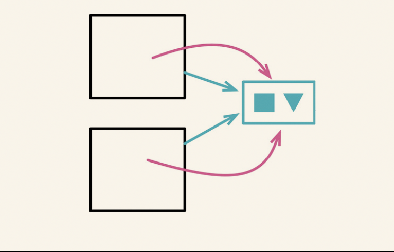

# 重新组织数据

## 4.1 拆分变量

### 场景

- 如果变量承担变了多个职责,那么他就应该被被替换为多个变量 ,每个变量只承担一个责任

### 修改方法

- 在待分解变量的声明以及其第一次被赋值处修改其名称
- 如果可能的话,将新的变量修改为不可修改
- 以该变量的第二次赋值动作为界,修改此前对该变量的所有引用,让他们引用新变量.
- 测试
- 重复上述步骤

## 4.2 字段改名

### 场景

- 对于命名不规范的字段和函数名,有必要对其进行改名

### 修改方法

- 如果记录的作用域较小，可以直接修改所有该字段的代码，然后测试。后面的步骤就都不需要了
- 如果记录还未封装，请先使用封装记录（162）
- 在对象内部对私有字段改名，对应调整内部访问该字段的函数
- 测试
- 如果构造函数的参数用了旧的字段名，运用改变函数声明（124）将其改名
- 运用函数改名（124）给访问函数改名

## 4.3 以查询取代派生变量

### 场景
- 如果某些变量可以很容易的被计算出来,那么可以省去这些变量

### 修改方法
- 识别出所有对变量做更新的地方。如有必要，用拆分变量（240）分割各个更新点。
- 新建一个函数，用于计算该变量的值。
- 用引入断言（302）断言该变量和计算函数始终给出同样的值
- 测试。
- 修改读取该变量的代码，令其调用新建的函数。
- 测试。
- 用移除死代码（237）去掉变量的声明和赋值。

## 4.4 将引用对象改为值对象

### 场景

- 如果我想在几个对象之间共享一个对象，以便几个对象都能看见对共享对象的修改，那么这个共享的对象就应该是引用
- 值对象是不可变的,对于二者的使用决定我们是否应该使用该重构手法

### 修改方法

- 检查重构目标是否为不可变对象，或者是否可修改为不可变对象。
- 用移除设值函数（331）逐一去掉所有设值函数
- 提供一个基于值的相等性判断函数，在其中使用值对象的字段

## 4.5 将值对象改为引用对象

### 场景

### 修改方法

- 为相关对象创建一个仓库（如果还没有这样一个仓库的话）。
- 确保构造函数有办法找到关联对象的正确实例。
- 修改宿主对象的构造函数，令其从仓库中获取关联对象。每次修改后执行测试