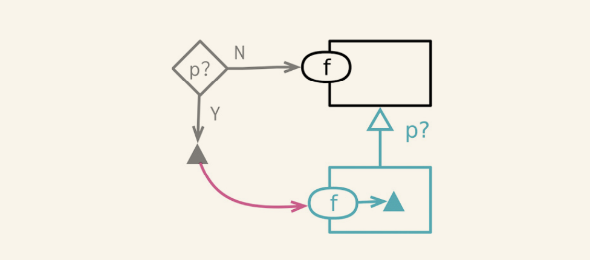

# 简化条件逻辑

## 5.1 分解条件表达式

### 场景

- 对于复杂的条件语句,将每一个条件拆分为独立的函数

### 修改方法

- 对每个条件和条件分支分别运用提炼函数

## 5.2 合并条件表达式

### 场景

- 检查条件各不相同,最终行为却一致, 对于这中情况就应该使用`逻辑或`或者`逻辑与`进行判断条件的合并
- 如果这些条件判断 ,的确彼此独立 , 那么不应该使用该方式来合并

### 修改方法
- 确定条件表达式没有副作用
- 使用适当的逻辑运算符,把多个条件语句合并为一个 , 顺序逻辑用或 , 嵌套判断用与
- 测试
- 重复前面的合并过程,直到将所有逻辑合并在一起
- 考虑对合并后的条件使用提炼函数

## 5.3 以卫语句取代嵌套条件表达式

### 场景

条件表达式通常有两种风格。第一种风格是：两个条件分支都属于正常行为。第二种风格则是：只有一个条件分支是正常行为，另一个分支则是异常的情况。

这两类条件表达式有不同的用途，这一点应该通过代码表现出来。如果两条分支都是正常行为，就应该使用形如if...else...的条件表达式；如果某个条件极其罕见，就应该单独检查该条件，并在该条件为真时立刻从函数中返回。这样的单独检查常常被称为“卫语句”（guard clauses）。

### 修改方法

- 选中最外层需要被替换的条件逻辑,将其替换为卫语句
- 测试
- 有需要的话,重复上述步骤
- 如果所有的卫语句都有相同的效果,可以使用合并表达式

## 5.4 以多态取代条件表达式

### 场景

- 构造一种类型,每一种类型处理一种条件逻辑
- 有一个基础逻辑,在其上又有一些变体,基础逻辑可以在超类作为通用逻辑,每个变体逻辑放在子类中.

### 修改方法

- 如果发现现在类尚不具备多态行为,使用工厂模式,创建他,令工厂函数返回恰当的对象实例.
- 在调用方法中使用工厂函数获取对象实例
- 将带有条件逻辑的函数移到超类中
- 任选一个子类,在其中建立一个函数,使之覆写超类中容纳条件表达式的,将与该子类相关的条件表达式分支复制到新函数中，并对它进行适当调整
- 重复上述过程，处理其他条件分支
- 在超类函数中保留默认情况的逻辑。或者，如果超类应该是抽象的，就把该函数声明为abstract，或在其中直接抛出异常，表明计算责任都在子类中

## 5.5 引入特例

### 场景

- 一个数据结构的使用者都在检查某个特殊的值，并且当这个特殊值出现时所做的处理也都相同。如果发现代码库中有多处以同样方式应对同一个特殊值，需要把这个处理逻辑收拢到一处

### 修改方法

- 给重构目标添加检查特例的属性，令其返回false
- 创建一个特例对象，其中只有检查特例的属性，返回true
- 对“与特例值做比对”的代码运用提炼函数（106），确保所有客户端都使用这个新函数，而不再直接做特例值的比对
- 将新的特例对象引入代码中，可以从函数调用中返回，也可以在变换函数中生成
- 修改特例比对函数的主体，在其中直接使用检查特例的属性
- 测试
- 使用函数组合成类（144）或函数组合成变换（149），把通用的特例处理逻辑都搬移到新建的特例对象中
- 对特例比对函数使用内联函数（115），将其内联到仍然需要的地方

## 5.6 引入断言

### 场景

- 断言告诉阅读代码的人,程序执行到这里时,做了何种假设

### 修改方法

- 如果发现代码某个条件始终为真,就尝试加入断言来说明这个情况