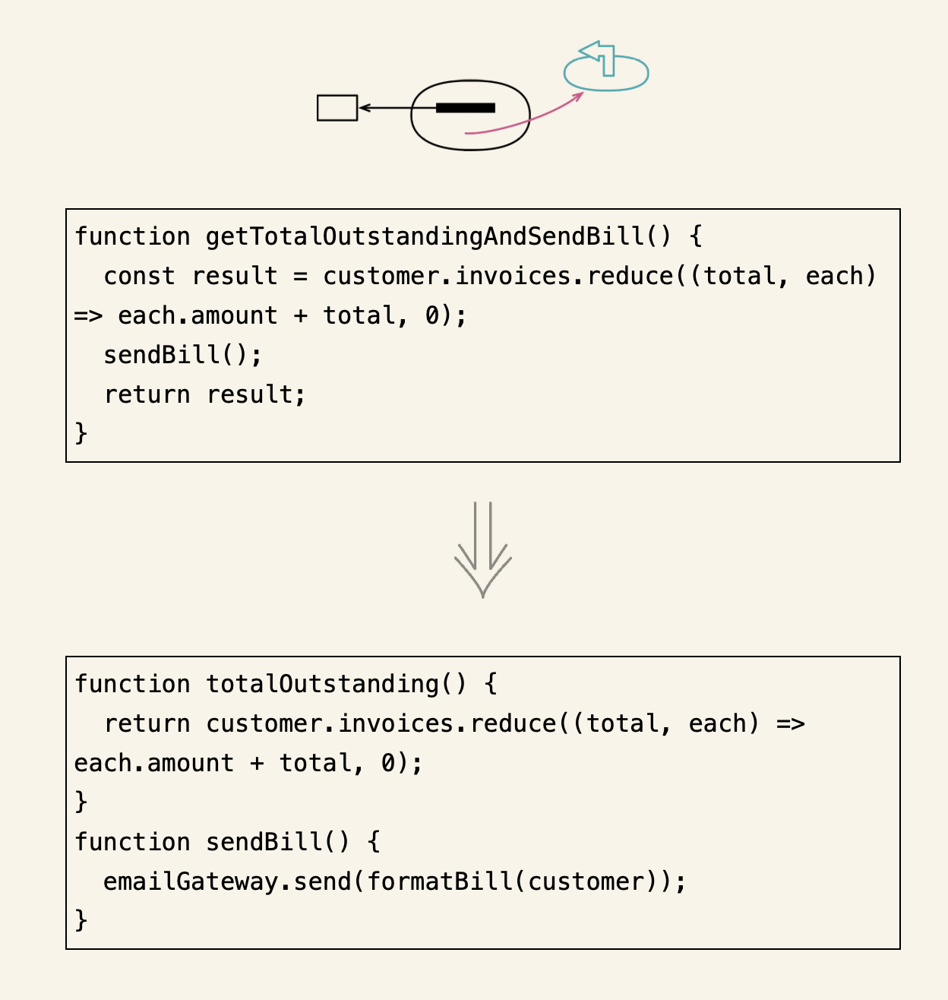
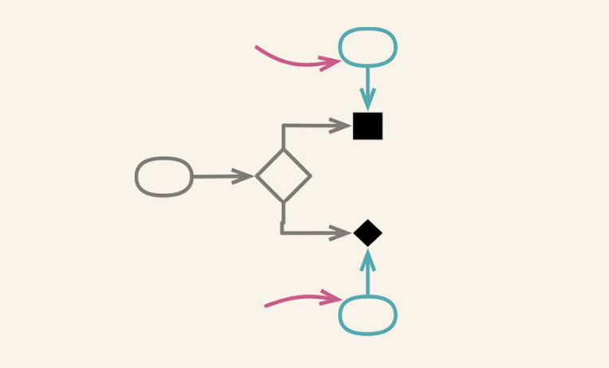
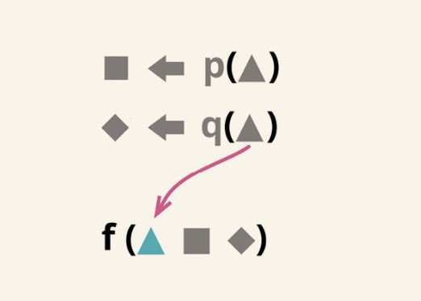
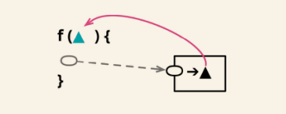
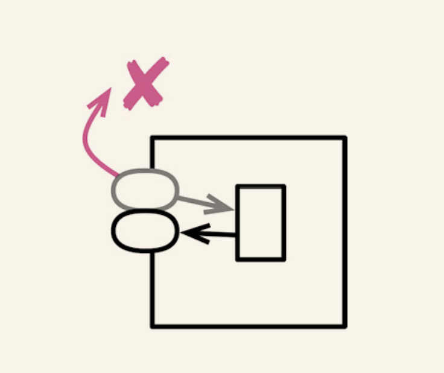
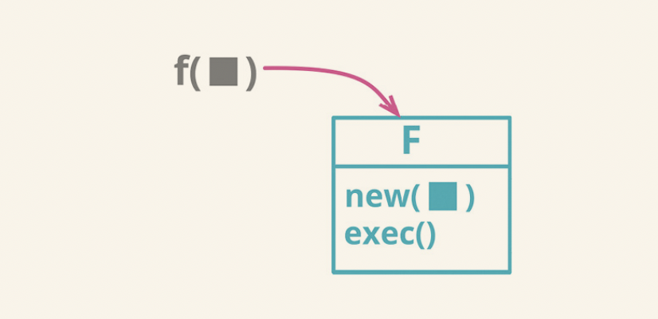

# 重构 API

## 6.1 将查询函数和修改函数分离

### 场景

- 对于既有查询,又有修改的函数,将查询和修改拆分出来.

### 修改方法

- 复制整个函数,将其作为一个函数来命名
- 从新建的查询函数中去掉所有造成副作用的语句
- 执行静态检查
- 查找所有调用原函数的地方。如果调用处用到了该函数的返回值，就将其改为调用新建的查询函数，并在下面马上再调用一次原函数。每次修改之后都要测试
- 从原函数中去掉返回值
- 测试

## 6.2 函数参数化

### 场景

- 如果发现两个函数非常类似 ,只有一些字面量不一样,可以将其合并为一个函数,以参数的形式传入不同的值,从而消除重复

### 修改方法

- 从一组相似的函数中选择一个
- 运用改变函数声明（124），把需要作为参数传入的字面量添加到参数列表中
- 修改该函数所有的调用处，使其在调用时传入该字面量值
- 测试
- 修改函数体，令其使用新传入的参数。每使用一个新参数都要测试
- 对于其他与之相似的函数，逐一将其调用处改为调用已经参数化的函数。每次修改后都要测试

## 6.3 移除标记参数

### 场景

- "标记参数",是指调用者用它来指示被调用的函数应该执行哪段逻辑

### 修改方法

- 针对参数的每一种可能,新建一个明确函数
- 对于“用字面量值作为参数”的函数调用者，将其改为调用新建的明确函数

## 6.4 保持对象的完整

### 场景

- 一段代码从一个记录中导出几个值,然后又把这几个值一起传递给一个函数,那么需要将整个记录传给这个函数,在函数体内导出所需的值
- 调用者将自己的若干数据作为参数,传递给被调用函数.这种情况下,可以将调用者的自我引用作为参数,直接传递给目标函数.

### 修改方法

- 新建一个空函数,提供期望的参数列表
- 在新函数体内调用旧函数,并把新的参数映射到旧的参数列表
- 执行静态检查
- 注意修改旧函数的调用者,令其使用新函数,每次修改之后执行测试
- 所有调用处都修改过来之后,使用内联函数把旧函数内联到新函数中
- 给新函数起名,同时修改所有调用处

## 6.5 以查询取代参数

- 反向重构 : 以参数取代查询

### 场景

- 函数的参数列表应该总结该函数的可变性,标识出可能体现出行为差异的主要方式.所以参数列表应该尽量避免重复,并且参数列表越短越容易理解
- 如果调用函数时传入了一个值,而这个值由函数自己来获得也是同样容易,这就出现了重复
- 如果在处理的函数具有引用透明性(referential transparency，即，不论任何时候，只要传入相同的参数值，该函数的行为永远一致),那么就不用去掉参数.保证该函数的引用透明性

### 修改方法

- 如果有必要,使用提炼函数,将参数的计算过程提炼到一个独立的函数中
- 将函数体内引用该参数的地方改为调用新建的函数,每次修改狗执行测试
- 全部替换完成后,使用改变函数声明,将参数替换掉.

## 6.6 以参数取代查询

- 反向重构 : 以查询取代参数

### 场景

- 让目标函数不再依赖于某个函数 , 需要注意权衡 : 如果把所有依赖关系都变成参数,会导致参数列表冗长重复;如果作用域之间共享太多,会导致函数间依赖过度

### 修改方法

- 对执行查询操作的代码使用提炼变量,将其从函数体中分离出来
- 现在函数体代码已经不再执行查询操作,而是使用前一步提炼出来的变量,对这部分代码使用提炼函数
- 使用内联变量 ,消除刚才提炼出来的变量
- 对原来的函数使用内联函数
- 对新函数改名,改回原来函数的名字 

## 6.7 移除设值函数

### 场景

- 如果不希望某个字段可以被改变,那么可以删除他的设值函数

### 修改方法

- 如果构造函数尚无法得到想要设入字段的值，就使用改变函数声明（124）将这个值以参数的形式传入构造函数。在构造函数中调用设值函数，对字段设值
- 移除所有在构造函数之外对设值函数的调用，改为使用新的构造函数。每次修改之后都要测试
- 使用内联函数（115）消去设值函数。如果可能的话，把字段声明为不可变
- 测试

## 6.8 以工厂函数取代构造函数

### 场景

- 需要根据环境或者参数信息返回子类实例或者代理对象

### 修改方法

- 新建一个工厂函数,让它调用现有的构造函数
- 将调用构造函数的代码改为调用工厂函数
- 每修改一处,执行测试
- 尽量缩小构造函数的可见范围

## 6.9 以命令取代函数

- 反向重构 : 以函数取代命令

### 场景

将函数封装为自己的对象,这样的对象可以称为"命令对象".用途是获取该函数的请求,执行该函数.

- 需要命令对象提供的某种能力而普通的函数无法提供这种能力时

### 修改方法

- 为想要包装的函数创建一个空的类,根据该函数的名字为其命名
- 使用搬移函数把函数移到空的类中(对于命令函数,可以起一个通用的名字,"execute" 或者 "call")
- 可以考虑给每个参数创建一个字段,并在构造函数中添加对应的参数

## 6.10 以函数取代命令

- 以命令取代函数

### 场景

- 对于只想调用一个函数,让他完成自己的工作就好,如果这个函数不是太复杂,那么使用命令对象的方式可能显得费而不惠,那么就应该考虑将其变回普通函数

### 修改方法

- 运用提炼函数,把"创建并执行命令对象"的代码单独提炼到一个函数中
- 对命令对象在执行阶段用到的函数,逐一使用内联函数
- 使用改变函数声明,把构造函数的参数转移到执行函数
- 对于所有的字段,在执行函数中找到引用他们的地方,并改为使用参数.每次修改之后测试
- 把"调用构造函数"和"调用执行函数"两步都内联到调用方(也就是最终要替换命令对象的函数)
- 测试
- 用移除死代码把命令类消去

