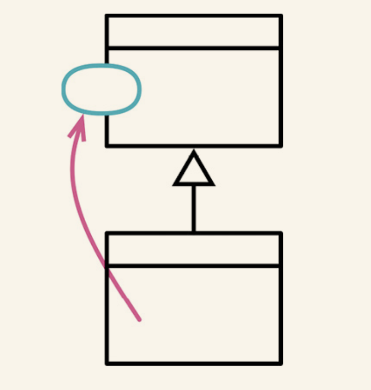
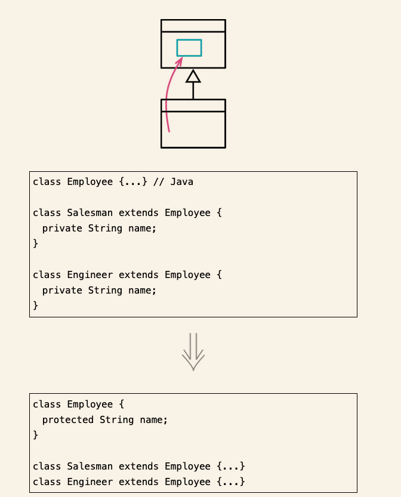
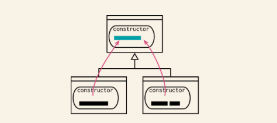
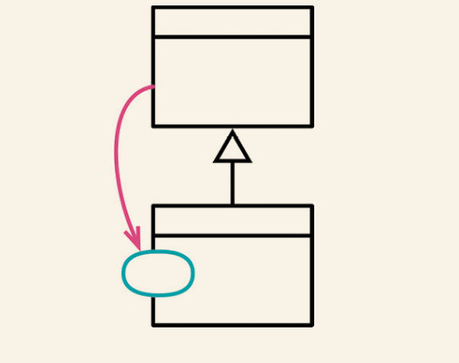
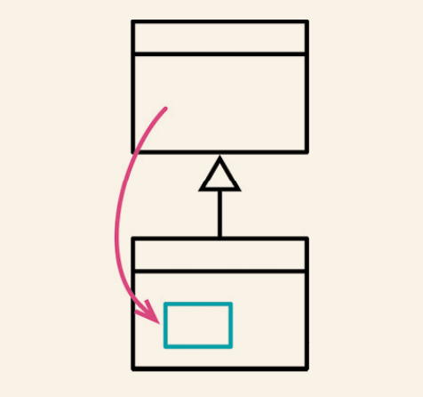
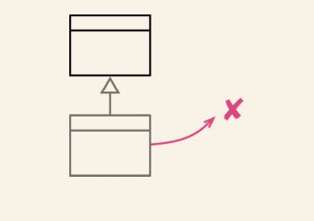
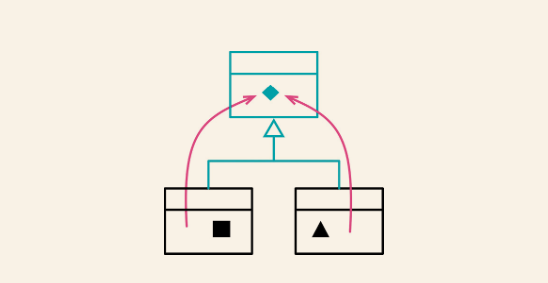
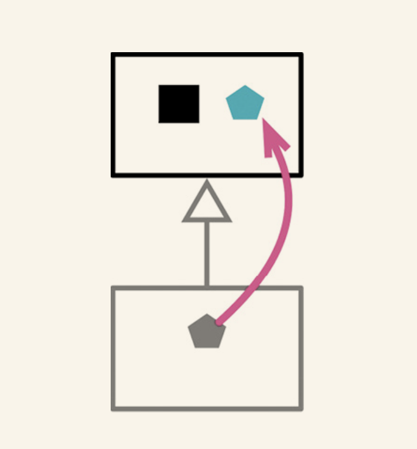
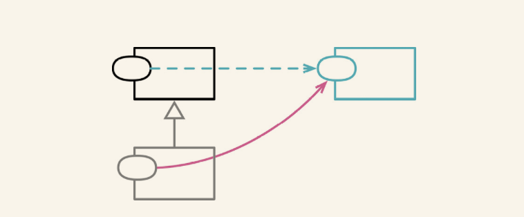
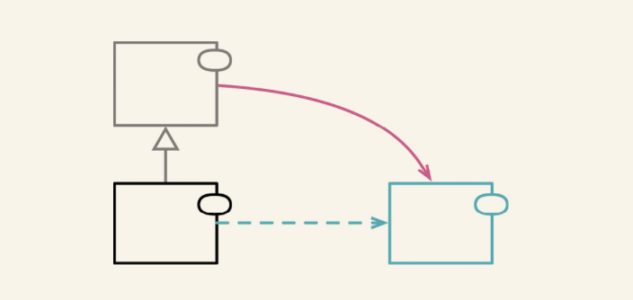

# 处理继承关系

## 7.1 函数上移

- 反向重构 : 函数下移

### 场景
- 避免重复代码 , 如果某个函数在各个子类中的函数体都相同,那么最好使用函数上移,将其抽象到父类中.

### 修改方法
- 检查待提升函数,确定他们是完全一致的,如果不一致,执行重构将其变为一致
- 检查函数体内引用的所有函数调用和字段都能从超类中调用到
- 如果待提升函数的签名不同,使用改变函数声明将那些签名都修改为在超类中使用的签名
- 在超类中新建一个函数,将某一个待提升的函数的代码复制到其中
- 执行静态检查
- 移除一个待提升的子类函数
- 测试
- 逐一移除待提升的子类函数,直到只剩下超类中的函数为止.

## 7.2 字段上移

- 反向重构 : 字段下移

### 场景

- 如果函数的使用方式很类似,可以将其提炼到超类中

### 修改方法

- 针对待提升的字段,检查他们的所有使用点,确认他们以同样的方式被使用
- 如果这些字段的名称不同,先使用变量改名为他们取个相同的名字
- 在超类中新建一个字段
- 移除子类中的字段
- 测试

## 7.3 构造函数本地上移

### 场景

- 对于有共同行为的函数进行剥离
- 如果重构过程过于复杂,可以考虑使用以工厂取代构造函数

### 修改方法

- 如果超类还不存在构造函数,首先围棋定义一个,保证子类调用超类的构造函数
- 使用移动语句将子类中的公共语句移动到超类的构造函数调用语句之后
- 逐一移动子类间的公共代码,将其提升至超类构造函数中,对于公共代码中引用到的变量,将其作为参数传递给超类的构造函数
- 测试
- 如果存在无法简单提升至超类的公共代码,先应用提炼函数,在利用函数上移提升之.

## 7.4 函数下移

- 反向重构 : 函数上移

### 场景

- 如果超类中的某个函数只与一个子类有关,那么最好将其从超类中挪走,放到真正关心它的子类中去.

### 修改方法

- 将超类中的函数本体复制到每一个需要此函数的子类
- 删除超类中的函数
- 测试
- 将该函数从所有不需要它的那些子类中删除
- 测试

## 7.5 字段下移

- 反向重构 : 字段上移

### 场景

- 如果某个类只被一个子类(或者一小部分子类)用到,就将其搬移到需要该字段的子类中.

### 修改方法

- 将所有需要该字段的子类中声明该字段
- 将该字段从超类中移除
- 测试
- 将该字段从所有不需要它的那些子类中删掉
- 测试

## 7.6 以子类取代类型码

- 反向重构 : 移除子类

### 场景

- 如果有几个函数都在根据类型码的取值采取不同的行为,可以引入子类来取代条件表达式.
- 有些字段或者函数只对特定的类型码取值才有意义,此时我们可以创建子类,然后用字段下移吧这样的字段放到子类中.

### 修改方法

- 自封装类型码字段
- 任选一个类型码取值,为其创建一个子类,覆写类型码类的取值函数,令其返回该类型码的字面量值
- 创建一个选择器逻辑,把类型码参数映射到新的子类
- 测试
- 针对每个类型码的取值,重复上述"创建子类,添加选择器逻辑"的过程.每次修改后执行测试
- 去除类型码字段
- 测试
- 使用函数下移和以多态取代条件表达式处理原本访问了类型码的函数.全部处理完成后,就可以移除类型码的访问函数.

## 7.7 移除子类

- 反向重构 : 以子类取代类型码

### 场景

- 子类所支持的变化被搬移或者完全去除,此时子类已经失去了价值

### 修改方法

- 使用工厂函数取代构造函数,把子类的构造函数包装到超类的工厂函数中
- 如果有任何代码检查子类的类型,先用提炼函数把类型检查逻辑包装起来,然后用搬移函数将其搬到超类.每次修改后执行测试.
- 新建一个字段,用于代表子类的类型
- 将原本针对子类的类型做判断的函数改为使用新建的类型字段.
- 删除子类
- 测试

## 7.8 提炼超类

### 场景

- 如果发现两个类在做相似的事,可以利用基本的继承机制把他们的相似之处提炼到超类

### 修改方法

- 为原本的类新建一个空白的超类
- 测试
- 使用构造函数本体上移,函数上移,字段上移手法,逐一将子类的共同元素上移到超类
- 检查留在子类中的函数,看他们是否还有共同的成分.如果有,可以先用提炼函数将其提炼出来,再用函数上移搬到超类
- 检查所有使用原本的类的客户端代码,考虑将其调整为使用超类的接口

## 7.9 折叠继承体系

### 场景

- 一个类和其超类已经没有太大区别了,这个时候可以将超类和子类合并起来

### 修改方法

- 选择想要移除的类,是超类还是子类
- 使用,字段上移,字段下移,函数上移,函数下移,把所有元素都移到同一个类中.
- 调整即将被移除的那个类的所有引用点,令他们改而引用合并后留下的类
- 移除我们的目标,此时他应该是一个空类
- 测试

## 7.10 以委托取代子类

### 场景

- 委托相比于继承,接口更加清晰,耦合更少

### 修改方法

- 如果构造函数有多个调用者,首先用工厂函数取代构造函数,把构造函数包装起来,
- 创建一个空的委托类,这个类的构造函数应该接收所有子类持有的数据项,并且经常以参数的形式指回超类的引用
- 在**超类中添加一个字段,用于安防委托对象**
- 修改子类的创建逻辑,使其初始化上述委托字段,放入一个委托对象的实例
- **选择一个子类中的函数,将其移入委托类**
- 使用搬移函数手法搬移上述函数,不要删除源类中的委托代码
- 如果被搬移的源函数还在子类之外被调用了，就把留在源类中的委托代码从子类移到超类，并在委托代码之前加上卫语句，检查委托对象存在。如果子类之外已经没有其他调用者，就用移除死代码（237）去掉已经没人用的委托代码
- 测试
- 重复上述过程，直到子类中所有函数都搬到委托类
- **找到所有调用子类构造函数的地方，逐一将其改为使用超类的构造函数**
- 测试
- 运用移除死代码（237）去掉子类

## 7.11 以委托取代超类

### 场景

- 如果超类的一些功能,对于子类并不适用,那么就不应该通过继承来获得超类的功能.

### 修改方法

- 在子类中新建一个字段，使其引用超类的一个对象，并将这个委托引用初始化为超类的新实例。
- 针对超类的每个函数，在子类中创建一个转发函数，将调用请求转发给委托引用。
- 每转发一块完整逻辑，都要执行测试
- 当所有超类函数都被转发函数覆写后，就可以去掉继承关系