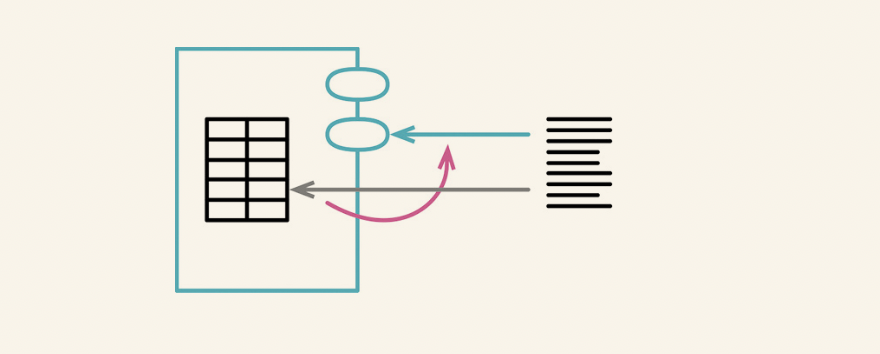

# 封装

## 2.1 封装记录

### 场景
程序的中间互相传递的嵌套列表(list)或者散列映射结构(map),将这些结构将其封装在类中,暴露访问方法.

### 修改方法
- 对持有记录的变量使用封装变量（132），将其封装到一个函数中。
- 创建一个类，将记录包装起来，并将记录变量的值替换为该类的一个实例。然后在类上定义一个访问函数，用于返回原始的记录。修改封装变量的函数，令其使用这个访问函数。
- 测试
- 新建一个函数，让它返回该类的对象，而非那条原始的记录
- 对于该记录的每处使用点，将原先返回记录的函数调用替换为那个返回实例对象的函数调用
- 移除类对原始记录的访问函数
- 测试
- 如果记录中的字段本身也是复杂结构，考虑对其再次应用封装记录（162）或封装集合（170）手法

## 2.2 封装集合

### 场景
- 不要再模块以外修改集合 , 通过封装对于集合元素的添加删除方法来做集合的变更处理,不要直接返回集合原始数据
### 修改方法

- 使用封装变量封装对于集合的引用
- 在类上添加用于"添加集合元素"和"移除集合元素"的方法
- 执行静态检查
- 查找集合的引用点,如果有调用者直接引用集合,那么修改为使用方法的方式
- 修改集合的取值函数,另其返回一个只读副本,或者设置只读代理
- 测试

## 2.3 以对象取代基本类型

### 场景

### 修改方法

- 如果变量没有封装,先使用封装变量,对其进行封装
- 为这个数据值创建一个简单的类. 类的构造函数应该保存这个数据值, 并为它提供一个取值函数.
- 执行静态检查
- 修改第一步得到的设值函数,令其创建一个新类的对象并将其存入字段,如果有必要的话,同时修改字段的类型声明.
- 修改取值函数,令其调用新类的取值函数,并返回结果.
- 测试
- 考虑对第一步得到的访问函数使用函数改名（124）,以便更好反映其用途.
- 考虑应用将引用对象改为值对象（252）或将值对象改为引用对象（256）,明确指出新对象的角色是值对象还是引用对象.

## 2.4

### 场景

### 修改方法

## 2.5

### 场景

### 修改方法

## 2.6

### 场景

### 修改方法

