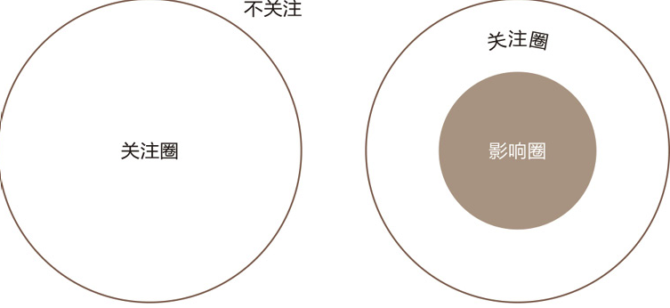
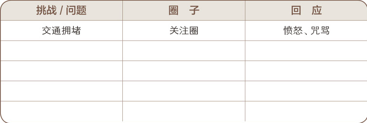

# 习惯一 积极主动 -- 个人愿景的原则

## 一. 积极主动的定义
> 积极主动的定义 : 积极主动不仅指行事的态度，还意味着人一定要对自己的人生负责。个人行为取决于自身的抉择，而不是外在的环境，人类应该有营造有利的外在环境的积极性和责任感。

基于此我们要做的事情分为两个方面 : 
- 采取主动
- 变被动为主动

## 二. 关注券和影响圈

关注圈内的事物，有些可以被掌控，有些则超出个人能力范围，前者可以被圈成一个较小的“影响圈”。观察一个人的时间和精力集中于哪个圈，就可以判断他是否积极主动。

积极主动的人专注于“影响圈”，他们专心做自己力所能及的事，他们的能量是积极的，能够使影响圈不断扩大.

消极被动的人则全神贯注于“关注圈”，紧盯他人弱点、环境问题以及超出个人能力范围的事不放，结果越来越怨天尤人，一味把自己当作受害者，并不断为自己的消极行为寻找借口。

## 三. 人类的四种天赋
人类的四种天赋：
- 自我意识（我们能够置身自己之外思考并观察我们的好恶的能力）
- 良知（判断对错的能力）
- 想象力（我们设想新机遇的能力）
- 独立意志（跳出所有影响因素之外行动的能力）

## 四.付出行动

### 4.1 培养积极主动性

积极的人使用积极的语言：“我能”、“我要”、“我宁愿”等等。消极的人使用消极的语言：“但愿”、“我办不到”、“我不得不”、“要是”。

想想过去几周内自己以消极方式做出回应的两三件事情。描述一下自己是怎么说的。
1.
2.
3.

现在，想想在同样情况下自己可以采取的几种积极的回应。请写在下面。
1.
2.
3.

请记住，在下周仔细倾听自己使用的语言——你的语言是更积极了，还是更消极了？
1.
2.
3.

### 4.2 你的圈子有多大

写下你在本周内所面临的各种挑战和问题。它们分别归入哪个圈子？你的瞬间回应又是什么？

你需要设法让自己的影响圈逐步扩大。从这两个圈子中各选一个你打算在下周改变应对方式以克服的挑战。你将怎样改变自己的回应以更有效地应对该挑战？
1. 影响圈

2. 关注圈

### 4.3 采取主动

找出一个在工作或生活中令你倍感挫折的问题，判断它属于直接控制、间接控制还是无法控制的问题，然后在影响圈内找出解决问题的第一步，并付诸行动。

试行“积极主动”原则30天，写下自己的影响圈有何变化。

你是否有什么事情一直想做，但又觉得缺少天赋、时间或能力？为了克服自己的弱点，你应当做些什么呢？一周伊始，你又能在本周做一件什么事呢？

* 如果你能开发自己的一项新才能，你希望是什么？
* 如果你能到世界任何一个地方去旅行，你想去哪里？
* 如果你能改变自己生活中的某件事情，你想改变哪一件？

制定让你实现以上三个愿望的计划，把它写下来。

