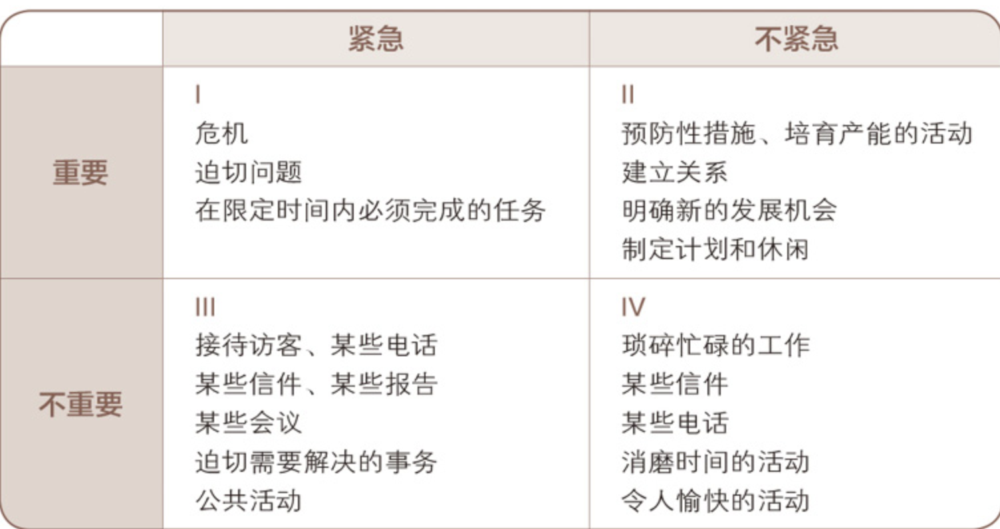
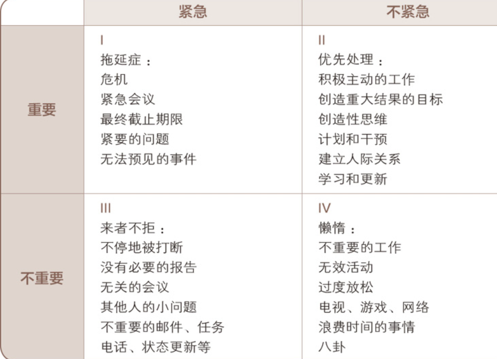
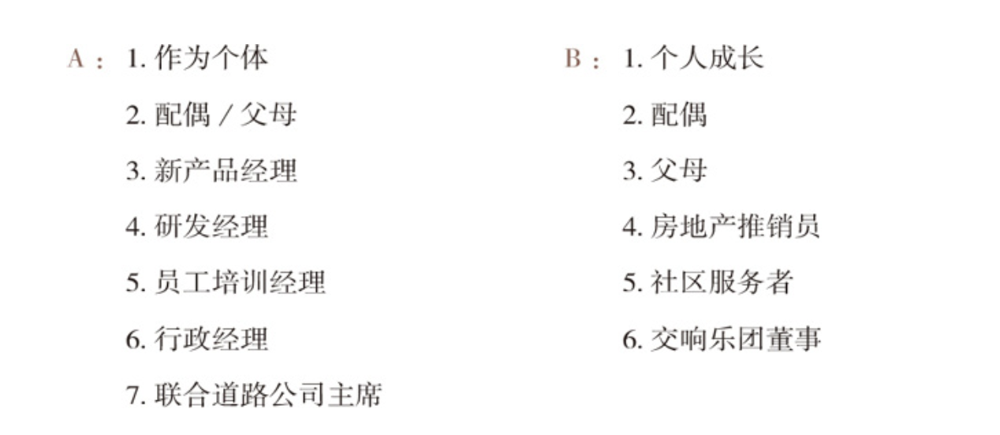
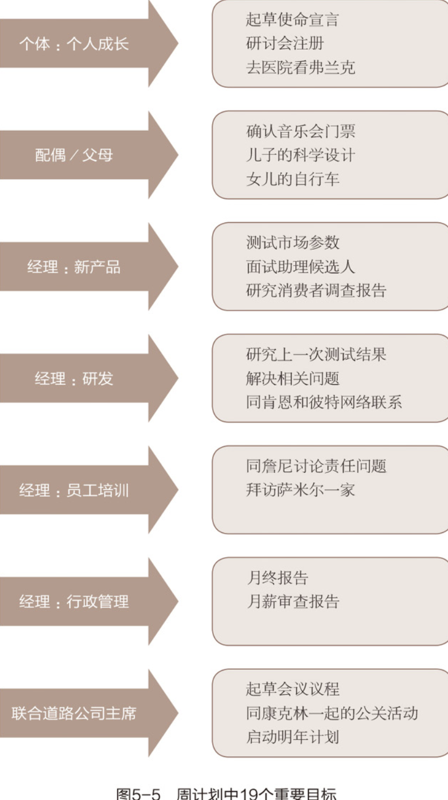

# 习惯三　要事第一 ——自我管理的原则

> 对于前两个习惯的总结 : 
>
> 习惯一告诉你：“你是创造者，你掌控自己的人生。”这个习惯的基础是人类特有的四大天赋，即想象力、良知、独立意志以及最为重要的自我意识。这个习惯让你能够大声宣布：“虽然那是我从小见惯了的事情，整个社会也都是这个样子，但是那根本就行不通，我不喜欢这种没有任何实际效果的解决方法，我能够改变它。”
>
> 习惯二是关于第一次的创造或者智力上的创造的习惯，其原则基础是想象力和良知这两大天赋。想象力是一种超前感知的能力，是对目前无法亲眼看到的潜力和创造力的认识，而良知则是发掘每个人身上独有特性的能力。良知在伦理道德方面担当对个体进行指导的责任。这个习惯同我们的基本思维方式和对自己的最高期望值、价值观密切相关。
>
> 习惯三是关于第二次的创造或者体力上的创造的习惯，是对前面两个习惯的实现、执行和自然流露。它要求我们运用独立意志努力实现一个目标，即以原则为基础安排人生。

## 时间管理矩阵 : 以第二象限为中心

- 紧急之事 : 要意识到这个只是别人的要事,对别人重要,对自己不一定重要
- 我们要尽可能多的吧时间投入在第二象限内,这里的事情才是让我们成长的事情
- 时刻牢记你要学着拒绝 : 有时候是很紧要的事情,甚至是很重要的事情(拒绝的理由是你有更加重要的事情需要去做,而重要与否也就依赖于第二个习惯,以原则为中心找到对于自己来说,当下最应该做什么.)

## 让第二象限事务成为生活中心的有效工具必须满足以下六个重要标准：

- 和谐一致 : 个人的理想与使命、角色与目标、工作重点与计划、欲望与自制之间，应和谐一致。
- 平衡功能 : 管理方法应有助于生活平衡发展，提醒我们扮演不同的角色，以免忽略了健康、家庭、个人发展等重要的人生层面
- 围绕中心 : 理想的管理方法会鼓励并协助你，注重于虽不紧急却极重要的事 , 不要就日程表订立优先顺序，应就事件本身的重要性来安排行事
- 以人为本 : 个人管理的重点在人，不在事
- 灵活变通 : 管理方法并非一成不变，视个人作风与需要而调整
- 便于携带 : 管理工具必须便于携带，随时可供参考修正

## 自我管理的步骤

- 确认角色 : 
- 

- 选择目标 : 作为这个角色你的目标是什么? 目标一定要有第二象限的事务

- 安排进度 : 为每一项目标计划实施的时间

## 授权

- 指令型授权 : 工作方法的每一步进行详细的指导
- 责任型授权 : 关注点是最终结果,它给人们自由，允许自行选择做事的具体方法，并为最终的结果负责.

#### 责任型授权前提 : 

- 预期成果：双方都要明确并理解最终的结果。要以“结果”，而不是以“方法”为中心。要投入时间，耐心、详细地描述最终的结果，明确具体的日程安排。
- 指导方针：确认适用的评估标准，避免成为指令型授权，但是一定要有明确的限制性规定。不加约束的放任，其最终结果只能是扼杀人们的能动性，让人们回到初级的指令型要求上：“告诉我你想要我做什么，我照做就是了。”事先告知对方可能出现的难题与障碍，避免无谓的摸索，但不要告诉做什么。要让他们自己为最后的结果负责，明确指导方针，放手让他们去做。
- 可用资源：告知可使用的人力、财物、技术和组织资源以取得预期的成果。
- 责任归属：制定业绩标准，并用这些标准来评估他们的成果。制订具体的时间表，说明何时提交业绩报告，何时进行评估。
- 明确奖惩：明确告知评估后的结果——好的和不好的——包括财物奖励、精神奖励、职务调整以及该项工作对其所在组织使命的影响。

## 提前预留时间
- 每周预留 30min 规划一周的生活 , 看看这件事情是否能够改变你的生活.
