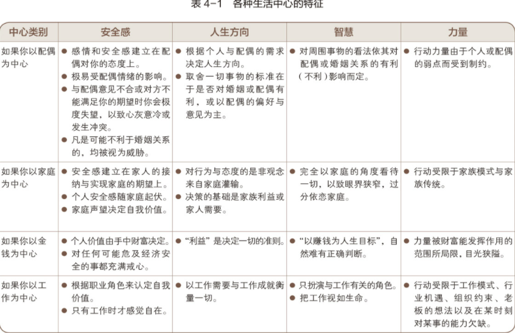
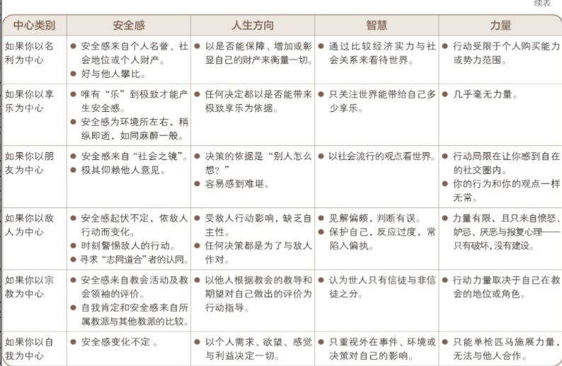
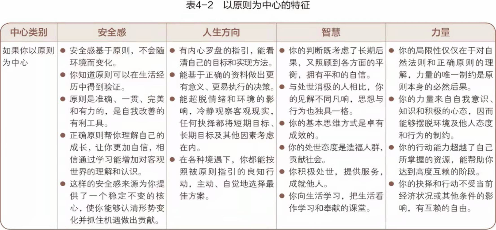

# 习惯二 以终为始----自我领导的原则

太多人成功之后，反而感到空虚；得到名利之后，却发现牺牲了更宝贵的东西。因此，我们务必固守真正重要的愿景，然后勇往直前坚持到底，使生活充满意义。和内在力量相比，身外之物显得微不足道。——奥利弗·温德尔·霍姆斯（Oliver Wendell Holmes）｜美国最高法院前大法官

## 一. 以终为始的定义

以终为始说明在做任何事之前，都要先认清方向。
你希望在盖棺定论时获得的评价，才是你心目中真正渴望的成功


## 二. 任何事物都要经历两遍创造

> 我们做任何事都是先在头脑中构思，即智力上的或第一次的创造（Mental/First Creation），然后付诸实践，即体力上的或第二次的创造（Physical/Second Creation）


## 三. 领导与管理：两次创造

管理是正确地做事,领导是做正确的事.

## 四. 改写人生剧本：成为自己的第一次创造者

想象力能让我们在心里演练那些尚未释放的潜能；
良知能让我们遵循自然法则或原则，发挥自己的独特才智，选择合适的贡献方式，再有就是确定自己的指导方针以便将上述能力付诸实践；
而想象力、良知、自我意识的结合则能让我们编写自己的人生剧本。

每个人在成长过程中都承袭了许多来自他人的“人生剧本”，因此更确切一点说，我们是改写，而不是编写人生剧本，即对已有思维的转换。当我们认识到人生剧本的低劣以及思维方式的低效，就会积极地加以改写。


## 五. 个人使命宣言
以终为始最有效的方法，就是撰写一份个人使命宣言，即人生哲学或基本信念。宣言主要说明自己想成为怎样的人（品德），成就什么样的事业（贡献和成就）及为此奠基的价值观和原则。

## 六. 核心区
制订个人使命宣言必须从影响圈的核心开始，基本的思维方式就在这里，即我们用来观察世界的“透镜”。

当我们专注于这个核心并取得丰硕成果的时候，影响圈就会被扩大，这是最高水平的产能，会有力提高我们在生活各领域的效能。

这个核心还是安全感、人生方向、智慧与力量的源泉。


- “安全感”（Security）：代表价值观、认同、情感的归属、自尊自重与拥有个人的基本能力。
- “人生方向”（Guidance）：是“地图”和内心的准绳，人类以此为解释外界事物的理据以及决策与行为的原则和内在标准。
- “智慧”（Wisdom）：是人类对生命的认知、对平衡的感知和对事物间联系的理解，包括判断力、洞察力和理解力，是这些能力的统一体。
- “力量”（Power）：则指采取行动、达成目标的能力，它是做出抉择的关键性力量，也包括培育更有效的习惯以替代顽固旧习的能力。


## 七. 识别自己的生活中心







- 以原则为中心 : 



## 八. 如何书写一份使命宣言

自由书写：请坐下，花15分钟，用你的笔写吧。写下来以下事情：头脑里出现的你所擅长的事情（自我意识），你感觉自己需要做的事情（良知），如果没有限制你会做的事情（想象力）。持续写的关键就是直到时间够用。写完之后，稍微编辑一下这份粗略的使命宣言草稿。

为休整做好计划：一天中一定要做好计划，去一个能够鼓舞自己的地方，不管是沙滩、山中还是公园里。想一想对你而言最重要的事情。为了激发这些想法，可以自问如下问题，写下答案。整合编辑到一起，形成一份草稿：
● 想想生命中对你起到积极影响的人。那个人身上的哪些特质是你想拥有的？
● 描述一段你受到深深激励的时光。
● 如果让你跨越科罗拉多大峡谷去张贴一个I型标，你愿意为了什么事或什么人穿越大峡谷？
● 如果让你花一整天在一个巨型图书馆研究任何课题，你想研究什么？
● 你绝对愿意做的10件事是什么？
● 想出一种代表你的东西：一种动物、一首歌、一辆车、一个地方。为什么唯有这件事物能代表你。


扩展方式：引用一段最喜欢的引言：一个词，一段歌曲，一首诗。没有唯一正确的方法。我经常帮助青少年完成使命宣言。青少年不经常使用文字描述，但是他们很喜欢用拼贴或展示板的形式，这是一种把握使命内涵的更加视觉化的方式。

使用模板：如果你需要知道，我们在[网站](https://msb.franklincovey.com)创建了一个使命宣言版块（这是富兰克林柯维公司浏览量最高的网页）。这个版块会引导你完成使命宣言。只要回答一些问题，按下“打印”按钮，就完成了。你的手中就会有一份使命宣言。


## 九. 开始行动

- 检查你的愿景
- 指定一份个人使命宣言
```text
步骤1：开动脑筋畅想将
你对下面三个问题的回答一口气写下来，不要停顿。这是自由发挥。如果你想到了一个观点，别太在意用词和语法，只管不停地写下去。记住，你只是在畅想，不是定稿，目的是把自己的想法写在纸上。在每个问题上花2～3分钟。
1. 写下一个对你有影响的人。确定一个对你的生活有积极影响的人。你最赞赏这个人的什么品质？你从这个人那里学到了什么品质？
2. 详细说明你想成为怎样的人。设想现在已是20年后，你已经达成了自己所希望的所有成就。你的成就清单是什么？你想拥有什么？你想成为怎样的人？你想成就怎样的事业？
3. 请确定，目前对你最重要的是什么。

步骤2：放松一下

现在深呼吸一下，然后放松下来。把你写的放在一边，走开几分钟。

步骤3：整理你的思绪

回顾你所写的，圈出你想列入自己使命宣言的关键想法、句子和词语。

步骤4：写出初稿

现在是写出你的初稿的时候了。前文已经列举了几个使命宣言的范本，以助于你思考。一周内随身带着这个初稿，每天写下备注或根据需要加以增删。也许每天或每两天你都想重写一份初稿。这是一个不断进行的过程。你的使命宣言将随着时间推移而不断修改。现在，花一点时间写出你的使命宣言初稿。

步骤5：完成你的使命宣言

周末写出你的使命宣言的定稿，放在一个便于随时翻阅的地方。

步骤6：定期检查并加以评估

每个月问自己下列问题：
● 我是否觉得这个使命宣言代表了最佳的自我？
● 当我回顾这个使命宣言的时候是否感到有了方向、目标、挑战和动力？
● 我的生活是否遵从了这个使命宣言中的理想和价值观？
```


