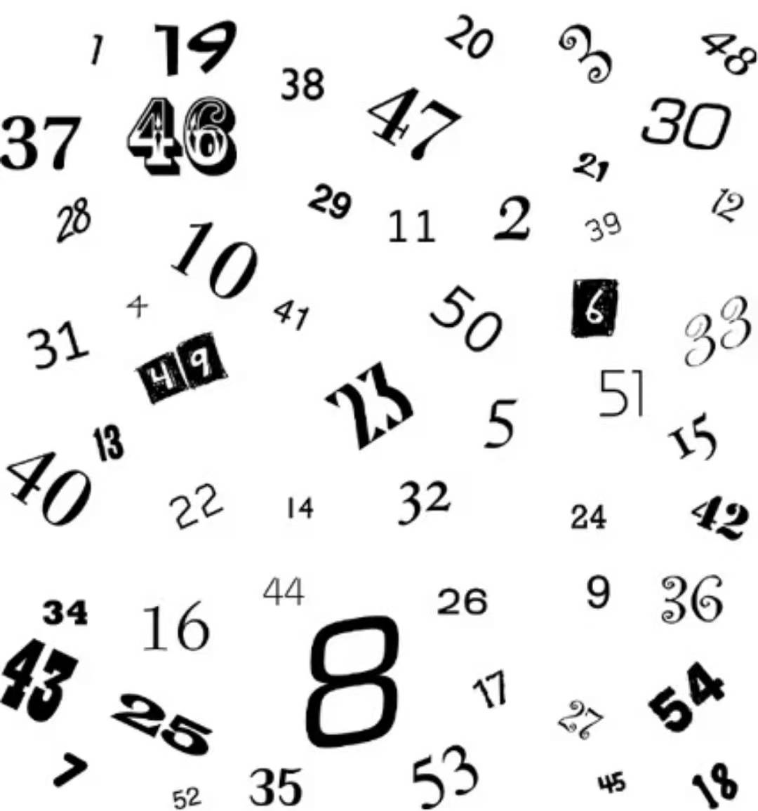
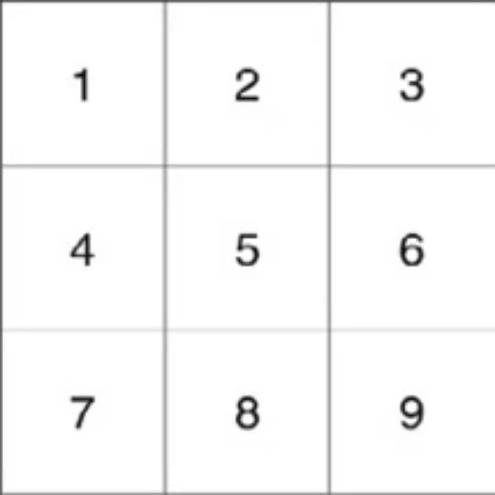
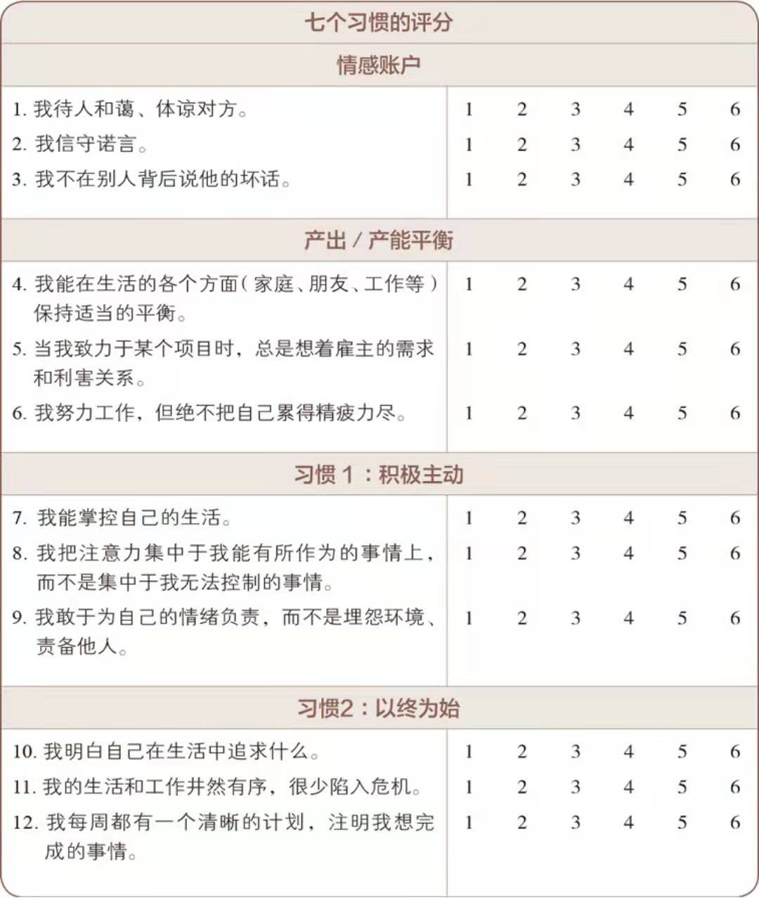
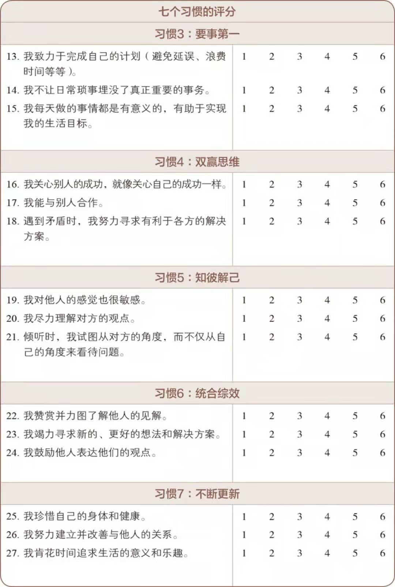
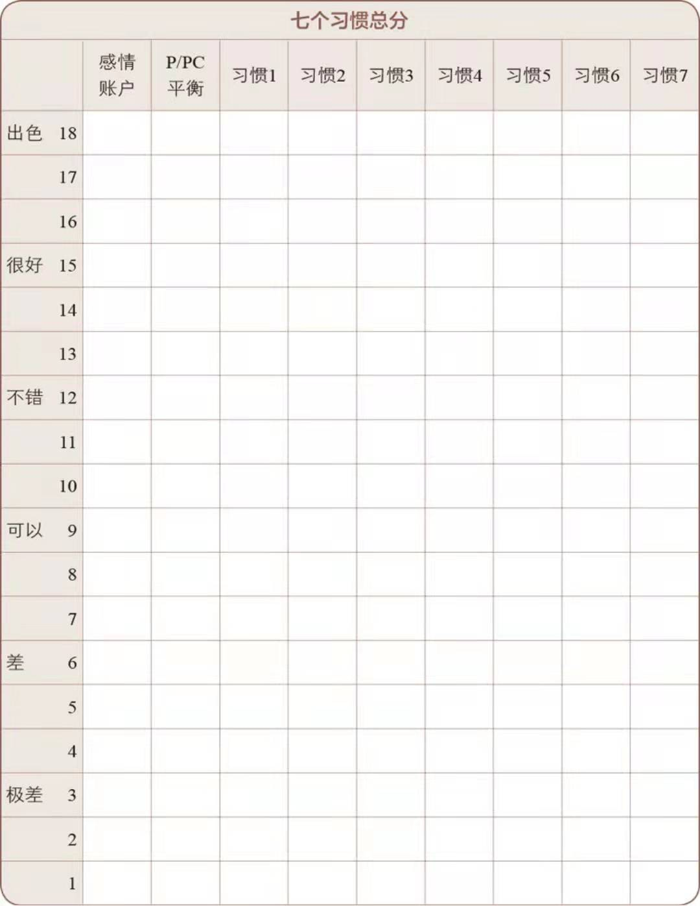

# 第二章 七个习惯概论

- 产出与产能的平衡 : 伊索寓言<下金蛋的鹅> , 七个习惯的基础

## 习惯一 : 积极主动
采取主动,为自己过去,现在以及未来的行为负责,并依据原则以及价值观,而非情绪或者外在环境来做决定.

## 习惯二 : 以终为始
所有事物都经过两次的创造--先是在脑海里酝酿,其次才是实质的创造.

## 习惯三 : 要事第一
要事第一即实质的创造,是梦想(你的目标,愿景,价值观及要事处理顺序)的组织与实践.

## 习惯四 : 双赢思维
双赢思维是一种基于互敬,寻求互惠的思考框架与心意,目的是分享更多的机会,财富以及资源,而非敌对式竞争.

## 习惯五 : 知彼待己
当我们不在急切回答,改以诚信去了解,倾听别人,便能开启真正的沟通,增进彼此的关系

## 习惯六 : 统合综效
统合综效谈的是创造第三种选择,即非按照我的方式,也非遵循你的方式,而是创造出第三种更好的办法.

## 习惯七 : 不断更新
不断更新指的是,如何在生活的基本面(身体,精神,智力,社会/情感)中,不断更新自己.

## 一个有条理的模型,可以帮助你领航
在没有模型的情况下按顺序寻找数字 :

确认模型之后,再次寻找.

## 七个习惯的评分 - 1 表示极差,6 表示出色

