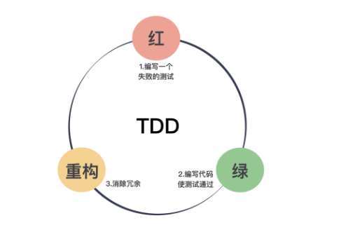

# 思考框架

- **以终为始**,确定好真实的目标
- **任务分解**,找到实施的路径
- **沟通反馈,**解决与人打交道出现的问题
- **自动化**,解决与机器打交道出现的问题

# 以终为始

### 1. 遇到事情,倒着思考.
### 2. 在做事情之前,先定义完成的标准
### 3. 在做需求和任务之前,先定好验收标准
### 4. 尽早提交代码进行集成测试
### 5. 默认所有需求都不做,直到弄清楚为什么要做这件事情,避免一次次返工
### 6. 扩大自己工作的上下文,不要把自己局限在"程序猿"的角色上
### 7. 在动手做一件事情之前,先推演一番
### 8. 对于工作的结果要做到可以通过数字来量化,设计好测量指标

# 任务分解

### 1. 动手做一个事情之前,先对他进行任务分解
### 2. 多写单元测试
### 3. 我们应该编写可测试的代码 : 测试驱动开发 TDD,先写测试,后写代码

- 红 : 表示写了一个新的测试,测试还没有通过的状态
- 绿 : 写了功能代码,测试通过的状态
- 重构 : 完成基本功能后,调整代码

### 4. 将任务拆分,越小越好

### 5. 按照完整实现一个需求的顺序去安排分解出来的任务,每做完一个任务,代码都是可提交的

### 6. 要想写好测试,就要写简单的测试

##### 怎么样的测试算是好的测试 ? A-TRIP
- Automatic，自动化 : 把测试尽可能交给机器运行,人工参与的部分越少越好
- Thorough，全面的 : 尽可能用测试覆盖各种场景
- Repeatable，可重复的 : 某一个测试反复运行,结果应该是一样的
- Independent，独立的 : 测试和测试之间不应该有任何依赖
- Professional，专业的 : 测试代码也要清晰易于理解.

### 7. 想要管理好需求,先把需求拆小

##### 需求管理的原则 : INVEST 原则
- Independent，独立的 : 一个用户故事应该完成一个独立的功能，尽可能不依赖于其它用户故事，因为彼此依赖的用户故事会让管理优先级、预估工作量都变得更加困难。如果真的有依赖，一种好的做法是，将依赖部分拆出来，重新调整。
- Negotiable，可协商的 : 对于需求的细节,需要大家一起协商
- Valuable，有价值的 : 一个用户故事都应该有其自身价
- Estimatable，可估算的 : 我们会利用用户故事估算的结果安排后续的工作计划。不能估算的用户故事，要么是因为有很多不确定的因素，要么是因为需求还是太大，这样的故事还没有到一个能开发的状态，还需要产品经理进一步分析。
- Small，小 : 不能在一定时间内完成的用户故事只应该有一个结果，拆分。小的用户故事才方便调度，才好安排工作。
- Testable，可测试的 : 需要有明确的验收标准.

##### 对于新技术的分解
- 了解新技术,对新技术有一些感性的认识
- 快速地完成教程上的例子
- 明确这项技术在项目中应用场景和我们的关注点
- 开发出一个验证我们想法的原型
- 当你确定要使用这项技术时，请丢弃掉你的原型代码(因为它是原型，你需要为你的项目重新设计)

### 8. 需求管理 : 尽量做最重要的事情,事情是否紧急如果不好评判可以放在更大的上下文中进行裁决

### 9. 如何用最小的代价做产品 : 做好产品开发，最可行的方式是采用 MVP
- 最小可行产品（Minimum Viable Product，MVP） : ,“刚刚好”满足客户需求的产品.
- 先明确系统核心功能,并且在满足用户需求的前提下进行需求拆分.
- 当时间有限时，我们需要学会找到一条可行的路径，在**完整用户体验**和**完整系统**之间，找到一个平衡.部分功能可能并不是核心功能,可以降低优先级,部分功能在当前的时间内肯恩没有使用场景,亦或者说在前期业务不会使用,那么这些功能也可以适当降低优先级.

