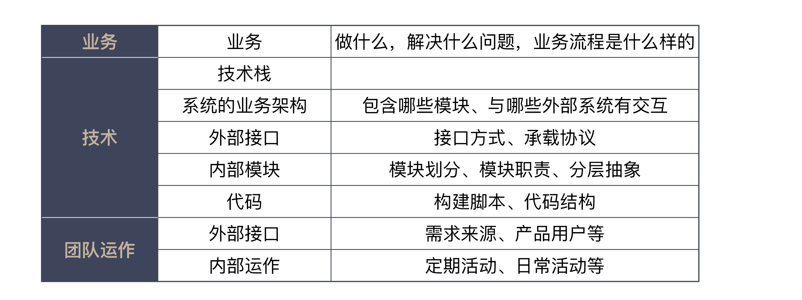

# 综合运用

### 1. 新入职一家公司，怎么快速进入工作状态？

- 业务 : 
  - 要了解业务，我一般都会请人给我讲一下，这个业务是做什么的，解决什么样的问题，具体的业务流程是什么样子的，等等。
  - 每次了解到一个业务，我都会在脑子中过一下，如果是我做这个业务，我会怎么做
  - 在初期的了解中，我并不会试图弄懂所有的细节，因为我的目标只是建立起一个基本的框架，有了这个初步的了解，后续再有问题，我就知道该从哪里问起了。
  - 了解业务时，一定要打起精神，告诉自己，这个阶段，我要了解的只是业务，千万别给我讲技术
- 技术 : 
  - 系统的技术栈,对用到的工具和框架有个大致的预期
  - 系统的业务架构，这个系统包含了哪些模块，与哪些外部系统有交互等等
  - 这个系统对外提供哪些接口，这对应着系统提供的能力；
  - 这个系统需要集成哪些外部系统，对应着它需要哪些支持。
- 团队运作 : 
  - 外部 : 这个团队有哪些外部接口，比如，需求是从哪来的，产品最终会由谁使用，团队需要向谁汇报。如果有外部客户，日常沟通是怎么安排的。
  - 内部 : 一方面是定期的活动，比如，站会、回顾会议、周会，这些不同活动的时间安排是怎样的；另一方面是团队的日常活动，比如，是否有每天的代码评审、是否有内部的分享机制等等。

### 2. 面对遗留系统,你应该这样做.

- 第一个问题，面对遗留系统，我们的现状是什么呢？找到遗留系统的问题根因
- 第二个问题,目标是什么? **重写**某些代码,在进行重写前,首先 : **尝试重构你的代码，尽可能在已有代码上做小步调整，不要走到大规模改造的路上，因为重构的成本是最低的。**
- 第三个问题, 怎么做? 需要有足够的测试来保证代码的稳定性.
- 第四个问题,怎么代码腐化速度不那么快? 要想代码腐化的速度不那么快，一定要在软件设计上多下功夫。**一方面，建立好领域模型，另一方面，寻找行业对于系统构建的最新理解。**

##### 2.1 寻找行业中的最新理解

- 做技术选型时，你就可以根据自己系统的特点，选择适合的技术，而不是以昨天的技术解决今天的问题，造成的结果就是，代码写出来就是过时的。
- 小步改造遗留系统，不要回到老路上。

##### 2.2 改造遗留系统，我给你几个建议
- 构建测试防护网，保证新老模块功能一致；
- 分成小块，逐步替换；
- 构建好领域模型；
- 寻找行业中关于系统构建的最新理解。