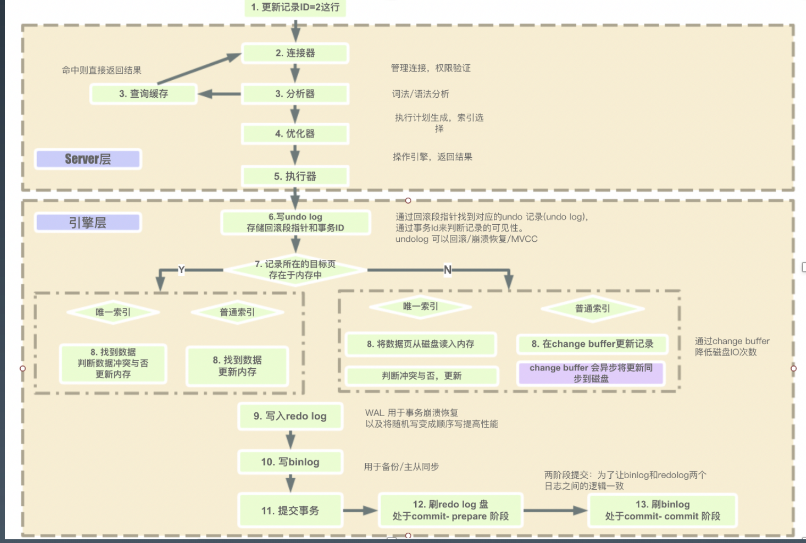

# 性能与SQL优化

# 一. SQL

- DB/SQL 优化是业务系统性能优化的核心

- 业务系统的分类：计算密集型、数据密集型结构化查询语言包含 6 个部分：


## 1.1 SQL语言
### 1.1.1 结构化查询语言
- 数据查询语言（DQL: Data Query Language）：其语句，也称为“数据检索语句”，用以从表中获得数据，确定数据怎样在应用程序给出。保留字 SELECT 是 DQL（也是所有 SQL）用得最多的动词，其他 DQL 常用的保留字有 WHERE，ORDER BY，GROUP BY 和 HAVING。这些 DQL 保留字常与其它类型的 SQL 语句一起使用。
- 数据操作语言（DML：Data Manipulation Language）：其语句包括动词 INSERT、UPDATE 和 DELETE。它们分别用于添加、修改和删除。
- 事务控制语言（TCL）：它的语句能确保被 DML 语句影响的表的所有行及时得以更新。包括COMMIT（提交）命令、SAVEPOINT（保存点）命令、ROLLBACK（回滚）命令。
- 数据控制语言（DCL）：它的语句通过 GRANT 或 REVOKE 实现权限控制，确定单个用户和用户组对数据库对象的访问。某些 RDBMS 可用 GRANT 或 REVOKE 控制对表单个列的访问。
- 数据定义语言（DDL）：其语句包括动词 CREATE,ALTER 和 DROP。在数据库中创建新表或修改、删除表（CREAT TABLE 或 DROP TABLE）；为表加入索引等。
- 指针控制语言（CCL）：它的语句，像 DECLARE CURSOR，FETCH INTO 和 UPDATE WHERE CURRENT 用于对一个或多个表单独行的操作。

## 1.2 MYSQL 存储
### 1.2.1 独占模式
- 日志组文件：ib_logfile0和ib_logfile1，默认均为5M
- 表结构文件：*.frm
- 独占表空间文件：*.ibd
- 字符集和排序规则文件：db.opt
- binlog 二进制日志文件：记录主数据库服务器的 DDL 和 DML 操作
- 二进制日志索引文件：master-bin.index
### 1.2.2 共享模式 innodb_file_per_table=1
- 数据都在 ibdata1

### 1.2.3 MySQL 详细执行流程



#### 1.2.3.1 连接器

连接器负责跟客户端建立连接、获取权限、维持和管理连接

```shell
# mysql -h$ip -P$port -u$user -p
mysql -h127.0.0.1 -P3306 -uroot -p958727804
```

- 由于建立连接比较复杂,建议使用长连接,但是使用长连接之后,可能导致 MySQL 占用内存特别快.这是因为 MySQL在执行过程中使用的内存是管理在连接对象中的,资源会在连接断开时候才释放,如果长连接使用过大,会导致内存占用过大,被系统强行杀掉.
- 一个用户成功建立连接后，即使你用管理员账号对这个用户的权限做了修改，也不会影响已经存在连接的权限。修改完成后，只有再新建的连接才会使用新的权限设置。
- `show processlist`查看连接


#### 1.2.3.2 查询缓存
- 查询缓存的失效非常频繁,只要有对一个表的更新,name 这个表上所有的查询缓存都会被清空.
- 将`query_cache_type`设置为`DEMAND`关闭查询缓存.使用时候`SELECT SQL_CACHE * from table_name`来使用
- MySQL 8.0 版本直接将查询缓存功能删除了.

#### 1.2.3.3 分析器
- 解析语法,检查语法错误,可能产生`You have an error in your SQL syntax`异常.
- 在分析器之后会做一次权限验证,但是因为此时无法对运行时涉及到的表进行权限验证,所以这部分也叫`precheck`

#### 1.2.3.4 优化器
- 表中有多个索引时候决定使用哪个索引
- 多表关联时候决定连接顺序

#### 1.2.3.5 执行器
- 判断是否有权限
- 根据表的引擎定义 , 使用表的引擎接口

## 1.3 MYSQL 参数配置

### 1.3.1 连接请求的变量
- max_connections
- back_log
- wait_timeout和interative_timeout

### 1.3.2 查看参数配置
- show variables like xxx (my.cnf )

### 1.3.3 缓冲区变量
- key_buffer_size
- query_cache_size（查询缓存简称 QC)
- max_connect_errors
- sort_buffer_size
- max_allowed_packet=32M
- join_buffer_size=2M
- thread_cache_size=300

### 1.3.4 配置 Innodb 的几个变量
- innodb_buffer_pool_size
- innodb_flush_log_at_trx_commit
- innodb_thread_concurrency=0
- innodb_log_buffer_size
- innodb_log_file_size=50M
- innodb_log_files_in_group=3
- read_buffer_size=1M
- read_rnd_buffer_size=16M
- bulk_insert_buffer_size=64M
- binary log

## 1.4 数据库优化
- 如何恰当选择引擎？: innodb? 
- 库表如何命名？: 需要有意义,保证再次查看时候可以理解
- 如何合理拆分宽表？
- 如何选择恰当数据类型：明确、尽量小
- char、varchar 的选择
- （text/blob/clob）的使用问题？: 尽量少用,操作会让数据库性能下降
- 文件、图片是否要存入到数据库？可以存本地 ,数据库只保存路径
- 时间日期的存储问题？
- 数值的精度问题？
- 是否使用外键、触发器？
- 唯一约束和索引的关系？
- 是否可以冗余字段？
- 是否使用游标、变量、视图、自定义函数、存储过程？
- 自增主键的使用问题？
- 能够在线修改表结构（DDL 操作）？
- 逻辑删除还是物理删除？
- 要不要加 create_time,update_time 时间戳？
- 数据库碎片问题？
- 如何快速导入导出、备份数据？


