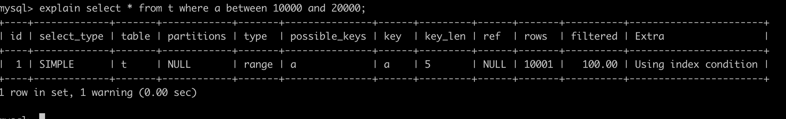
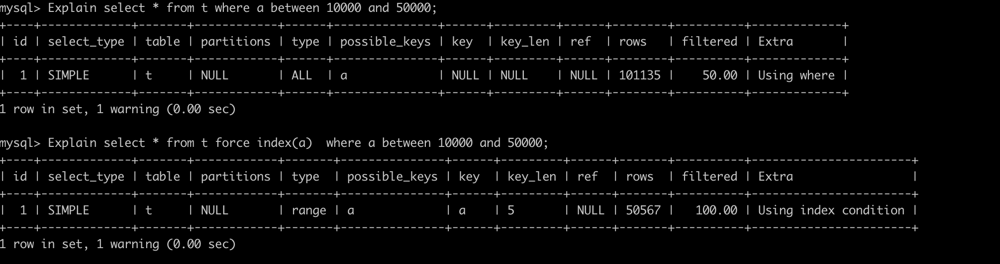
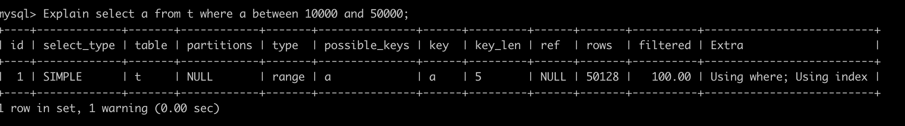

# 为什么有时候 MySQL 会选错索引


## 优化器的逻辑

优化器选择索引的目的，是找到一个最优的执行方案，并用最小的代价去执行语句。在数据库里面，扫描行数是影响执行代价的因素之一。扫描的行数越少，意味着访问磁盘数据的次数越少，消耗的 CPU 资源越少。当然，扫描行数并不是唯一的判断标准，优化器还会结合是否使用临时表、是否排序等因素进行综合判断. 数据的回表也是一个考量的因素.下面的示例,就是因为数据需要回表导致没有执行索引.

## 索引选择异常和处理
- 采用 force index 强行选择一个索引 : 这样解决会导致如果索引改名,查询语句也要修改,并且迁移数据库的话可能不兼容
- 考虑修改语句
	```sql
	-- 此时会走索引 b,因为走索引 b 可以避免排序
	select * from t order by b limit 1;
	-- 此时因为 a,b 都进行了排序,所以扫描行数成为了索引选择的关键条件.
	select * from t order by a,b limit 1;
	```
- 新建一个更合适的索引 , 来提供给优化器做选择或者删除误用的索引.


# 测试 demo


docker 下的 mysql 安装 m1 版本 : 

```shell
## 拉取 mysql 镜像
docker pull mysql/mysql-server
## 启动 : 这里起了别名 mysql1
docker run --name=mysql1 -d mysql/mysql-server
## 查看日志 ,日志中包含了默认的密码
docker logs mysql1
## 登陆 : 这里使用启动时候创建的别名,进入到 base
docker exec -it mysql1 /bin/sh
## 登陆 : 用户名密码登陆,密码使用之前 log 里面的密码
mysql -uroot -p'aaa123'
## 修改密码
ALTER USER 'root'@'localhost' IDENTIFIED BY 'root'
```


测试 demo

```sql
## 查看数据源
show databases;
## 创建数据源
create database if not exists test;
## 切换数据源
use test;
```
```sql
## 建表
CREATE TABLE `t` (
  `id` int(11) NOT NULL AUTO_INCREMENT,
  `a` int(11) DEFAULT NULL,
  `b` int(11) DEFAULT NULL,
  PRIMARY KEY (`id`),
  KEY `a` (`a`),
  KEY `b` (`b`)
) ENGINE=InnoDB;
```
```sql
## 创建存储过程
delimiter ;;
create procedure idata()
begin
  declare i int;
  set i=1;
  while(i<=100000)do
    insert into t values(i, i, i);
    set i=i+1;
  end while;
end;;
delimiter ;
call idata();
```


分析 : 扫描的行数 10001 行

```sql
explain select * from t where a between 10000 and 20000;
```




执行如下操作 : 

| session A                                   | session B                                                    |
| ------------------------------------------- | ------------------------------------------------------------ |
| Start transaction with consistent snapshot; |                                                              |
|                                             | delete from t;<br />call idata();                            |
|                                             | Explain select * from t where a between 10000 and 50000;     |
|                                             | Explain select * from t force index(a)  where a between 10000 and 50000; |
| commit;                                     |                                                              |

下面我们分别看下他们的执行计划 : 
```sql
Explain select * from t where a between 10000 and 50000;
Explain select * from t force index(a)  where a between 10000 and 50000;
Explain select a from t where a between 10000 and 50000;
```





